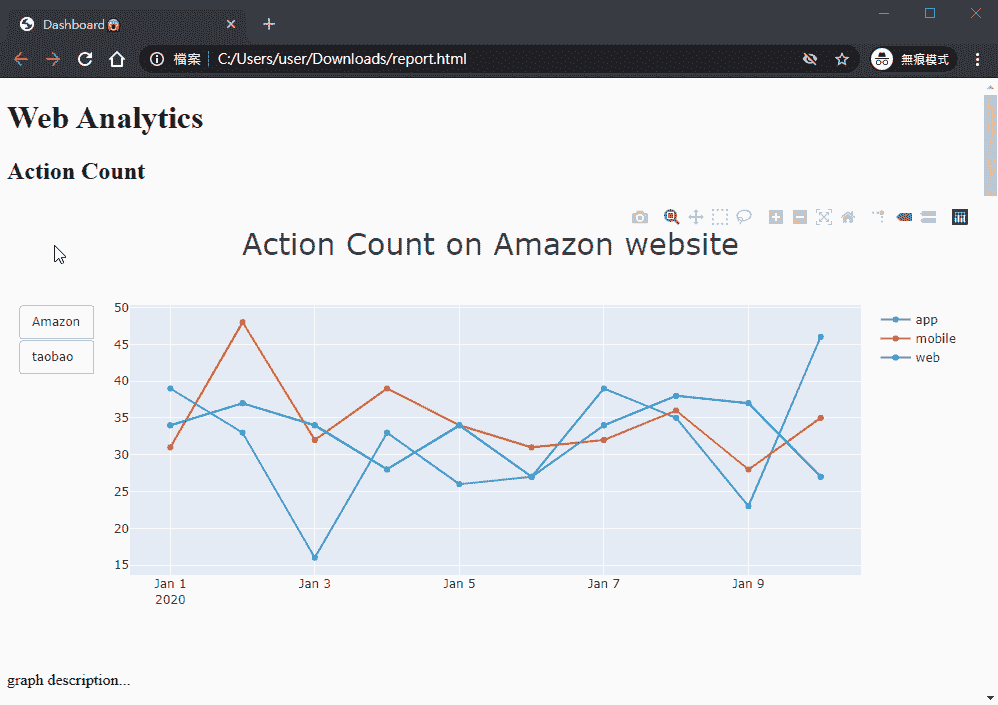
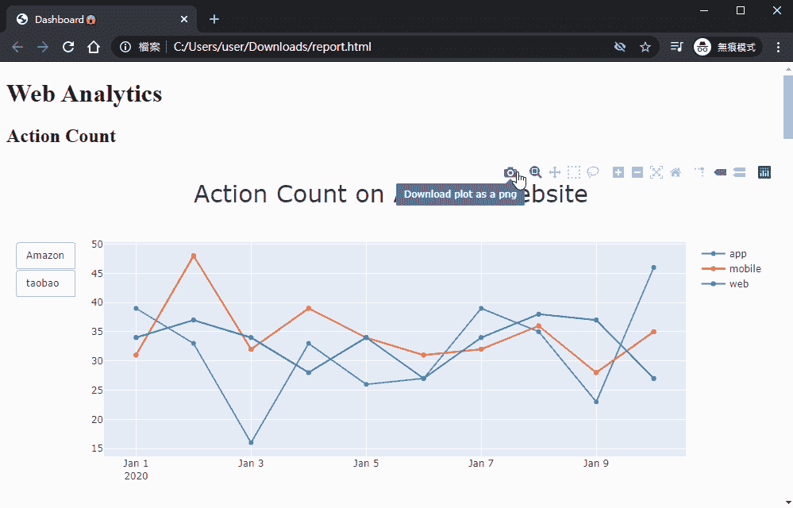
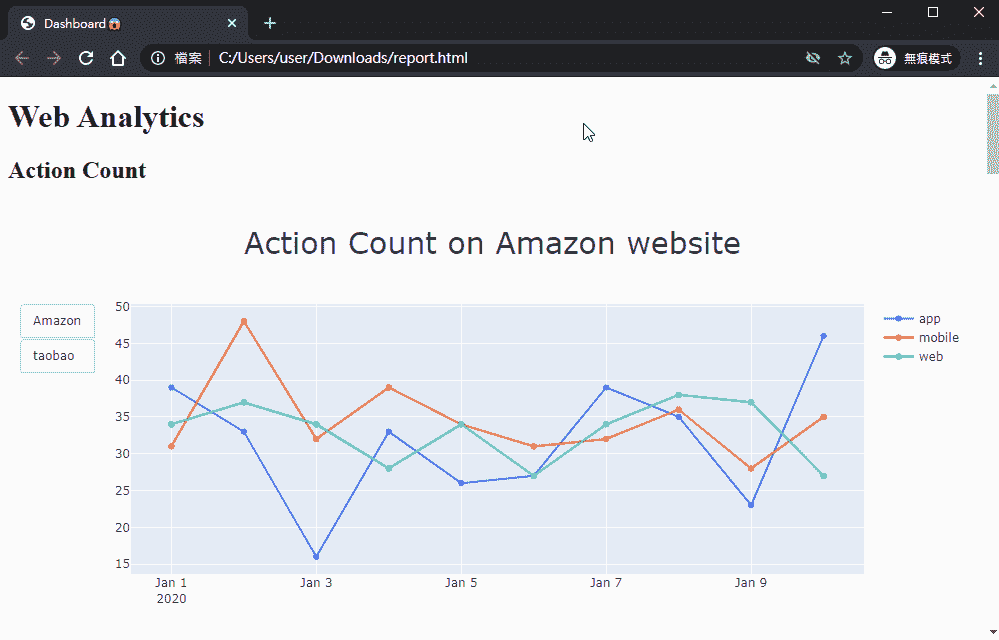
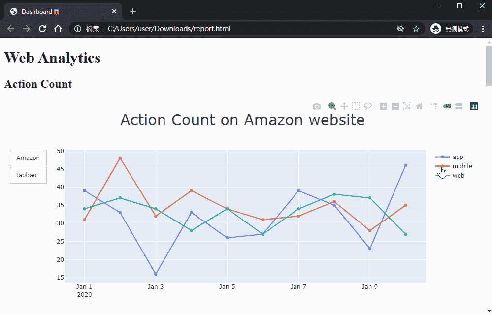
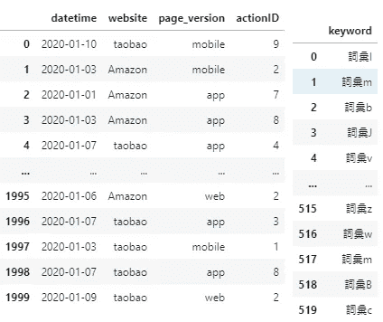
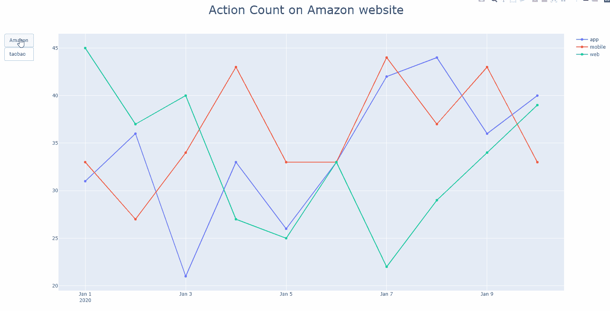
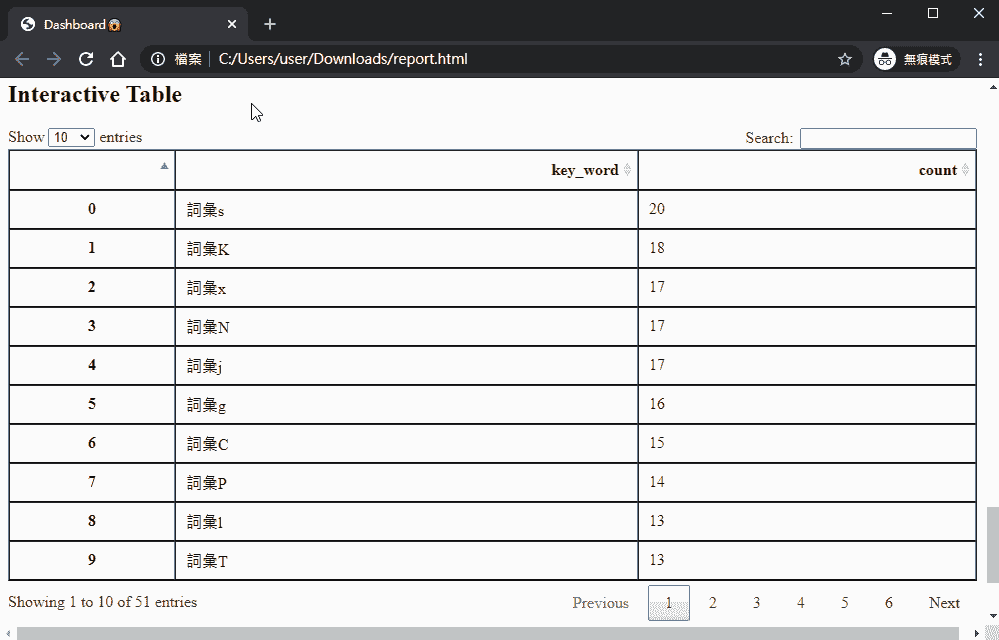
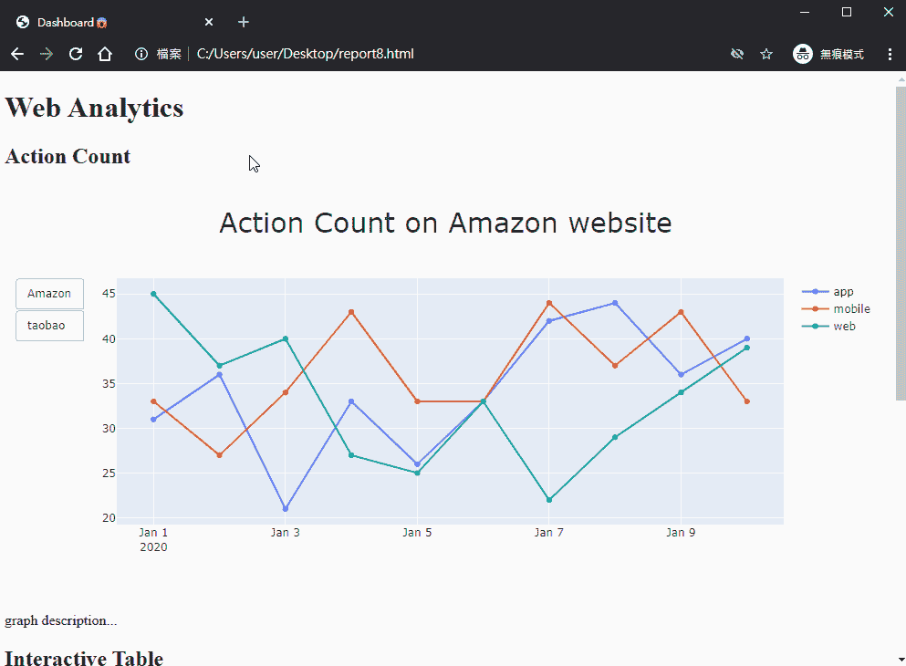

# 使用 Plotly 创建离线交互式报告

> 原文：<https://medium.com/geekculture/create-an-interactive-report-by-using-plotly-981a513fdec4?source=collection_archive---------5----------------------->


Photo by [Luke Chesser](https://unsplash.com/@lukechesser?utm_source=medium&utm_medium=referral) on [Unsplash](https://unsplash.com?utm_source=medium&utm_medium=referral)

## 如果您的公司不想开发仪表板，但需要您长时间监控复杂的数据。也许这是帮助你的一种方式。



Fig1 Offline Interactive Report

# 为什么要用 Plotly 画图？

还有许多其他工具可以创建交互式图表。然而，我不会在本文中争论哪种工具更好。如果有人对它感兴趣，可以查看[链接](https://towardsdatascience.com/the-sweet-spot-of-plotly-c6e1342e3544)。

# 离线交互式报告的优势

*   创建过程可以是全自动的，因为交互式 UI 将让您轻松地比较不同条件下的每个项目。
*   离线交互式报表不需要启动服务器，但仪表板需要。它非常适合那些过去通过电子邮件接收信息的人。
*   Plotly 的交互功能很有帮助，比如下载按钮、隐藏线和缩放图形。



Fig2 Download



Fig3 Zoom Graph



Fig4 Hidden Line

# 创建交互式报表的简单教程

首先，我为这篇文章生成一些假数据。代码如下所示。



weblog dataset: 2000 rows × 4 columns / keyword(search term): 520 rows × 1 columns

其次，打开另一个脚本来导入您的包并加载您之前生成的数据集。

```
# plotly
import plotly.graph_objects as go
import plotly
from plotly.subplots import make_subplots
# basic package
import pandas as pd
import glob
import config
import numpy as np
import re
from datetime import date
import os
import pickle
# wordcloud
from wordcloud import WordCloud, STOPWORDS, ImageColorGenerator
# plot
import matplotlib.pyplot as plt
from matplotlib.font_manager import FontProperties
import base64
from io import BytesIO
from os import path
from PIL import Image
# from pivottablejs import pivot_ui
from IPython.display import IFrame
import json, io
# html
from IPython.display import HTMLdf = pd.read_pickle(‘../Data/web_lod_data.pkl’)
df.head()
```

这样做了之后，你就可以开始考虑你想要显示什么图形或者表格了。下面我举两个例子。

**案例 1:通过统计动作数量比较不同网络浏览设备的使用情况**

我们的数据集有两个网站，所以我们需要创建一个可以相互切换的按钮。



Fig5 Number of Actions

**案例 2:创建一个交互式表格来显示搜索词出现的次数**



Fig6 Interactive Table

最后，打开新的脚本并遵循下面的代码，然后你就可以快速地将我们之前创建的 HTML 文件嵌入到基本的 HTML 模板中了。



# 结论

我认为大多数时候在线仪表板是交互式报告的更好的解决方案。但有时，它可能不是您公司的最佳解决方案。例如，如果您是唯一需要监控数据的人，那么创建在线仪表板就是浪费。另一种情况是您的老板或主管不习惯在仪表板上探索数据洞察力。离线交互式报告可能是您的一个好选择。它可以很容易地在报告中添加您的观点或建议。

我最后的想法是找到一种合适的方式来展示你的分析结果，这是你需要记住的一件重要的事情。否则，你的建议或努力可能很难被看到。尤其是如果你是数据科学家，你的老板或主管可能没有工程或数据分析背景。完整的代码在我的 [GitHub](https://github.com/EricTsai83/offline_interactive_report) 上。谢谢你的时间。