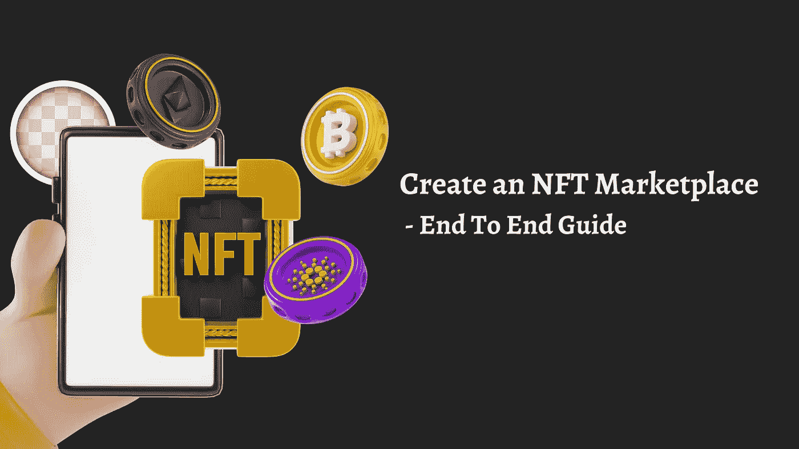

# 创建 NFT 市场—端到端指南

> 原文：<https://medium.com/geekculture/create-an-nft-marketplace-end-to-end-guide-7c19eba8c5b0?source=collection_archive---------21----------------------->

## NFT 市场发展

NFT 市场开发是开发一个专门面向企业的 NFT 市场，并创建、销售和铸造支持游戏内资产、虚拟土地、角色、虚拟房屋和其他对象等的 NFT 的整个技术过程。我们的开发人员是开发各种区块链 NFT 市场的专家，如 Polygon、Solana、Flow、BSC、near 等。

作为一家领先的 nft 市场开发公司，zodeak 为开发一个完全分散的、有限的、可穿越的 NFT 市场提供了一流的解决方案。

我们建立的 NFT 市场提供了丰富的互动体验，并允许用户即时标记他们的资产。用户还可以在用户店面中展示自己的 NFT，并随时转售。

NFT 不局限于一个具体的事物清单；它已经超出了你的想象，我们都准备好深入研究这个领域，以提供温和的解决方案。

## **NFT 市场开发服务**

NFT 市场不适合一个单一的发展过程阶段。一些重要的服务需要整合到平台中，以使其作为一个成熟的 NFT 市场发挥作用。下面列出了 zodeak 提供的服务。

*   NFT 钱包集成
*   头像创作
*   交叉链连接
*   虚拟土地创造
*   NFT 存储
*   游戏中的资产
*   3D 视觉支持

## **NFT 市场的特色**

*   唯一的 NFT
*   社交互动
*   互动体验
*   分散
*   P2P 互动
*   标记化
*   NFT 钱包集成
*   双因素认证
*   多层保护
*   连接这些点——加密和 NFT

## **如何创建 NFT 市场？**

成功的项目需要一致性和敏锐的规划。

**以下是创建 NFT 市场的一些重要步骤:**

*   规划你的商业模式
*   创建详细而精确的白皮书
*   通过 IPFS 或皮纳塔设置安全的 NFT 存储
*   加载智能合约中的核心功能
*   在平台中启用界面和 3D 视图
*   维护管理面板的数据库存储数据
*   集成一些其他功能，包括跨链功能
*   审计智能合同并测试平台
*   计划并测试你的效率

如果你没有足够的时间或其他，寻找一站式解决方案，我们想出一个即时解决方案给你。

## **NFT 市场脚本**

NFT 市场脚本是一个白色标签，高度安全的脚本/软件，是专为即时创建一个 NFT 平台。这个脚本的平台允许用户购买、出售和铸造虚拟土地、化身、游戏内资产等等。我们部署并交付支持虚拟和增强现实的 NFT 市场脚本，以改善 zodeak 的整体用户体验。

## **创建 NFT 市场的好处**

毫无疑问，加密货币是未来的发展方向。加密市场可能会有起有落，但它不会从全球舞台上消失。区块链技术和密码，就像互联网一样，准备传播到全球的各个角落。

NFT 仍处于婴儿期，但它拥有巨大的潜力和力量来影响全人类的生活。需要数年的连续项目才能达到一个稳定的阶段。因此，尽早进入这个行业会带来更大的好处，让你能够抓住吸引用户的机会。

通过与我们 zodeak， [**NFT 市场发展公司**](https://www.cryptocurrencyscript.com/nft-marketplace-development) 在这个紧要关头的合作，商人可以获得如下好处

1.  高投资回报率

2.即时上市

3.定制解决方案

4.经济的

5.消耗较少的时间

联系我们获取报价。