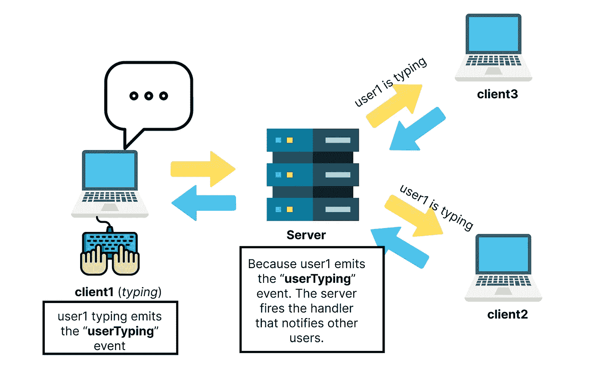

# 使用 ExpressJS(NodeJs)、Socket.io、ReactJs 和 Tailwind CSS 创建一个开放的群聊

> 原文：<https://medium.com/geekculture/create-an-open-group-chat-using-expressjs-nodejs-socket-io-reactjs-and-tailwind-css-bf42957600b5?source=collection_archive---------9----------------------->

A Demo of our Application

# 你将学到什么

1.  Socket.io
2.  克-奥二氏分级量表
3.  反应使用效果、依赖性和清除。
4.  React useRef
5.  顺风 CSS
6.  JavaScript 中的可选链接

# 介绍

学习的一个好方法是建立。在本文中，我们将探讨如何使用以下技术构建一个开放的群聊应用程序:

*   NodeJs :基于谷歌 Chrome V8 引擎的 JavaScript 运行时，用于构建网络应用。了解更多信息[https://nodejs.org/en/about/](https://nodejs.org/en/about/)
*   **ReactJs:** 一个用于构建具有交互式用户界面的单页面应用程序的框架。要了解更多信息，请访问此链接[https://reactjs.org/](https://reactjs.org/)
*   **Socket.io** :这是一个允许在客户端和服务器之间进行实时、双向和基于事件的通信的库。在这里阅读更多:[https://socket.io/](https://socket.io/)
*   **Tailwind CSS** : CSS 实用框架，可用于设计前端应用。访问 https://tailwindcss.com/，了解更多关于这个框架的信息。

# Socket.io 如何工作

插座。IO 允许服务器与客户机或浏览器进行通信。传统上，客户端只与服务器建立单向通信。这是通过客户端发送一个 **HTTP** 请求来实现的，比如一个 **GET** 请求。例如，客户端不知道有多少其他客户端连接到服务器，不能与其他客户端通信，等等。

> **注意:** Socket.io 不是 Web 套接字

1.  我们在客户端和服务器之间建立连接。
2.  使用 socket.io 发出和激发事件。当我们想要发出一个事件时，我们使用`emit`方法，该方法将获取事件的名称，即`socket.emit('eventName')`。当我们想要触发或执行一个事件时，我们使用`on`方法，该方法采用我们发出的事件的名称，例如`socket.on(‘eventName')`。还有一个`broadcast`方法可用于每个连接的套接字。它允许客户端向所有其他客户端发送消息。当您想让其他客户端知道您正在键入时，这很有用。想了解更多，请访问 https://socket.io/。请参见下图:



Communication Between Server and Clients as a Client Types on the Keyboard

# 构建我们的项目

## **步骤 1:设置文件夹结构**

我们基本上需要两个文件夹。一个用于我们的服务器，另一个用于我们的前端应用。

> **注意**:确保你的电脑上安装了`NodeJs`。访问[此处](http://nodejs.org)安装 NodeJs 运行时。

```
mkdir server
```

我们将使用 create-react-app 创建第二个文件夹，前端文件夹，我们很快就会看到。

## 步骤 2:创建我们的服务器

需要一个服务器，因此我们创建了一个 express.js 服务器。这将处理从客户端触发的任何事件。以及向客户端激发或发出任何事件。为此，我们首先将 cd 放入您终端中的服务器文件夹。

```
 cd server
```

我们将需要安装`express`、`cors`和`socket.io`。为了安装这些软件包，我们需要运行:

```
npm install --save express cors socket.io 
```

接下来，创建一个名为`app.js`的文件，并粘贴以下代码。

Source code for the app.js of our server

*   **第 1–3 行**:我们需要 **express** ，创建我们的 **HTTP** 服务器并需要 **cors。**
*   **第 6 行:**我们需要 **socket.io** ，并将其实例化为 **io** 。这是使用安装的，然后我们通过使用星号“ ***** ”允许 **CORS** 用于每个原点来配置它。这意味着任何来源的客户端，如“ ***、http://yourigin.com***”或“ ***、http://yourorigin.com***”仍然可以连接到服务器。可以通过将星号“*”替换为有问题的原点来指定特定的原点。
*   **第 9 行和第 10 行**:设置服务器运行的端口。
*   **第 13 行**:我们让服务器支持跨源资源共享。这样，来自任何域的任何客户端都可以连接。
*   **第 16 行**:我们创建了一个“连接”事件，当任何客户端连接到服务器时就会触发这个事件。它接受一个代表所连接的客户端的参数。在这种情况下，客户端被称为套接字。反过来，这个套接字包含一些特定于客户端或套接字的属性，比如`id`。

> **注意**:只有使用`connection`事件连接客户端，才能触发所有其他事件。

*   **第 18 行**:我们发出事件`activeUsers`，它允许我们获得连接的客户端数量。
*   **第 21 行**:我们发出`getId`事件，该事件将在客户端首次连接时获取客户端的 id，然后我们传递所连接的套接字或客户端的套接字 id。
*   **第 24 行**:我们触发`chat`事件，当用户发送聊天时，任何客户端都会发出这个事件。它将发送聊天的用户的`id`和`chat`作为参数，然后发出`sendChat`事件。
*   **第 29 行**:事件`userNameChange`被创建。当用户更改其用户名时，将触发此事件。这个事件依次向所有其他客户端发出`resetChat`事件。
*   **第 34 行**:创建了一个`userTyping`事件，当用户输入时该事件被触发。反过来，它向其他客户机发出事件`someoneTyping`。
*   **第 39 行**:我们触发`activeUsers`事件，该事件获取连接用户的数量。它使用 socket.io `engine.clientsCount`方法来实现这一点。然后我们使用`countUsers`事件将结果发送给客户端。
*   **第 40 行**:这是客户端断开连接时触发的`disconnect`事件。在其中，我们允许任何断开的套接字立即向其他客户端发出`disconnectNotification`事件。然后它向其他客户端发送连接用户的数量。

为了启动我们的服务器，我们需要编辑服务器文件夹的 package.json 中的“start”脚本。

```
{..."scripts": { "test": "echo \"Error: no test specified\" && exit 1", "start": "node app.js",
    ...},
...}
```

现在要启动我们的服务器，我们需要运行

```
npm start
```

## 步骤 2:创建我们的前端应用程序

对于我们的前端应用程序，我们将使用 ReactJs 和 Tailwind CSS。安装参见反应中的[反应安装](https://reactjs.org/docs/create-a-new-react-app.html#create-react-app)和[顺风安装。](https://tailwindcss.com/docs/guides/create-react-app)

首先，我们需要从终端中的服务器文件夹中取出 cd:

```
cd ..
```

然后运行下面的命令来安装 React

```
npx create-react-app frontend
cd frontend 
```

上面的命令将安装 react，并允许您 cd 进入 react 应用程序文件夹。在终端的文件夹中，运行下面的命令来安装 Tailwind CSS。

```
npm install -D tailwindcss postcss autoprefixer
```

完成后，运行下面的命令来初始化 tailwind:

```
tailwindcss init -p
```

上面的命令将创建一个顺风配置文件。现在打开文件，编辑`content`字段如下:

```
...
content: ["./src/**/*.{js,jsx,ts,tsx}"],
...
```

最后，转到 react 应用程序文件夹的`index.css`文件，粘贴以下内容:

```
[@tailwind](http://twitter.com/tailwind) base;
[@tailwind](http://twitter.com/tailwind) components;
[@tailwind](http://twitter.com/tailwind) utilities;
```

现在，这将允许我们在我们的项目中使用 Tailwind CSS。

接下来，打开 App.js 并粘贴以下代码:

Source Code for App.js

*   **1-3 行**:我们导入`React`、`useState`、`useRef`和`useEffect`。
*   第 4 行:我们导入`io`作为我们的客户端引擎。下面是在客户端导入`socket.io`的[指南](https://socket.io/docs/v3/client-initialization/)。
*   **第 5 行**:我们导入定制的 CSS。
*   **第 9 行**:我们使用`useRef` React 钩子创建了`toastRef`，它将处理`DOM`上负责烤面包的元素。
*   **第 12–20 行**:使用`useState`钩子，我们创建变量，如`activeUsers`，它代表连接设备的数量。`socket`表示连接的客户端或套接字的实例。`id`代表用户的`id`。`socketid`表示客户端或套接字的 id。`username`表示用户的用户名。`chat`代表用户发送的聊天。`allChats`这是一个保存所有用户所有聊天记录的数组。`notification`用于设置 toast 将要显示的通知。`someoneTyping`它将保存用户名或用户或客户端输入的套接字的 id。
*   第 23 行:我们创建了`scrollToBottom()`函数，当用户发送聊天信息时，它会滚动到页面底部。
*   **第 30 行**:我们创建了一个`showToast()`函数，显示任何通知的提示。它采用背景颜色并实现了一个`setTimeOut()`功能，三秒钟后将被触发以隐藏祝酒词。
*   **第 39 行**:我们创建了`changeUsername()`函数来设置用户的用户名。这也将映射所有聊天，并将用户的用户名更改为输入的用户名。最后，它发出`usernameChange`事件。
*   **第 49 行**:我们创建了`handleChatInput()`方法，该方法将接受用户输入的内容，并将值设置为`chat`。
*   **第 54 行**:使用`submitChat()`函数，我们首先使用套接字的`socket.disconnected`属性检查客户端是否断开连接。如果为真，则仅向客户端发送通知，告知它们已断开连接。如果没有用户的聊天记录，将不会提交任何内容。如果为真，则发出事件`chat`，该事件将用户的 id、他们的聊天以及他们的套接字 id 作为`socketid`。最后，当提交聊天时，调用`scrollToBottom()`函数。
*   **Line 67** :我们创建了`logOut()`函数，用于注销或断开用户连接。它检查用户是否已经断开连接。然后显示带有相应通知的祝酒词。
*   **Line 79** :通过`getTime()`功能，我们可以得到任何聊天信息发送的时间。
*   **第 86 行**:我们创建了`searchUser()`函数，它遍历所有的聊天记录，并使用用户的 id 找到一个特定的用户。
*   第 97 行:我们创建了`handleUserTyping()`方法来处理用户的输入。我们创建一个每秒运行一次的`timeout`函数。它发出`userTyping`事件，并使用`clearTimeout()`功能清除。
*   我们创建了我们的第一个`useEffect()`钩子。这将只运行一次，因此它的依赖数组中没有任何内容。我们这样做是为了只创建一个套接字实例，然后只添加一次事件侦听器。这将防止诸如一个客户端同时发送两个聊天的问题。
*   **第 109 行**:我们初始化一个新的 socket 实例，并将我们的服务器端点传递给它。这样它就可以与服务器建立连接。
*   **第 110 行**:我们保存套接字到一个状态。
*   **第 113 行**:我们调用`socket.io`内置的`connect_error`事件处理程序。这将检查是否存在连接错误，并相应地通知用户。
*   **第 120 行**:发出`activeUsers`事件。
*   **第 123 行**:我们为`getId`事件创建处理程序，它获取套接字的 id 并保存到状态`id`。
*   **第 129 行**:我们为`countUsers`创建了一个事件处理程序，它将通过使用函数`setActiveUsers()`获取连接的客户端数量，并将值设置为状态`activeUsers`。
*   **第 135 行**:事件`sendChat`的处理程序被创建，它获取`allChats`状态数组，并向其中添加新的聊天。最后，它调用`scrolltoBottom()`函数。
*   **第 143 行**:这里我们为`resetChat`事件创建处理程序。它通过更改用户的用户名来修改`allChats`状态。
*   **Line 150** :现在我们为`message`事件创建处理程序。它在发出`message`事件时触发，并使用`setNotification()`函数和`showToast()`函数用消息通知每个套接字。
*   **第 156 行**:我们给第一个`useEffect`钩子增加了一个清理功能。这是为了避免副作用，例如插座在应该关闭时仍然连接。
*   **第 154 行**:我们创建另一个`useEffect`钩子。这是因为我们希望能够在状态`allChats`更新时重新呈现我们的组件，并且能够基于更新执行一些功能。这在第一个中是不可能的，因为它只会在组件第一次渲染时运行一次。
*   **第 166 行**:当组件重新呈现时，我们仍然想获得活动用户的数量。

> **注意**:在`socket`实例上`?`的使用。这在 Javascript **中叫做**可选链接** *。用于检查一个特定的对象或其属性是否为空或未定义，并防止任何与之相关的错误。***

因为在第一次渲染时，`socket`对于第二个`useEffect`钩子来说是空的，所以我们使用它来防止将被抛出的`Uncaught TypeError: Cannot read properties of null`的错误。

*   **第 169 行**:我们为`disconnectNotification`事件创建处理程序，它通过使用套接字 id 并调用我们前面已经讨论过的`searchUser()`函数来搜索断开连接的用户。因此它向所有客户端通知断开连接的用户。
*   **第 177 行**:创建了`someoneTyping`事件的处理程序。它接受套接字的 id 和类型参数。它检查用户是否正在输入或已经停止。
*   **第 193 行**:我们使用`activeUsers`状态显示活动用户总数。
*   **第 195 行**:我们在一个按钮内部实现了`logOut()`功能。
*   **第 200 行**:显示用户的`id`。
*   **第 208 行**:我们实现了一个`Onchange`事件监听器，用于输入我们想要设置的用户名。它设置用户的`username`。
*   **第 209 行**:我们将`changeUsername()`函数附加到按钮的`onClick`事件监听器上。这将根据`Line 208`中提供的输入更改用户的用户名。
*   **第 216 行**:我们将之前创建的`toastRef`附加到`toast`中带有`id`的段落。并将`notification`状态附加到它上面。类似于我们之前的解释。这将显示任何通知消息的 toast。
*   **第 221–227 行**:这里，我们映射`allChats`状态数组。它将通过显示聊天的`id`、`chat`和`time`来映射所有聊天。
*   第 233–239 行:我们通过检查`someoneTyping`状态是否有值来检查是否有人在打字。如果为真，我们使用逻辑`AND`运算符来显示`someoneTyping`状态值。
*   **Line 240** :在提交聊天的表单上，我们将之前创建的`submitChat()`函数附加到它的`onSubmit`事件处理程序上。
*   **第 241 行**:我们将输入字段的值设置为`chat`。`onkeyUp`和`onKeyDown`事件处理程序被附加到用于输入聊天内容的输入字段。前者是当用户停止按键盘上的任何键时，从而将`someoneTyping`状态值设置为`null`。而后者负责对键盘上的任何键进行按压的时间。还附带了将调用`handleChatInput()`函数的`onChange()`事件处理程序。最后，我们有`onKeyPress`事件处理器，它将检查用户是否点击或按下了键盘上的`'Enter'`键。

# 预览我们的项目

这里是 Github 上完整代码的链接。如果你喜欢这个项目，记得给⭐️留下一颗星星😊。

# 这是现场演示:https://oya-chat.onrender.com/**。**

# **结论**

在本教程中，我们学习了 socket.io 和实时通信是如何工作的。我们还学习了如何使用 CORS，使用效果和清理，用户参考和顺风 CSS。有了这个，我们可以构建任何实时聊天应用程序。