# 创建基本的 Web 应用程序🖥️和🚀部署🚀用 Python！！

> 原文：<https://medium.com/geekculture/create-basic-web-application-%EF%B8%8F-and-deployment-using-python-eb027e57c5ee?source=collection_archive---------1----------------------->

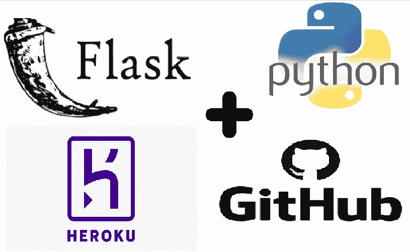

大家好。！！🤗

今天，您将向自己介绍用于 **Python** 的 **Flask** ，并为“**信用评分”**创建一个基本的 web 应用程序，其中包括一个包含网页结构的 **HTML** 模板，一个包含设计说明的 **CSS** 样式表，一个与 web 服务器通信的 **Python** 后端，并通过将该应用程序免费部署给 **Heroku** 来完成它！😁

## 烧瓶快速概览

*   Flask 正在使用一种叫做 HTML 的编程语言来创建网页的结构。
*   **CSS**——用于样式化这个结构，使它看起来更有吸引力。
*   **Javascript** —它用于与网页上的不同元素进行交互。
*   **Python** —它用于与 web 服务器通信，也称为后端。这只是烧瓶的一小部分。

所有文件都可以在 [**我的 GitHub 资源库**](https://github.com/Priyanka-Dandale/Credit-Score-Rating-App) 中找到。

## 按照步骤准备好您的 web 应用程序！

1.  **创建文件夹** —首先，在你的电脑上创建一个空文件夹‘CreditScoreRatingApp’。在里面创建其他文件夹，如:

*   “模板”来存储我们所有的 HTML 文件，
*   “静态”——在里面创建“CSS”文件夹来保存我们所有的样式表，

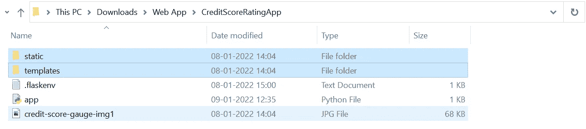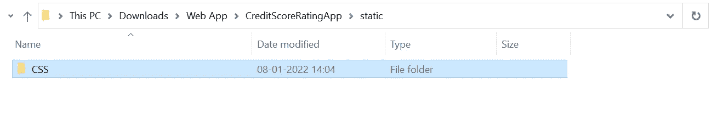

2.**【模板】文件夹中的 HTML 文件** —打开一个新的记事本文件，复制下面的 HTML 代码。

将其保存在“templates”文件夹中，名称为“index ”,扩展名为。“html”。

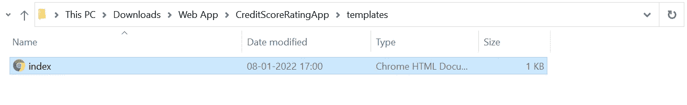

如果你点击 index.html，它会显示在网页下方。

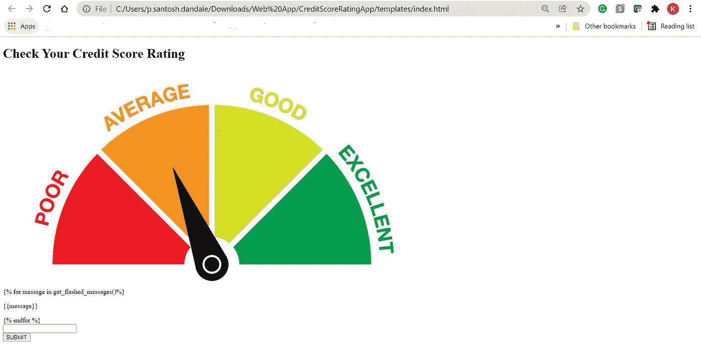

3.**‘static’——CSS 文件**的‘CSS’文件夹——在记事本中打开一个新文件，复制下面的 CSS 代码。

将其保存在“CSS”文件夹中，文件名为“main ”,扩展名为。css。

4.在**‘CreditScoreRatingApp’文件夹中，**添加 Python 文件—在 Spyder 或任何其他 Python IDE 中打开一个新文件，以创建**‘app . py’**文件，并复制以下 Python 代码。

如果用户输入为，将显示相应的消息:

*   300 比 349——“你的分数很差！！!'
*   350 到 599—‘你的分数一般！！!'
*   600 比 799——‘你的分数不错！！!'
*   800 到 900—‘你的分数很优秀！！!'
*   除上述内容外的任何内容都将显示输入无效，最大限制为 900，最小限制为 300。

5.在**‘CreditScoreRatingApp’文件夹**中添加**。flaskenv** 文件—在记事本中打开一个新文件，并复制以下代码。

> FLASK_APP = app.py

6.现在打开 Anaconda 命令提示符，用下面的命令创建一个新的虚拟环境:

> conda create-name en v2(请检查下面的确切语法)

然后用下面一行代码激活您新创建的环境:

> conda 激活 env2

您需要在新环境中安装 flask，代码如下:

> 康达安装-c 水蟒烧瓶

现在转到您的“CreditScoreRatingApp”文件夹目录。更改目录的 cd:

> cd 下载\Web 应用程序\CreditScoreRatingApp

键入 flask run 并按 enter 键。

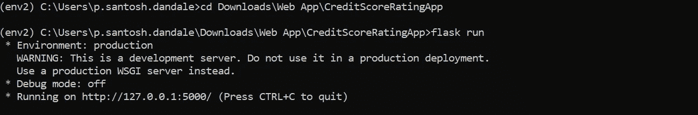

转到 URL“http://127 . 0 . 0 . 1:5000/priyankad”

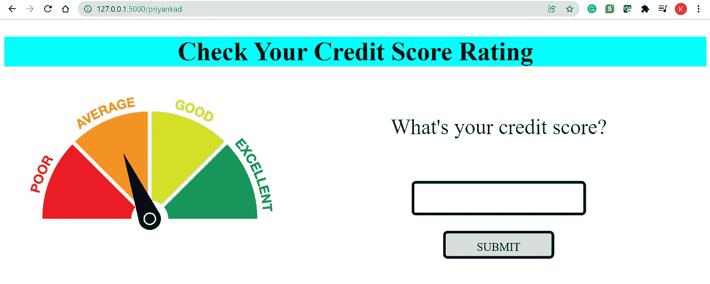

在空输入框中输入一个值，例如 850，然后点击提交按钮。

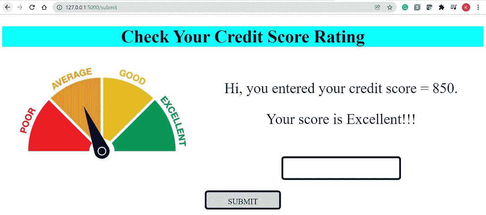

你的网页现在完全正常了。

🤔**请记住，如果您对 HTML、CSS 或 Python 文件进行了任何更改，那么您需要清除缓存—进入设置选项 n Chrome —隐私和安全—清除浏览数据—缓存的图像和文件—清除数据。**

## 您需要创建两个附加文件:

1.  **Procfile:**

在 Anaconda 提示符下，键入 Ctrl + C 退出。然后使用以下命令安装 gunicorn:

> pip 安装 gunicorn

键入以下内容，在同一文件夹目录中创建新的空文件

> 回显> Procfile

转到“CreditScoreRatingApp”文件夹，用记事本打开“Procfile”并删除文本“ECHO on”并输入***' web:guni corn app:app '***其中第一个 app 为你的 Python 文件名' app.py '并保存。

2 **。需求文件**

要生成自动生成应用程序所有需求的需求文件，请键入以下内容并按回车键:

> pip 冻结> requirements.txt

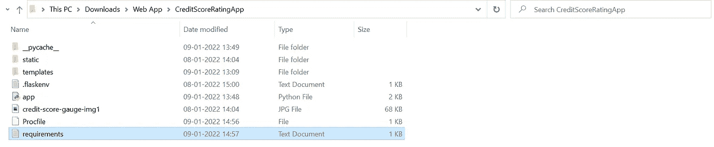

# 使用 HEROKU 部署😎

前往“[https://www.heroku.com](https://www.heroku.com/)”并登录或注册新的免费账户。创建新帐户后，单击网格图标导航至您的控制面板:

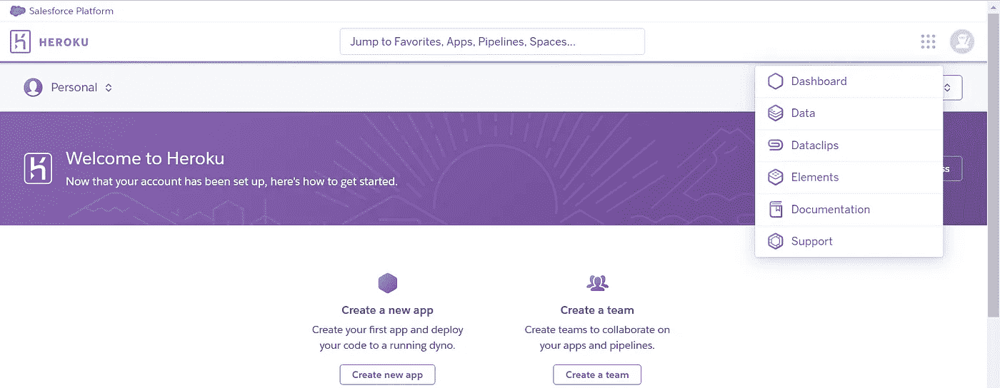

点击“创建新应用”和应用名称，选择一个地区，然后点击“创建应用”。

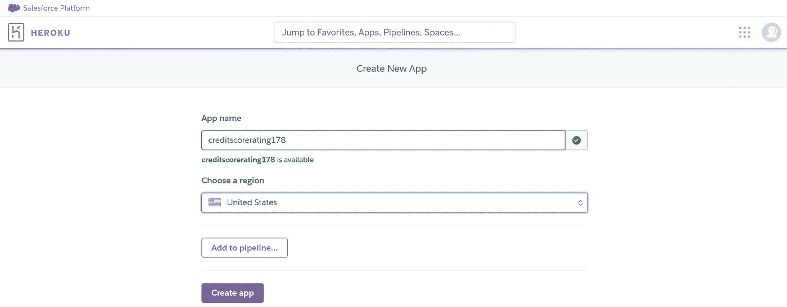

转到设置:

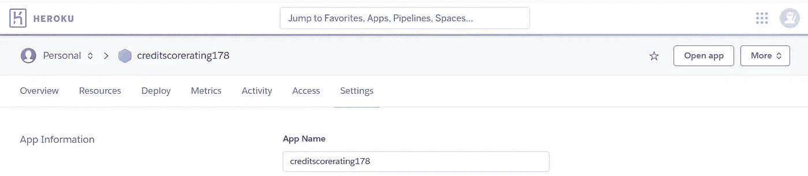

向下滚动一点，点击“添加构建包”,选择 Python 并保存更改:

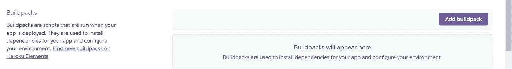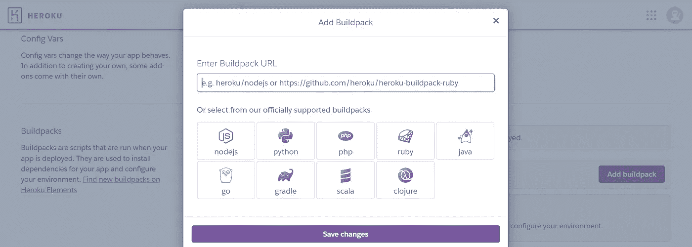

向上滚动并点击“部署”:

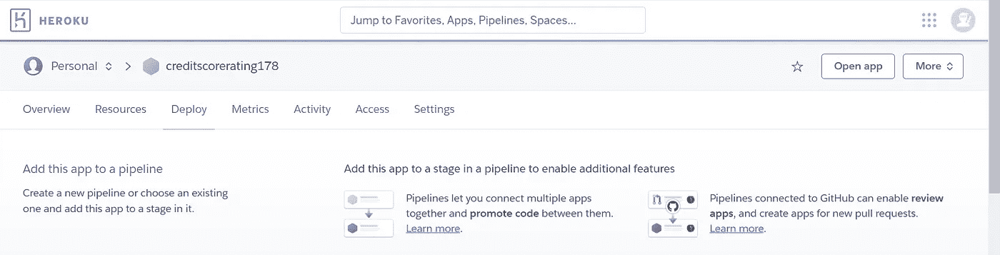

我们将使用 GitHub 连接和部署我们的应用程序——点击 GitHub，然后点击“连接到 Github ”,并提供您的用户名和密码。

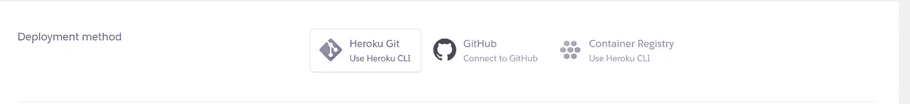

给出您的存储库名称，然后单击“连接”。

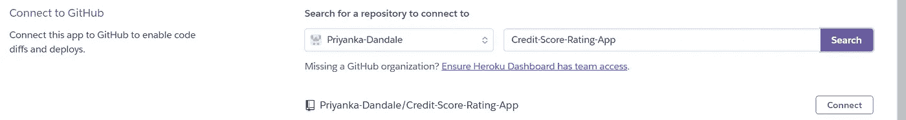

转到“手动部署”部分，选择您需要的分支，因为我将选择“主”并单击“部署分支”。

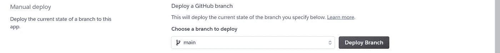

向下滚动一点:

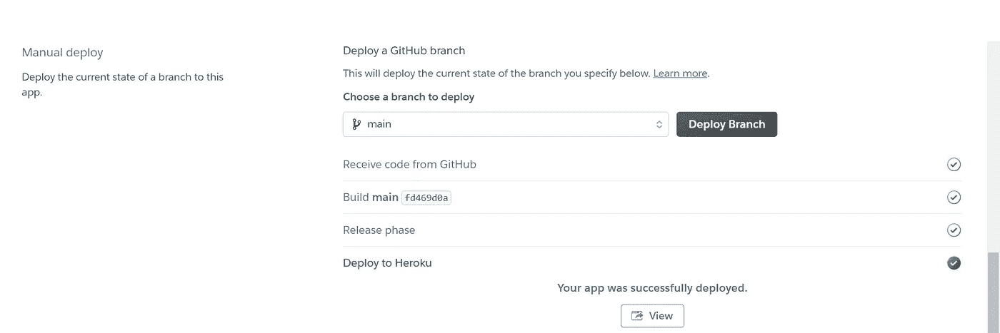

看到“部署到 Heroku”消息后，点击“查看”,您将看到以下网页:

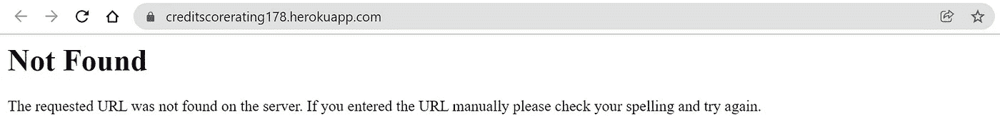

请记住，您必须在 URL 中指定“/priyankad”路由:

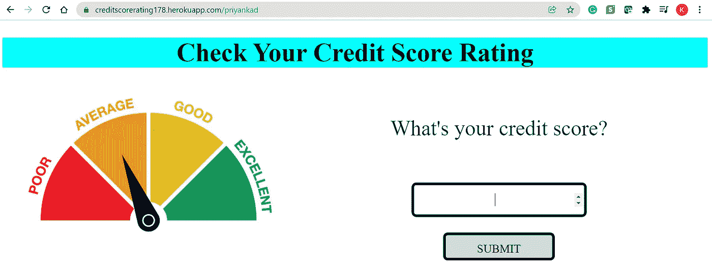

# 瞧啊。！！😊

____________________________________________________________

感谢你阅读❤

对于任何建议或疑问，请在下面留下您的评论，并关注更新。

如果你喜欢这篇文章，请点击👏图标来支持它。这将有助于其他媒体用户找到它。分享一下，让别人也能看！

快乐学习！😊