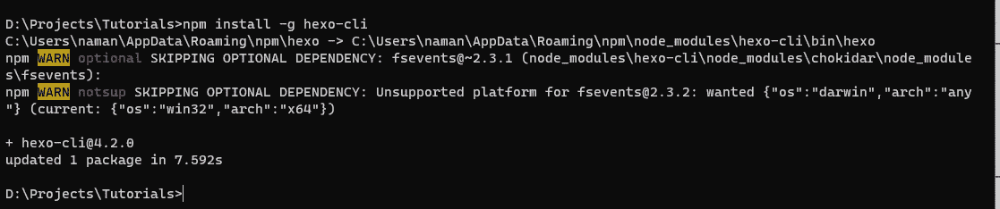
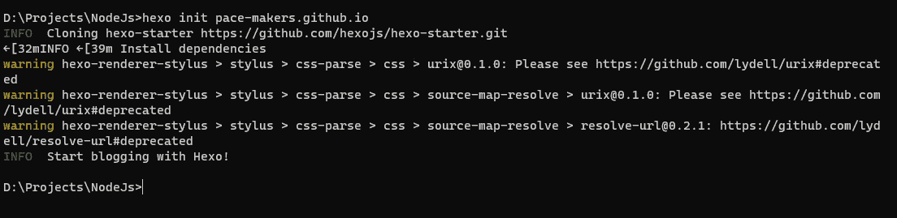
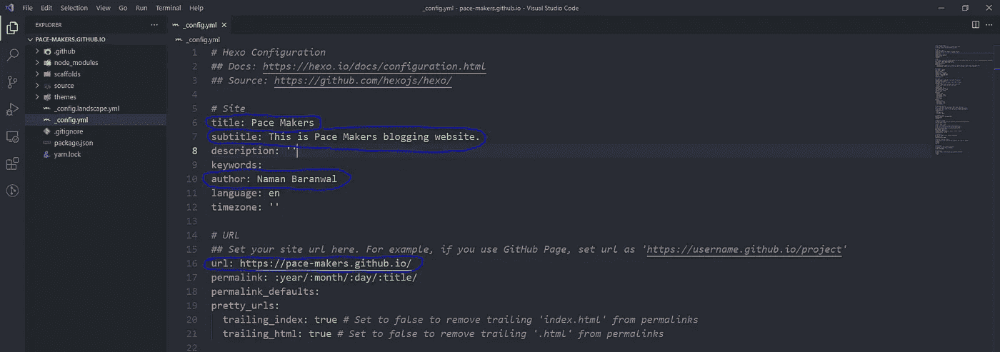
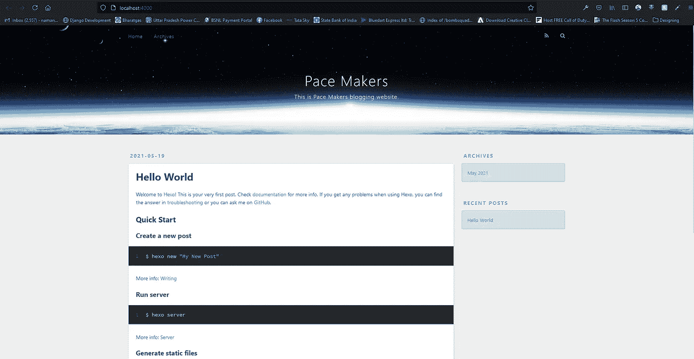
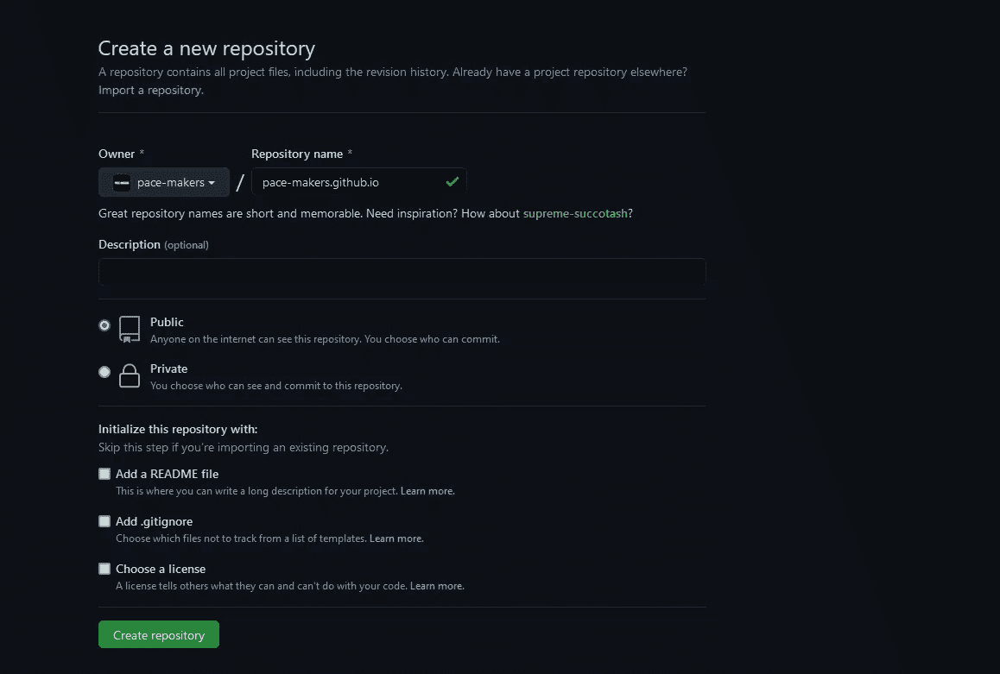
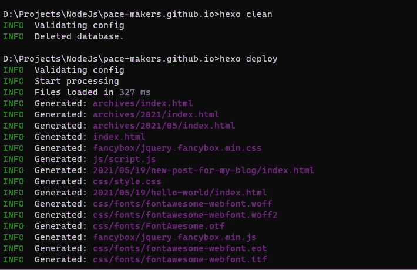
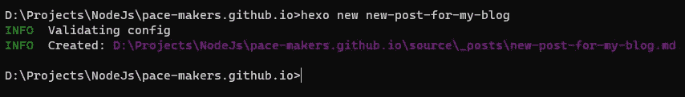
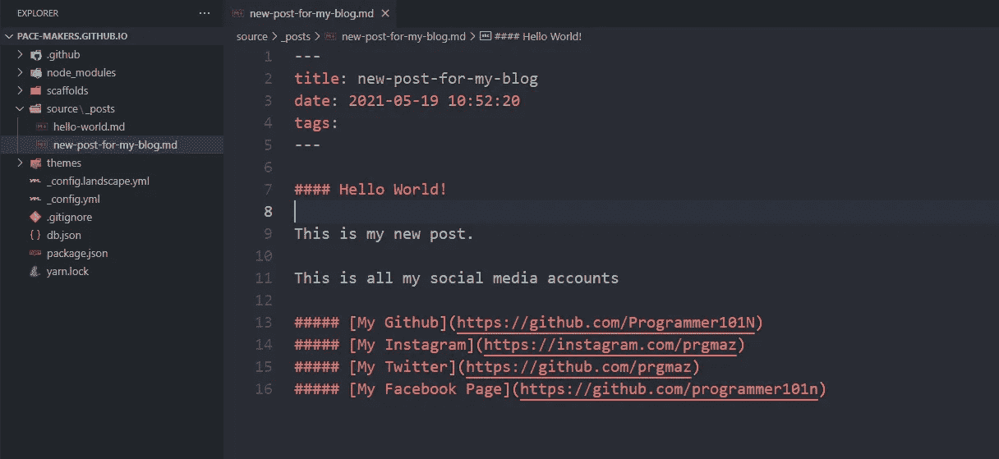
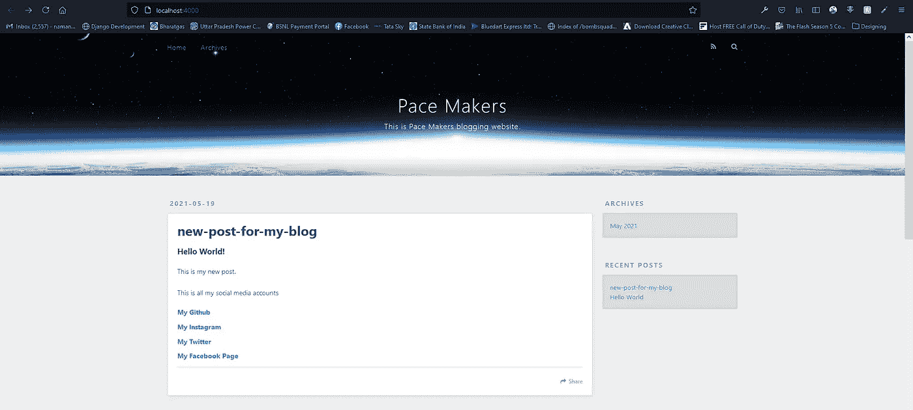

# 创建一个博客网站，并将其免费托管在 Github 页面上

> 原文：<https://medium.com/geekculture/create-blogging-website-and-host-it-on-github-pages-for-free-300faacb3b6e?source=collection_archive---------7----------------------->

## 我们将创建一个博客网站，并将其免费托管在 Github 页面上。


## 本教程我们需要的是

*   Git 已安装
*   NPM 和节点已安装
*   hexo-cli(全球安装)

## 设置我们的项目

首先，让我们安装所有需要的模块。要安装`hexo-cli`，只需打开`cmd`、`powershell`或`terminal`，输入`npm install -g hexo-cli`。这将在您的电脑上全局安装`hexo`。



## 创建一个入门博客网站

要创建博客网站启动包，请键入`hexo init <github_username>.github.io`。我要在 Github 上为我的组织创建一个博客网站。



您已经创建了自己的入门博客。现在用您想要的代码编辑器打开该目录。

## 建立我们的博客网站

打开`_config.yml`，这个文件包含你网站的配置信息。我要为我的网站改`name, subtitle, description and etc.`。



我在我的网站`_config.yml`文件上更改了这些设置。

现在为我们的网站服务，在我们的终端或 cmd 上键入`hexo server`。



你可以看到我们的网站正在运行。

## 在 Github 页面上部署

首先，您需要通过键入`git init`来初始化该目录上的 git 存储库。如果你想要一个 git 指南，你可以在我的 Git 上查看以前文章的基础指南。

转到 [Github](https://github.com) 并点击 new，在 GitHub 上创建一个新的存储库。



现在复制存储库的`https`链接。对我来说，是`[https://github.com/pace-makers/pace-makers.github.io.git](https://github.com/pace-makers/pace-makers.github.io.git.)` [。](https://github.com/pace-makers/pace-makers.github.io.git.)

现在安装一个模块，它将帮助您在 Github 页面上进行部署。在该目录中的 cmd 上键入`npm install hexo-deployer-git`。

现在你需要对`_config.yml`文件进行修改。打开并向下滚动到该文件的底部，键入以下内容。

```
...
deploy:
  type: git
  repo: https://github.com/pace-makers/pace-makers.github.io.git # Your repo link goes here
  branch: master
```

现在使用这些命令`hexo clean`和`hexo deploy`部署到 Github 页面。



如果你去`https://<your-user-name>.github.io/`，你会看到你的博客网站在工作。

## 创建新帖子。

要在您的网站上创建新帖子，您可以键入`hexo new <post-title>`。



这将在您的`source/_posts`目录中创建一个新的帖子模板。如果你打开目录，你会看到一个模板帖子`hello-word.md`。现在你可以开始用 Markdown 语言编辑这篇文章了。



现在，如果你刷新你的页面，你会看到，你的新文章出现在第一页。



您可以通过进入 [**本网站**](https://hexo.io/themes/) 并按照说明进行安装来更改您网站的主题。

您需要再次部署以对您的网站进行更改。在你的 cmd 上输入`hexo clean`和`hexo deploy`。

[链接到我的 Git 回购](https://github.com/pace-makers/pace-makers.github.io)

## [访问我的网站](https://programmer101n.com)，我也在那里张贴这些东西。

## [**在我的社交网站上关注我**](https://wlo.link/@prgmaz) **。(它们在我网站的右侧)**