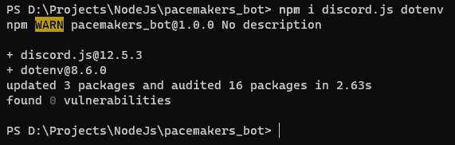
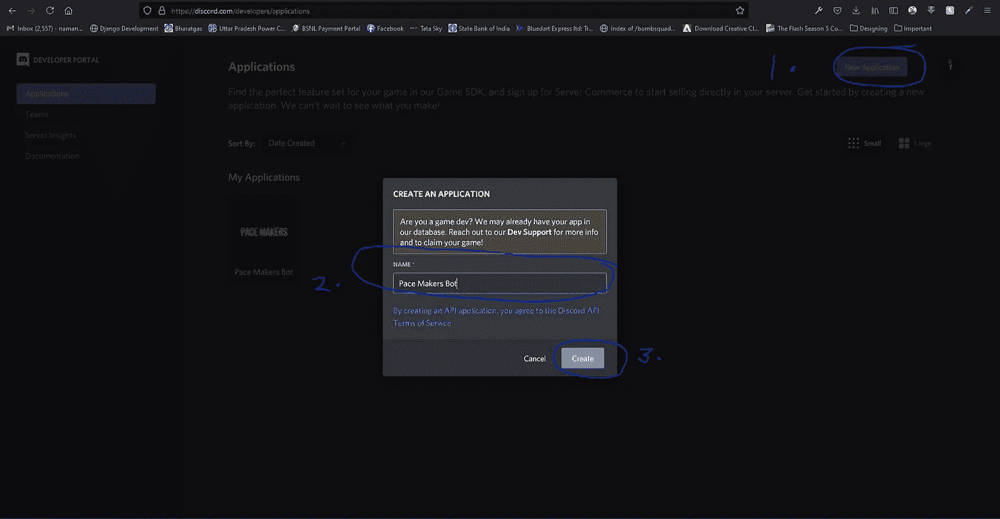
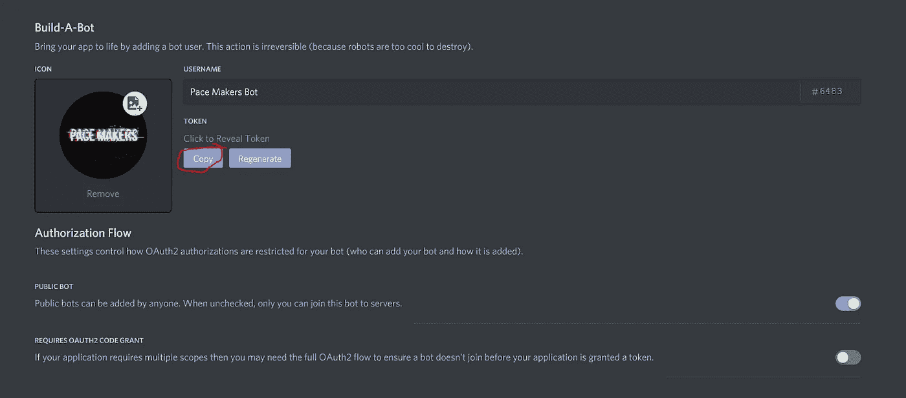
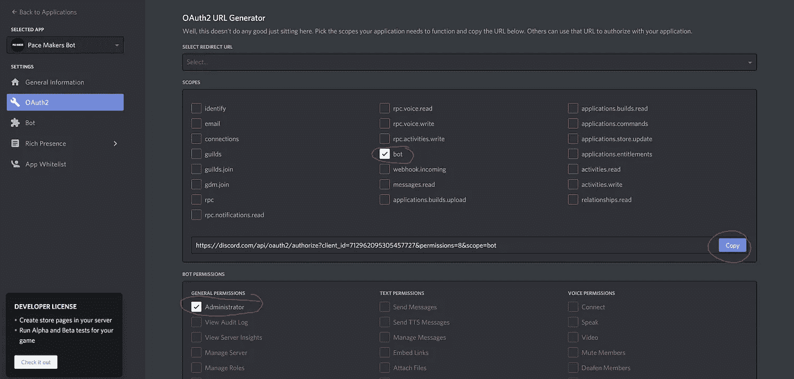
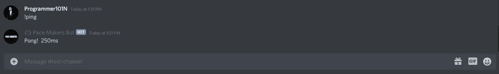
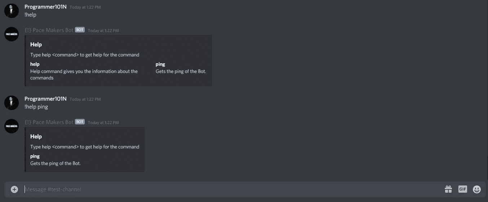

# 为你的不和谐服务器创建机器人

> 原文：<https://medium.com/geekculture/create-bot-for-your-discord-server-59989b39f6fa?source=collection_archive---------35----------------------->

在这篇博客中，我们将为你的 discord 服务器创建一个可以执行各种命令的机器人。


## 本教程我们需要的是

*   NodeJs 和 NPM 已安装
*   不和谐. js
*   dotenv

## 设置项目

创建一个名为`discord_bot`的文件夹，并使用`npm init -y`命令初始化该文件夹中的一个节点项目。现在让我们通过输入这个命令`npm i discord.js dotenv`来安装一些软件包。



让我们创建一个名为`.env`的文件。这个文件将包含我们的环境变量，比如机器人的`TOKEN`和`PREFIX`。

让我们为我们的不和谐机器人得到我们的令牌。去 [**Discord 开发者门户**](https://discord.com/developers/applications) 如果你还没有注册的话就去注册吧。现在打开应用程序选项卡，点击`New Application`。键入一个名称，然后按`Create`。



现在您已经创建了一个应用程序，通过键入 name 并给它一个个人资料图片来设置它。

点击`Bot`选项卡，复制令牌。



将其粘贴到您的`.env`文件中。您的文件应该如下所示

```
TOKEN=PASTE YOUR TOKEN HERE
PREFIX=!
```

让我们通过转到`OAuth2`选项卡并赋予它`bot`的范围和`Administrator`的权限来邀请我们的机器人加入我们的服务器，复制 url 并将其粘贴到您的浏览器中，现在选择您的服务器并按`Continue`。



现在我们开始创建我们的不和谐机器人。

## 登录我们的机器人

在你的项目中创建`index.js`文件并开始输入你的代码。

```
require("dotenv").config(); // Telling Nodejs, We are using dotenv to get environment variables
const discord = require("discord.js"); // Importing discord.js library
const client = new discord.Client(); // Creating a client for our bot
const fs = require("fs"); // We are gonna need filesystem module for later.// Your CODE WILL GO HEREclient.login(process.env.TOKEN); // Login into your discord bot you created by this method and passing it the token
```

我们来听一下`ready`事件(当我们的 bot 准备好使用时它会触发)。

```
require("dotenv").config(); // Telling Nodejs, We are using dotenv to get environment variables
const discord = require("discord.js"); // Importing discord.js library
const client = new discord.Client(); // Creating a client for our bot
const fs = require("fs"); // We are gonna need filesystem module for later.client.on('ready', () => {
    console.log("Hello World!");
});client.login(process.env.TOKEN); // Login into your discord bot you created by this method and passing it the token
```

现在，如果你在 powershell 中输入`nodemon index`来运行你的机器人。您将看到`Hello World!`登录到您的终端。


## 创建命令

要创建命令，在项目中创建名为`commands`的目录。让我们为我们的机器人创建一个基本命令`ping`。在我们的`commands`目录下创建名为`ping`的文件。

```
// Importing Message data type from `discord.js`
const { Message } = require("discord.js");/* 
    Exporting a object with name, description and execute properties.
    1\. name - this will be the name of the commands and used to call the commands
    2\. description - This will be helpful for getting help message.
    3\. execute - This will contain the function of the command. message and args will be passed to it.
*/
module.exports = {
    name: "ping",
    description: "Gets the ping of the Bot.",
    execute: (message, args) => {
        // Creating a new message
        const msg = new Message();
        // Setting content of the message to 'Pong!'
        msg.content = "Pong!";
        // Sending the message to the current channel
        message.channel.send(msg);
    }
}
```

您可以根据需要添加更多命令，就像这样。

## 执行命令

我们将监听服务器任何通道上的消息，并看到该消息是从我们在`.env`文件中使用的`PREFIX`开始的。为此，我们将侦听`message`事件(每当有新消息时，该事件就会触发)。

```
require("dotenv").config(); // Telling Nodejs, We are using dotenv to get environment variables
const discord = require("discord.js"); // Importing discord.js library
const client = new discord.Client(); // Creating a client for our bot
const fs = require("fs"); // We are gonna need filesystem module for later.client.on('ready', () => {
    console.log("Hello World!");
});client.on("message", (message) => {
    // If message doesn't start with our prefix and author of that message is a bot, we are gonna break the execution any further
	if (!message.content.startsWith(process.env.PREFIX) || message.author.bot)
		return; 

    // Removing prefix, Getting command and arguments 
	const args = message.content.slice(process.env.PREFIX.length).split(/ +/); 
	const command = args.shift().toLowerCase(); // Getting command name.});client.login(process.env.TOKEN); // Login into your discord bot you created by this method and passing it the token
```

现在我们有了用消息调用的命令和参数。我们可以创建命令。为此，首先我们要对我们的`ready`事件监听器做一些更改。

```
client.on("ready", () => {
	console.log("Hello World!");
	// Creating new Collection Datatype from discord.js(You can learn about it from the documentation of discord.js)
	client.commands = new discord.Collection();     // Getting all file names with extension of `.js` in the `commands` directory
	const commandFiles = fs
		.readdirSync("./commands/")
		.filter((file) => file.endsWith(".js")); 

    // Looping through the file and getting all the commands from it and setting it by name and command.
	for (const file of commandFiles) {
		const command = require(`./commands/${file}`);
		client.commands.set(command.name, command);
	}
});
```

现在改变我们的`message`事件来执行命令。

```
client.on("message", (message) => {
	if (!message.content.startsWith(process.env.PREFIX) || message.author.bot)
		return; const args = message.content.slice(process.env.PREFIX.length).split(/ +/);
	const command = args.shift().toLowerCase(); // Checking if command exist it, if it does, calling execute function. Else sending error message to the channel where the command was called from.
	if (client.commands.has(command)) {
		client.commands.get(command).execute(message, args);
	} else {
		message.channel.send(
			`No command named **${command}** is found. Type **help** for all commands.`
		);
	}
});
```

如果您向服务器发送消息，将导致命令被执行。



## 创建帮助命令

要创建帮助命令，在`commands`目录中创建一个名为`help.js`的文件。

```
// Importing Message embed data type
const { MessageEmbed } = require("discord.js");
// Importing Filesystem module
const fs = require("fs");

module.exports = {
	name: "help",
	description: "Help command gives you the information about the commands",
	execute: function (message, args) {
	    // Instantiating new MessageEmbed
		const embed = new MessageEmbed();
		// Setting title and description of the embed
		embed.setTitle("Help");
		embed.setDescription("Type help <command> to get help for the command");

        // If no command specified after !help then execute this.
		if (args.length < 1) {
		    // Reading all the commands
			const commandFiles = fs
				.readdirSync("./commands/")
				.filter((file) => file.endsWith(".js"));

			for (const file of commandFiles) {
				const command = require(`./${file}`);
                // Adding to the embed command name and its description
				embed.addField(command.name, command.description, true);
			}
		} else {
			const command = require(`./${args[0]}.js`);
			if (!command) {
				return message.channel.send("No command found");
			}

			embed.addField(command.name, command.description, true);
		}
		// Sending the embed to the channel.
		message.channel.send(embed);
	},
};
```

现在，如果你输入`!help`或`!help command`，它将被执行。



要全天候运行这个机器人，你需要把它托管在一个托管提供商上，比如`Heroku`、`Digital Ocean`或`Google Cloud`。

项目链接在我的网站上。

在我的社交网站上关注我。