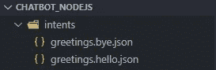
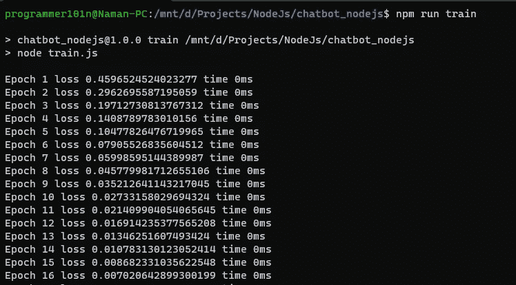
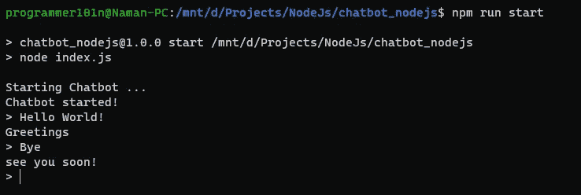

# 如何用 Node.js 创建聊天机器人

> 原文：<https://medium.com/geekculture/create-chatbot-with-nodejs-cf3d8bc3f302?source=collection_archive---------1----------------------->


本教程我们需要的是:

*   NPM 和节点已安装
*   节点 nlp 模块

## 设置我们的项目

首先创建一个你想要创建项目的文件夹，我创建了名为`chatbot_nodejs`的文件夹。

用命令`npm init`初始化文件夹中的 repo，用`npm i node-nlp`安装模块。


在该文件夹中创建一个名为`index.js`的文件。


现在我们的项目已经设置好了。

## 创作意图

在我们的项目文件夹中创建一个名为`intents`的文件夹。我们将在 json 中创建我们的意图，所以我创建了两个名为`greetings.bye.json`和`greetings.hello.json`的 JSON 文件。在里面，我把我们的问题和答案组织成这样。

```
{
    "questions": [
        "goodbye",
        "bye take care",
        "see you later",
        "bye for now",
        "i must go"
    ],
    "answers": [
        "see you soon!",
        "Till next time",
        "bye bye",
        "have a great day"
    ]
}{
    "questions": [
        "hello",
        "hi",
        "howdy",
        "Greetings"
    ],
    "answers": [
        "Hey there!",
        "Hello",
        "Hi",
        "Greetings"
    ]
}
```



您可以通过创建新的 json 文件并像这样构建您的意图来添加更多内容。

## 训练和保存聊天机器人

在我们的项目文件夹中创建一个名为`train.js`的文件。让我们编写一些代码来训练模型。

```
// Let's start with importing `NlpManager` from `node-nlp`. This will be responsible for training, saving, loading and processing.
const { NlpManager } = require("node-nlp");
// Creating new Instance of NlpManager class.
const manager = new NlpManager({ languages: ["en"] });// Let's import fs module to read our json files.
const fs = require("fs");// Let's read all our intents files in the folder intents
const files = fs.readdirSync("./intents");// Looping through the files and Parsing the string to object and passing it to manager instance to train and process it.
for (const file of files) {
    let data = fs.readFileSync(`./intents/${file}`);
    data = JSON.parse(data); const intent = file.replace(".json", ""); for (const question of data.questions) {
        manager.addDocument("en", question, intent);
    } for (const answer of data.answers) {
        manager.addAnswer("en", intent, answer);
    }
}// let's create a function that will be responsible for Training and saving the manager instance.
async function train_save(){
    await manager.train();
    manager.save();
}// Calling the above function
train_save();
```

我们的`train.js`文件现在完成了。现在让我们创建我们的`index.js`文件。

```
// Let's start with importing `NlpManager` from `node-nlp`. This will be responsible for training, saving, loading and processing.
const { NlpManager } = require("node-nlp");
console.log("Starting Chatbot ...");// Creating new Instance of NlpManager class.
const manager = new NlpManager({ languages: ["en"] });
// Loading our saved model
manager.load();// Loading a module readline, this will be able to take input from the terminal.
var readline = require("readline");
var rl = readline.createInterface(process.stdin, process.stdout);console.log("Chatbot started!");
rl.setPrompt("> ");
rl.prompt();rl.on("line", async function (line) {
    // Here Passing our input text to the manager to get response and display response answer.
    const response = await manager.process("en", line);
    console.log(response.answer);
    rl.prompt();
}).on("close", function () {
    process.exit(0);
});
```

现在我们的文件完整了。我们现在需要做的就是创建两个脚本 train 和 start。打开`package.json`，添加两个脚本。

```
"scripts": {
    "train": "node train.js",
    "start": "node index.js"
  },
```

*   `train`脚本将运行`train.js`文件。
*   `start`脚本将运行`index.js`文件。



现在我们的项目完成了。您可以从我的 Github 下载这个源代码。

[在 Github 上访问这个项目](https://github.com/Programmer101N/chatbot_nodejs)

*更多内容请看*[***plain English . io***](http://plainenglish.io)