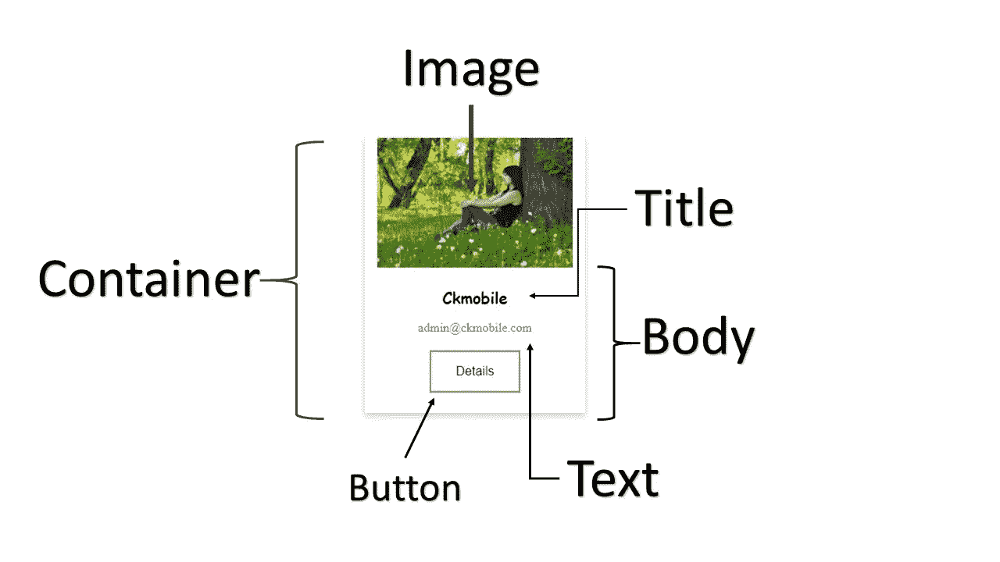

# 在 React 中创建复合组件。

> 原文：<https://medium.com/geekculture/create-compound-components-in-react-c94e4934a51?source=collection_archive---------11----------------------->

## 使用复合组件创建卡片列表

在本文中，我们计划创建一个包含容器、图像、标题、正文、文本和按钮的复合组件。

源代码和教学视频: