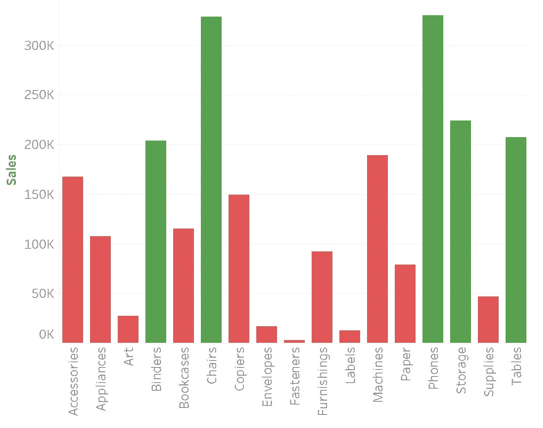
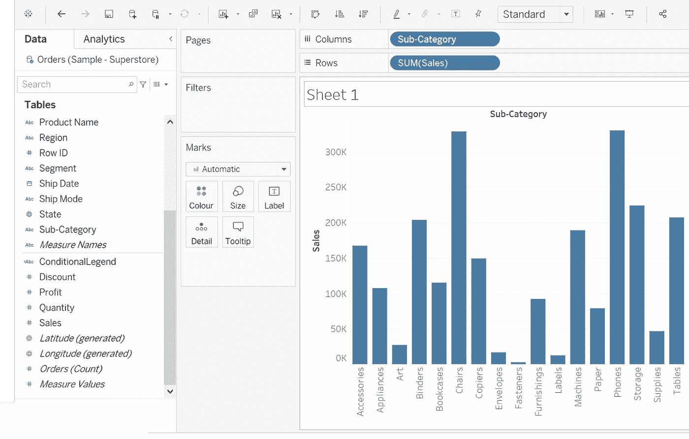
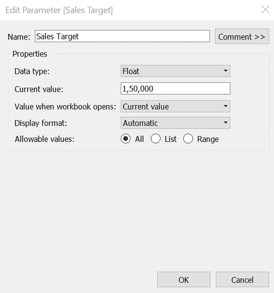
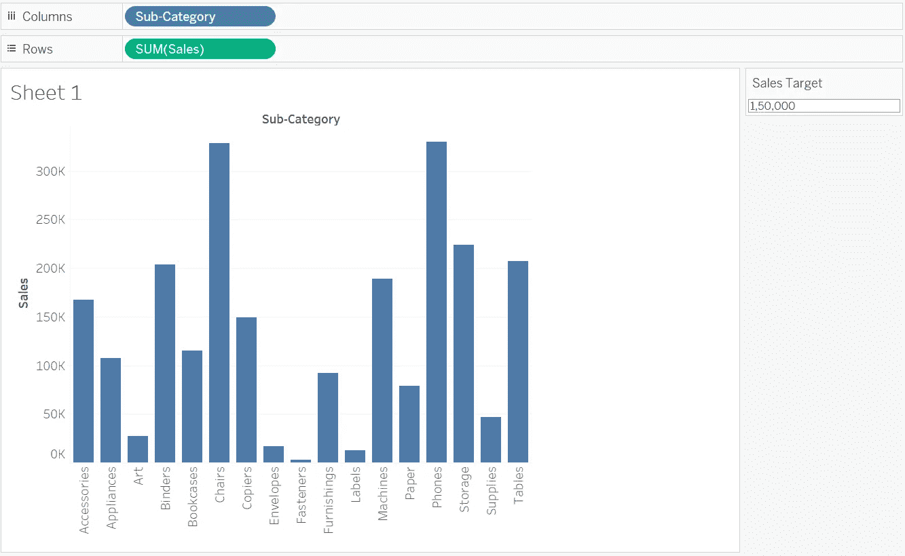
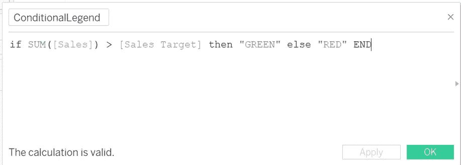
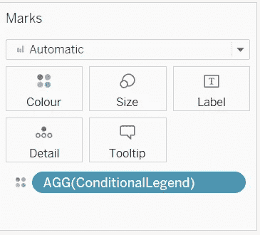
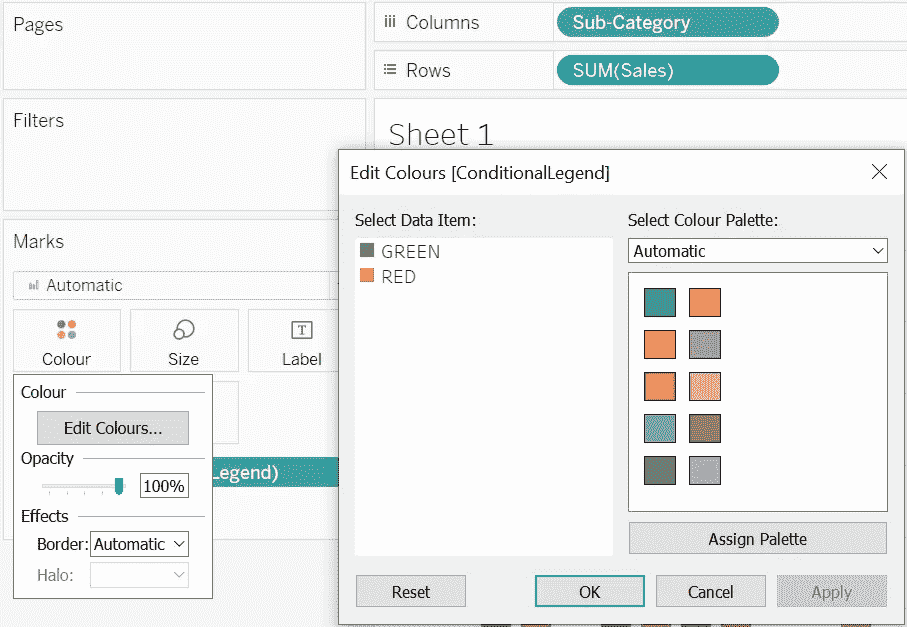
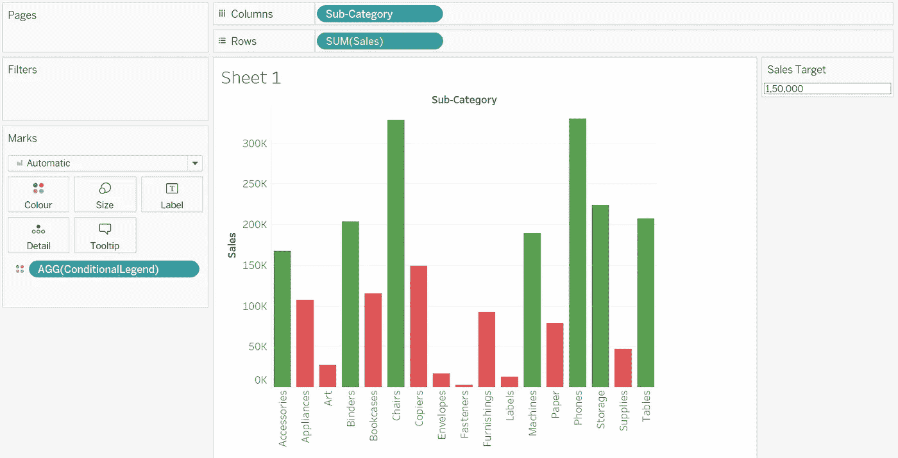
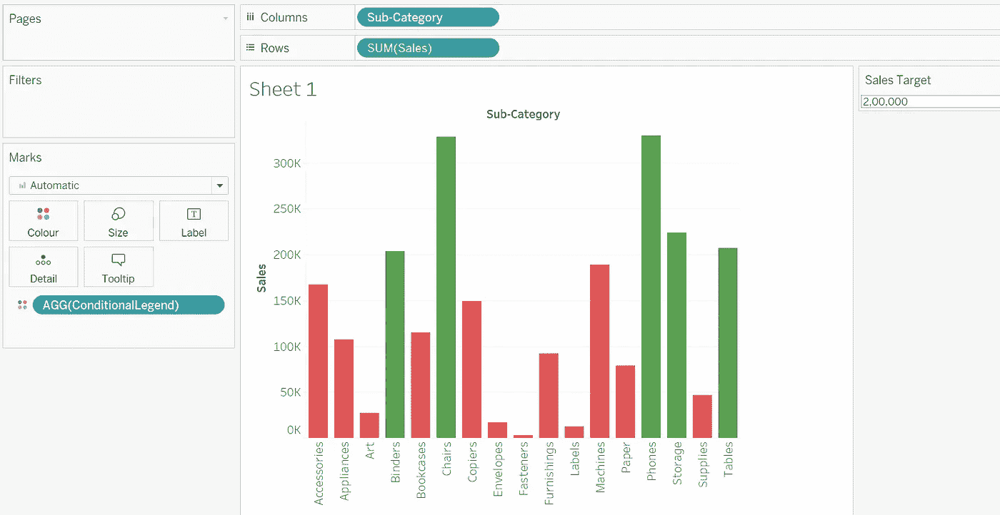

# 在 Tableau 中创建基于条件的颜色图例

> 原文：<https://medium.com/geekculture/create-condition-based-color-legend-in-tableau-1ea1348005c4?source=collection_archive---------22----------------------->

所有使用 Tableau 的人都知道，如果将一个分类字段拖到颜色标记卡中，它会自动创建一个颜色图例。然而，很多时候我们会遇到这样的情况，我们可能需要基于某些标准或条件的颜色图例。在本文中，我将以这样一个场景为例，解释如何在 Tableau 中创建基于条件的颜色图例。

我将使用 Tableau 附带的“样本超市”数据集的订单表。在我开始之前，让我解释一下这个场景。

我想看到子类别销售额的条形图。基于特定的销售阈值，条形的颜色将在绿色和红色之间变化。如果一个子类别的销售总额高于阈值，则该条的颜色应为绿色，否则为红色。这里有趣的地方在于，销售额的阈值应该是用户输入的。

**第一步:**拖动列中的**子类**和行中的 **SUM(Profit)**

Image 1: Sub Category vs SUM(Sales)

**第二步**:创建参数

将参数命名为**销售目标**，并赋予如下图所示的属性:

Image2: Creating a Parameter

一旦创建了参数，右键单击它并执行“显示参数”。该参数将作为用户输入字段出现在右侧窗格中，并设置默认值。请参见下图:

Image3: Adding Parameter to the Canvas

**第三步**:创建自定义字段

创建名为**conditional end 的计算字段。**给出该字段的以下条件:

*如果求和(【销售】)>【销售目标】则“绿色”否则“红色”结束*

请参见下图:

Image4: Creating custom field

**第四步**:将新创建的**条件**字段拖放到色标中

Image5: Drag-drop ConditionalLegend field in the Colour Marks

**步骤 5** :调整色标

点击颜色标记并编辑颜色。一旦颜色面板出现，给出适当的颜色代码，即绿色代表“绿色”，红色代表“红色”。

Image6: Setting correct color codes

一旦上述步骤完成，所有 SUM(Sales)值大于 150000 的条形将开始以绿色显示。请参见下图:

Image7: Bars showing color based on threshold input

现在，为了测试这是否正常工作，您可以在参数输入中将销售目标的值更改为 200000。SUM(Sales)值低于 200000 的所有条形将立即开始以红色显示。请参见下图:

Image8: Color of bars changing based on Sales Target entered

哟！我们提出了我们的问题陈述。

我将在下一篇文章中介绍另一个有趣的画面技巧。