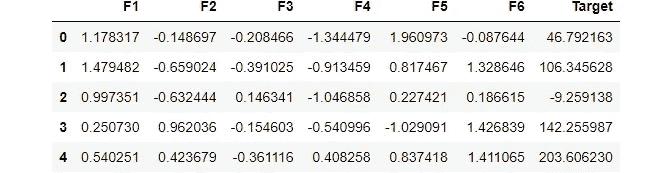
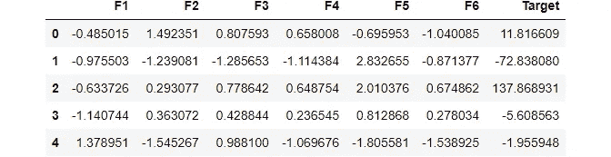
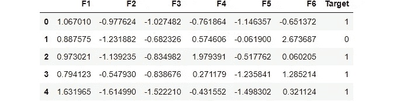

# 以下是如何在一秒钟内创建自定义数据集的方法

> 原文：<https://medium.com/geekculture/create-custom-datasets-within-seconds-53abf103bf8b?source=collection_archive---------10----------------------->

## 构建完美的数据集，在几秒钟内测试您的模型


Photo by [Mika Baumeister](https://unsplash.com/@mbaumi?utm_source=medium&utm_medium=referral) on [Unsplash](https://unsplash.com?utm_source=medium&utm_medium=referral)

作为一个初学者，开始处理一个已经存在的数据集可能有点令人畏惧。

或者，您可能想快速测试一个模型，或者在您所学的最新算法上练习构建一个模型。

但是你不想把时间浪费在数据清理之类的事情上。

本文将帮助您在瞬间构建自己的自定义数据集，您可以随时开始练习。

在本文中，我们将创建自己的自定义函数，根据我们的需求生成随机数据集。我们将在 Sklearn 库的帮助下创建这个函数。

我们将使用在 [Sklearn 数据集模块中定义的用于创建随机数据集的函数。](https://scikit-learn.org/stable/modules/classes.html#module-sklearn.datasets)

那么，我们开始吧。

# 创建自定义数据集

我们将从从 Sklearn 模块导入 make_regression()方法开始，为回归创建数据集。

```
from sklearn.datasets import make_regression
```

然后，我们将通过传递所需的参数来创建一个回归对象。

现在，我们将传递创建包含 100 个样本、4 个特征和 1 个目标的数据集的参数。

```
reg = make_regression(n_samples=100, n_features=4, n_targets=1)
type(reg)tuple
```

现在，我们的数据集已经准备好了，但它是数组元组的形式。

为了便于处理，我们需要将其转换为数据框。

因此，我们将首先定义我们的列。

```
columns = [f"F{i}" for i in range(1, 7)] #defining our column names
```

现在，让我们生成数据框。

```
# features
features = pd.DataFrame(reg[0], columns=columns)

# target
target = pd.DataFrame(reg[1], columns=['Target'])

# checking dataframe shape
print("Dataset shape: ", features.shape, target.shape)Dataset shape:  (10000, 6) (10000, 1)
```

现在，让我们连接要素和目标数据框以获得最终的数据框。

```
# concatenating features and target.
df_reg = pd.concat([features, target], axis=1)
df_reg.head() # looking at first 5 observations
```



就是这样。我们的定制数据框架已经准备好了，现在您可以开始用您的机器学习模型快速练习了。

**但是等等，其他任务的数据集呢？**

别担心。我为你做了一个自定义功能，你可以把它复制粘贴到你的终端/窗口/笔记本的任何地方。

# 用于创建自定义数据集的自定义函数

您可以利用这个函数轻松地生成您的自定义数据集。

您应该提供问题所需的编号，以生成相应的数据集。

例如，要为回归创建数据集，请键入

```
makedf(1).head()Dataset shape:  (10000, 6) (10000, 1)
```



对于分类数据集，

```
makedf(3).head()Dataset shape:  (10000, 6) (10000, 1)
```



类似地，您可以传递参数并获取所需的数据集。

希望你喜欢这篇文章。

关注我，了解更多可操作的数据科学和机器学习内容。

你可以在 https://github.com/Retinpkumar[访问我的 GitHub 个人资料，获取与我的博客文章相关的代码文件。](https://github.com/Retinpkumar)

谢谢你，祝你愉快。