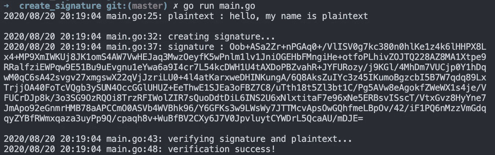

# 在 Go 中使用 RSA 创建数字签名

> 原文：<https://medium.com/geekculture/create-digital-signature-using-rsa-in-go-8da82552f028?source=collection_archive---------5----------------------->

## 你收到你祖母的一封转账信，但是信上没有她的签名。你能转账吗？我希望你不要。


Cover Photo by [SkillScouter](https://unsplash.com/@skillscouter?utm_source=unsplash&utm_medium=referral&utm_content=creditCopyText) on [Unsplash](https://unsplash.com/s/photos/signature?utm_source=unsplash&utm_medium=referral&utm_content=creditCopyText)

签名是确保信息真实性的最常见方式。自罗马帝国时代就有了。具有讽刺意味的是，在这个数字时代，有许多公司和应用程序在没有适当的数字签名的情况下进行交互。

# 项目范围

构建一个简单的 go 应用程序，它基于示例文本创建签名。然后验证签名是否为有效签名。

社区图书馆

*   壁垒:[https://github.com/purnaresa/bulwark](https://github.com/purnaresa/bulwark)

# 已完成的项目预览

通过调用 go build 文件在命令 shell 中运行应用程序。

```
go run main.go
```



首先，应用程序打印出伪明文。然后它创建一个签名。如果创建签名成功，签名将被打印出来。最后一部分是应用程序验证明文的签名。如果验证成功，它将打印成功消息。

# 应用设计


Example Application Design

> *在继续之前，请订阅我们的网站，如果我们有新的教程内容，您会得到通知。*

# 密码

# 主要应用

```
package mainimport (
	"log" "github.com/purnaresa/bulwark/crypto"
)func main() {
	// provision key pair
	privateKey, publicKey, err := crypto.GenerateKeyPair()
	if err != nil {
		log.Fatalln(err)
	} // create dummy plaintext
	plaintext := []byte("hello, my name is plaintext")
	log.Printf("plaintext : %s\n\n", string(plaintext)) // create signature
	log.Println("creating signature...")
	signature, err := crypto.SignDefault(plaintext, privateKey)
	if err != nil {
		log.Fatalln(err)
	} else {
		log.Printf("signature : %s\n\n", string(signature))
	} // verify signature
	log.Println("verifying signature and plaintext...")
	errVerify := crypto.VerifyDefault(plaintext, publicKey, signature)
	if errVerify != nil {
		log.Fatalln(errVerify)
	} else {
		log.Println("verification success!")
	}}
```

上面的代码是 main.go 的完整代码，下面我们将对代码进行分解并给出解释。

**第一部分:提供密钥对**

```
privateKey, publicKey, err := crypto.GenerateKeyPair()
	if err != nil {
		log.Fatalln(err)
	}
```

在生产环境中，RSA 密钥对是在系统之外提供的。您必须将私钥存储在安全的地方。整体而言——如果您的私钥被泄露，签名就是有缺陷的，因为签名不能保证其真实性。公钥应该与和你通信的伙伴共享。如果您的私钥泄露，请生成新的密钥对！

为了简单起见，这个项目中的密钥对是动态生成的。

**第 2 部分:创建伪明文**

```
plaintext := []byte("hello, my name is plaintext")
log.Printf("plaintext : %s\n\n", string(plaintext))
```

你可以加密任何东西，只要它是字节格式的。重要的是明文的大小。RSA 只能加密有限大小的明文。在大多数情况下，加密短信就足够了。如果您需要加密像图像或 pdf 这样的大数据，请使用双重加密方法。首先，使用 AES/symmetrical 用随机生成的密钥加密文件。然后使用 RSA 加密生成的密钥。

**第 3 部分:创建签名**

```
log.Println("creating signature...")
signature, err := crypto.SignDefault(plaintext, privateKey)
	if err != nil {
		log.Fatalln(err)
	} else {
		log.Printf("signature : %s\n\n", string(signature))
	}
```

用私钥对明文签名。输出是一个签名，可以使用密钥对中的公钥进行验证。签名是使用随机数发生器创建的。即使明文相同，每次签名也会不同。

创建签名的用例就在将数据和签名一起发送给合作伙伴之前。如果您的应用程序正在处理个人身份信息(PII)，您将需要加密数据。加密前基于明文创建签名。如果您在加密后创建签名，攻击者可能会破坏(修改)签名，从而导致验证失败，因此信息不会得到处理。通过加密密文和签名来保护信息。

**第 4 部分:验证签名**

```
log.Println("verifying signature and plaintext...")
errVerify := crypto.VerifyDefault(plaintext, publicKey, signature)
	if errVerify != nil {
		log.Fatalln(errVerify)
	} else {
		log.Println("verification success!")
	}
```

必须使用签名创建者的公钥来验证签名。明文是检验签名是否有效的必要材料。如果验证失败，它将返回一个错误对象。

在生产场景中，验证签名的是您正在与之通信的伙伴。因此，您必须与他们共享您的公钥，以便他们验证签名。

# 图书馆

上面的主要应用程序是从

```
"github.com/purnaresa/bulwark/crypto"
```

这是一个安全应用架构库。该应用中使用的三个功能是:

*   GenerateKeyPair()
*   SignDefault(明文[]字节，私钥[]字节)(签名字符串，err 错误)
*   VerifyDefault(明文[]字节，公钥[]字节，签名字符串)(err 错误)

**GenerateKeyPair** 是生成 RSA 密钥对的函数。函数的细节和例子可以在这篇文章中找到[在 Go](https://www.purnaresa.co/build-rsa-private-public-key-generator-in-go/) 中生成 RSA 私钥-公钥对

**SignDefault** 是创建签名的函数。输入是明文和私钥。输出是 base64 字符串的签名，以便于存储和传送。该功能对于大多数用例都是灵活的。如果您需要了解引擎盖下的情况，请查看此 [Github 代码](https://github.com/purnaresa/bulwark/blob/master/crypto/encryption_public.go)。

**VerifyDefault** 是验证签名的函数。输入是明文、公钥和公钥。如果验证成功，输出是一个空的错误对象。如果您需要了解引擎盖下的情况，请查看此 [Github 代码](https://github.com/purnaresa/bulwark/blob/master/crypto/encryption_public.go)。

# 摘要

创建数字签名很容易。许多社区图书馆可供使用。你可以用一个你信任的。重要的是确保这些库的规范符合行业标准。如果规范不符合行业标准，与您通信的合作伙伴将很难验证签名

此处提供示例代码:

[https://github . com/purnaresa/bulwark/blob/master/crypto/example/create _ signature/main . go](https://github.com/purnaresa/bulwark/blob/master/crypto/example/create_signature/main.go)