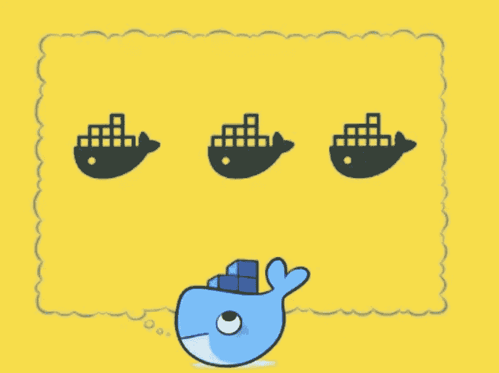
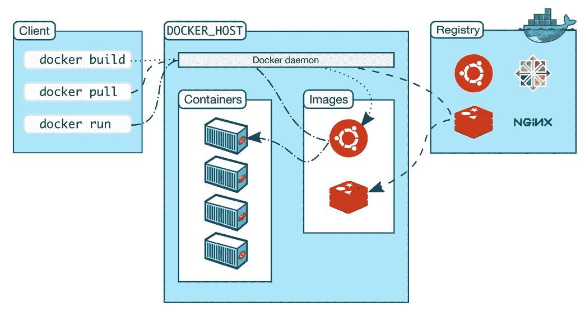
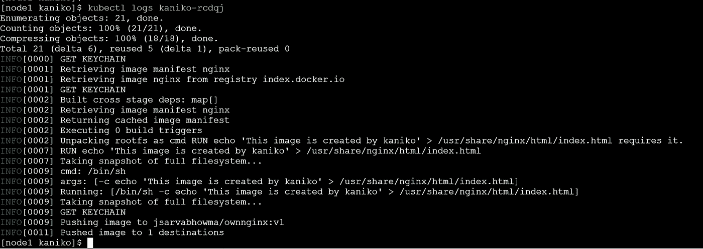
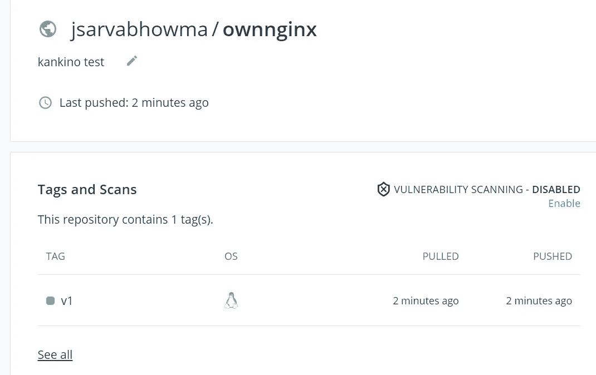
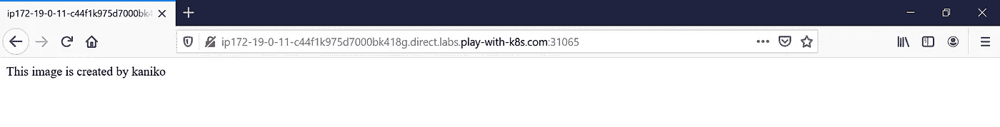

# 创建没有 Docker 守护进程的 Docker 映像(Kaniko)

> 原文：<https://medium.com/geekculture/create-docker-images-without-docker-daemon-kaniko-847a688155a6?source=collection_archive---------4----------------------->

Docker 中众所周知的安全缺陷是，它需要 root 访问权限来使用 Docker 守护程序构建您的 Docker 映像。

我们知道在使用 root 访问权限时应该小心。本文将有助于理解使用 docker 和 Docker 替代品(Kaniko)来缓解安全问题的缺点。



Docker Inside Docker

# **Docker 内部 Docker 的已知问题:**

为了理解为什么 docker 守护进程以 root 权限运行，以及这是一个什么问题，我们首先需要理解 Docker 的高层架构。

容器图像是用 Dockerfile 文件指定的。docker 文件详细介绍了如何根据您的应用和资源[构建](https://docs.docker.com/engine/reference/commandline/build/)映像。使用 Docker，我们可以使用 build 命令来构建我们的容器映像。一旦你有了 docker 文件的图像，你就可以[运行](https://docs.docker.com/engine/reference/commandline/run/)它。运行映像时，会创建一个容器。

下面是 Docker 架构的简化图，直接取自[官方文档](https://docs.docker.com/get-started/overview/)。



Docker Architecture

docker 的问题是我们不能在你的系统上直接使用 docker。在大多数情况下，我们只会与 Docker CLI 交互。然而，使用 Docker 运行应用程序意味着您必须使用 root 权限运行 [Docker 守护进程。它实际上绑定到 Unix 套接字，而不是 TCP 端口。默认情况下，用户只能使用由用户 *root* 拥有的 *sudo* 命令来访问 Unix 套接字。](https://docs.docker.com/engine/install/linux-postinstall/)

Docker 守护进程负责容器和图像的状态，并促进与“外部世界”的任何交互。Docker CLI 仅用于将命令转换为发送到 Docker 守护进程的 API 调用。这允许您使用本地或远程 Docker 守护程序。

谷歌通过提供一个叫做 [Kaniko](https://github.com/GoogleContainerTools/kaniko) 的工具解决了这个问题。Kaniko 帮助您在不访问 Docker 守护进程的情况下在容器中构建容器映像。这样，您可以在容器内执行构建作业，而无需授予对主机文件系统的任何访问权限。

# **Kaniko:**

Kaniko 是一个开源工具，允许用户构建映像，即使没有授予它 root 访问权限。这些图像构建在一个容器或 Kubernetes 集群中。与 Docker 守护进程不同，Kaniko 执行用户空间中的所有命令。Kaniko 由谷歌维护。

部署和运行 Kaniko 有几种不同的方法:

*   [在一个 Kubernetes 集群中](https://github.com/GoogleContainerTools/kaniko#running-kaniko-in-a-kubernetes-cluster)
*   [在谷歌云构建中](https://github.com/GoogleContainerTools/kaniko#running-kaniko-in-google-cloud-build)
*   [在码头](https://github.com/GoogleContainerTools/kaniko#running-kaniko-in-docker)
*   在 [gVisor](https://github.com/GoogleContainerTools/kaniko#running-kaniko-in-gvisor) 中

要运行容器，Kaniko 需要三个参数:

1.  一份文件
2.  构建上下文:包含 docker 文件的目录，Kaniko 可以用它来构建您的映像。
3.  最终映像应被推送到的注册表的名称。

# Kaniko 如何工作

*   读取指定的`Dockerfile`。
*   将基本映像(在`FROM`指令中指定)提取到容器文件系统中。
*   单独运行`Dockerfile`中的每个命令。
*   每次运行后，拍摄用户空间文件系统的快照。
*   每次运行时将快照层附加到基础层。

因此，Kaniko 不依赖于 Docker 守护进程。

# **从 Kaniko 开始:**

我们将在 Kubernetes 集群中使用 Kaniko。为了开始使用 Kaniko 并执行后续步骤，我们假设您有以下设置:

*   正在运行的 Kubernetes 集群，具有创建、列出、更新和删除作业、服务、pod 和机密的权限。
*   用于存储`Dockerfile`和 Kubernetes 清单的 GitHub 帐户。
*   用于托管容器映像的 Docker Hub 帐户。

# **为集装箱注册创建密码**

要推送构建的映像，需要向容器注册中心进行认证。因此，请确保在集群中创建它。

您将需要以下内容:

*   `docker-server`—Docker 注册服务器，您需要在其中托管您的图像。如果您使用 Docker Hub，请使用`[https://index.docker.io/v1/](https://index.docker.io/v1/)`。
*   `docker-username`—Docker 注册表用户名。
*   `docker-password`—Docker 注册表密码。
*   `docker-email`—Docker 注册表上配置的电子邮件。

运行以下命令，替换必要的值:

```
kubectl create secret docker-registry regcred --docker-server=<docker-server> --docker-username=<username> --docker-password=<password> --docker-email=<email>
```

对于一个测试，我使用 nignx 图像，我已经有 dockerfile 和 kaniko yaml 工作和测试负载来测试图像。

首先让我们看看 Dockerfile。

`Dockerfile`包含两个步骤。它将基础映像声明给`nginx`，并将`This image is created by kaniko`写入`/usr/share/nginx/html/index.html`。当我们到达 NGINX 端点时，我们应该得到一个响应。

让我们看看`kaniko.yaml`是什么样子的:

清单使用`gcr.io/kaniko-project/executor:latest`图像创建一个容器，并使用以下参数运行它:

*   `docker-file`—Docker 文件的路径，相对于上下文。
*   `context` —Docker 上下文。在这种情况下，我们已经指明了我们的 GitHub 存储库
*   `destination` —推送构建好的映像的 Docker 存储库。

此外，它还在`/kaniko/.docker`上安装了一个 docker config JSON 文件，以通过 docker 存储库进行身份验证。我们在上一节中对此进行了定义。

# 使用 Kaniko 构建容器映像

通过应用`kaniko.yaml`清单构建映像:

```
[node1 kaniko]$ kubectl apply -f kaniko.yaml
job.batch/kaniko created
[node1 kaniko]$ k get po
NAME           READY   STATUS    RESTARTS   AGE
kaniko-rcdqj   1/1     Running   0          5s
[node1 kaniko]$
[node1 kaniko]$ k get po
NAME           READY   STATUS      RESTARTS   AGE
kaniko-rcdqj   0/1     Completed   0          16s
[node1 kaniko]$
```

下面是 kaniko pod 的日志片段。



Kaniko Logs to verify the image build & Push

目前新的图像正在被推送到 dockerhub。



Docker Hub Image

# 测试创建的映像:

为了测试这一点，我们创建了简单的部署文件，以使用 kaniko 创建的图像并打印页面。

`nginx-deployment.yaml`文件:

在 spec，containers，image 部分，我使用了我们通过 kaniko 创建的自定义图像名称。

`nginx-service.yaml`文件:

在上述服务中，我们将应用程序暴露在互联网上进行测试。

现在应用这两个清单文件，用我们通过 kaniko 创建的图像创建应用程序。

```
[node1 tests]$ kubectl apply -f nginx-deployment.yaml
deployment.apps/nginx-deployment created
[node1 tests]$ kubectl apply -f nginx-service.yaml
service/nginx-service created
[node1 tests]$
[node1 tests]$
[node1 tests]$ kubectl get all
NAME                                   READY   STATUS      RESTARTS   AGE
pod/kaniko-rcdqj                       0/1     Completed   0          10m
pod/nginx-deployment-7dd46f65d-d96v7   1/1     Running     0          23s
pod/nginx-deployment-7dd46f65d-dqz7f   1/1     Running     0          23sNAME                    TYPE        CLUSTER-IP       EXTERNAL-IP   PORT(S)        AGE
service/kubernetes      ClusterIP   10.96.0.1        <none>        443/TCP        11m
service/nginx-service   NodePort    10.103.233.221   <none>        80:31065/TCP   15sNAME                               READY   UP-TO-DATE   AVAILABLE   AGE
deployment.apps/nginx-deployment   2/2     2            2           23sNAME                                         DESIRED   CURRENT   READY   AGE
replicaset.apps/nginx-deployment-7dd46f65d   2         2         2       23sNAME               COMPLETIONS   DURATION   AGE
job.batch/kaniko   1/1           14s        10m
[node1 tests]$
```

正如我们所见，测试应用程序已经启动，运行良好，使用我们创建的图像，让我们进行小的 curl/web 测试。

因为我已经启用了[节点端口](https://kubernetes.io/docs/concepts/services-networking/service/#nodeport)，所以我必须用[节点端口](https://kubernetes.io/docs/concepts/services-networking/service/#nodeport)端口号点击 kubernetes 节点 IP 来测试应用程序。



```
[node1 tests]$ curl [http://ip172-19-0-11-c44f1k975d7000bk418g.direct.labs.play-with-k8s.com:31065/](http://ip172-19-0-11-c44f1k975d7000bk418g.direct.labs.play-with-k8s.com:31065/)
This image is created by kaniko
[node1 tests]$
```

以上是卷曲测试。

邮报到此为止。我希望你对 Kaniko 和它的工作原理有所了解。我将在接下来的几周提出更高级的话题。在那之前，注意安全。

继续学习！

**叉** [**这个资源库**](https://github.com/Sarvabhowma1995/kaniko.git) **到你的 GitHub 账号中存放所有的练习文件。**