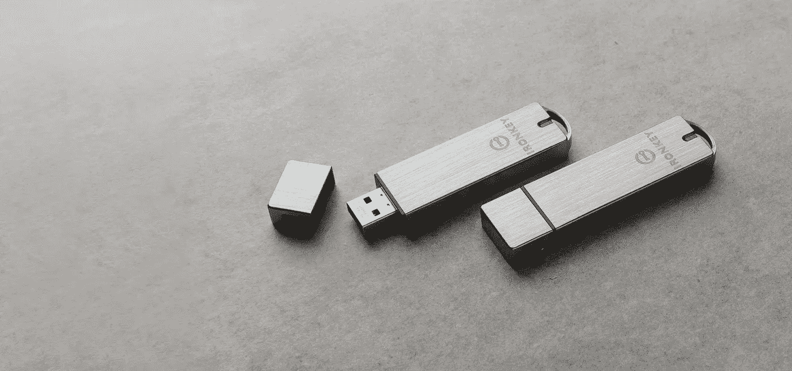

# 创建传染性 USB/CD 媒体

> 原文：<https://medium.com/geekculture/create-infectious-usb-cd-media-30fbac0289a4?source=collection_archive---------16----------------------->

From: kingston.com

USB 设备已经存在了近 20 年，它提供了一种简单方便的方法来在没有直接连接到彼此或互联网的计算机之间存储和共享数字文件。网络威胁行为者过去已经利用了这种能力，最著名的是 2010 年的 Stuxnet 蠕虫，它使用 USB 设备将恶意软件插入伊朗核设施的网络。