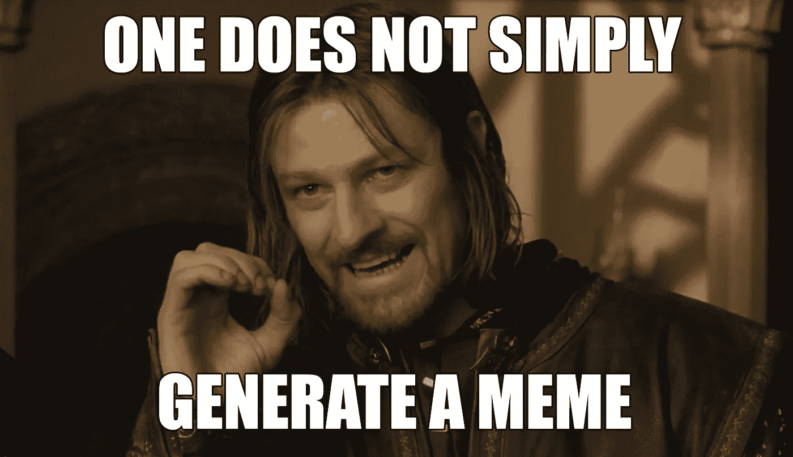
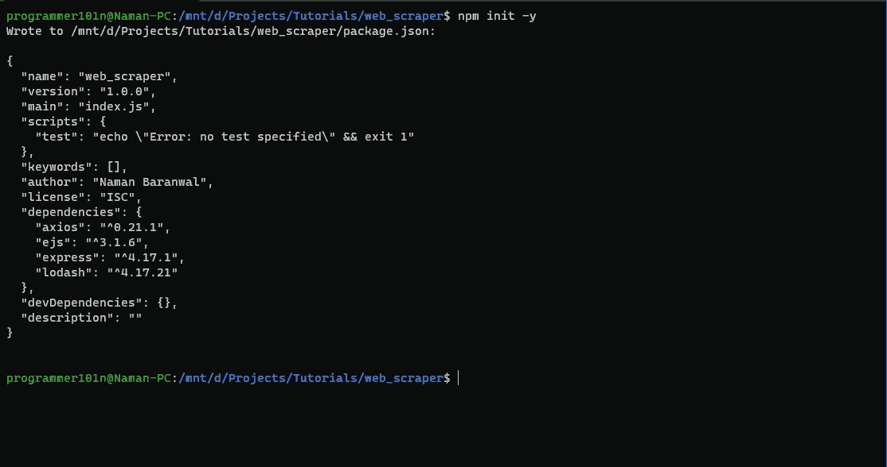
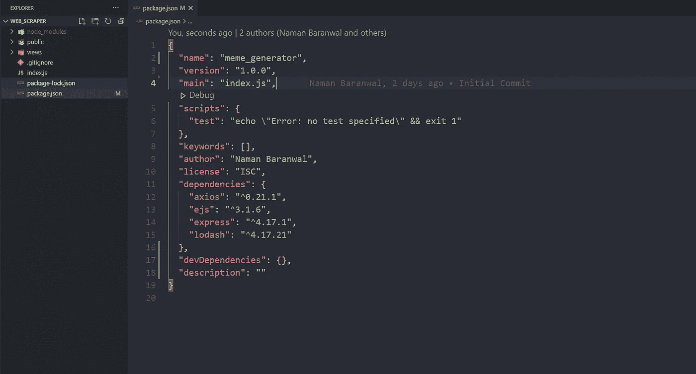
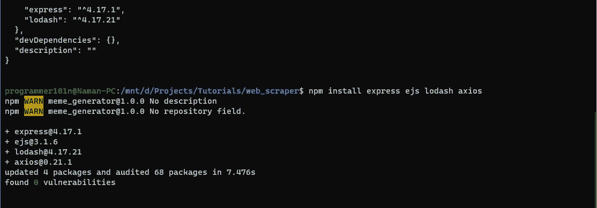
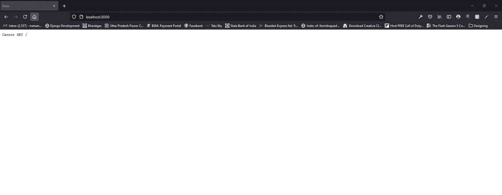
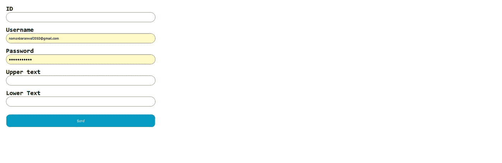
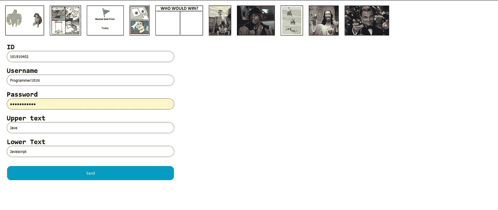

# 用 NodeJS 创建迷因生成器

> 原文：<https://medium.com/geekculture/create-memes-generator-with-nodejs-2400aa1b3eb5?source=collection_archive---------21----------------------->



本教程需要的是。

1.  HTML 和 CSS
2.  一些 Javascript
3.  节点和快速
4.  Axios

让我们创建一个名为 meme_generator 的文件夹，并通过键入`npm init -y`来初始化节点项目



现在我们已经初始化了 NodeJS 项目，让我们打开该文件夹中的代码并设置我们的 express 和 webservers 配置。

我将创建一个 index.js、public 和 views 目录。

*   公共目录将存储我们的静态文件，如 js，css，图像等。
*   视图目录将存储我们的意见(网页)。
*   Index.js 将包含我们服务器的代码。



首先让我们设置我们的 express 服务器。让我们通过键入`npm install express ejs axios lodash`在那个文件夹中安装一些模块。

*   Express 将创建我们的服务器。
*   ejs 是一个模板模块。
*   axios 是一个 http 请求库，它将向 imgflip api 发出请求。
*   lodash 是我们需要的列表函数。



现在我们已经安装了模块，让我们打开 index.js 并编写一些代码。

```
// IMPORTS
const express = require('express');
const axios = require('axios').default;
const _ = require('lodash');// CONSTANTS
const app = express();// MIDDLEWARES
app.use(express.json()); // This will parse json payload.
app.use(express.urlencoded({extended: true}); // This will parse urlencoded payload.
app.use(express.static('public')); // This will serve public directory on our server.
app.set('view engine', 'ejs'); // So express uses ejs as its templating engine.// Routes // Listeing to server
app.listen(3000, () => {
  console.log("Server is running on http://localhost:3000");
});
```

现在我们已经准备好了代码和服务器代码。要运行它，我们需要 Nodemon(一个当代码改变时重新运行文件的库)。让我们在全球范围内安装它。`npm install -g nodemon`

现在让我们运行这个 index.js。在您的终端中键入`nodemon index.js`。

如果你打开浏览器进入`http://localhost:3000`。将显示一条消息。



```
cannot get '/'
```

这意味着我们的服务器运行正常。现在让我们设置一些路线。

在这里，我将创建两条路线。

*   /'将包含我们的热图生成器。
*   “/generate”将让方法 POST 并向 imgflip API 发送请求，然后返回响应。

```
// IMPORTS
const express = require('express');
const axios = require('axios').default;
const _ = require('lodash');

// CONSTANTS
const app = express();

// MIDDLEWARES
app.use(express.json()); // This will parse json payload.
app.use(express.urlencoded({extended: true}); // This will parse urlencoded payload.
app.use(express.static('public')); // This will serve public directory on our server.
app.set('view engine', 'ejs'); // So express uses ejs as its templating engine.

// Routes
app.get('/', (req, res) => {
  return res.render("index");
});

app.post("/generate", (req, res) => {
  return res.send("Hello World!");
});

// Listeing to server
app.listen(3000, () => {
  console.log("Server is running on http://localhost:3000");
});
```

现在我们的代码设置好了，让我们进入前端。在您的`views`目录中创建一个名为`index.ejs`的文件。

编写一些代码，用 form-urlencoded 编码类型的`template_id, username, password, text0, text1`的参数向`/generate`路由发出 post 请求。如下面的代码块所示。

```
<!DOCTYPE html>
<html lang="en">
<head>
    <meta charset="UTF-8">
    <meta http-equiv="X-UA-Compatible" content="IE=edge">
    <meta name="viewport" content="width=device-width, initial-scale=1.0">
    <title>Input</title>
    <link rel="stylesheet" href="style.css">
</head>
<body>
    <div class="container">
        <div class="d-flex">
        </div>
        <form action="/generate" method="POST" enctype="application/x-www-form-urlencoded">
            <div class="input-container">
                <label for="">ID</label>
                <input id="template_id" required name="template_id" type="text">
            </div>
            <div class="input-container">
                <label for="">Username</label>
                <input required name="username" type="text">
            </div>
            <div class="input-container">
                <label for="">Password</label>
                <input required name="password" type="password">
            </div>
            <div class="input-container">
                <label for="">Upper text</label>
                <input required name="text0" type="text">
            </div>
            <div class="input-container">
                <label for="">Lower Text</label>
                <input required name="text1" type="text">
            </div>
            <button type="submit" class="btn-primary">
                Send
            </button>
        </form>
    </div>
</body>

</html>
```

现在让我们来设计一下，在你的公共目录中创建`style.css`。

```
.container{
    display: flex;
    flex-direction: column;
}

.input-container{
    margin: 15px;
    display: flex;
    flex-direction: column;
    width: 30%;
}

.input-container label{
    font-size: 24px;
    font-family: 'Consolas', sans-serif;
    font-weight: bold;
}

.input-container input{
    border-radius: 25px;
    padding: 10px;
    border: 1px solid grey;
}

.btn-primary{
    width: 30%;
    height: 50px;
    border: 1px solid white;
    border-radius: 15px;
    margin: 15px;
    background-color: rgb(4, 156, 194);
    color: white;
    cursor: pointer;
}

.d-flex{
    display: flex;
}

.d-flex img{
    width: auto;
    height: 100px;
    margin: 10px;
    border: 1px solid black;
    cursor: pointer;
}
```

如果你在浏览器中进入`/`路线，你会看到这个。



现在让我们设置我们的邮政路线。在`index.js`文件中。向 imgflip api 发出请求，并传递我们从服务器的索引页面发送请求时获得的参数。

```
app.post("/generate", (req, res) => {
	axios
		.post(
			"https://api.imgflip.com/caption_image",
			{},
			{
				params: {
					template_id: req.body.template_id,
					username: req.body.username,
					password: req.body.password,
					text0: req.body.text0,
					text1: req.body.text1,
				},
			}
		)
		.then((response) => {
			return res.send(``);
		}).catch((e) => {
            return res.status(403).send("403 Client Error")
        });
});
```

## 注意:您需要用户名和密码来请求 imgflip api，在 img lip 上创建您的帐户

现在我们已经完全完成了我们的 POST 路由，让我们创建我们的前端。

让我们从 imgflip api 中获取所有的 meme 模板，并显示 10 个随机的 meme_template，供用户选择。去你的`/`路线，写这个代码。

```
app.get("/", (req, res) => {
	axios
		.get("https://api.imgflip.com/get_memes")
		.then((memes) => {
			return res.render("index", {
				memes: _.sampleSize(memes.data.data.memes, 10)
			});
		})
		.catch((e) => {
			return res.status(500).send("500 Internal Server Error");
		});
});
```

*   sampleSize 方法以列表为参数，以大小数为参数，给出随机模因数。
*   如果有错误，这将产生互联网服务器错误信息。

现在让我们迭代并在我们的`index`视图中显示图像。

```
<div class="container">
    <div class="d-flex">
        <% for(const i of memes){ %>
             src=<%= i.url %>>
        <% } %>
    </div>
    <form action="/generate" method="POST" enctype="application/x-www-form-urlencoded">
    ...
</div>
```

现在我们想添加事件监听器到所有的图片，这样当我们点击图片时，它的 id 将会改变。

```
...
</body><script>
    var images = document.getElementsByClassName("meme_image");
    var templateInput = document.getElementById("template_id");
    for(const i of images){
        i.addEventListener('click', (e) => {
            templateInput.value = i.id;
        });
    }
</script>
</html>
```

现在我们的项目完成了。如果你点击一张图片，输入你的用户名、密码和文字，然后点击提交，你的迷因就会生成。



您可以从我的 Github 下载这个源代码。

[在 Github](https://github.com/Programmer101N/make-meme-generator) 上访问这个项目

也可以看看我的博客，[这里是链接](https://programmer101n.com)