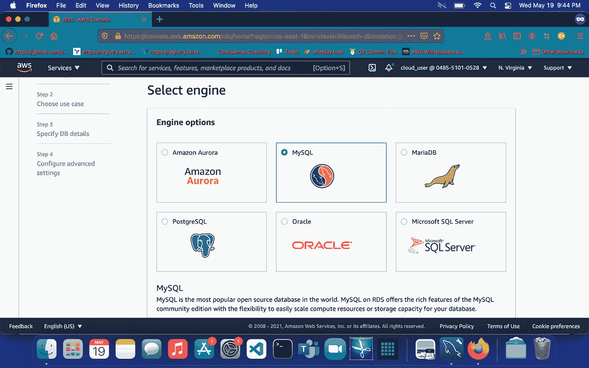
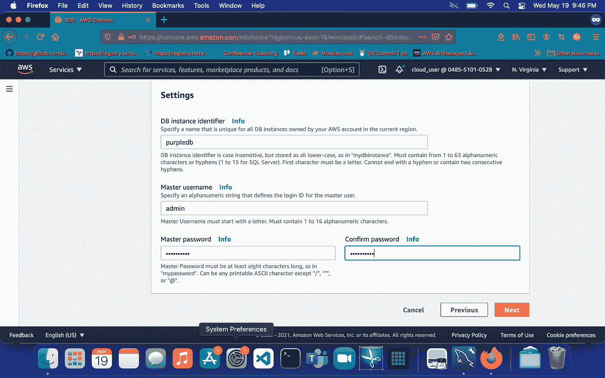
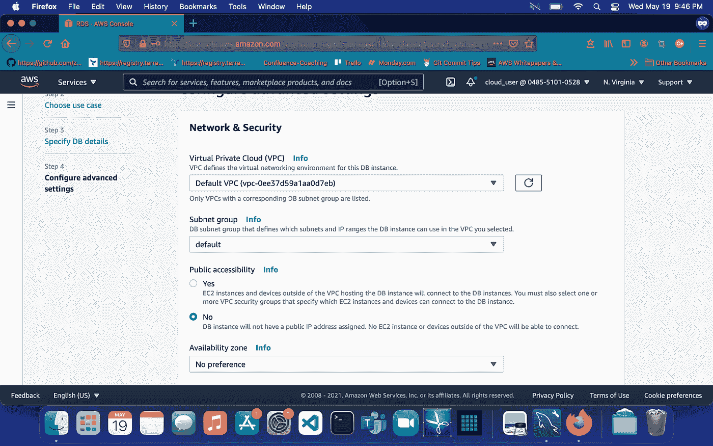
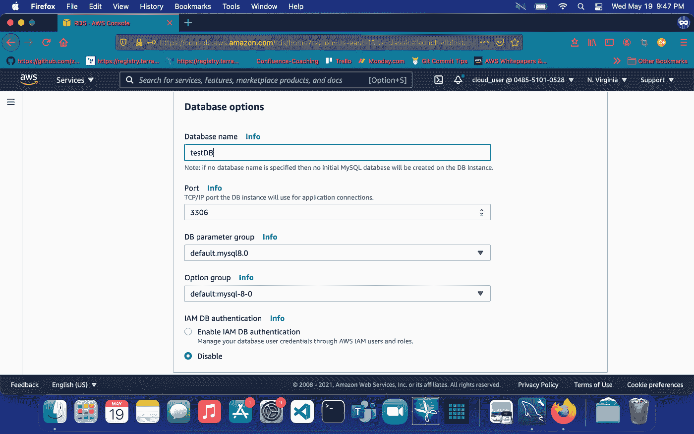
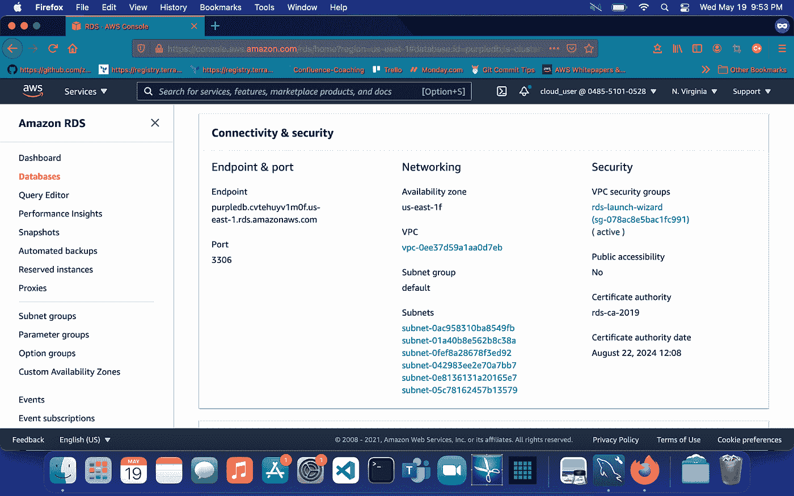
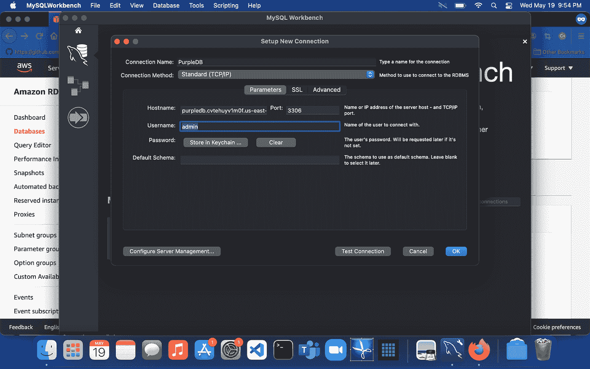

# 用 Amazon RDS 创建 MySQL 数据库

> 原文：<https://medium.com/geekculture/create-mysql-database-with-amazon-rds-4a6581e8dfaa?source=collection_archive---------36----------------------->

Amazon RDS

# 什么是 RDS？

亚马逊关系数据库服务(RDS)是 AWS 提供的一项服务，通过互联网实现数据库连接。

**你为什么想要 RDS？**
因为亚马逊 RDS 接管了关系数据库的许多困难而繁琐的管理任务:

当您购买服务器时，您会获得 CPU、内存、存储和 IOPS，所有这些都捆绑在一起。在 Amazon RDS 中，这些都是分开的，因此您可以独立地扩展它们。如果您需要更多的 CPU、更少的 IOPS 或更多的存储，您可以轻松地分配它们。Amazon RDS 管理备份、软件修补、自动故障检测和恢复。

您可以在需要时配置自动备份，也可以手动创建自己的备份快照。您可以使用这些备份来还原数据库。Amazon RDS 恢复过程可靠而高效。

可以使用你已经熟悉的数据库产品:MySQL、MariaDB、PostgreSQL、Oracle、Microsoft SQL Server。您可以通过一个主实例和一个同步辅助实例获得高可用性，当出现问题时，您可以故障转移到该实例。

除了数据库包中的安全性，您还可以通过使用 AWS 身份和访问管理(IAM)来定义用户和权限，从而帮助控制谁可以访问您的 RDS 数据库。您还可以通过将数据库放在虚拟私有云来帮助保护数据库。

既然介绍已经结束，让我们开始吧！

# 下载 MySQL 工作台

请进入此链接

[https://dev.mysql.com/downloads/workbench/](https://dev.mysql.com/downloads/workbench/)

*   **接下来，选择您的操作系统**
*   **下载用于 windows 的 x86 64 位版本或用于 MacOS 的 x86 64 位版本**
*   **安装工作台**

# 创建一个 MySQL 或 MariaDB 示例数据库

**访问 AWS 管理控制台**
搜索 RDS
创建 MySQL 引擎
启用自由层选项
通用-公共-许可证
使用 5.8
使用 db.t2.micro
20 GiB 分配存储

搜索 RDS
创建 MySQL 引擎
启用自由层选项
通用-公共-许可
使用 5.8
使用 db.t2.micro
20 GiB 分配存储

# 设置

数据库实例标识符:purpledb

主用户名:admin

主密码:我的密码

选择下一步

# 网络与安全

选择 VPC:默认

子网组:默认

公众可访问:是

创建新的 VPC SG:确保您的 SG 允许入站流量到达您的 IP 的端口 3306。

# 数据库选项

数据库名称:TestDB

端口:3306

数据库参数组:(使用默认值)

选项组:(使用默认值)

IAM 数据库验证:禁用

(跳过加密)

# 支持

7 天保留期
无偏好
启用自动次要升级

删除保护
创建数据库。

**(创建大约需要 4-5 分钟)**

复制端点

使用 MySQL 工作台连接到数据库

输入主机名、端口、用户名和密码。

选择 Ok，等待数据库完成连接。

如果您已经完成了本教程，那么恭喜您！我们已经成功地创建了一个 RDS 数据库，并通过 MYSQL Workbench 连接到它。

真诚地

卡林顿云