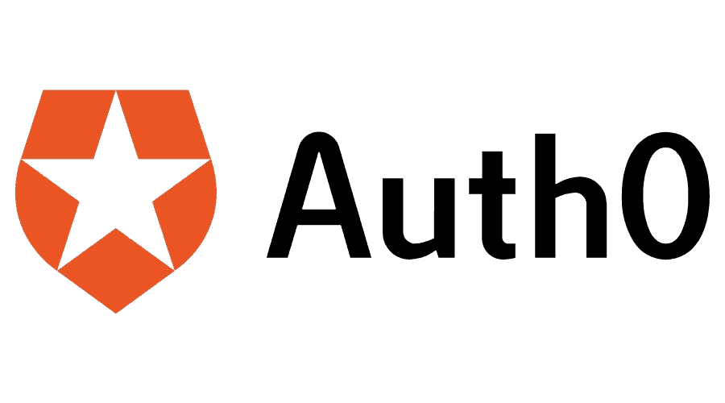
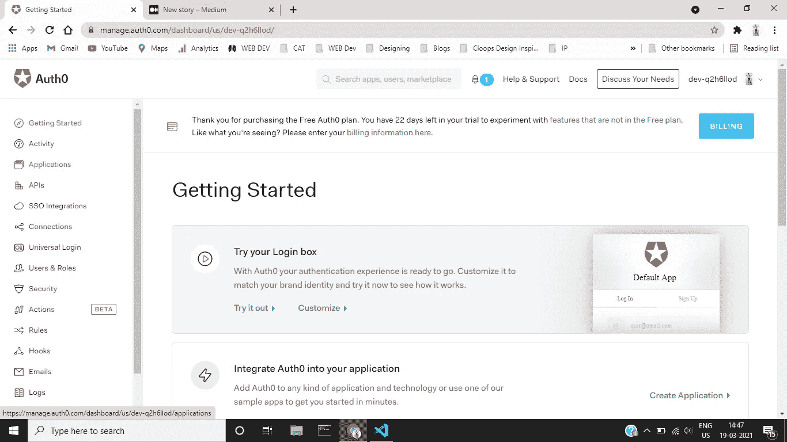
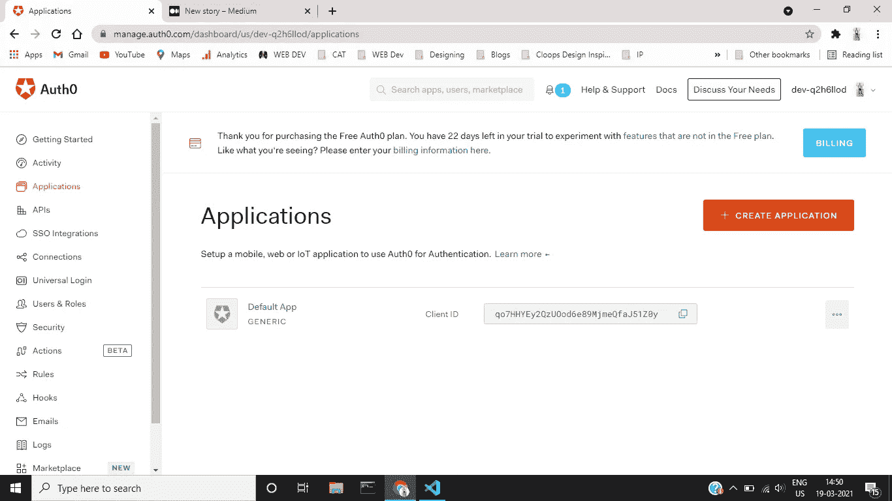
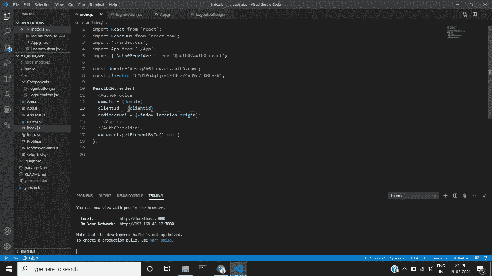
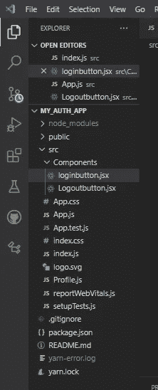
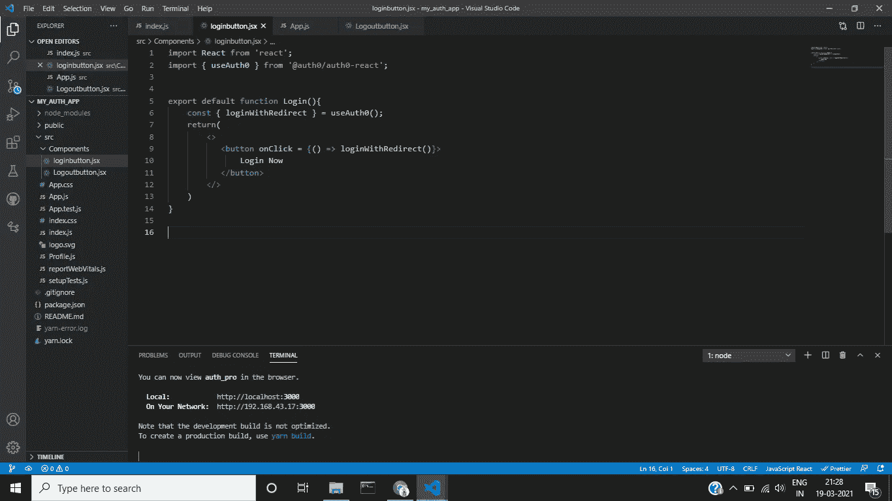
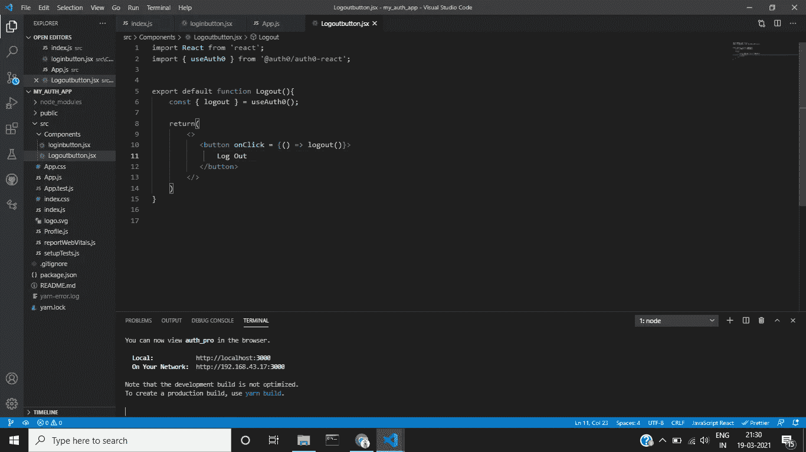
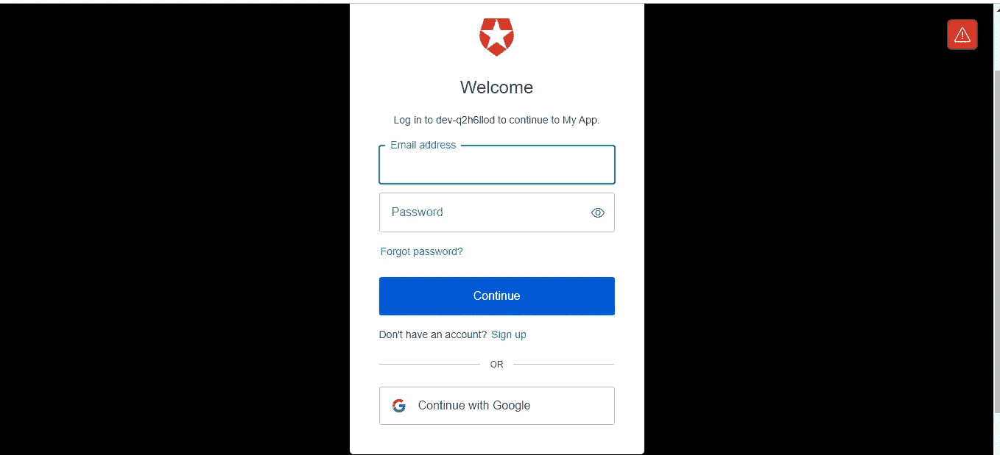

# 创建 React SPA 以使用 Auth0 对用户进行身份验证

> 原文：<https://medium.com/geekculture/create-react-spa-to-authenticate-users-using-auth0-36930c5cdab?source=collection_archive---------17----------------------->

## 使用- ***验证用户继续使用谷歌***



我们经常听到这样的措辞，比如， ***注册谷歌*** 或者 ***注册脸书。这听起来很方便，我们经常点击这样的按钮来节省时间。在本教程中，我们将使用 React JS 框架构建一个惊人的 Web 应用程序，它将使用 Auth0 授权框架对用户进行身份验证。***

> 是的，你已经做到了，我们如何使用授权框架来认证用户呢？
> 
> 现在，大的技术公司使用 OAuth 的概念以更方便的方式验证用户。在本教程中，我们将学习相同的内容。

在上一个教程中，我们已经学习了 [OAuth-2.0](https://rampotabatti.medium.com/basics-of-oauth-open-authorization-93acd75a3d58) 的基础知识，并详细了解了 [OAuth-2.0](/nerd-for-tech/flows-and-terminologies-of-oauth-4eaa3a38dc0b) 中使用的流程和术语。

首先，我们必须创建一个能够处理 UI 的 React 应用程序

```
npx create-react-app my_auth_app
```

创建 react-app 需要几分钟时间。完成后，在代码编辑器中打开目录。

打开 react 应用程序后，清除所有默认的不必要的代码。

完成，现在使用以下命令安装 Auth0 -

```
npm install @auth0/auth0-react
```

*或*

```
yarn add @auth0/auth0-react
```

有一次，做完这个—

现在，访问 [Auth0 授权框架](https://auth0.com)使用 OAuth 2.0 的服务。

在这里，你必须创建一个帐户，只需提供所有的细节，然后继续。

登录后，下面是如何创建 Auth0-的应用程序

您将看到 Auth0 的服务列表。点击应用程序，如下所示。



现在，点击创建应用程序-



在这里，我们将应用程序的名称作为我的应用程序(默认)，并选择单页应用程序。

现在，选择 React 应用程序，因为我们将使用 React 框架。

至此，您已经完成了 Auth0 应用程序的创建。

在这里，您必须更改 Auth0 应用程序的设置-

1.  访问设置
2.  搜索允许的回拨 URL，并添加以下 URL-

```
[http://localhost:3000](http://localhost:3000) //Since, we work using development mode.
```

当你从事生产工作时，你可以进一步将这个设置更改为你的*域名网址*。

3.复制同一个网址，然后粘贴进去—

*允许的注销网址*

*&*

*允许的网络来源*

4.确保点击页面底部的*保存更改*。

现在，让我们打开代码编辑器来连接我们的 UI 和 Auth0-

1.  打开 Index.js 文件，导入模块“Auth0Provider”，如下所示-

```
import { Auth0Provider } from '@auth0/auth0-react';
```

现在，创建如下所示的两个重要变量-

```
const domain='enter_domain_here';
const clientid='enter_clientid_here';
```

> 您将在 Auth0 应用程序的设置选项卡中获得这些值。

现在，用如下所示的元素嵌套你的应用组件

```
<Auth0Provider 
domain = {*domain*}
clientId = {clientid}
redirectUri = {window.location.origin}
>
<App/>
</Auth0Provider>
```

它看起来一定像这样-



现在，要访问 Auth0，我们将创建 2 个简单的按钮组件-



分别在这些组件中创建登录和注销按钮。

现在，我们必须在这两个组件中导入“useAuth0”模块-

```
import { useAuth0 } from '@auth0/auth0-react';
```

这里，我们将使用数组析构来使用特定的函数，如下所示

内部**登录按钮组件—**

```
const { loginWithRedirect } = useAuth0();
```

内部 **LogoutButton 组件—**

```
const { logout } = useAuth0();
```

现在，这是给这个按钮添加含义的最后两个步骤-

将 onClick、事件添加到这些函数中—

我们的 LoginButton 组件必须如下所示



Logoutbutton 组件必须如下所示-



现在是启动服务器的时候了-

```
npm start
or
yarn run
```

如果一切正常，浏览器会显示 2 个按钮-

*登录&注销*

是时候测试应用程序了

点击登录按钮后，会出现一个如下所示的窗口



在这里，你必须点击*继续谷歌-*

*如果谷歌询问*，请输入谷歌凭证。否则，您将看到与 2 个按钮相同的窗口。

> 现在，我们将为我们的应用程序添加另一个功能。

也就是说，一个信息—

> 您好，用户名，您已登录！

必须只向那些已登录的用户显示。对于未登录的用户，显示以下消息—

> *您已注销。*

现在，让我们开始-

创建一个新组件，你可以把它命名为 Profile.js。在组件内部导入同一个模块“useAuth0”。

> 我们还可以在数组析构函数中传递另一个参数，即 *isAuthenticated。*此参数可用于验证用户是否登录(认证)。

**Profile.js，**可能看起来如下-

```
import React from 'react'import { useAuth0 } from '@auth0/auth0-react'; export default function Profile() {const { user , isAuthenticated } = useAuth0();return (<div>{isAuthenticated ? <h2>Hello,{user.name}, you are logged in!<br/></h2>
 : 
<h2>*You are logged out.*</h2>
}</div>)}
```

现在，将这个组件添加到我们的根组件 App.js 中。

启动应用程序并检查所做的工作。

如果需要，参考本回购协议-[https://github.com/balram1402/my_auth_app.git](https://github.com/balram1402/my_auth_app.git)

这里，我们已经使用 Google 帐户完成了应用程序的用户认证。希望，你们都喜欢这篇文章。我将很快尝试发表一篇关于*整个过程的文章，它到底是如何在后台工作的。*

谢谢大家！