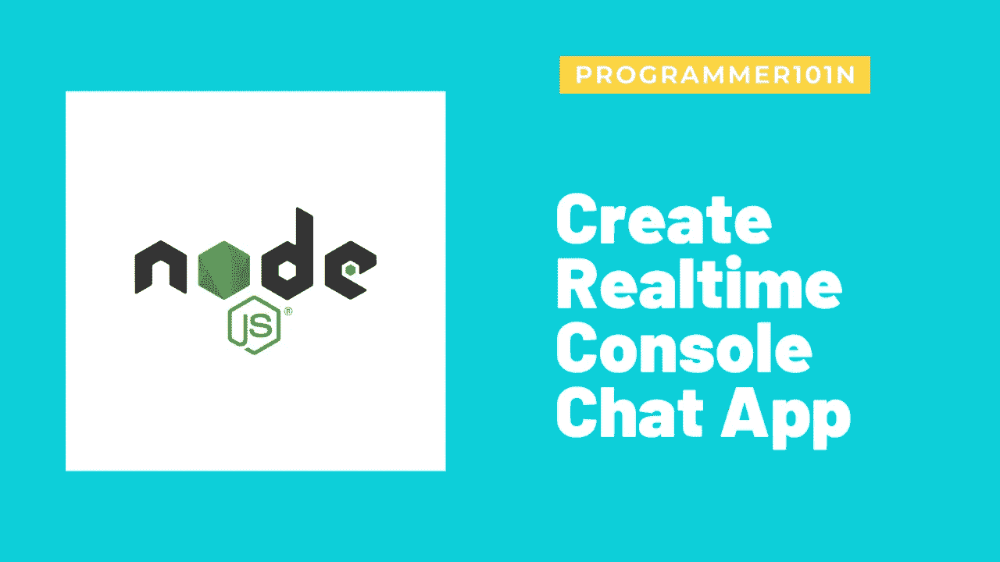
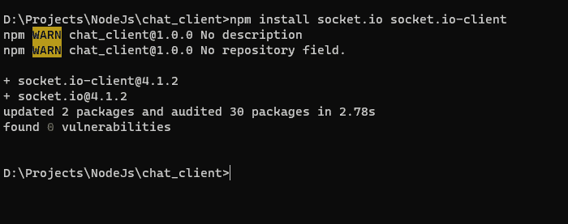
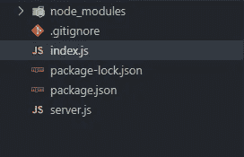
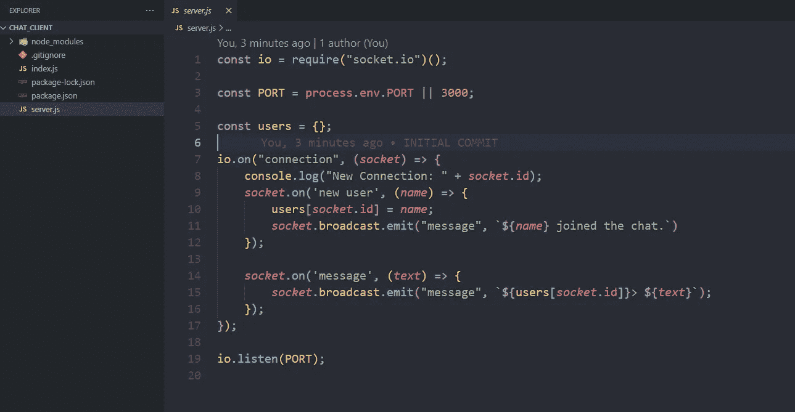
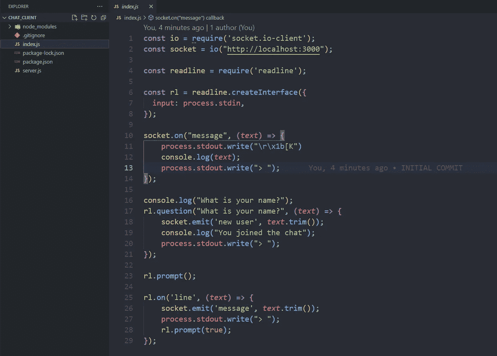
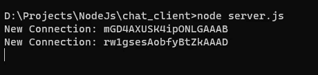
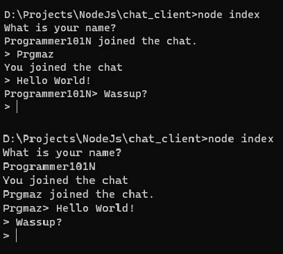

# 创建实时控制台聊天应用程序

> 原文：<https://medium.com/geekculture/create-realtime-console-chat-app-b5b481bcbd2?source=collection_archive---------9----------------------->

在本帖中，我们将创建并看看在控制台中创建自己的实时聊天应用程序有多简单。这个聊天应用程序由两部分组成，一部分是服务器，另一部分是客户端。



## 本教程我们需要的是

*   NPM 和节点已安装
*   `socket.io`和`socket.io-client`模块

## 设置我们的项目

我将在同一个项目上创建我的服务器和客户端，如果你想将你的服务器代码部署到你的主机提供商，你需要创建一个单独的项目。首先，我创建了一个名为`chat-cli`的目录，并用`npm init -y`初始化了 npm 项目。

现在我安装了需要的模块，如`socket.io`和带`npm install socket.io socket.io-client`的`socket.io-client`。我在我们的项目中创建了两个文件`index.js`(包含客户端代码)和`server.js`(包含服务器代码)。现在让我们深入了解更多细节。



## 创建 Socket.io 服务器

我们需要一个 socket.io 服务器来处理所有事件，并将它们发送给我们的客户端。所以，让我们来创造它。

打开你的`server.js`文件，让我们写一些代码。

```
// Created a socket.io server
const io = require("socket.io")();
// This should be a free port on our server.
const PORT = process.env.PORT || 3000;// Created a empty user object, This will store names of our users.
const users = {};// Listening for a connection event (This event fires when a client is connected to your server)
io.on("connection", (socket) => {
	console.log("New Connection: " + socket.id);
	// If user emitted a `new user` event, This callback will be called with his name.
    socket.on('new user', (name) => {
        // Storing his name
        users[socket.id] = name;
        // Emitting an event to all users except that user.
        socket.broadcast.emit("message", `${name} joined the chat.`)
    });
    // Listening for a `message` event.
    socket.on('message', (text) => {
        // Emitting an event to all users except that user.
        socket.broadcast.emit("message", `${users[socket.id]}> ${text}`);
    });
});// Starting up server on PORT
io.listen(PORT);
```

现在我们的服务器代码完成了。



## 正在为服务器创建客户端

我们需要创建一个客户端，并让它连接到我们的服务器。

打开`index.js`文件，让我们写一些代码。

```
// IMPORTING `socket.io-client` module
const io = require('socket.io-client');
// Creating client at the server, you need to pass url of your server where you hosted it.
const socket = io("http://localhost:3000");
// IMPORTING readline module to read from console.
const readline = require('readline');// Creating an interface to get input from our console.
const rl = readline.createInterface({
  input: process.stdin,
});// Getting users name.
console.log("What is your name?");
rl.question("What is your name?", (text) => {
    // Sending users name to server
    socket.emit('new user', text.trim());
    console.log("You joined the chat");
    process.stdout.write("> ");
});// Listening for event `message` from our server (This will fire when server sends `message` event)
socket.on("message", (text) => {
    // Erasing Last line
    process.stdout.write("\r\x1b[K")
    console.log(text);
    process.stdout.write("> ");
});
// Prompting user to enter message.
rl.prompt();// Fires when we input text from user.
rl.on('line', (text) => {
    // Sending message to our server.
    socket.emit('message', text.trim());
    process.stdout.write("> ");
    rl.prompt();
});
```

我们的客户端代码现在已经完成。



## 怎么跑

首先，打开项目目录中的三个终端或 cmd，通过键入`node server.js`启动服务器。

现在，通过在两个终端或 cmd 上键入`node index.js`来运行您想要与之聊天的两个客户端。

如果你做对了一切，你就可以聊天了。



[链接到这个项目，](https://github.com/Programmer101N/chat-cli-nodejs)可以克隆和派生这个项目。

## [访问我的网站](https://programmer101n.com)，我也在那里张贴这些东西。

## 在我的社交网站上关注我。