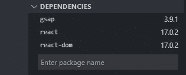

# 使用 React 和 GSAP 创建揭示文本动画

> 原文：<https://medium.com/geekculture/create-revealing-text-animation-with-react-gsap-e8b784606635?source=collection_archive---------9----------------------->

## 一个关于如何用一个叫做 GSAP 的动画库创建文本动画的指南。


Photo by [Animesh Chatterjee](https://unsplash.com/@animeshchatterjee?utm_source=medium&utm_medium=referral) on [Unsplash](https://unsplash.com?utm_source=medium&utm_medium=referral)

我正在改造我的作品集网站，我想让动画感觉新鲜，所以我决定用它做一些文字动画。在这里，我想分享我是如何用一个叫做 GSAP 的动画库来创作这些启示性的文字的。

# 1.启动项目

在这一点上，你可以决定是用`create-react-app`还是用像 [stackblitz](https://stackblitz.com/) 这样的在线环境来创建它。现在我刚从 stackblitz 开始。之后，在依赖部分，安装 GSAP。



Install gsap.

之后，在你想要制作动画的文件中(或者在我的例子中是在`app.js`)，像这样导入 GSAP:

```
import { gsap } from 'gsap';
```

# 2.创建元素

现在，让我们从创建显示文本的 JSX 开始。首先，在`app.js`的返回中，我们创建了包装器。这里我们想要创建一行文本，因此我们在包装器中创建 2 个 div。

```
return(
 <div style={style.wrapper}>
    <div style={style.words}> </div>
    <div style={style.words}> </div>
 </div>
)
```

这是目前为止的风格。

```
const style = {
 wrapper: {
  height: '30vh',
  width: '90vw',
  display: 'flex',
  flexDirection: 'column',
  justifyContent: 'center',
  alignItems: 'center',
  backgroundColor: 'black',
 },
 words:{
  display: 'flex',
  flexDirection: 'row',
  overflow: 'hidden'
 }
}
```

注意`words` 风格中的`overflow:’hidden’`，那种风格是让文字看起来从底部突然出现的关键。在我们完成之后试着评论一下那种风格。

# 3.创建信函组件

之后，让我们创建`Letter` 组件，以便它可以被重用。该组件将获得两个道具，即空间和字母。如果 space props 为真，它将打印一个空格，如果 space 为假，它将打印字母。该组件将如下所示。

```
const Letter = ({space, letter}) => { return( space == true ? <div className="text">&nbsp;</div> : <div className="text" style={style.letter}>{letter}</div> )}
```

在这里，我们通过析构稍后将提供给组件的属性，在向屏幕呈现字母或空格之间创建条件呈现。

然后我们为 style.letter 添加样式。其实看你的喜好了。

```
letter:{ fontSize: 32, color: 'white', fontWeight: 'bold'}
```

# 4.添加文本作为回报

现在让我们进入下一部分，将文本添加到我们已经在步骤 2 中创建的元素中。

```
<div style={style.words}> { 'Hello World!'.split('').map((i) => i == ' ' ? <Letter space={true} letter={i}/> : <Letter space={false} letter={i}/> )}</div><div style={style.words}>{ 'No Worries'.split('').map((i) => i == ' ' ? <Letter space={true} letter={i}/> : <Letter space={false} letter={i}/> )}</div>
```

在那里，我们直接将文本 *Hello World* ，而*不用担心，*将其拆分成数组，然后将值一一映射。在此之后，还有一个条件渲染，看看它是否是一个空间，然后我们给字母组件`space={true}`道具，如果不是，则为 false。

# 5.动画！

主要部分来了。现在让我们给`app.js`添加 useEffect 函数

```
useEffect(() => { let textAnimation = gsap.timeline(); textAnimation.from('.text', { y: 100, stagger: { 
   each: 0.07 
  } });}, []);
```

在那里我们声明了`textAnimation`变量，然后将它们赋给`gsap.timeline()`，这样我们就可以很容易地访问它们。GSAP 有很多方法可以用，像`.from`、`.to`、`.fromTo`等。但是现在，我们将只使用`.from`方法。它接收两个参数，目标和样式的对象。

在过渡到我们已经在`style`对象中声明的实际样式之前，包含在`.from`方法的对象样式中的所有样式都是组件将应用的样式。

看看字母组件，我们给 div 一个 className `text`，这样我们就可以用 GSAP 来定位它。因此，我们使用 text 类作为元素目标，然后创建一个包含样式的对象，在这里我们将 y 设置为 100，这意味着文本将从底部 100 个像素开始，stagger 是为了在转换的元素之间给它一个延迟。如果没有交错，所有的文本将会同时出现。

现在，当您运行项目时，动画将在您刷新浏览器后出现。

就是这样！这就是我今天能和你分享的，下次再见，祝你有美好的一天！🖐

*更多内容看* [***说白了。报名参加我们的***](http://plainenglish.io/) **[***免费周报***](http://newsletter.plainenglish.io/) *。在我们的* [***社区不和谐***](https://discord.gg/GtDtUAvyhW) *获得独家获取写作机会和建议。***