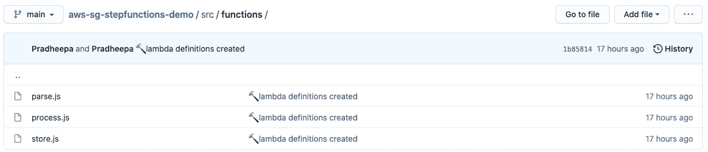
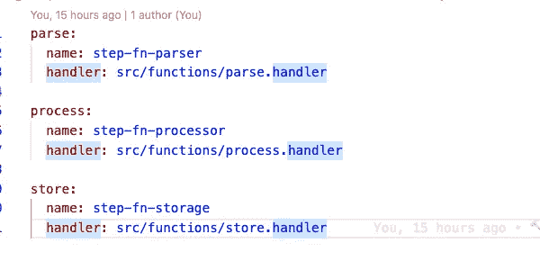
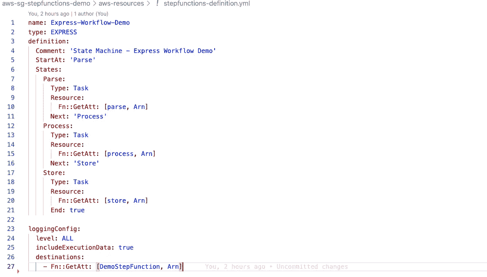
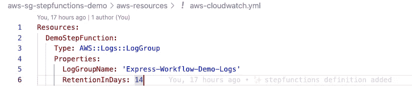
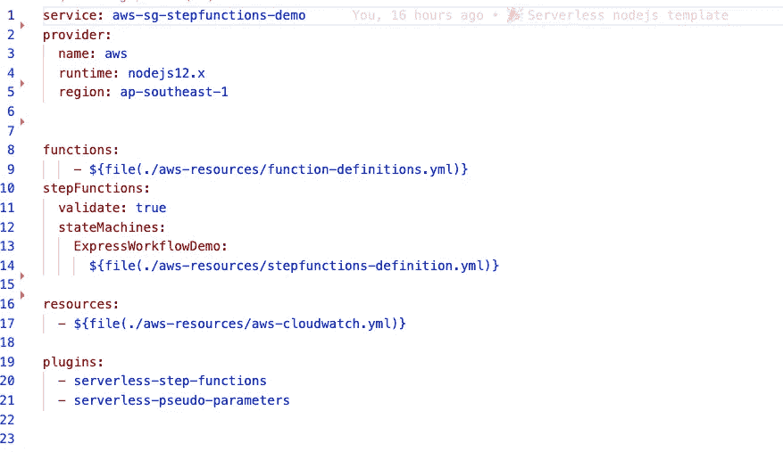
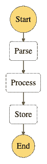

# 使用 AWS 步骤功能创建可扩展的业务工作流

> 原文：<https://medium.com/geekculture/create-scalable-business-workflows-using-aws-step-functions-1fde6d6d37ea?source=collection_archive---------16----------------------->

## 在这篇博文中，我们将探讨如何使用无服务器框架创建简单的 AWS 步骤函数。

## 我为什么选择无服务器？

因为它在一个文件中定义了所有内容:

*   IAM 角色声明
*   Lambda 函数处理器
*   Lambda 函数触发器
*   阶跃函数状态
*   云形成资源

现在，让我们开始构建阶跃函数。

**步骤 1:** 使用下面的命令创建 node-js 模板项目

```
sls create - template aws-nodejs - path aws-sg-stepfunctions-demo
```

**第二步:**导航到**文件夹 *aws-sg-stepfunctions-demo。*** 文件夹内创建 serverless.yml。如果您使用下面的命令在本地调用示例 hello 函数

```
sls invoke local -f hello
```

收到以下结果。

```
{
    "statusCode": 200,
    "body": "{\n  \"message\": \"Go Serverless v1.0! Your function executed successfully!\",\n  \"input\": {}\n}"
}
```

**步骤 3:** 通过改变主体内部的消息来重构这个 lambda 函数。我将再创建两个 lambda 函数，在所有这些 lambda 函数中，只有消息组件是不同的。



aws lambda nodejs

**第四步:**创建***functions-definition . yml 如下。*** 我们会在 serverless.yml 中引用这个文件。



functions-definition.yml

**步骤 4:** 创建**步骤 *functions-definition.yml 如下。*** 我们也会在 serverless.yml 中引用这个文件。



**步骤 6:** 为步骤功能创建cloudwatch 日志组。



**第五步:**使用以下配置创建serverless.yml



serverless.yml

现在所有的配置都准备好了，使用下面的命令部署 step 函数。

```
sls deploy
```

这将在新加坡地区创建一个状态机，如下所示。



State Machine

来源:[https://github.com/pradheepap/aws-sg-stepfunctions-demo](https://github.com/pradheepap/aws-sg-stepfunctions-demo)