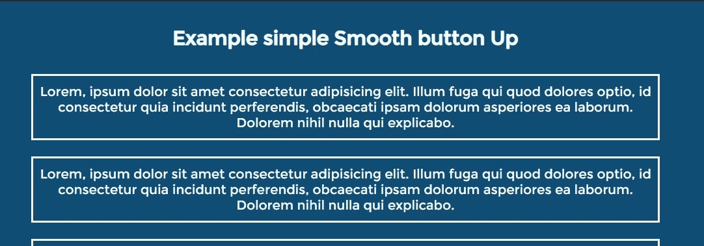
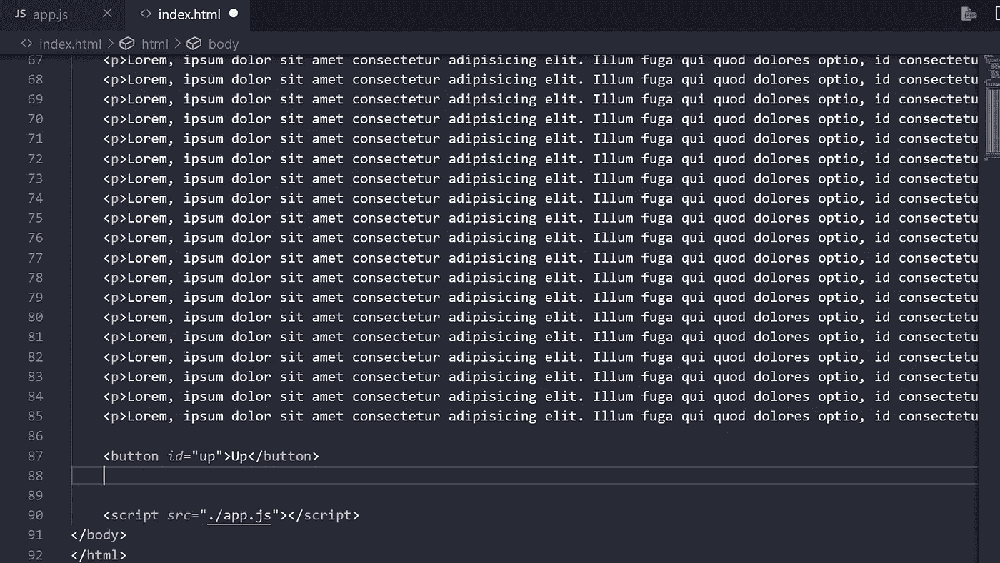
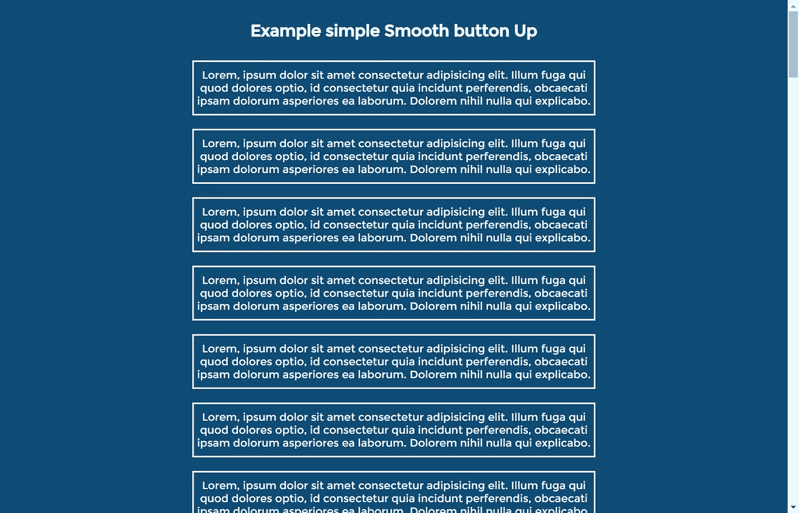
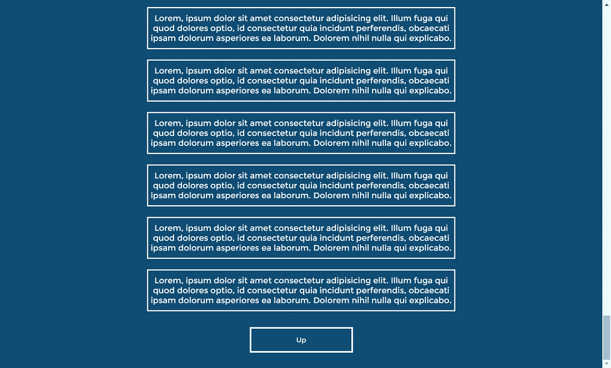
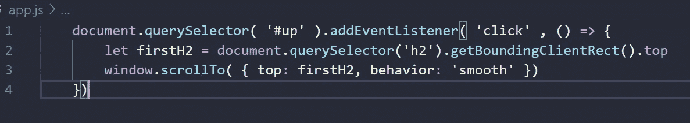
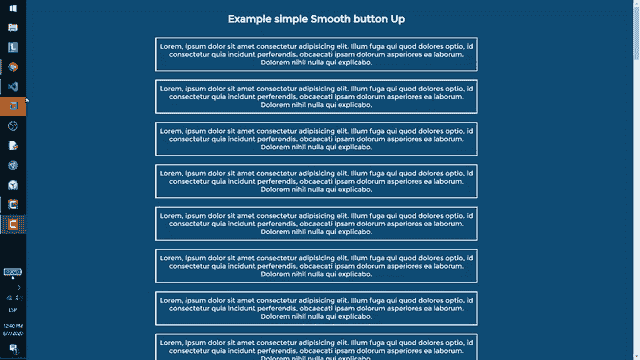
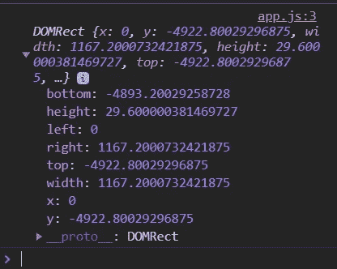
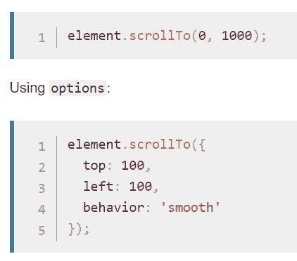

# 仅用 4 行 JavaScript 代码和流畅的行为创建“滚回顶部”按钮

> 原文：<https://medium.com/geekculture/create-scroll-back-to-top-button-with-just-4-lines-of-javascript-code-and-smooth-behavior-61a1edf08df7?source=collection_archive---------0----------------------->



我真的很担心有多少教程让这个变得如此复杂，他们使用 jQuery，但实际上它并不复杂，我们可以让它变得平滑和简单，相信我！

如果你想看的话，这是视频

# 创建太多代码和按钮

在这一部分，我只添加了一些 HTML 代码来增加页面的高度



Example HMLT5 tags for the scroll button

# 第二步少量的 CSS，以获得良好的质量



Example how it looks with css

按钮呢



The final par the Button up

# 第 3 步四行代码只看 VScode 图片的数字

```
document.querySelector( '#up' ).addEventListener( 'click' , () => { let firstH2 = document.querySelector('h2').getBoundingClientRect().top window.scrollTo( { top: firstH2, behavior: 'smooth' }) })
```



Example code of the Up button in JavaScript

# 享受



# 说明

我们只调用 click 事件，然后在这个例子中只使用 getBoundingClientRect()方法，这个方法给我们标签的位置、高度和宽度，以及 x 和 y 值(在这个例子中是 h2 标签)



The getBoundingClientRect() method in JavaScript

第二部分是 ScrollTo()方法，它帮助我们滚动到标签的位置，它接收 x 和 y 以及选项(对象),我们只需要 top 和 behavior 选项来创建平滑漂亮的效果。



Example of how we can use the ScrollTop() method in JavaScript from developers mozilla

# 结论

如果你想创建滚回顶部按钮，而不用担心添加 JQuery 到你的网站或一个非常粗糙的效果，你可以使用这个简单的效果漂亮和干净，有其他最好的库来创建更好的平滑效果。

# 来源

[https://developer . Mozilla . org/en-US/docs/Web/API/Element/scroll to](https://developer.mozilla.org/en-US/docs/Web/API/Element/scrollTo)