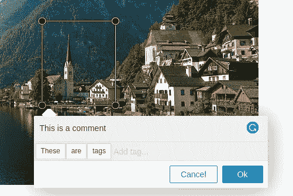

# 在 ReactJS 中的高分辨率可缩放图像上创建选择和注释(OpenSeadragon + Annotorious)

> 原文：<https://medium.com/geekculture/create-selections-and-annotations-on-high-resolution-zoomable-images-in-reactjs-openseadragon-a847976d080d?source=collection_archive---------17----------------------->

Annotorious OpenSeadragon implementation in React

本文旨在创建注释；它是动态的、可存储的、可重新创建的图片选择，有自己的注释和标签；在 ReactJS 项目中，借助于作为高分辨率可缩放图像查看器的 **OpenSeadragon** 和作为注释包的**annotor ous**。