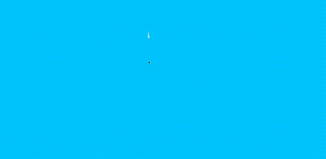

# 用 AnimeJS 在 HTML 和 CSS 中创建水滴效果

> 原文：<https://medium.com/geekculture/create-water-drop-effect-in-html-and-css-with-animejs-27517fe64219?source=collection_archive---------23----------------------->


本教程我们需要的是:

*   HTML 和 CSS
*   AnimeJS
*   你选择的编辑

我下载了所有资产，并将它们放在我的资产目录中，因此我的目录将如下所示:

*   动画/资产/CSS/CSS-文件-此处
*   动画/资产/js/js-文件-此处

然后我在我的 assets 文件夹中创建了 index.html 文件和 styles.css，然后在 header 标签中链接了所有的 css，在 body 下面链接了所有的 js 文件。

我的 index.html 是这样的:

```
<!doctype html>
<html lang="en">
<head>
    <meta charset="UTF-8">
    <meta name="viewport"
          content="width=device-width, user-scalable=no, initial-scale=1.0, maximum-scale=1.0, minimum-scale=1.0">
    <meta http-equiv="X-UA-Compatible" content="ie=edge">
    <title>Home - Programmer101N</title>
    <link rel="stylesheet" href="assets/css/styles.css">
</head>
<body></body>
<script src="assets/js/anime.js"></script>
</html>
```

现在让我们用 HTML 创建画布。我将创建 canvas 元素，并将其 id 设置为 canvas。

```
<body>
  <canvas id="canvas"> </canvas>
</body>
```

现在让我们在 style.css 中创建我们的样式。你可以复制我的样式或者创建你自己的样式。

```
html, body{
  height: 100vh;
  width: 100vw;
  display: flex;
  margin: 0;
  padding: 0;
}#canvas{
  background-color: transparent;
}
```

现在我们的 CSS 部分完成了，让我们创建我们的脚本。首先，我将获得画布和它与 DOM 的上下文，并将其高度和宽度设置为我们的窗口高度和宽度。我将背景色设置为深蓝色。

```
const canvas = document.getElementById("canvas");
const c = canvas.getContext("2d");
canvas.width = window.innerWidth;
canvas.height = window.innerHeight;
canvas.style.backgroundColor = "#01C5FF";
```

现在，我添加了一个事件监听器来调整事件大小，每次窗口高度或宽度改变时都会调整画布大小。

```
window.addEventListener("resize", () => {
  canvas.width = window.innerWidth;
  canvas.height = window.innerHeight;
});
```

首先我要创建一个函数 createDrop，它将创建水滴并返回它。

```
function createDrop(x, y) {
  const drop = {
    x: x,
    y: y - 150,
    endPos: {
      x,
      y,
      dropForm: 30,
    },
    dropForm: 3,
    opacity: 0,
    draw: () => {
      c.beginPath();
      c.fillStyle = `rgba(255, 255, 255, ${drop.opacity})`;
      c.moveTo(drop.x - drop.dropForm, drop.y);
      c.lineTo(drop.x, drop.y - drop.endPos.dropForm * 1.4);
      c.lineTo(drop.x + drop.dropForm, drop.y);
      c.arc(drop.x, drop.y, drop.dropForm, 0, Math.PI);
      c.closePath();
      c.fill();
    },
  };
  return drop;
}
```

现在创建一个函数 clickEffect，当我们的水滴击中时它会产生波浪，它将调用 animate 函数。

```
function clickEffect(x, y) {
  let strokeWidth = 5;
  const animatables = []; for (let j = 0; j < 3; j++) {
    const circle = {
      x: x,
      y: y,
      radius: 0,
      strokeWidth: strokeWidth,
      draw: () => {
        c.beginPath();
        c.arc(
          circle.x,
          circle.y,
          circle.radius,
          0,
          Math.PI * 2,
          true
        );
        c.lineWidth = circle.strokeWidth;
        c.stroke();
      },
    };
    strokeWidth -= 2;
    animatables.push(circle);
  } animate(x, y, animatables);
}
```

现在创建一个动画函数，它将使所有东西都有动画效果。

```
function animate(x, y, animatables) {
  const tl = new anime.timeline({
    duration: 7000,
    easing: "easeOutExpo",
  }); tl.add({
    targets: createDrop(x, y),
    y: (p) => {
      return p.endPos.y;
    },
    dropForm: (p) => {
      return p.endPos.dropForm;
    },
    opacity: [0, 1, 0],
    duration: 1500,
    update: (e) => {
      e.animatables.forEach((a) => {
        a.target.draw();
      });
    },
    easing: "easeInExpo",
  }); tl.add({
    targets: animatables,
    radius: window.innerWidth * 1.125,
    update: (e) => {
      e.animatables.forEach((a) => {
        a.target.draw();
      });
    },
    delay: anime.stagger(150),
  });
}
```

创建一个渲染变量，它将在每次更新时清除所有内容。

```
const render = anime({
  duration: Infinity,
  update: () => {
    c.clearRect(0, 0, canvas.width, canvas.height);
  },
});
```

现在添加事件监听器到触摸事件或点击事件，当点击注册并设置渲染状态为播放时，在坐标上调用 clickEffect 函数。

```
document.addEventListener(
  "ontouchstart" in window || navigator.msMaxTouchPoints
    ? "touchstart"
    : "mousedown",
  (e) => {
    clickEffect(e.clientX, e.clientY);
    render.play();
  }
);
```

我们的效果现在完成了！



您可以从我的 Github 下载这个源代码。

[在 Github 上访问该项目](https://github.com/Programmer101N/create-water-drop-effect)

访问我的博客，在这里我张贴所有这些东西。[链接到博客](https://programmer101n.com)。