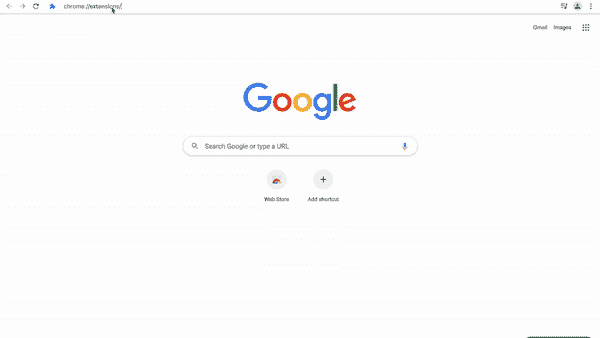
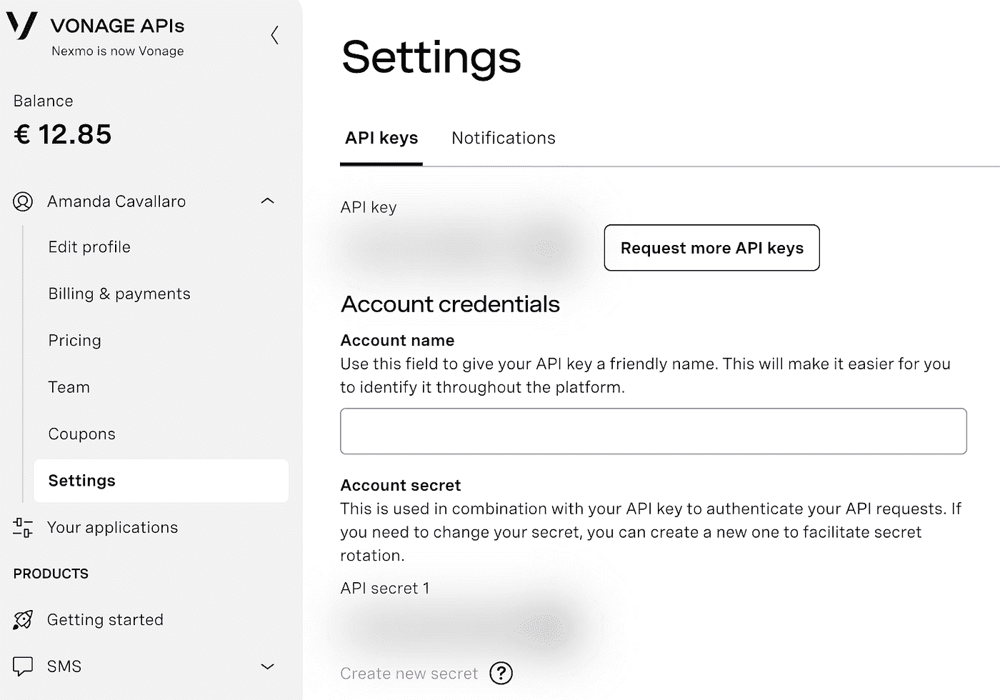

# 用 JavaScript 创建你的第一个 Chrome 扩展来隐藏你的 API 键

> 原文：<https://medium.com/geekculture/create-your-first-chrome-extension-in-javascript-to-hide-your-api-keys-7318357bb764?source=collection_archive---------12----------------------->

在本教程中，你将学习如何创建一个 chrome 扩展。我们今天要看的例子是在仪表板上隐藏您的 Vonage API 键。你将从本教程的步骤中获得的知识将为你如何为不同的目的创建你自己的 chrome 扩展打下基础。

# 什么是 Chrome 扩展

chrome 扩展是一个软件程序，允许您扩展 Chrome 功能并改变您的浏览器体验。可以用 HTML、CSS、JavaScript 和一个`manifest.json`文件构建一个扩展。后者为 Chrome 提供了运行脚本所需的信息，以便扩展能够正常工作。

# 创建 Chrome 扩展文件夹

在你的计算机中创建一个新文件夹，其中包含`manifest.json`文件和引导文件，在我们的例子中，我们将它命名为`index.js`。对于我的例子，我将这个文件夹命名为`chrome-extension`。

# 创建`manifest.json`文件

创建 chrome 扩展时需要一个`manifest.json`文件，因为它告诉你的程序要执行的功能。

创建一个`manifest.json`文件。在 Unix 的终端上，您可以输入`touch manifest.json`。

用所需的信息填充它，如下面的代码片段所示。

让我们一步步来看每一行。

*   `name`是将出现在 chrome 扩展列表中的扩展名称。
*   `description`是对你的 chrome API 做什么的描述。
*   `version`是您的扩展的当前版本，如果您进行了更改，您可以将其删除。
*   `author`应该包含 chrome 扩展创建者的名字。
*   `manifest_version`指的是清单的版本，在写这篇博文的时候，最新的版本是 3。
*   `content_scripts`是可以对 DOM 进行修改并将信息传递给扩展的文件。可以在[内容剧本官网](https://developer.chrome.com/docs/extensions/mv3/content_scripts/)了解更多。在这个例子中，我们希望我们的脚本匹配网页[https://dashboard.nexmo.com/](https://dashboard.nexmo.com/)及其任何子页面。我们声明要遵循的逻辑将被写在文件`index.js`中。

# 创建引导文件

从您的终端创建`index.js`文件。在 Unix 机器上，您可以通过键入`touch index.js`来实现。

为了拥有一个 chrome 扩展，你可以创建一个简单的函数，一旦你导入它，它就会被应用到浏览器中。

这里有一个例子，您可以用它来创建一个只执行一次的简单警报。

对于本教程，我们将使用下面的代码来模糊一些 API 键。

让我们创建一个名为 blurApiKeys 的函数。我们将使用`document.querySelector`和`document.querySelectorAll`来查找包含 API 密钥和 API 密钥的 HTML 元素。最后，我们将使用 CSS 样式为这些元素添加一个 20 像素的模糊，setInterval 每隔 10 毫秒调用一次 blurApiKeys 函数。

# 将创建的文件夹导入到 Chrome 扩展中

现在是时候导入您创建的这两个文件，并将它们作为 chrome 扩展添加到您的浏览器中了。

1.  打开 Chrome 浏览器。
2.  导航到`chrome://extensions/`。
3.  点击右上角的开发者模式来启用它(如果还没有启用的话)。
4.  点击左上角的 Load unpacked，一个文件上传工具将会打开。
5.  在你的电脑上搜索你创建文件夹`chrome-extension`的位置，点击它，最后点击选择按钮。
6.  你可以看到一个名为“API Key Hider”的新 chrome 扩展被创建，它是在`manifest.json`的 name 属性中指定的。
7.  确保此 chrome 扩展已启用(已切换)。如果你想关闭它，你可以从 chrome 扩展列表中取消或移除它。

你可以在下面的一张 gif 里看到上面的步骤:

# 测试一下

您的 chrome 扩展现在已经加载，您可以在浏览器中看到您创建的函数的功能。

为了测试我们创建的函数，导航到 [Vonage 仪表板](https://dashboard.nexmo.com/)，浏览仪表板中的页面，您会注意到您的 Vonage API 和密钥都被隐藏了。如果您需要复制它们，即使关键点模糊不清，旁边的复制按钮仍然有效，如下图所示。

# 恭喜

干得好！您创建了一个 chrome 扩展来隐藏您的 Vonage API 键，现在您已经了解了如何创建、导入和启用 chrome 扩展，您可以尽情发挥您的创造力，创建更多的扩展！

如果你想让它更上一层楼，你可以从官方文档中学习如何将它发布到 Chrome 网上商店。

希望你喜欢这个。欢迎在 Twitter 上联系我[或者加入我们的](https://twitter.com/amdcavallaro)[社区休闲频道](https://developer.nexmo.com/community/slack)。

*最初发布于*[*https://learn . vonage . com/blog/2021/08/31/create-your-first-chrome-extension-in-JavaScript-to-hide-your-API-keys/*](https://learn.vonage.com/blog/2021/08/31/create-your-first-chrome-extension-in-javascript-to-hide-your-api-keys/)