# 在以太坊上创建你的第一个 dAPP

> 原文：<https://medium.com/geekculture/create-your-first-dapp-on-ethereum-6eb50b4083f2?source=collection_archive---------6----------------------->

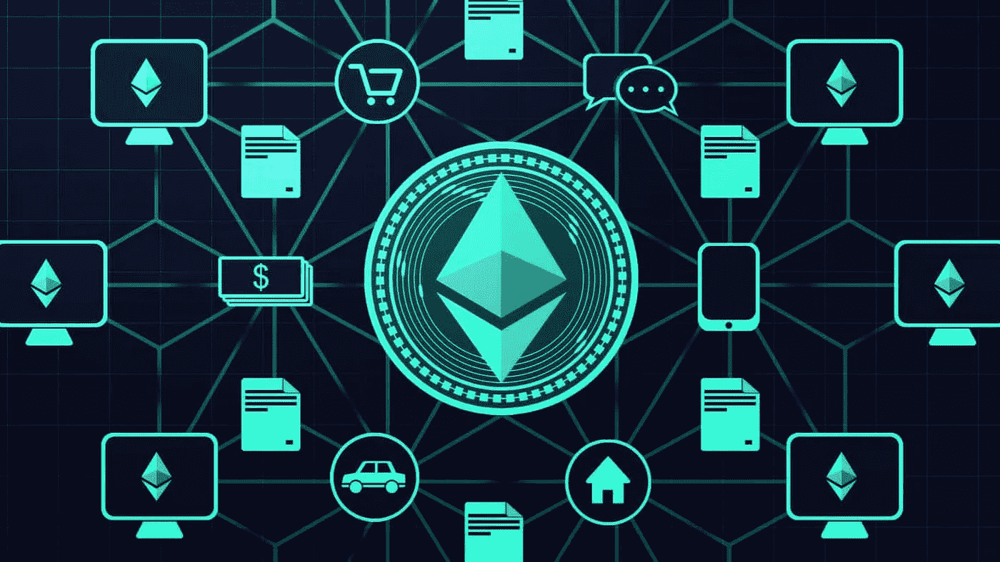

# 介绍

在本文中，我们将在以太坊区块链上构建一个简单的凝乳分布式应用程序。还将为相同的应用程序创建一个凝乳智能契约。这是一篇实用的动手文章。

# 观众

区块链初学者，软件开发者，以太坊用户/管理员。

# 先决条件

1.  对**坚实度**或一般编程有基本了解。
2.  chrome 或 firefox 上的 Metamask 扩展。(与**网站 3** 连接)
3.  对 **Web3** 的基本了解。
4.  钱包在 metamask 上，带有一些**乙醚(硬币)**用于 ropsten 网络。
5.  Nodejs 或 javascript 理解。

# 设置步骤

*   在 **ropsten 网络**上部署智能合约。
*   智能合约的测试。
*   分散式应用程序的体系结构。
*   构建分散式应用程序(dAPP)以与区块链交互。
*   运行并测试应用程序

# 源代码

*   让我们克隆包含智能合同和 dapp 源代码的存储库。

```
**git clone https://github.com/cmjagtap/dApp**
```

# 智能合同部署

*   这是一个简单的凝乳智能契约，处理学生的数据。
*   让我们在一个混合环境中部署契约
*   首先，导航到地址[https://remix.ethereum.org/](https://remix.ethereum.org/)
*   添加新的 **curd.sol** 文件，并从存储库中复制粘贴代码。
*   从左侧点击第三个按钮，将出现部署窗口。
*   选择**环境**作为**注入的 Web3** ，会出现如下 metamask 提示。

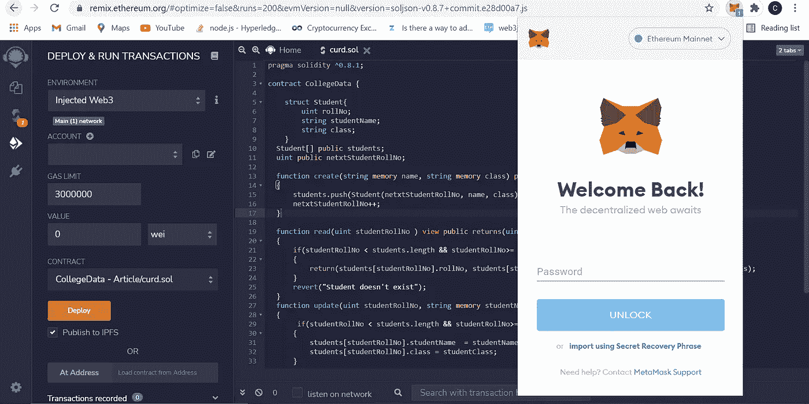

*   在 metamask 中输入您的密码，我将连接到 remix 环境。
*   你可以在一个 **remix 账户上看到你的 metamask 钱包地址。**
*   在 metamask 扩展中选择 ropsten test-network，你的钱包应该是这样的。

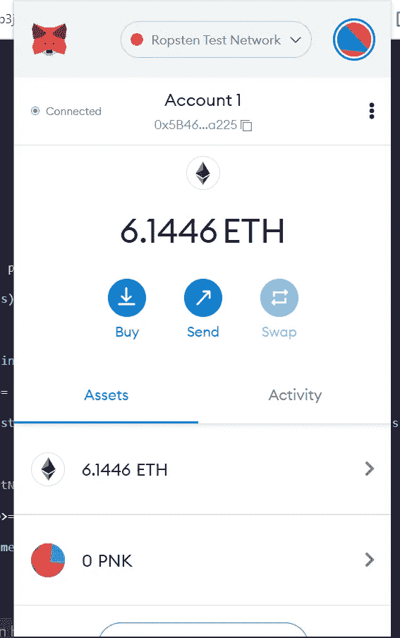

*   单击 deploy 按钮，合同将被部署到 ropsten 网络上。
*   现在 metamask 提示符将如下所示出现，并要求您确认交易。
*   现在，您可以在契约创建的 remix 环境中看到调试日志，在成功部署之后，事务日志将如下所示。

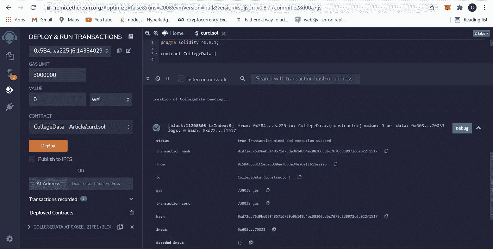

*   让我们通过导航到这个地址[https://ropsten . ethers can . io](https://ropsten.etherscan.io/)来验证 ropsten explore 上的合同部署。
*   将交易散列从日志复制并粘贴到 etherscan 网站。

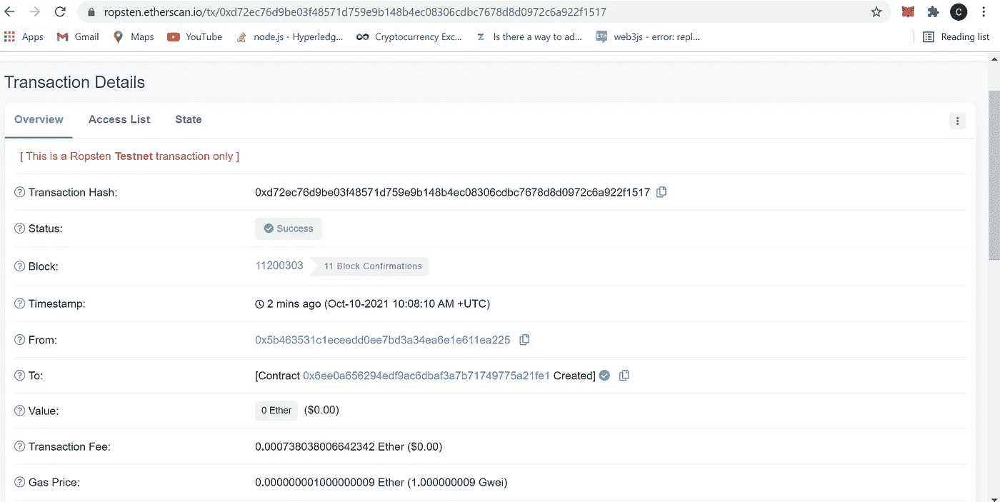

Ropsten Etherscan

*   在上图中，我们可以看到谁创建了交易，它应该与您的元掩码钱包地址相匹配。
*   现在我们的合同准备好了，我们可以测试合同的所有功能。

# 合同测试

在 remix 环境下测试功能。

*   现在我们可以创建学生记录。

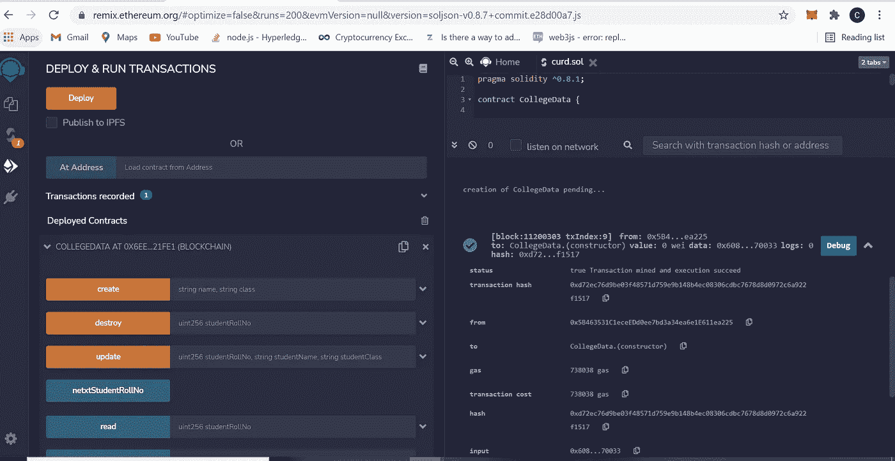

Deployed Contract

# 分散式应用程序的体系结构。

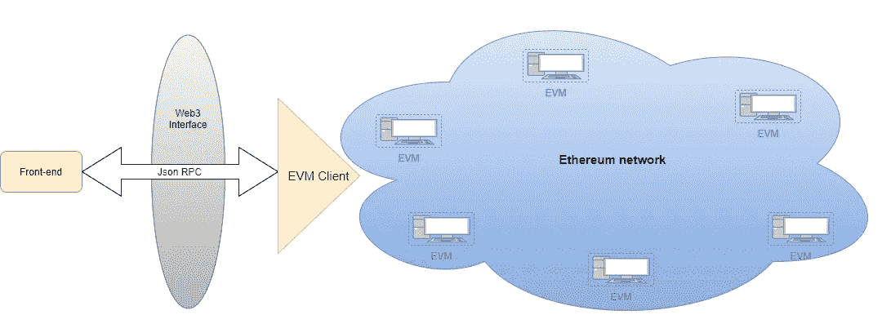

Web3 Architecture

# 构建分散式应用程序(dAPP)

*   首先，在 [https://infura.io](https://infura.io/) 上创建一个账户
*   然后创建一个项目并导航到项目设置。

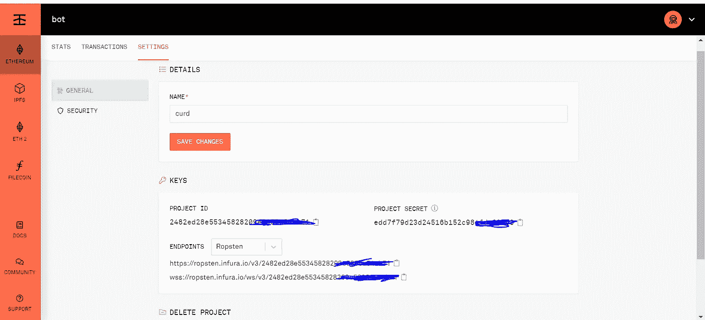

Infura Project

*   选择终点作为**终点。**

> 注意:我们已经在 ropsten 网络上部署了我们的合同，这就是我们选择 Ropsten 端点的原因。

*   复制项目 id 并粘贴到****dapp . js**中的**in fura _ KEY****
*   **复制你的元掩码钱包地址并粘贴到****dapp . js**中的 ***账户*******
*   ****导出元掩码私钥并粘贴到****dapp . js**中的 ***privateKey*** 中。******

> ****不要共享您的私钥。我们需要私钥来签署交易。****

*   ****从 remix 环境或 etherscan(在上面的 etherscan 图片中有一个**到**是智能合约地址)中复制部署好的合约地址，粘贴到***contract _ Address***In****dapp . js**中。******
*   ****复制 abi，它是由 solidity 编译器编译的字节码。****

****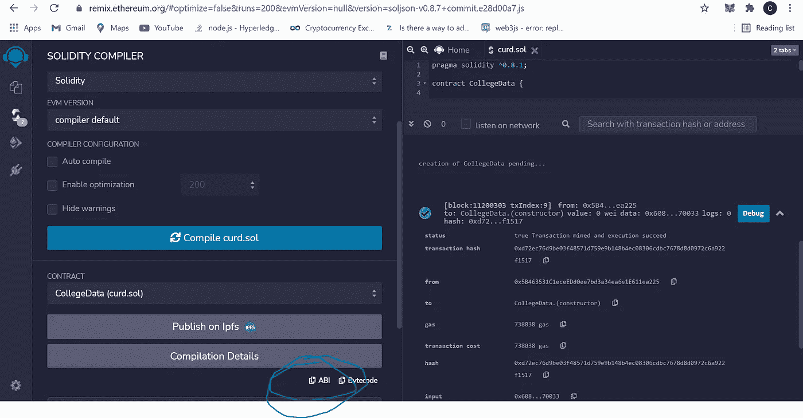****

****Contract abi****

*   ****将复制的 ABI 数组粘贴到 **dapp.js** 中****

```
**const Web3 = require('web3');
const Tx = require('ethereumjs-tx').Transaction;
const INFURA_KEY = "";  *// replace your infura-key* const web3 = new Web3('wss://ropsten.infura.io/ws/v3/' + INFURA_KEY);
const account = ''; *// replace wallet address with metamask wallet address* const privateKey = Buffer.from('', 'hex'); *// replace Private key to sign the transaction.* const contract_Address = ""; *//replace deployed contract address* const abi = ; //replace contract abi
const contract = new web3.eth.Contract(abi, contract_Address); *// Instantiating smart contract***
```

## ****合同功能****

*   ****签约交易功能工作如下:****
*   ****首先，它从区块链读取一个 **TransactionCount** 来计算一个交易的价格，然后 **getGasPrice** 从区块链读取一个天然气价格， **sendSignedTransaction** 向区块链发送一个交易并等待开采。****
*   ****挖掘成功后会得到一张交易收据。****

> ****注意:这里 read 函数不需要签署事务，因为它不改变区块链状态。****

# ****运行测试 dAPP****

*   ****使用下面的命令安装依赖项。****

```
****npm install****
```

*   ****使用以下命令运行应用程序****

```
****node dapp.js****
```

*   ****执行申请后，学生将在区块链上创建，我们将收到如下收据。****

****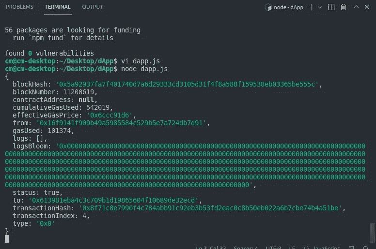****

****Transaction Receipt****

> ****注意:等待交易收据。****

*   ****导航到[https://ropsten . ethers can . io](https://ropsten.etherscan.io/)。****
*   ****将上述事件中的交易哈希复制并粘贴到 etherscan 网站。****

****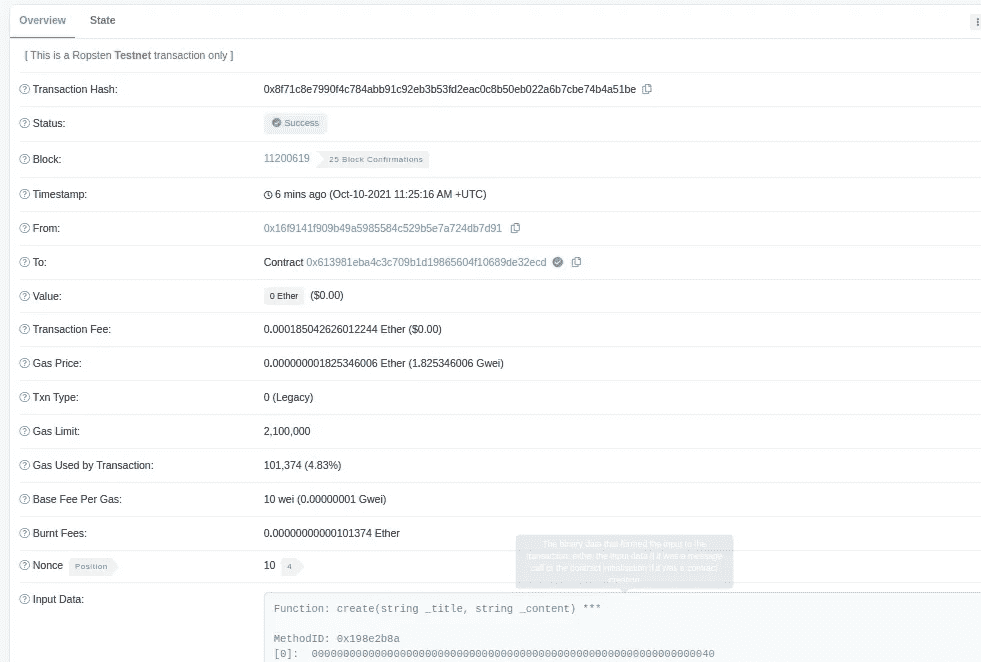****

****Create Student****

*   ****注释**创建**函数调用并启用 **read** 函数，然后重新运行 dapp。****

****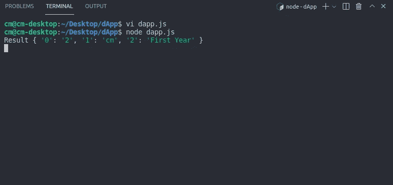****

****Read Student****

****同样，我们可以测试更新和删除功能。****

# ****摘要****

****我们已经看到了如何创建智能合约，以及如何在 remix 和测试网络环境中部署智能合约。我们学习如何使用 web3js 构建 dapp，并与以太坊区块链交互。****