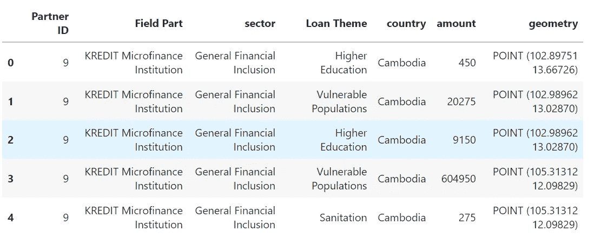
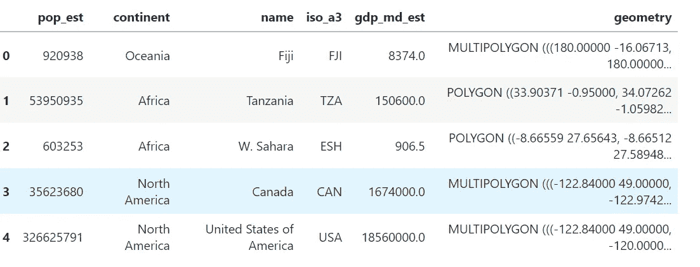
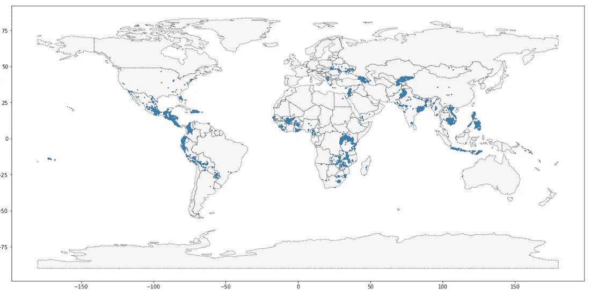
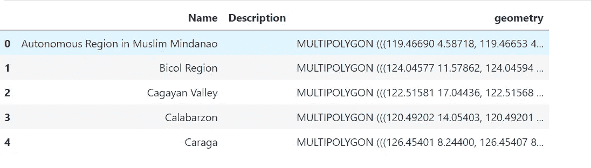
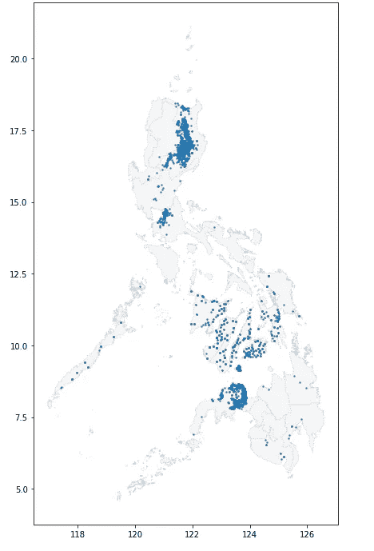

# 使用 GeoPandas 创建您的第一张地图！

> 原文：<https://medium.com/geekculture/create-your-first-map-using-geopandas-dace55a65da3?source=collection_archive---------7----------------------->


Photo by [Calvin Hanson](https://unsplash.com/@calvinhanson?utm_source=medium&utm_medium=referral) on [Unsplash](https://unsplash.com?utm_source=medium&utm_medium=referral)

本文将讨论使用 python 处理和可视化 **地理空间数据的不同方法。**

## **读取地理空间数据**

第一步是读取一些**地理空间数据**！为此，我们将使用 [**GeoPandas**](http://geopandas.org/) 库。**不同的地理空间文件格式**有很多，比如[**shape file**](https://en.wikipedia.org/wiki/Shapefile)**，**[**geo JSON**](https://en.wikipedia.org/wiki/GeoJSON)**，** [**KML**](https://en.wikipedia.org/wiki/Keyhole_Markup_Language) ，以及 [**GPKG**](https://en.wikipedia.org/wiki/GeoPackage) 。这里可能没有全部实践，但是我们知道一些细节，例如:

*   **shapefile** 是最常见的文件类型，并且
*   所有这些文件类型都可以通过`**gpd.read_file()**`功能快速加载

让我们试着在**的一些代码**中了解幕后发生的事情。使用的 [**数据集**](https://www.kaggle.com/datasets/kiva/data-science-for-good-kiva-crowdfunding) 是 [**KIVA**](https://www.kiva.org/) **在线众筹**平台，将金融服务延伸到全球的穷人。首先，让我们**加载数据(world_loans)并检查**整体看起来如何。

```
import geopandas as gpd
loans_filepath = "kiva_loans.shp"

# Your code here: Load the data
world_loans = gpd.read_file(loans_filepath)

# Uncomment to view the first five rows of the data
world_loans.head()
```



The kiva_loans file in the form of GeoPandas data frame (world_loans) (Kaggle image)

在本节中，我们在 **GeoPandas** 库中有各种**地理空间类型的数据集**。创建包含国家边界的地理数据框**世界**。

```
world_filepath = gpd.datasets.get_path('naturalearth_lowres')
world = gpd.read_file(world_filepath)
world.head()
```



First 5 rows of Geo data frame **world** (Kaggle Image)

**world** 和 **world_loans** 地理数据框用于可视化世界各地的 **Kiva 贷款位置**。

```
ax = world.plot(figsize=(20,20), color='whitesmoke', linestyle=':', 
                edgecolor='black')
world_loans.plot(ax=ax, markersize=2)
```



The countries (parts of countries) marked in WhiteSmoke are the regions where Kiva loans are donated (Kaggle Image)

因此，我们使用 **GeoPandas(地理数据框)创建了第一张世界地图。**看起来很有趣！

接下来，我们将看到位于**菲律宾**的贷款。通过使用下一个代码，我们创建了一个**地理数据框架** `PHL_loans`，其中包含来自菲律宾的`world_loans`贷款的所有行。

```
PHL_loans = world_loans.loc[world_loans['country'].isin(['Philippines'])].copy()
```

接下来，地理数据框架`PHL`被加载**，其中包含菲律宾所有**岛屿**的边界**。

```
# Load a KML file containing island boundaries
gpd.io.file.fiona.drvsupport.supported_drivers['KML'] = 'rw'
PHL = gpd.read_file("../input/geospatial-learn-course-data/Philippines_AL258.kml", driver='KML')
PHL.head()
```



Boundaries of all islands in the Philippines (Kaggle image)

同上 **PHL** 和**PHL _ 贷款地理数据框**用于可视化**菲律宾**的贷款。

```
ax = PHL.plot(figsize=(12,12), color='whitesmoke', linestyle=':', 
              edgecolor='lightgray')
PHL_loans.plot(ax=ax, markersize=2)
```



The set of islands in the Philippines and the areas of loans marked in WhiteSmoke (Kaggle image)

如果我们进一步深入上面的**地图**，我们将寻找一个没有任何贷款或贷款较少的岛屿(白烟区域)。所以，我们避开那些地区，找一个更大的地方(**民都洛**在**菲中部**)。在当前数据集中，这是一个没有任何贷款的相当大的岛。这个岛可以作为**招募**新野外伙伴**的好地点**！这张 [**地图**](https://upload.wikimedia.org/wikipedia/commons/f/f6/Labelled_map_of_the_Philippines_-_Provinces_and_Regions.png) 对识别岛屿很有帮助。

因此，在本文中，我们使用 **GeoPandas** 创建了我们的**第一张地图**，这里的 指的是 [**。当然，该课程的某些部分将很快添加进来。请继续关注我的下一篇文章。跟着**](https://www.kaggle.com/code/abhi2652254/exercise-your-first-map/edit) **[**me**](/@abhi2652254) 说 [**hi**](https://www.linkedin.com/in/obhinaba17/) 。**