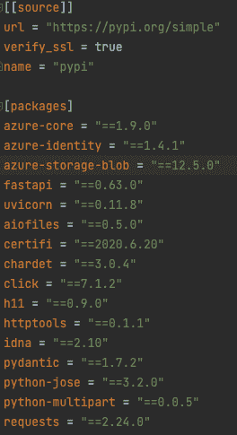
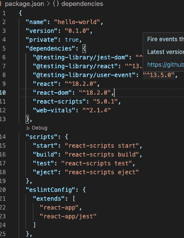
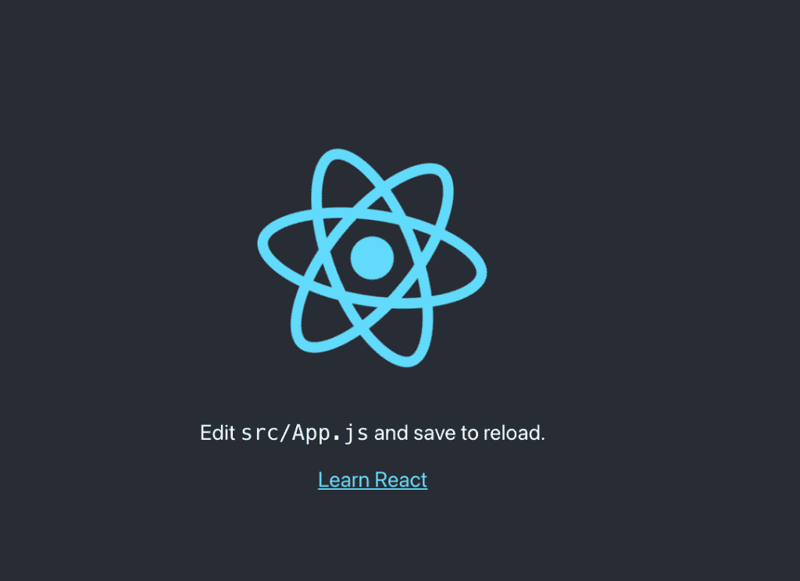
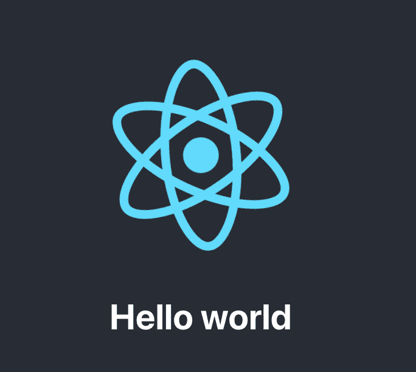

# 创建您的第一个 React 应用程序

> 原文：<https://medium.com/geekculture/create-your-first-react-app-5fd07e2b4451?source=collection_archive---------7----------------------->

## reactjs 入门


# 简介:

我一直有学习前端技术的好奇心。虽然我断断续续地研究过`JavaScript`，但从未获得高深的知识。现在我有一些时间，我想我可以从`react`开始我的旅程。

这篇文章讨论了如何使用`react`创建你的第一个应用程序。虽然我从事 python 开发已经很多年了，但是对于 react 来说，我还是个新手，我将按照我所学的方法来完成这些步骤。你现在应该已经猜到了，基本上我们将创建一个 hello-world react 应用程序。

出于学习目的，我们将在本帖中使用极简的`create-react-app`。这款应用是`Facebook`在 2016 年推出的 react 入门套件。

[https://reactjs.org/](https://reactjs.org/)

# 要求:

我们将在创建应用程序之前安装`node`和`npm`。我正在使用 mac，并将使用 brew 来安装 npm 和 node。

## MACOSX:

```
$brew install node
```

[https://nodejs.org/en/download/](https://nodejs.org/en/download/)

安装后，检查节点和 npm 版本。

```
$node -v 
v18.4.0 $npm -v 
8.12.1
```

# 创建应用程序:

现在我们有了环境设置，让我们创建我们的应用程序。

## 命令:

```
$ npx create-react-app hello-world
```

执行上面的命令会创建一个项目，输出如下:

```
Creating a new React app in /Users/dkb/hello-world.

Installing packages. This might take a couple of minutes.
Installing react, react-dom, and react-scripts with cra-template...

added 1394 packages in 32s

194 packages are looking for funding
  run `npm fund` for details

Initialized a git repository.

Installing template dependencies using npm...
npm WARN deprecated source-map-resolve@0.6.0: See https://github.com/lydell/source-map-resolve#deprecated

added 52 packages in 3s

194 packages are looking for funding
  run `npm fund` for details
Removing template package using npm...

removed 1 package, and audited 1446 packages in 2s

194 packages are looking for funding
  run `npm fund` for details

6 high severity vulnerabilities

To address all issues (including breaking changes), run:
  npm audit fix --force

Run `npm audit` for details.

Created git commit.

Success! Created hello-world at /Users/dkb/hello-world
Inside that directory, you can run several commands:

  npm start
    Starts the development server.

  npm run build
    Bundles the app into static files for production.

  npm test
    Starts the test runner.

  npm run eject
    Removes this tool and copies build dependencies, configuration files
    and scripts into the app directory. If you do this, you can’t go back!

We suggest that you begin by typing:

  cd hello-world
  npm start
```

# 反应项目结构:

项目结构由以下文件组成，如输出所示。

```
hello-world
|__node_modules
|__package-lock.json
|__package.json
|__public/
|__README.md
|__src/
   |__App.css
   |__App.js
   |__App.test.js
   |__index.css
   |__index.js
   |__logo.svg
   |__reportWebVitals.js
   |__setupTests.js
```

## 节点模块:

该文件夹包含所有通过`npm`安装的标准节点包。如果你来自`python`背景，你可以把`npm`和`pip`联系起来，npm 基本上是 JavaScript 的 pip。

`node_modules`就像 python 中的`site-packages`。这将使用 npm 自动安装和卸载。

## package.json:

该文件列出了所有节点包依赖项和项目配置。同样，您可以将这与 python 中的`Pipfile`联系起来。



Python’s pip file



package.json in JS

以上是一个`pip`文件和`package.json`文件的对比。这些文件的目的是相似的:指定依赖库及其版本。

`name`字段指定应用程序的名称。在我们的例子中，这是`hello-world`。指定的脚本可以用`npm run [script]`命令执行。对于`test`和`start`脚本，可以跳过运行命令。

```
$npm start$npm test$npm run build
```

`npm run eject`。 ***这是一种单向操作。一旦这样做了，我们就不能撤销它*** 。

这基本上是对构建工具和配置文件进行更改。从[文档](https://create-react-app.dev/docs/available-scripts/#:~:text=npm%20run%20eject%20%E2%80%8B&text=This%20command%20will%20remove%20the,project%20as%20dependencies%20in%20package.)中，

> 你不必使用`eject`。精选的特性集适用于中小型部署，您不应该觉得有义务使用这个特性。然而，我们明白，如果您在准备好使用这个工具时无法对其进行定制，那么它将毫无用处。

## 包锁. json:

对于 npm 修改`node_modules`树或`package.json`的任何操作，都会自动生成`package-lock.json`。正如你已经猜到的，这与`Pipfile.lock`文件有关。

## 公共文件夹:

这包含了你所有的开发文件，你的图标，`favicon.ico`，`index.html`等等。索引文件显示在`[http://localhost:3000](http://localhost:3000.)` [。](http://localhost:3000.)

`src`文件夹中的`App.js`文件包含 hello-world 应用程序的锅炉板代码。

App.js file — Default

这个特定的 JavaScript 函数被称为 App 组件。

# 组件:

什么是组件？

组件是可重用的`JavaScript`函数，通过接受名为`props`的参数来执行特定的任务，并返回一个 react 组件。这也称为功能组件。

函数组件返回的 HTML 叫做`JSX`也就是`JavaScript XML`。

组件也可以使用 ES6 类来编写，但是让我们留待以后再说。

[https://reactjs.org/docs/components-and-props.html](https://reactjs.org/docs/components-and-props.html)

# 启动应用程序:

现在我们已经讨论了足够多的项目结构，让我们开始执行，看看我们的第一个应用程序是什么样子的。

```
$npm start

Compiled successfully!

You can now view hello-world in the browser.

  Local:            http://localhost:3000
  On Your Network:  http://192.168.0.228:3000

Note that the development build is not optimized.
To create a production build, use npm run build.

webpack compiled successfully
```



Browser output of starter kit react

输出类似于上面的内容。嗯，严格来说，我们从来没有打过 hello world。当然，在结束本文之前，我将对代码进行一点小小的改动。默认代码有一个超链接和一个段落文本。让我们简化一下。

Hello World JS code

我通过移除超链接并添加一个带有 Hello World 文本的标题，使事情变得简单多了。我保留了图像标签，让它看起来更酷。尝试通过删除 App 和 App-logo 的类名来修改代码，看看内容显示在哪里。

输出:



Hello world output in browser.

# 总结:

如果您是一名后端开发人员，并且希望使用全栈技术或学习前端技术来提升自己的形象，那么这篇文章可能是您的入门文章。

现在，我们已经用这个初学者工具包湿了我们的脚，我们有很多要走的路才能到达目的地。例如，组件类型、道具、JSX 等。当我有时间的时候，我会继续写越来越多的关于`react`的文章。

# 参考资料:

*   [https://reactjs.org/docs/hello-world.html](https://reactjs.org/docs/hello-world.html)
*   [https://www.roadtoreact.com/](https://www.roadtoreact.com/)

*原载于 2022 年 7 月 8 日*[*https://dock2learn.com*](https://dock2learn.com/tech/create-your-first-react-app/)*。*