# 创建您自己的 100 万加密货币

> 原文：<https://medium.com/geekculture/create-your-own-1-million-cryptocurrency-bd86f4f5e16d?source=collection_archive---------8----------------------->


# 介绍

在本文中，我们将使用以太坊 **ERC-20 标准**构建我们自己的加密货币 **DreamToken** 。硬币的总数将是 100 万。这是一篇实用的动手文章。

> 注意:我们正在创建一个加密令牌，而不是硬币。硬币是基于他们的本土区块链网络，代币是建立在现有的区块链。

# 观众

区块链开发者，以太坊用户/管理员。

# 先决条件

1.  对**可靠性**或一般编程有基本的了解。
2.  chrome 或 firefox 上的 Metamask 扩展。(与 **web3** 连接)
3.  对 **Web3** 的基本了解。
4.  钱包在 metamask 上，带有一些**乙醚(硬币)**(可选)。

# 设置步骤

*   智能合同概述。
*   在 remix 环境中部署。
*   以太坊 ropsten 测试网络的部署。
*   加密令牌的测试。
*   将 DreamToken 添加到元掩码 wallet。

# 文件夹结构

*   让我们克隆包含智能合同源代码的存储库。

```
**git clone** [**https://github.com/cmjagtap/DreamCoin**](https://github.com/cmjagtap/DreamCoin)
```

# 文件夹结构

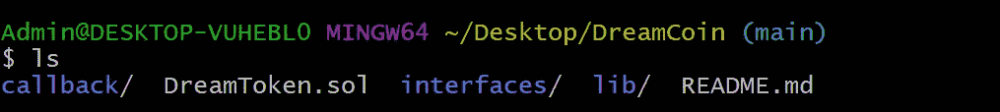

*   **回调-:** 包含回调智能合约文件。
*   **Dream token . sol-:**Dream token 智能合约文件。
*   **接口-:** ERC-20 接口合同文件**。**
*   **lib -:** Safemath 合同文件**。**

# 什么是 ERC-20？？

ERC-20 是一种技术标准。它用于以太坊区块链上用于令牌实现的所有智能合约。

# 智能合同概述:

## 1) Safemath 智能合约

*   这是一份与数学相关的公用事业合同。增加溢出检查的 Solidity 算术运算包装器。

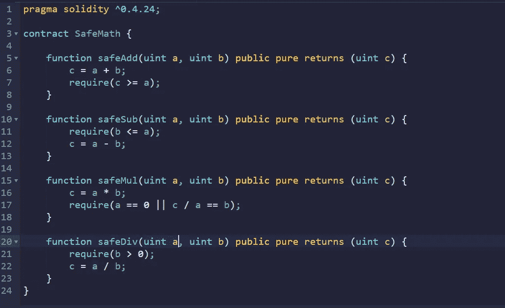

Safemath. sol Contract

*   已经有一些合约可用于数学运算，更多信息请点击此处。

## 2)回调智能合约

*   这是一个简单的回调契约。

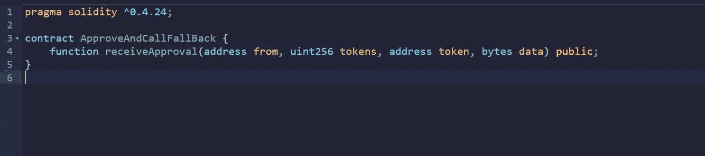

Callback.sol Contract

## 3) ERC-20 智能合约

*   这是一个定义为以太合同 ERC-20 接口。

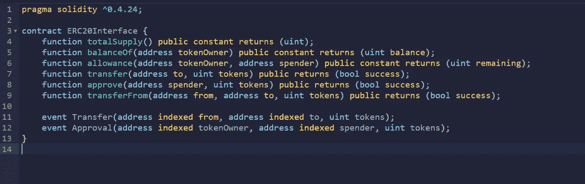

ERC-20 Interface

*   上图显示了 ERC-20 标准的所有方法，更多信息[点击这里](https://ethereum.org/en/developers/docs/standards/tokens/erc-20/)
*   我们将在我们的加密令牌中实现它们。

## 4) DREAMToken 智能合约

*   Dreamtoken 是我们的主合同。

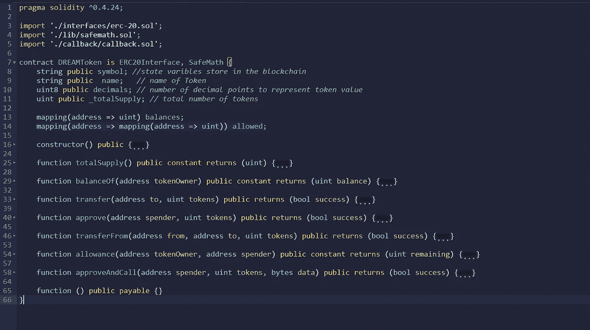

DREAMToken.sol Contract

*   替换以下变量创建自己的令牌:
    ***符号***= " DRMTKN "；//在这里输入你的令牌符号
    ***名称*** = "梦想令牌"；//给你的令牌起个名字
    ***_ total supply***= 1000000；//创建 100 万代币
    ***余额***【0x 87159283507 Abe 8543 a 943d 74447247 E1 d 8396 a 0】= _ total supply；//用你的钱包地址替换地址
    emit Transfer(地址(0)，0x 87159283507 Abe 8543 a 943d 74447247 E1 d 8396 a 0，_ total supply)；
    }

令牌功能**。**

*   **totalSupply** :一种定义令牌总供应量的方法，当达到此限制时，智能合约将拒绝创建新令牌。
*   **balanceOf** :返回钱包地址拥有的令牌数的方法。
*   **转移**:从总供给中取出一定数量的代币给某个用户的方法。
*   **从**转移:另一种类型的转移方法，用于在用户之间转移令牌。
*   **approve** :该方法验证是否允许智能合约向用户分配一定数量的令牌，考虑总供应量。
*   **津贴**:此方法与批准的方法相同，只是它检查一个用户是否有足够的余额向另一个用户发送一定数量的令牌。

ERC-20 类似于面向对象的编程接口。

# 在混合环境中部署

*   让我们在一个混合环境中部署令牌契约
*   首先，导航到地址[https://remix.ethereum.org/](https://remix.ethereum.org/)
*   将 Dreamtoken 合同代码添加到混音中，如下所示。

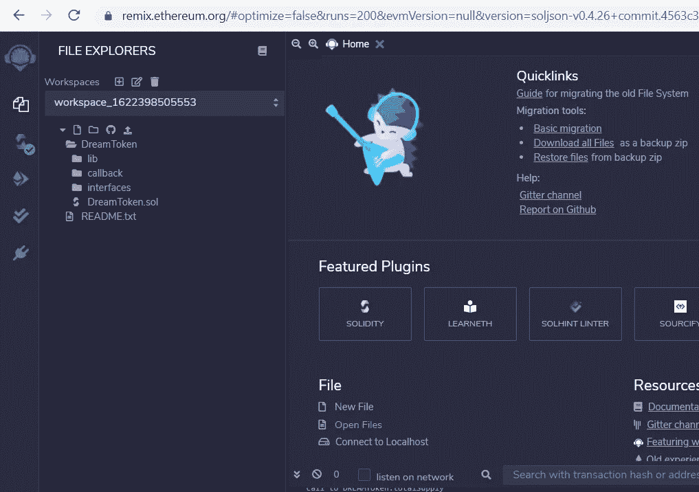

*   在左侧，我们可以看到 DreamToken 的源代码。
*   从左侧按钮编译合同或打开 DreamToken.sol 并按 ctrl+s。

> 请记住替换钱包地址，这里我们使用的是 remix 环境，我们必须根据所选帐户更改合同中的钱包地址以部署合同。

*   单击左侧第三个按钮，您将看到如下图所示的部署环境。

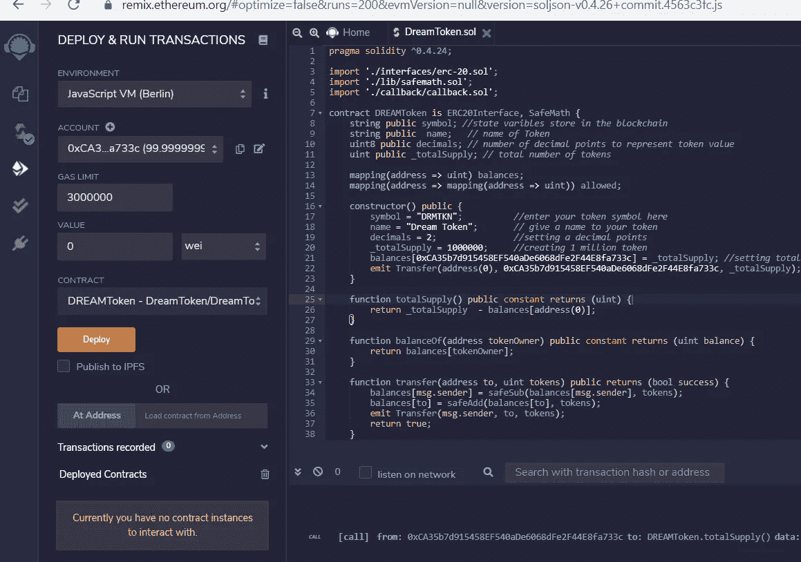

Deploy Screen

*   选择**环境**作为 JavaScript 虚拟机。
*   验证合同中的帐户地址和您的令牌地址，它们应该是相同的。
*   单击黄色的部署按钮，在 remix 区块链上部署令牌。
*   如果一切顺利，那么您应该会看到如下成功的契约部署。

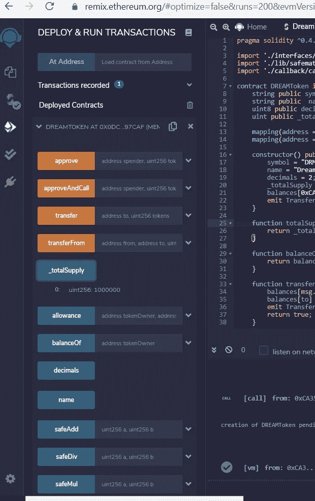

Deployed token

*   在上图中，我们可以看到 **_totalSupply 是 100 万**，你可以自行测试其他功能。

# 部署在 Ropsten 测试网络上。

*   首先，在 chrome 或 firefox 上安装一个**元掩码扩展**
*   从左侧再次单击第三个按钮，将出现部署窗口。
*   选择**环境**为**注入的 Web3** ，会出现如下元掩码提示。

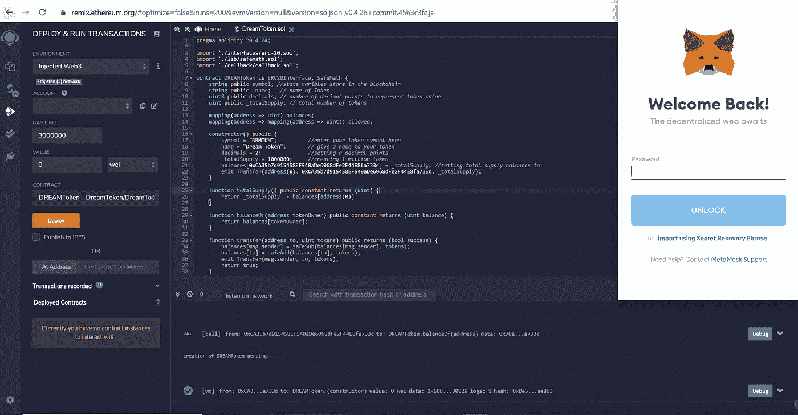

Deploy Screen

*   在 metamask 中输入您的密码，我将连接到 remix 环境。
*   你可以在一个 **remix 账户上看到你的 metamask 钱包地址。**
*   在 metamask 扩展中选择 ropsten test-network，你的钱包应该是这样的。

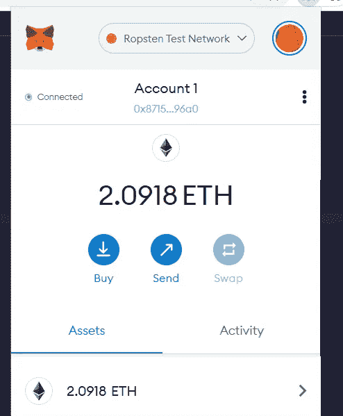

Metamask Wallet

*   这里你需要一些醚作为汽油费。
*   你可以从[这个链接](https://faucet.ropsten.be/)得到免费的乙醚，输入你的地址，他们会免费送你一个乙醚。
*   我们准备在 ropsten 测试网络上部署 DreamToken。
*   在此之前，将您的 DreamToken 钱包地址替换为合同中的元掩码地址，如下所示。

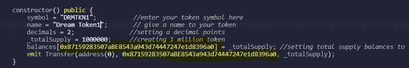

Metamask Wallet Address

*   上述地址将使您成为 DreamToken 智能合约的所有者。
*   让我们通过单击黄色的 deploy 按钮在 ropsten 网络上部署令牌合约。
*   现在 metamask 提示符将如下所示出现，并要求您确认交易。

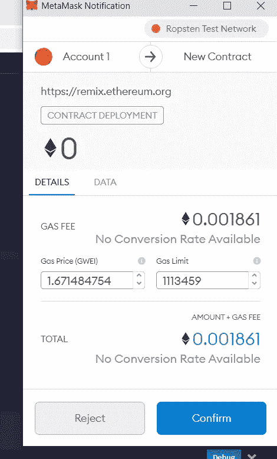

Deployment Transaction

*   现在，您可以在 Dream token 正在创建的 remix 环境中看到调试日志，在成功部署后，事务日志将如下所示。

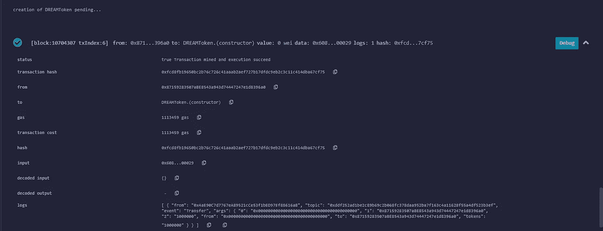

Token Creation

*   让我们通过导航到此地址[https://ropsten . ethers can . io](https://ropsten.etherscan.io/)来验证 ropsten explore 上的合同部署。
*   将日志中的交易哈希复制并粘贴到以太网扫描网站。

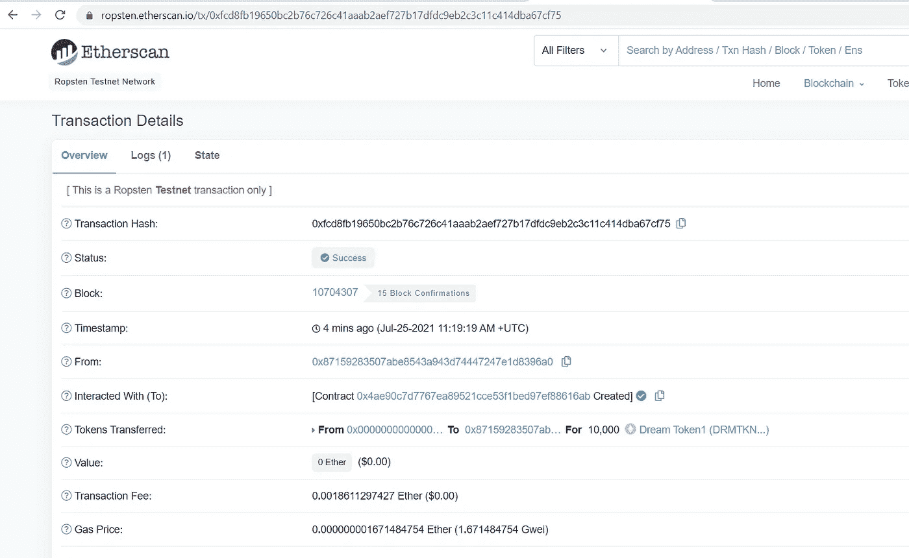

*   在上图中，我们可以看到谁创建了交易，它应该与您的元掩码钱包地址相匹配。
*   现在我们的合同准备好了，我们可以测试合同的所有功能。

# DreamToken 契约的测试

*   首先，将使用函数 ***_totalSupply*** 检查 **DreamTokens** 的数量。

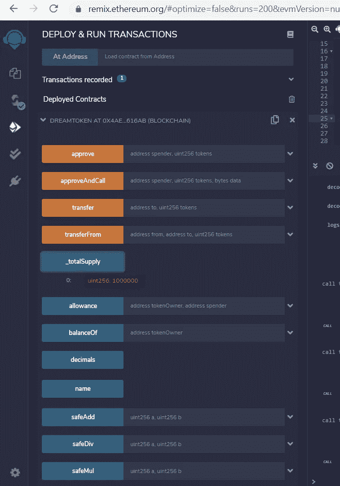

Token

*   这里我们可以看到**100 万个 DreamToken** 已经被创建。

**让我们使用*转移*功能将 10k 梦想币转移给另一个用户。**

*   我已经使用一些随机钱包地址转移 10k 代币。
*   点击转账功能，然后输入您要向其转移代币的钱包地址和代币数量，然后点击交易。
*   现在 metamask 窗口将出现，以确认交易。

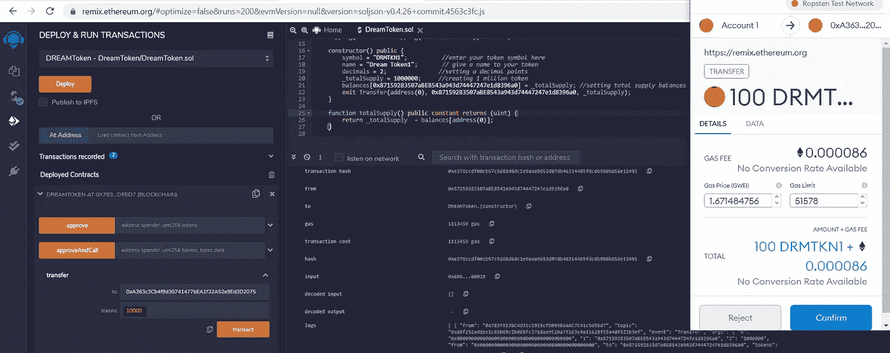

Token Transfer

*   现在检查我们的代币转账后的余额。
*   点击 balanceOf function 并在那里输入我们的钱包地址，您应该会看到合同中剩余的令牌余额如下。

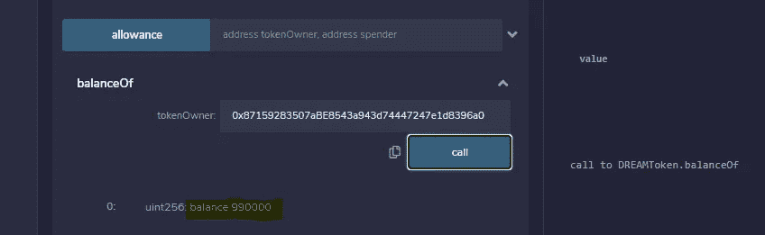

Remaining Tokens

*   同样，您可以测试所有其他功能。

# 将 DreamToken 添加到元掩码 Wallet

*   让我们复制 DreamToken 合同的地址，单击突出显示的部分，地址将被复制到您的剪贴板。

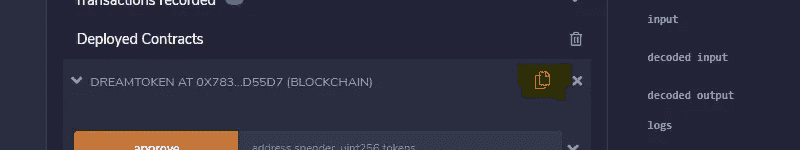

Token Address Copy

*   然后转到元掩码，点击添加令牌选项卡，粘贴复制的合同地址。

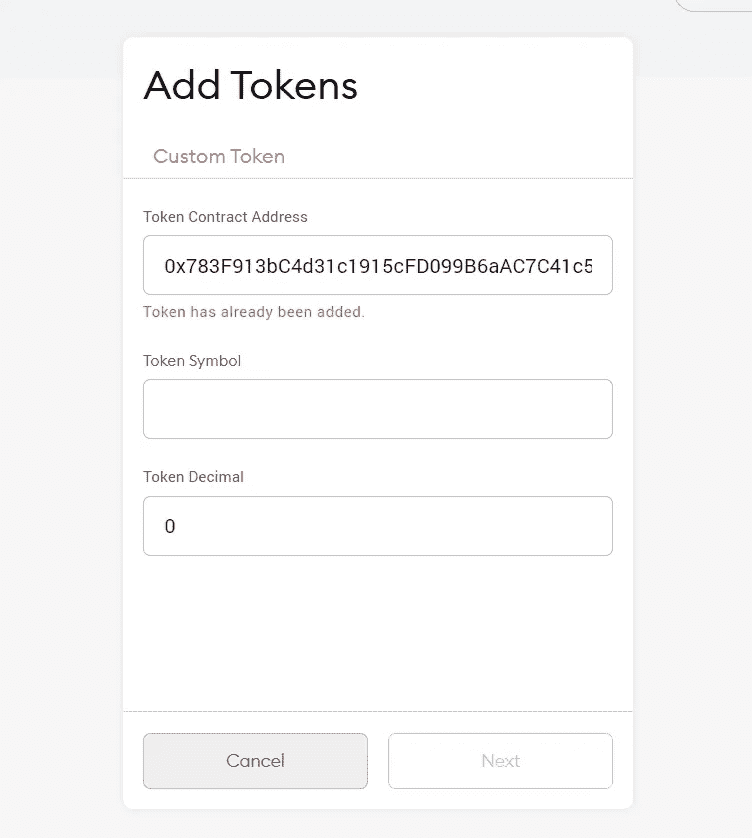

In my case token was already added.

*   现在，您应该可以在钱包中看到您列出的令牌以及剩余余额。

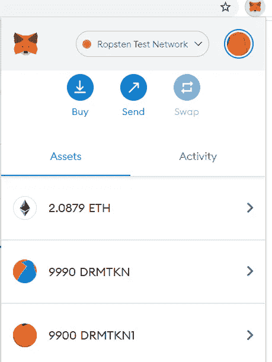

Metamask Wallet

> 这篇文章仅用于教育目的。如果你想在币安或任何 DEX 平台上交易这个令牌，你应该联系他们。

# 摘要

我们已经看到了如何创建自己的加密货币令牌，以及如何在 remix 和测试网络环境中部署智能合约。在下一篇文章中，我们将看到如何创建 NFT 令牌。