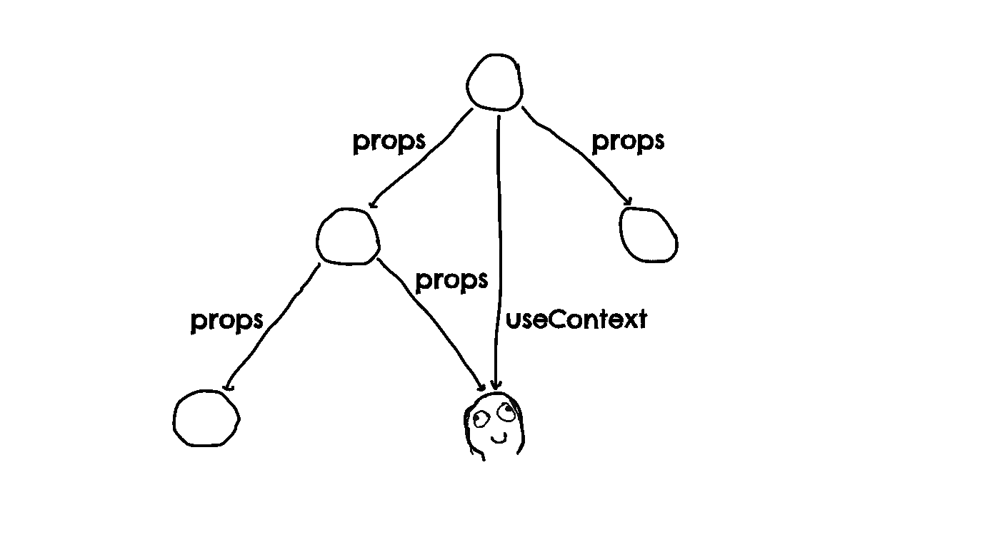

# 创建自己的 React 上下文

> 原文：<https://medium.com/geekculture/create-your-own-react-context-b91060fd3ef0?source=collection_archive---------13----------------------->

## 在反应的童话世界里的冒险

React 的[上下文](https://reactjs.org/docs/context.html) API 允许我们在将数据从祖先传递到后代时任意跳过组件树的层次。当处理由层次结构中不同层次的不相关组件读取的有状态数据时，这很方便。也是[复合组件](https://dev.to/alexi_be3/react-component-patterns-49ho)、 [React 路由器](https://reactrouter.com)背后强大的复合模式的中坚力量。



自从引入以来，上下文 API 一直是围绕集中式状态管理的几乎所有讨论的核心。虽然它本身并不是一个完整的状态管理工具，但它可以与其他 React 原语结合使用，创建一个轻量级的替代方案来替代现有的解决方案，如 [Flux](https://facebook.github.io/flux/) 、 [React Redux](https://react-redux.js.org) 或 [MobX React](https://github.com/mobxjs/mobx/tree/main/packages/mobx-react) 。

关于使用上下文 API 使中央应用程序状态对组件树可用，最常见的问题之一是性能。什么时候渲染？订阅一个上下文会触发那些只读取它的一个子部分的组件的不必要的更新吗？将来 React 组件是否应该默认为[记忆](https://reactjs.org/docs/react-api.html#reactmemo)？

在这个问题上，社会上的意见分歧很大。一些人提倡使用 API，如 [connect](https://react-redux.js.org/api/connect) 来封装渲染优化的逻辑。有些人认为我们不应该总是纠结于组件的重新渲染，而是应该关注保持它们的渲染逻辑简单和精简。一些人认为掌握好的组件设计的基础会产生集中状态管理的可靠替代方案。各方面都有优点。

我的意思不是赞同任何一种特定的世界观，而是帮助你驾驭解决 [prop drilling](https://kentcdodds.com/blog/prop-drilling) 问题的复杂性。在本文中，我们将一步步实现我们自己的上下文 API。

# API

一个利用集中状态的轻量级应用程序的例子可以选择提供最新的状态以及通过上下文更新它的方法。当前的上下文创建 API 返回一个[提供者](https://reactjs.org/docs/context.html#contextprovider)包装组件，访问上下文值的最先进方式是通过 [useContext](https://reactjs.org/docs/hooks-reference.html#usecontext) 钩子。

```
import { [createContext](https://reactjs.org/docs/context.html#reactcreatecontext), [useContext](https://reactjs.org/docs/hooks-reference.html#usecontext), [useReducer](https://reactjs.org/docs/hooks-reference.html#usereducer) } from "[react](https://reactjs.org)";const StateContext = createContext(initialState);
const DispatchContext = createContext(noop);function App() {
    const [state, dispatch] = [useReducer](https://reactjs.org/docs/hooks-reference.html#usereducer)(reducer, initialState); return (
        <StateContext.Provider value={state}>
             <DispatchContext.Provider value={dispatch}>
                  <Component />
             <DispatchContext.Provider>
        </StateContext.Provider>
    );
}function Component() {
    const dispatch = [useContext](https://reactjs.org/docs/hooks-reference.html#usecontext)(DispatchContext);
    const bar = [useContext](https://reactjs.org/docs/hooks-reference.html#usecontext)(StateContext).foo.bar; // ...
}
```

提供者起源于生命周期逻辑只能在[类组件](https://reactjs.org/docs/react-component.html)中实现的时代。随着钩子的引入，我们现在有可能开发一个 API，它允许应用程序利用多种上下文来摆脱[提供者](https://reactjs.org/docs/context.html#contextprovider)的深度嵌套金字塔。

另一个有趣的变化是使用选择器来访问上下文数据，这是由 [React Redux](https://react-redux.js.org) 推广的。我们将在 API 中包含我们自己的 [useSelector](https://react-redux.js.org/api/hooks#useselector) 实现，并探索它的好处。

```
import { [useReducer](https://reactjs.org/docs/hooks-reference.html#usereducer) } from "[react](https://reactjs.org)";
import { **createContext** } from "..."; const [**useProvider**, **useSelector**] = **createContext**(initialState);
const [**useDispatchProvider**, **useDispatch**] = **createContext**(noop);function App() {
    const [state, dispatch] = [useReducer](https://reactjs.org/docs/hooks-reference.html#usereducer)(reducer, initialState); **useProvider**(state);
    **useDispatchProvider**(dispatch); return <Component />;
}function Component() {
    const dispatch = **useDispatch**();
    const bar = **useSelector**(**state => state.foo.bar**); // ...
}
```

# 第一步:设置场景

React [挂钩](https://reactjs.org/docs/hooks-intro.html)的引入使得[高阶组件](https://reactjs.org/docs/higher-order-components.html)以及[混合组件](https://reactjs.org/blog/2016/07/13/mixins-considered-harmful.html)的使用被淘汰。这在高阶事物的神秘领域留下了怀旧的空白。我们可以偶尔创造一个高阶钩子来填补这个空白。

创建一个上下文相当于创建一对彼此明确对应的钩子。我们可以利用这种设计在层次结构的不同层次的组件之间建立连接，而不需要传递道具。

```
export function createContext(initialValue) {
    const useProvider = createProviderHook();
    const useSelector = createSelectorHook(); return [useProvider, useSelector];
}function createProviderHook() {
    return function(value) {
          // ?
    }
}function createSelectorHook() {
    return function(select) {
          // ?
    }
}
```

# 第二步:分享背景

钩子的成对创建也是创建上下文对象的好机会，它们通过上下文对象共享数据。当 useProvider 不断地将最新收到的值写入上下文时，useSelector 不断地从中读取最新的值。

注意，即使最新的上下文值被两个钩子共享，它也不是被动共享的。调用 useProvider 的组件的更新不一定会触发调用 useSelector 的所有后代的更新。被记忆的组件可能存在于两者之间。

```
export function createContext(initialValue) {
    **const context = {
        value: initialValue,
    };** const useProvider = createProviderHook(**context**);
    const useSelector = createSelectorHook(**context**); return [useProvider, useSelector];
}function createProviderHook(**context**) {
    return function(value) {
        **context.value = value;**
    }
}function createSelectorHook(**context**) {
    return function(select) {
        **return select(context.value);**
    }
}
```

# **第三步:注册订阅**

我们现在需要确保当 useProvider 接收到新值时，所有调用 useSelector 的组件都得到更新。

其思想是让 useSelector 的每个实例将自己作为订阅者引入上下文，并让 useProvider 在收到新值时通知所有已注册的订阅。有了这个添加，我们的上下文 API 实现也将在使用[记忆组件](https://reactjs.org/docs/react-api.html#reactmemo)的情况下正确工作。

```
**import {** [**useEffect**](https://reactjs.org/docs/hooks-reference.html#useeffect)**,** [**useReducer**](https://reactjs.org/docs/hooks-reference.html#usereducer)**,** [**useMemo**](https://reactjs.org/docs/hooks-reference.html#usememo) **} from "**[**react**](https://reactjs.org)**";**export function createContext(initialValue) {
    const context = {
        value: initialValue, 
        **subscriptions: new** [**Set**](https://developer.mozilla.org/en-US/docs/Web/JavaScript/Reference/Global_Objects/Set)**();**
    }; const useProvider = createProviderHook(context);
    const useSelector = createSelectorHook(context); return [useProvider, useSelector];
}function createProviderHook(context) {
    return function(value) {
        context.value = value;[**useEffect**](https://reactjs.org/docs/hooks-reference.html#useeffect)**(() => {
            for (const notifyUpdate of context.subscriptions) {
                notifyUpdate();
            }
        }, [value]);**
    }
}function createSelectorHook(context) {
    return function(select) {
        const selectedValue = select(context.value);
 **const notifyUpdate =** [**useReducer**](https://reactjs.org/docs/hooks-reference.html#usereducer)**(c => c + 1, 0)[1];
        const subscription =** [**useMemo**](https://reactjs.org/docs/hooks-reference.html#usememo)**(() => notifyUpdate), []);** [**useEffect**](https://reactjs.org/docs/hooks-reference.html#useeffect)**(() =>
            context.subscriptions.add(subscription);
            return () => {
                context.subscriptions.delete(subscription);
            }
        }, []);**        return selectedValue;
    }
}
```

# 第四步:修复闪烁的用户界面

让我们来看看一件有趣的事情，如果我们使用 Effect 通知注册的订阅。

调用 useProvider udates 的组件安排所有订阅的通知在更改提交到 DOM 和浏览器重新绘制之后发生。如果由于提供者祖先的更新，所有的上下文使用者都被同步更新，那么就没问题了，到通知效果运行时，所有的订阅都将收到最新的上下文值，没有更新需要触发。

但是如果中间有一个[记忆组件](https://reactjs.org/docs/react-api.html#reactmemo)，并且至少有一个消费者没有因为提供者祖先更新而立即更新，那该怎么办呢？然后，在浏览器绘制初始更新和通知效果运行后，未收到最新上下文值的消费者被通知并更新，确定要重新绘制的浏览器。

是的，在存在 memozied 组件的情况下，当上下文值改变时，可能至少需要两次重绘来显示更新的组件树。这可能会在用户界面中产生闪烁效果。

这就是为什么我们要用[来代替](https://reactjs.org/docs/hooks-reference.html#uselayouteffect)的原因。

它的回调保证在渲染更改提交到 DOM 之后运行，但是在之前*浏览器有机会重新绘制。不仅如此，在布局效果中触发的进一步的状态更新也保证在浏览器重新绘制之前同步应用并提交到 DOM，这意味着提供者祖先的更新和消费者后代的更新同时呈现给用户。*

注意，这不一定是好事。这只是一个设计决策。一次性同步更新组件树也意味着浏览器在渲染时会被阻塞更长时间。进一步探究这种区别自然会引出[并发模式](https://reactjs.org/docs/concurrent-mode-intro.html)，我现在还不准备谈论它，至少在它变得稳定之前。

```
import { [**useLayoutEffect**](https://reactjs.org/docs/hooks-reference.html#uselayouteffect)} from "[react](https://reactjs.org)";function createProviderHook(context) {
    return function(value) {
        context.value = value;[**useLayoutEffect**](https://reactjs.org/docs/hooks-reference.html#uselayouteffect)(() => {
            for (const notifyUpdate of context.subscriptions) {
                notifyUpdate();
            }
        }, [value]);
    }
}
```

喜欢新奇事物的人可能会问，同步通知已经在呈现阶段的订阅怎么样？如果你知道你在做什么，那就是使用[功能等同于 getDerivedStateFromProps](https://reactjs.org/docs/hooks-faq.html#how-do-i-implement-getderivedstatefromprops) 。确实很奇特，很少被记载，也很难解释。我打算暂时把它放在一边。

顺便说一句，如果你还没有，一定要留出一些时间来阅读[效果使用指南](https://overreacted.io/a-complete-guide-to-useeffect/)。我总是觉得很清爽。

# 第五步:自上而下更新

到目前为止，事情进展顺利。这一过程中的每一步都是合乎逻辑的，而且有些清晰。但是那些听过 React 鬼故事的人可能会记得 React Redux 的幽灵、[陈旧的道具和僵尸小孩](https://react-redux.js.org/api/hooks#stale-props-and-zombie-children)。

**(ノಠ益ಠ)ノ彡┻━┻**

这篇令人惊叹的文章已经在探索问题的复杂性方面做了出色的工作。如果您是新手，我建议您不要因为这一点上的复杂性而感到不知所措，而是慢慢来，首先掌握基础知识。

尽可能简短地说，我们的实现不会受到僵尸孩子的影响。让我们通过对注册订阅实施批量、自顶向下的通知来解决过时的 props 问题。到目前为止，我们手头上最好的工具是 [ReactDOM](https://reactjs.org/docs/react-dom.html) 的一个隐藏功能，记录在用户土地的民间传说中。

```
**import { unstable_batchedUpdates } from "**[**react-dom**](https://reactjs.org/docs/react-dom.html)**";**function createProviderHook(context) {
    return function(value) {
        context.value = value; [useLayoutEffect](https://reactjs.org/docs/hooks-reference.html#uselayouteffect)(() => {
 **unstable_batchedUpdates(() => {** for (constnotifyUpdate of context.subscriptions) {
                    notifyUpdate();
                }
 **});**       }, [value]);
    }
}
```

# 第六步:避免不必要的更新

我们还没有利用基于选择器的界面。到目前为止，当上下文值改变时，即使选择的值保持不变，useSelector 的每个注册订阅都会得到通知。我们的目标是只触发元素的更新，当在新的上下文中调用时，选择器回调为这些元素返回不同的值。

请注意，**仅触发元素**的更新和**仅更新元素**之间有细微的区别。后者意味着使用这个 API 本身优化了组件的呈现。事实并非如此。为了提高性能，在提供者祖先和消费者后代之间也必须有[记忆组件](https://reactjs.org/docs/react-api.html#reactmemo)。默认情况下，React 更新一个更新元素的所有后代，不管它们的属性是否改变。这里是[(大部分)反应渲染行为](https://blog.isquaredsoftware.com/2020/05/blogged-answers-a-mostly-complete-guide-to-react-rendering-behavior/)的完整指南。

这个想法是在每次 useSelector 运行时，与 useProvider 共享最新的选择器以及最新选择的值。useProvider 可以使用这些来选择退出通知订阅，通知订阅不会收到与前一个值不同的选定值。

```
function createProviderHook(context) {
    return function(value) {
        context.value = value; [useLayoutEffect](https://reactjs.org/docs/hooks-reference.html#uselayouteffect)(() => {
     unstable_batchedUpdates(() => {
                for (const { **select,
                    selectedValue,** notifyUpdate**,**
                } of context.subscriptions) {                    **if (select(value) !== selectedValue) {**
                        notifyUpdate();
                    **}** }
            });
        }, [value]);
    }
}function createSelectorHook(context) {
    return function(select) {
        const selectedValue = select(context.value);
        const notifyUpdate = [useReducer](https://reactjs.org/docs/hooks-reference.html#usereducer)(c => c + 1, 0)[1];
        const subscription = [useMemo](https://reactjs.org/docs/hooks-reference.html#usememo)(() => **({**          
            **select, 
            selectedValue,**
            notifyUpdate,
        **})**, []); **subscription.select = select;
        subscription.selectedValue = selectedValue;** [useEffect](https://reactjs.org/docs/hooks-reference.html#useeffect)(() =>
            context.subscriptions.add(subscription);
            return () => {
                context.subscriptions.delete(subscription);
            }
        }, []); return selectedValue;
    }
}
```

# 第七步:完成 API

咻，有很多东西需要消化，但是我们就快到了！我们缺少两个小细节来完成 API。我们可以为 useSelector 提供一个默认的回调，允许它在没有参数的情况下被调用。我们还可以让用户通过第二个相等检查器回调来决定两个上下文值相等意味着什么。严格来说，这些特性并不是 API 所必需的，但是它们确实在实践中对 API 用户产生了重要的影响。

```
function createSelectorHook(context) {
    return function(select **= identity, areEqual = strictEquality**) {
          *// This margin is too narrow to contain it.*
    }
}**function identity(value) {
    return value;
}****function strictEquality(left, right) {
    return left === right;
}**
```

# 结论

我们已经使用 React 提供的三种基本能力实现了一个上下文 API:在组件的整个生命周期中持久保存任意数据的能力( [useMemo](https://reactjs.org/docs/hooks-reference.html#usememo) 或 [useRef](https://reactjs.org/docs/hooks-reference.html#useref) )，在组件挂载、卸载或接收新数据时运行任意代码的能力( [useEffect](https://reactjs.org/docs/hooks-reference.html#useeffect) 和 [useLayourEffect](https://reactjs.org/docs/hooks-reference.html#uselayouteffect) )，以及任意触发任何组件更新的能力( [useState](https://reactjs.org/docs/hooks-reference.html#usestate) 或 [useReducer](https://reactjs.org/docs/hooks-reference.html#usereducer) )。

我希望你喜欢阅读这篇文章，并且它激励你去追求你自己的反应实验。几年后，我们可能会回顾当前的做法，使它们变得不必要的复杂。但是在我们到达那里之前，我们必须继续挖掘事情的真相，并且问自己，*这能变得更简单吗？*

感谢您抽出时间，祝您度过愉快的一天！我将继续测试并维护本报告中的代码。

**〆(・∀・)**