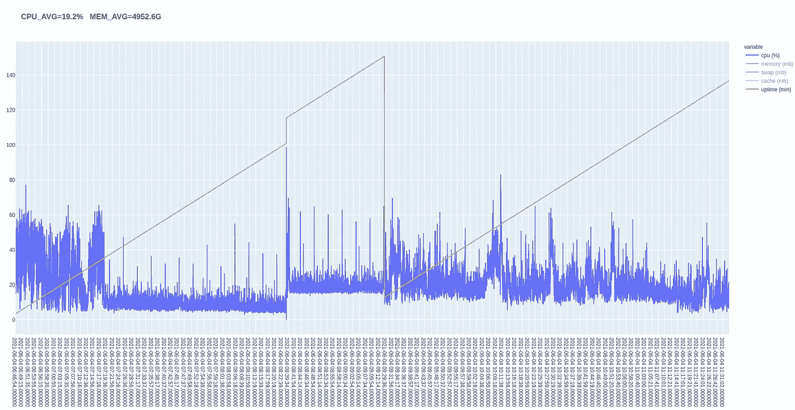

# 在 Linux 中创建自己的系统监控工具

> 原文：<https://medium.com/geekculture/create-your-own-system-monitoring-tool-in-linux-b860e480b151?source=collection_archive---------25----------------------->

市场上有这么多更好的监控工具，为什么还要创建自己的监控工具呢？…为什么不呢？

plotting uptime and cpu using plotly

也许你想做性能测试。也许您正在使用低规格系统，并希望创建自己的监控工具，而不是内置工具，如 htop，以减少分析对被分析数据的影响。也许你只是为了学习而学习。在这篇文章中，我…