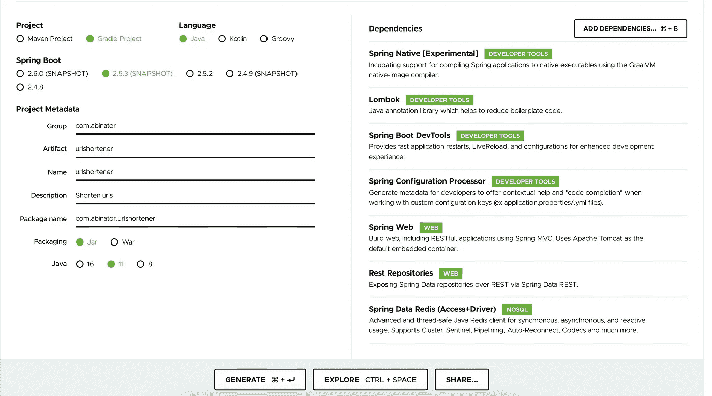
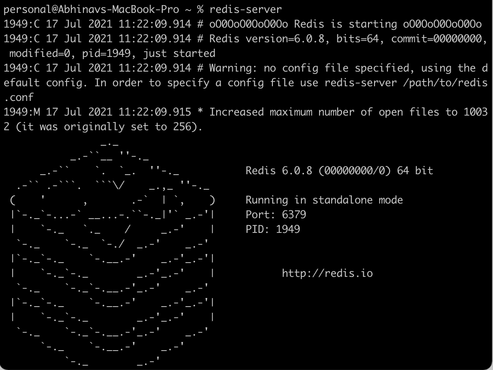
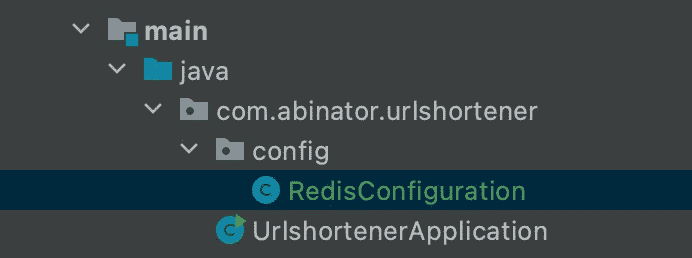
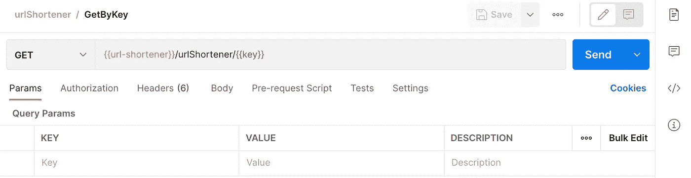

# 用 Spring Boot 和 Redis 创建你自己的网址缩写

> 原文：<https://medium.com/geekculture/create-your-own-url-shorteners-with-spring-boot-redis-289c9000f747?source=collection_archive---------4----------------------->

# Url 缩写

Url shortener 是一种为非常大的链接创建一个短的唯一别名的服务。我们可以将这些缩短的别名称为“短链接”然后用户可以使用这些短链接，当他们点击这些短 URL 时，会被重定向到原始 URL。短链接占用更少的空间，视觉上更美观，更容易发消息/发微博/打印。

例如，假设您必须向用户发送个人通知。你愿意这样发送你的信息吗:

```
Hi Abc,
We welcome you to the biggest sale of the year. Get best offers at [https://www.google.com/search?q=rajnikant&rlz=1C5CHFA_enIN961IN961&sxsrf=ALeKk01CgCbCOvDbH0-6362aa24dzoB4zg:1627480763291&source=lnms&tbm=isch&sa=X&ved=2ahUKEwiD5Zim9oXyAhX-wTgGHTDvDMUQ_AUoAnoECAEQBA&biw=1792&bih=898](https://www.google.com/search?q=rajnikant&rlz=1C5CHFA_enIN961IN961&sxsrf=ALeKk01CgCbCOvDbH0-6362aa24dzoB4zg:1627480763291&source=lnms&tbm=isch&sa=X&ved=2ahUKEwiD5Zim9oXyAhX-wTgGHTDvDMUQ_AUoAnoECAEQBA&biw=1792&bih=898)
```

或者像这样:

```
Hi Abc,
We welcome you to the biggest sale of the year. Get best offers at [https://www.urlshortener.com/](https://www.google.com/search?q=rajnikant&rlz=1C5CHFA_enIN961IN961&sxsrf=ALeKk01CgCbCOvDbH0-6362aa24dzoB4zg:1627480763291&source=lnms&tbm=isch&sa=X&ved=2ahUKEwiD5Zim9oXyAhX-wTgGHTDvDMUQ_AUoAnoECAEQBA&biw=1792&bih=898)v1Wx4b/
```

一些现有的网址缩写是:

*   最佳全能网址缩短工具
*   [更名](https://zapier.com/blog/best-url-shorteners/#rebrandly)用于创建品牌链接
*   [TinyURL](https://zapier.com/blog/best-url-shorteners/#tinyurl) 快速匿名短网址
*   [BL。墨](https://zapier.com/blog/best-url-shorteners/#blink)面向小企业主
*   [Zapier 的 URL shorten er](https://zapier.com/blog/best-url-shorteners/#zapierurlshortener)用于自动创建短链接
*   Instagram 用户的 [Shorby](https://zapier.com/blog/best-url-shorteners/#shorby)
*   [Short.io](https://zapier.com/blog/best-url-shorteners/#Shortio) 为不同的访问者发送不同的链接
*   [Sniply](https://zapier.com/blog/best-url-shorteners/#Sniply) 为您分享的链接添加 CTA

我们将创建一个像这些使用 Spring Boot 网址缩写服务。我们还将利用 cache 提供的内存缓存。这个应用程序可以用来生成一个短 url &也可以使用这个短 url 获取原始 url。Lombok 将用于干净代码& Javax 用于验证。

# 使用 Spring Initializr 引导

[*Spring Initializr*](https://start.spring.io/)*是最流行的自举创建应用的平台。我们可以添加项目细节&依赖项，并点击生成按钮来生成项目。*

**

*Project configuration on Spring Initializr*

# *设置项目*

*要设置您的项目并将其连接到您的远程 repo，您可以遵循以下命令(注意:这些命令适用于 Mac。对于 Linux 和 Windows，可能会有一点不同)。*

```
** brew install git
* mkdir urlshortener
* cd urlshortener
* git init
* git remote add origin [https://github.com/abinator-1308/urlshortener.git](https://github.com/abinator-1308/urlshortener.git)
* git fetch && git checkout main*
```

# *设置 Redis*

*您可以使用 brew install redis 命令安装 redis。安装完成后，可以使用 redis-server 命令启动服务器。*

```
** brew install redis
* redis-server*
```

*服务器将启动。窗口应该看起来像这样*

**

*startting a redis server*

*要检查是否安装了 redis-cli，您可以运行以下命令*

```
** redis-cli --version
6.0.8* redis-cli ping
PONG*
```

*使用以下命令进入交互模式:*

```
*personal@MacBook-Pro ~ % redis-cli
127.0.0.1:6379>*
```

# *配置 Redis*

*我们需要定义配置，以便在 redis 中存储我们的 JSON 对象。每个 url 条目将被定义为:*

```
*{
    "key": 123,
    "url": "www.abc.url"
    "created_at": "2021-08-10T23:59:59Z"
}*
```

*为了在我们的应用程序中定义这些，我们需要在配置包中添加我们的配置。首先将包和文件 RedisConfiguration.java 添加到应用程序中。*

*项目结构现在将如下所示:*

**

*Project structure after Redis config*

*该配置定义为:*

*   *首先通过添加@Configuration 符号将类定义为一个配置。*

```
*@Configuration
public class RedisConfiguration {
}*
```

*   *向入口包添加一个类 Url 来定义模型。这个类看起来有点像*

```
*@Data
@Builder
@JsonNaming(PropertyNamingStrategies.SnakeCaseStrategy.class)
public class Url {

    @NotNull
    private Integer key;

    @NotBlank
    private String url;

    @JsonSerialize(using = LocalDateTimeSerializer.class)
    @JsonDeserialize(using = LocalDateTimeDeserializer.class)
    private LocalDateTime createdAt;
}*
```

**注意:我使用 PropertyNamingStrategies 作为 PropertyNamingStrategy SnakeCaseStrategy 在 Java 16 中被否决**

*   *为 Redis 模板定义 bean*

```
*@Bean
RedisTemplate<String, Url> redisTemplate() {
    final RedisTemplate<String, Url> redisTemplate = new RedisTemplate<>();
    Jackson2JsonRedisSerializer valueSerializer = new Jackson2JsonRedisSerializer(Url.class);
    valueSerializer.setObjectMapper(objectMapper);
    redisTemplate.setConnectionFactory(connectionFactory);
    redisTemplate.setKeySerializer(new StringRedisSerializer());
    redisTemplate.setValueSerializer(valueSerializer);
    return redisTemplate;
}*
```

# *定义功能*

*Url 缩短服务有两个功能:从密钥获取 url 和为给定的 url 生成密钥。我们可以使用 Google 提供的 murmur3 算法来生成密钥。管理器接口和实现看起来像这样:*

```
*UrlManager Interface:public interface UrlManager {
    public String getUrlByKey(@NotBlank String key);
    public Url shortenUrl(@NotBlank String url);
}*
```

*这些方法可以在 UrlManagerImpl 中实现*

```
*public class UrlManagerImpl implements UrlManager {
    @Autowired
    private RedisTemplate<String, Url> redisTemplate;

    @Override
    public String getUrlByKey(@NotBlank String key) {
        Url url = redisTemplate.opsForValue().get(key);
        return url.getUrl();
    }

    @Override
    public Url shortenUrl(@NotBlank String url) {
        // generating murmur3 based hash key as short URL
        String key = Hashing.*murmur3_32*().hashString(url, Charset.*defaultCharset*()).toString();
        return Url.*builder*().key(key).createdAt(LocalDateTime.*now*()).url(url).build();
    }
}*
```

# *添加 Rest 控制器来公开服务*

*RestControllers 是向外部世界公开您的服务所必需的。您可以定义从键中获取 url 的操作&为给定的输入生成一个简短的 URL。控制器看起来有点像:*

```
*@RestController
@RequestMapping(value = "/urlShortener")
public class UrlController {

    @Autowired
    private UrlManager urlManager;

    @RequestMapping(value = "/{url}", method = RequestMethod.*POST*)
    @ResponseBody
    public ResponseEntity shortenUrl(@PathVariable String url) {
        Url shortUrlEntry = urlManager.shortenUrl(url);
        return ResponseEntity.*ok*(url);
    }

    @RequestMapping(value = "/{key}", method = RequestMethod.*GET*)
    @ResponseBody
    public ResponseEntity getUrl(@PathVariable String key) {
        String url = urlManager.getUrlByKey(key);
        return ResponseEntity.*ok*(url);
    }
}*
```

# *邮递员测试案例*

*可以创建 Postman 测试用例来测试套件。该集合由我们通过控制器公开的两个 API 组成。
1。getByKey:这将在我们将键作为输入传递时获取缩短的 url。这是一个 get 请求，其中键在 url 中传递。*

**

*2.urlShortener:这将用于缩短作为输入传递的任何 url。这将是一个 post 请求。*

**

*post request to shorten urls*

# *结果*

*现在你知道了！你的网址缩写后端应用程序已经准备好了。您可以在它的基础上添加更多的功能(url 验证、清除缓存、高级/自定义哈希算法等)。)或者添加一个调用您的服务来缩短 URL 的前端应用程序。*

*注意: **MurmurHash** 在这里作为一种哈希方法使用。在设计问题/面试的情况下，期望你自己建立散列算法。*

# *参考*

*   *https://en.wikipedia.org/wiki/MurmurHash*
*   *OpenHFT:[https://github.com/OpenHFT/Zero-Allocation-Hashing](https://github.com/OpenHFT/Zero-Allocation-Hashing)*
*   *Github 回购:[https://github.com/abinator-1308/urlshortener](https://github.com/abinator-1308/urlshortener)*
*   *https://spring.io/projects/spring-boot*

*恭喜你坚持到最后！在 [*Twitter*](https://twitter.com/bot_pragmatic) ， [Github](https://github.com/abinator-1308/abinator-1308) ， [*Medium*](/@abhinav.as1308) ， [*LinkedIn*](https://www.linkedin.com/in/abinator-1308/) 或 [*Instagram*](https://www.instagram.com/abinator_1308/) 上随意谈论科技或任何很酷的项目。*

*感谢阅读！*