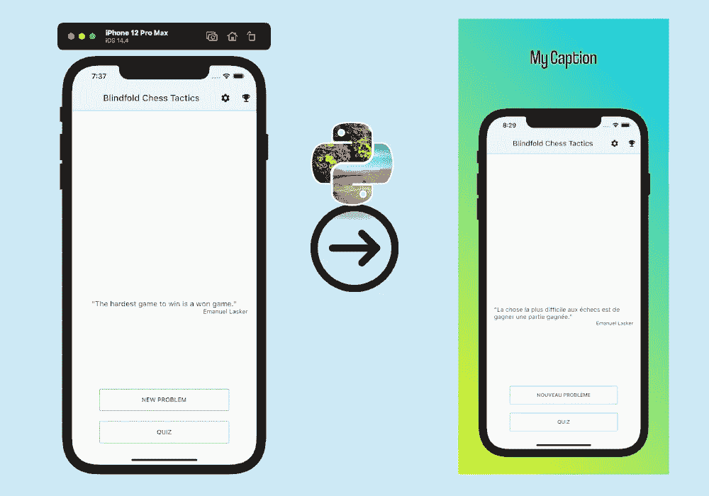
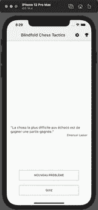
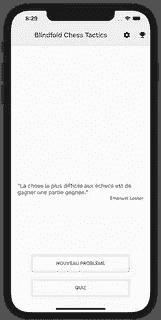
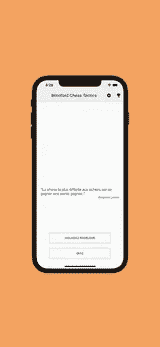
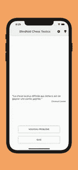
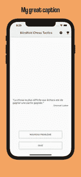
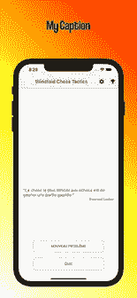

# 用 Python 和 PIL 创建你的商店截图

> 原文：<https://medium.com/geekculture/create-your-screenshots-for-the-stores-with-python-and-pil-c11e0dc8c07d?source=collection_archive---------13----------------------->

我已经为 play store 和 app store 发布了移动应用。但是格式化商店的截图是一项漫长而无聊的任务。你需要裁剪你的截图，添加背景和一些文字来突出你的按键功能。你必须为每个不同的屏幕尺寸重复它。并对您的应用程序支持的所有语言重复此操作。

因此，作为一名懒惰的开发人员，我编写了一个 python 脚本来自动执行这些任务，并生成准备上传到商店的图像。



遵循本文需要的唯一包是`Pillow`或`PIL`。但是我建议不要用`PIL`，因为它没有保养。

在本文的第一部分，我将使用一个 iPhone 模拟器的截图。并且将专注于为 6.5 英寸屏幕设备创建图像，所以我必须创建一个 1284 x 2778 的图像。

你可以在这里找到苹果询问的所有设备尺寸

# 打开并显示您的截图

```
from PIL import Image

# Load your image
screenshot = Image.open(PATH_TO_YOUR_IMAGE)
# Open a window to show it
screenshot.show()# You can get the size of you image with
width, height = screenshot.size
```



The original screenshot

# 裁剪截图

首先，我们将删除模拟器的工具栏

```
# The parameter is a tuple of fours numbers, defining the left, top, right, and bottom pixel coordinates. This box correspond to the image you want to keep
screenshot = screenshot.crop((0, 110, width, height))
```

我使用 110 作为顶部值，从顶部移除 110 个像素。



Screenshot without the toolbar

# 添加背景

让我们创建一个背景，并添加粘贴我们的截图。你也可以加载你自己的图像或者创建一个渐变。

```
store_width = 1284
store_height = 2778
width, height = screenshot.size

# Create an image with the desired size for the store
im = Image.new('RGBA', (store_width, store_height), color=(232, 106, 28))

# Paste the screenshot on the background and center it
im.paste(screenshot, (
    int(store_width/2 - width/2),
    int(store_height/2 - height/2)
), screenshot)
```



The screenshot on our wonderful orange background

下面是制作垂直或水平渐变的代码:[https://stack overflow . com/questions/32530345/pil-generating-vertical-gradient-image](https://stackoverflow.com/questions/32530345/pil-generating-vertical-gradient-image)

下面是一个如何制作对角线渐变的要领:[https://gist . github . com/Wei anglo/1e 754 EC 47 FDD 683 a 42 fdf 6a 272904535](https://gist.github.com/weihanglo/1e754ec47fdd683a42fdf6a272904535)

# 调整图像大小

我们的截图似乎有点小，所以我们会在粘贴到背景之前调整它的大小。

```
def resize(im, ratio):
    w, h = im.size
    w = int(w * ratio)
    h = int(h * ratio)
    im = im.resize((w, h), Image.ANTIALIAS)
    return imscreenshot = resize(screenshot, ratio=1.4)
```



# 添加标题

这个方法创建了一个文本层，并将其添加到我们的商店图像中

你必须给出一个字体文件的路径。

```
def add_text(im, text, font_path, font_size=120, text_color=(0, 0, 0)):
    width, height = im.size

    txt_image = Image.new('RGBA', (width, height), (0, 0, 0, 0))
    font = ImageFont.truetype(font_path, font_size)
    draw = ImageDraw.Draw(txt_image)
    w, h = draw.textsize(text, font=font)

    text_position = ((width-w)/2, 75)
    draw.multiline_text(text_position, text, text_color, font=font, align="center")

    im = Image.composite(im, txt_image, ImageChops.invert(txt_image))

    return imim = add_text(im, "My great caption", font_path=r'font/coolvetica condensed rg.ttf')
```



# 每个截图的结构和循环

我把我的截图组织成这样:

```
- English
    - Android
        - screenshot_1.png
        - screenshot_2.png
        - ...
    - Ipad
        - screenshot_1.png
        - ...
    - Iphone 5.5
        - ...
    - Iphone 6.5
    - ...

- French
    - ...
- Spanish
    - ...
- ...
```

所以我们可以用操作系统包遍历这些文件夹。

我做了两个小函数。`lisdir` 返回给定文件夹的所有文件和文件夹，隐藏的除外(比如 mac。DS_Store)。一个`save_screenshot`方法将保存你的图像，并在需要时创建文件夹。

```
import os

def listdir(path):
    return [f for f in os.listdir(path) if not f.startswith('.')]

def save_screenshot(img, path, file_name):
    # Create folders
    try:
        os.makedirs(path)
    except:
        pass
    # Save image
    img.save(f"{path}/{file_name}")

PATH = r"PATH_TO_YOUR_SCREENSHOTS_FOLDER"languages_folders = listdir(PATH)
# For every langagues
for languages_folder in languages_folders:
    device_folders = listdir(f"{PATH}/{languages_folder}/")

    # For every devices folders
    for device_folder in device_folders:
        # Get list of all the screenshot in the folder
        screens = listdir(f"{PATH}/{languages_folder}/{device_folder}")

        # For every screenshots
        for screen in screens:
            screenshot = Image.open(PATH)

            # Do our transformations on our screenshots
            # You can also do some condition do some conditions,   depending on the screenshot to ajuste size, caption ... # Save the screenshot
            save_screenshot(screenshot, PATH_OUTPUT_FOLDER, file_name=screen)
```

# 截屏格式包

我做了一个[包](https://pypi.org/project/ScreenshotFormat/)来包装我们在这里讨论的不同方法。并添加了一些其他工具和助手，如不同的梯度背景，帮助定位图像，添加文字与光晕，列出所有不同的屏幕截图所需的苹果大小…

它看起来是这样的:

```
from ScreenshotFormat import ScreenshotFormat, StoreSizeName, BackgroundType, PositionPATH_TO_YOUR_IMAGE = ""
PATH_TO_YOUR_FONT = r""
OUTPUT_PATH = r""# Instantiate the helper with our screenshot and the desired size for the store
helper = ScreenshotFormat(screenshot_path=PATH_TO_YOUR_IMAGE, store_size_name=StoreSizeName.iphone_6_5)helper.crop_screenshot(top=110)
helper.resize_screenshot(zoom_ratio=1.3)

# Create an image, it will have the size of on iphone 6.5
background = helper.create_background(type_=BackgroundType.diagonal_gradient_right, color_palette=[
    (255, 0, 0),
    (255, 255, 0),
    (255, 255, 255),
])

# Adding text
text_position = (Position.center, 150)
text = "My Caption"
background = helper.add_text_with_halo(background,
                                       text=text,
                                       position=text_position,
                                       color=(0, 0, 0),
                                       halo_col=(255, 255, 255),
                                       font_path=PATH_TO_YOUR_FONT,
                                       font_size=120)

# Adding screenshot on our background
position = (Position.center, helper.store_height - helper.screenshot_height - 100)
final_image = helper.apply_screenshot_on_background(background, position)

# Save image
ScreenshotFormat.save(img=final_image, path=OUTPUT_PATH, file_name="MyScreenshot.jpg")
```



## 小费

在截图名称的开头添加一个数字，它会自动对它们进行排序，并使上传到商店变得更加容易。

感谢阅读