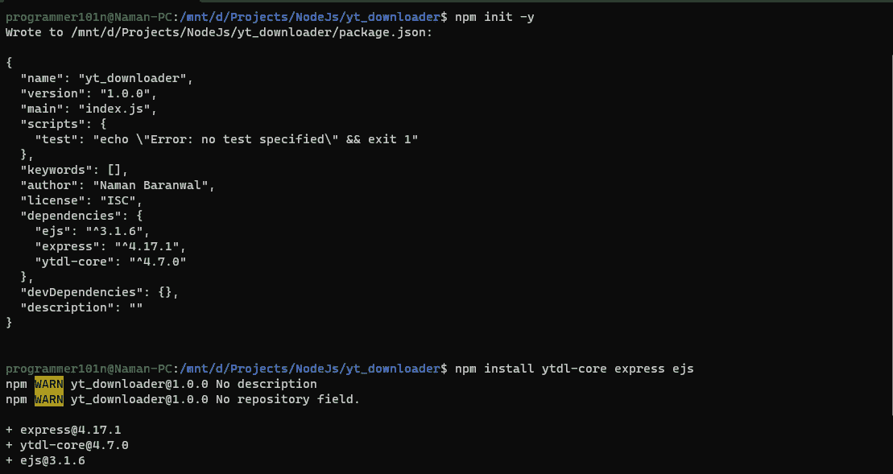
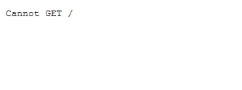
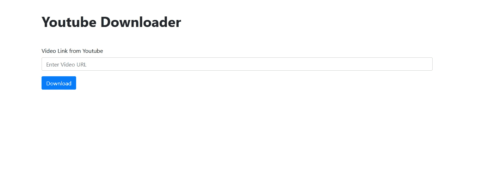
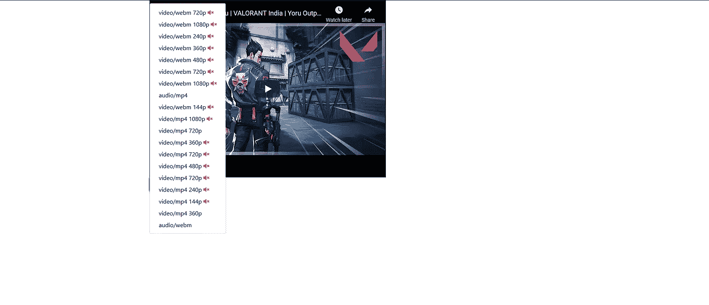

# 用 NodeJS 创建 Youtube 视频下载器

> 原文：<https://medium.com/geekculture/create-youtube-video-downloader-with-nodejs-986a207b943e?source=collection_archive---------2----------------------->


## 本教程我们需要的是

*   诺杰斯和 NPM
*   快速(用于创建 Web 服务器)
*   ytdl-core(获取 youtube 视频信息的 npm 模块)
*   模板引擎

## 设置我们的项目

创建一个名为`yt_downloader`的目录，并用`npm init`初始化该文件夹中的一个节点项目。现在打开 Visual Studio 代码或该文件夹中的任何其他编辑器。用`npm install ytdl-core express ejs`安装所有需要的模块



现在我们有了项目设置，让我们写一些代码。

## 设置我们的服务器

在该文件夹中创建名为`index.js`的文件并编写代码。

```
const express = require("express");
const app = express();
const ytdl = require("ytdl-core");app.set("view engine", "ejs");// OUR ROUTES WILL GO HERE app.listen(3000, () => {
	console.log("Server is running on http://localhost:3000");
});
```

你可以在你的终端输入`nodemon .`来运行这个服务器。



## 用 EJS 创建简单的图形用户界面

创建一个名为`views`的文件夹，在其中创建一个名为`index.ejs`的文件，并通过编写简单的 HTML 创建您的 GUI。

```
<!DOCTYPE html>
<html lang="en">
	<head>
		<meta charset="UTF-8" />
		<meta http-equiv="X-UA-Compatible" content="IE=edge" />
		<meta name="viewport" content="width=device-width, initial-scale=1.0" />
		<title>Youtube Downloader</title>
		<link
			rel="stylesheet"
			href="https://cdn.jsdelivr.net/npm/bootstrap@4.6.0/dist/css/bootstrap.min.css"
			integrity="sha384-B0vP5xmATw1+K9KRQjQERJvTumQW0nPEzvF6L/Z6nronJ3oUOFUFpCjEUQouq2+l"
			crossorigin="anonymous"
		/>
	</head>
	<body>
		<div class="container my-5">
			<h1><strong>Youtube Downloader</strong></h1>
			<form method="GET" action='/download' class="my-5">
				<div class="form-group">
					<label for="videoURL"
						>Video Link from Youtube</label
					>
					<input
						type="text"
						class="form-control"
						placeholder="Enter Video URL"
                        name="url"
					/>
				</div>
				<button type="submit" class="btn btn-primary">Download</button>
			</form>
		</div>
	</body>
</html>
```

这里我们的表单将使用参数`url`到`\download`发出 GET 请求。

我使用了 Bootstrap，但是你也可以使用 css，只要记住你必须提供静态文件。



在您的`index.js`中创建一个新的路由`\`来服务这个 index.ejs

```
app.get("/", (req, res) => {
	return res.render("index");
});
```

## 正在创建`\download`路线。

创建一条将参数`url`传递给`download`视图的路线。

```
app.get('\download' , (req, res) => {
    const v_id = req.query.url.split('v=')[1];
    return res.render('download', {
        url: "https://www.youtube.com/embed/" + v_id,
    });
});
```

在上面的代码中，我正在获取视频 id，并通过自定义嵌入到 url。(Youtube 否认它嵌入了不可信的网站)

在您的`views`目录中创建新文件`download.ejs`。

```
<!DOCTYPE html>
<html lang="en">
	<head>
		<meta charset="UTF-8" />
		<meta http-equiv="X-UA-Compatible" content="IE=edge" />
		<meta name="viewport" content="width=device-width, initial-scale=1.0" />
		<title>Download Options for the link</title>
		<link
			rel="stylesheet"
			href="https://cdn.jsdelivr.net/npm/bootstrap@4.6.0/dist/css/bootstrap.min.css"
			integrity="sha384-B0vP5xmATw1+K9KRQjQERJvTumQW0nPEzvF6L/Z6nronJ3oUOFUFpCjEUQouq2+l"
			crossorigin="anonymous"
		/>
		<link
			rel="stylesheet"
			href="https://cdnjs.cloudflare.com/ajax/libs/font-awesome/5.15.3/css/all.min.css"
			integrity="sha512-iBBXm8fW90+nuLcSKlbmrPcLa0OT92xO1BIsZ+ywDWZCvqsWgccV3gFoRBv0z+8dLJgyAHIhR35VZc2oM/gI1w=="
			crossorigin="anonymous"
		/>
		<script
			src="https://code.jquery.com/jquery-3.2.1.slim.min.js"
			integrity="sha384-KJ3o2DKtIkvYIK3UENzmM7KCkRr/rE9/Qpg6aAZGJwFDMVNA/GpGFF93hXpG5KkN"
			crossorigin="anonymous"
		></script>
		<script
			src="https://cdnjs.cloudflare.com/ajax/libs/popper.js/1.12.9/umd/popper.min.js"
			integrity="sha384-ApNbgh9B+Y1QKtv3Rn7W3mgPxhU9K/ScQsAP7hUibX39j7fakFPskvXusvfa0b4Q"
			crossorigin="anonymous"
		></script>
		<script
			src="https://maxcdn.bootstrapcdn.com/bootstrap/4.0.0/js/bootstrap.min.js"
			integrity="sha384-JZR6Spejh4U02d8jOt6vLEHfe/JQGiRRSQQxSfFWpi1MquVdAyjUar5+76PVCmYl"
			crossorigin="anonymous"
		></script>
	</head>
	<body>
		<div class="container">
			<iframe class="d-flex" width="640" height="480" src="<%= url %>">
			</iframe>
		</div>
		<div class="container">

		</div>
	</body>
</html>
```

现在让我们用路线中的`ytdl-core`模块获取视频信息。因为我们的`ytdl-core`库是异步的，所以我们将创建到异步的路由。我正在按照视频的 mime 类型(如`video/webm`和`video/mp4`)对我的视频格式进行分类。

```
app.get("/download", async (req, res) => {
	const v_id = req.query.url.split('v=')[1];
    const info = await ytdl.getInfo(req.query.url); return res.render("download", {
		url: "https://www.youtube.com/embed/" + v_id,
        info: info.formats.sort((a, b) => {
            return a.mimeType < b.mimeType;
        }),
	});
});
```

现在在我们的`download.ejs`文件中显示带有 EJS 的下载按钮。

```
...
            </iframe>
        </div>
        <div class="container">
			<div class="btn-group">
				<button
					type="button"
					class="btn btn-success dropdown-toggle"
					data-toggle="dropdown"
					aria-haspopup="true"
					aria-expanded="false"
				>
					Download
				</button>
				<div class="dropdown-menu">
					<% info.forEach((format) => { %>
					<a class="dropdown-item" href="<%= format.url %>">
						<%= format.mimeType.split(";")[0] %> <%= format.hasVideo
						? format.height + "p" : "" %> <% if(!format.hasAudio) {
						%>
						<i class="fas fa-volume-mute text-danger"></i>
						<% } %>
					</a>
					<% }); %>
				</div>
			</div>
		</div>
	</body>
</html>
```



现在我们的视频下载器完成了，如果你点击下载按钮，你可以选择下载哪个视频。

你可以从我的 Github 下载这个项目。

[在 Github 上访问这个项目](https://github.com/Programmer101N/create-youtube-video-downloader)

也可以看看我的博客，[这里是链接](https://programmer101n.com)。