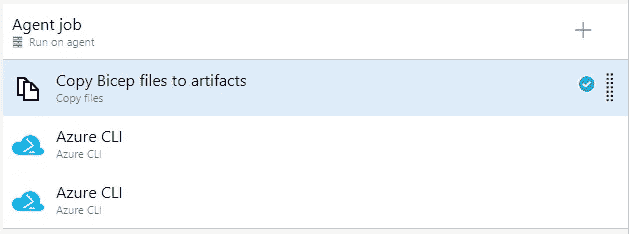
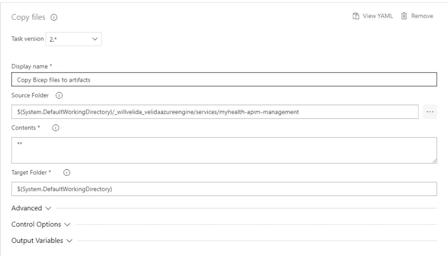
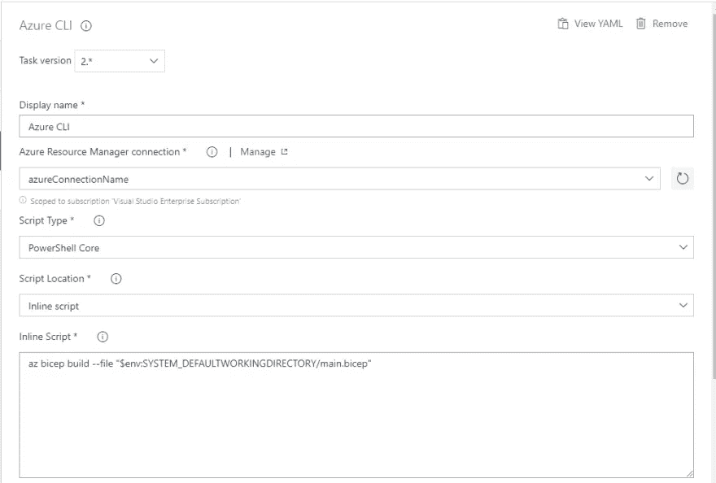
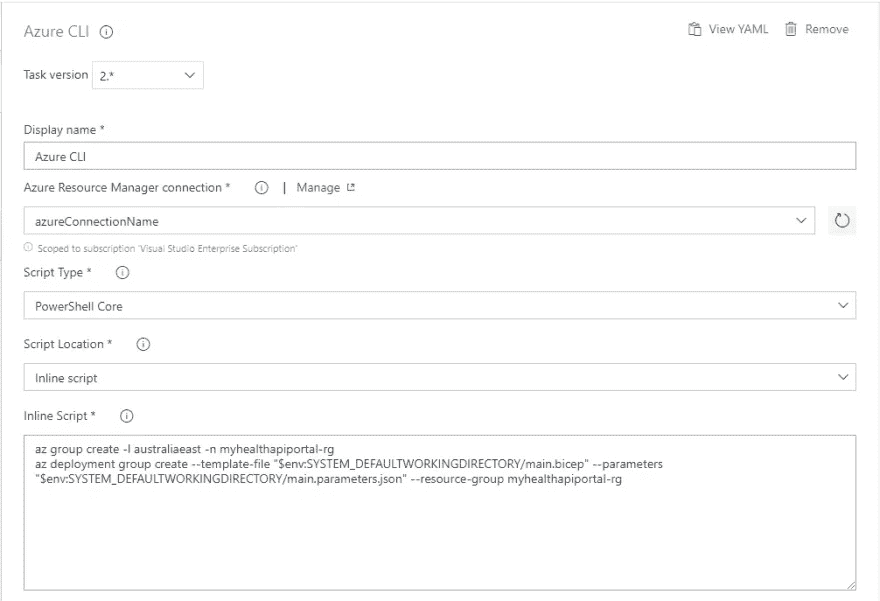
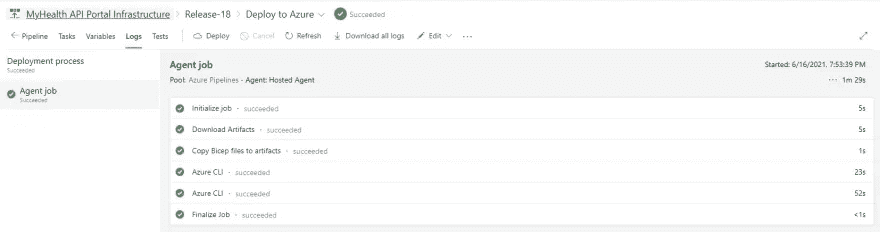
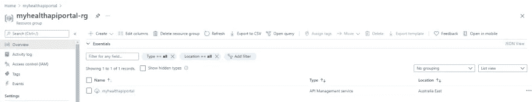

# 通过 Azure DevOps 使用 Bicep Lang 创建 Azure API 管理实例

> 原文：<https://medium.com/geekculture/creating-a-azure-api-management-instance-using-bicep-lang-via-azure-devops-873d05998e01?source=collection_archive---------11----------------------->


# 介绍

我越用二头肌，我就越喜欢它。这就是 ARM 模板应该有的样子。说到 IaC，我一般用 Terraform。这是我上次演出时使用的 IaC 工具，我喜欢它支持多种云。

然而，我最近换了工作，我发现我越来越多地使用 ARM 模板。考虑到这一点，我一直想学习二头肌并在我自己的个人项目中使用它，所以当有一天我必须将 ARM 模板转换为二头肌代码时，我会做好准备😂

回到本文，我正在开发一个个人健康应用程序，它有一堆与我的数据交互的 API(使用 Azure Functions ⚡构建)。理想情况下，我希望将它集成到 Azure API 管理中。我使用 Azure DevOps 部署这些 API，因此为了保持一致，我希望通过 Azure DevOps 使用 IaC 部署 APIM。

我将向您展示我们如何使用 Bicep 代码提供 Azure API 管理实例，然后使用 Azure DevOps 部署它。

在我们开始之前要注意的一件事是，在撰写本文时，Azure DevOps 中还没有官方支持的 Bicep 任务。对于 Terraform 和 ARM 模板，我们可以使用 DevOps 中的任务来部署我们的基础架构。对于本文，我使用了一些 AZ CLI 任务来构建和部署我的 Bicep 模板。

因此，如果你在将来读到这篇文章，我们可以在 DevOps 中使用官方支持的二头肌任务，请记住这一点😊

# 什么是二头肌郎？

Bicep 是一种特定于领域的语言，它使用声明性语法来部署 Azure 资源。当我们编写 ARM 模板时，我们本质上是在编写 JSON 来将资源部署到 Azure。这种方法的语法可能会有点复杂，对于复杂的东西，我们需要编写复杂的表达式才能让它工作。

二头肌长头训练显著降低了复杂性。Bicep 是对 ARM 模板的透明抽象，当我们部署 Bicep 模板时，它附带了一个 CLI，可以将 Bicep 文件转换为 ARM 模板 JSON。

从 v0.3 开始，Bicep 受到微软的支持，并且与 ARM 模板 100%对等，这意味着您可以开始将它用于生产工作负载！

如果你想了解更多关于二头肌的知识，你可以查看这里的文档:

[](https://docs.microsoft.com/en-us/azure/azure-resource-manager/bicep/) [## Bicep 文档

### 了解如何开发 Bicep 文件并使用它们来部署 Azure 资源

docs.microsoft.com](https://docs.microsoft.com/en-us/azure/azure-resource-manager/bicep/) 

# 什么是 API 管理

API 管理(APIM)允许我们为后端服务创建一致的 API 网关。使用 APIM，我们可以发布 API 并让外部和内部开发人员使用。

APIM 由以下几部分组成:

*   **网关**是接受 API 调用并将它们路由到正确后端的端点，验证 API 密钥，强制执行使用配额和速率限制等。
*   **Azure 门户**允许管理我们的 API 程序，定义 API 模式，将 API 打包到产品中，设置策略等。
*   **开发者门户**作为开发者的主要网站，为他们提供 API 文档，允许他们通过交互式控制台试用 API，并创建一个可以用来订阅 API 的帐户。

如果您想更深入地了解 APIM，请查阅相关文档:

[](https://docs.microsoft.com/en-us/azure/api-management/) [## API 管理文档

### 了解如何使用 API 管理安全、大规模地向外部、合作伙伴和员工开发人员发布 API…

docs.microsoft.com](https://docs.microsoft.com/en-us/azure/api-management/) 

# 为 API 管理编写 Bicep 代码

让我们开始编写二头肌代码吧！💪编写 Bicep 代码最好的工具是 Visual Studio 代码。还有一个很棒的扩展可以下载，它将帮助验证你的 Bicep 代码并提供智能感知:[https://github . com/Azure/Bicep/blob/main/docs/installing . MD # install-the-Bicep-vs-code-extension](https://github.com/Azure/bicep/blob/main/docs/installing.md#install-the-bicep-vs-code-extension)

在本教程中，我不会过多关注 APIM 复杂的一面。我只想提供一个简单的配置来开始。

根据我从文件中看到的，看起来我需要以下属性:

*   **名称**(APIM 服务的名称)
*   **Type** (我们将提供的资源类型)
*   **ApiVersion** (我们将使用的 ARM API 的版本)
*   **属性**(我们要配置的 APIM 的属性，主要是发布者邮箱和名称)
*   **位置**(我们将在这里提供我们的 APIM 实例)
*   **SKU** (我们 APIM 实例的 SKU 属性)

你可以在这里看到 APIM 模板的完整参考:

[](https://docs.microsoft.com/en-us/azure/templates/microsoft.apimanagement/2019-01-01/service?tabs=bicep) [## 微软。API management/service 2019-01-01-ARM 模板参考

### 要创建 Microsoft.ApiManagement/service 资源，请将以下 JSON 添加到模板的 resources 部分。

docs.microsoft.com](https://docs.microsoft.com/en-us/azure/templates/microsoft.apimanagement/2019-01-01/service?tabs=bicep) 

记住上述属性，我们可以编写以下二头肌代码:

```
param apimName string
param apimLocation string
param publisherName string
param publisherEmail string

resource myhealthapim 'Microsoft.ApiManagement/service@2019-12-01' = {
  name: apimName
  location: apimLocation
  sku: {
    name: 'Developer'
    capacity: 1
  }
  properties: {
    publisherEmail: publisherEmail
    publisherName: publisherName
  }
}
```

如您所见，我已经为我的 APIM 实例的一些配置值使用了一些参数。我们来讨论一下二头肌中的这些是什么。

# 使用参数

在 Bicep 中，当我们部署 Bicep 模板时，我们可以使用参数向它们提供信息。这使得我们可以重用我们的二头肌模板。

在上面的代码中，我们使用关键字 **param** 声明了我们的参数。这里有一个例子:

```
param parameterName string
```

*   param —向 Bicep 表明我们正在使用一个参数
*   parameterName —我们的参数的名称
*   字符串-指参数的类型

我们可以通过文件提供参数。使用 JSON 创建参数文件。如果我们将资源部署到多个环境，我们可以为每个环境创建一个参数文件，并根据环境提供不同的值。

对于本教程，我已经创建了以下文件。

```
{
    "$schema": "https://schema.management.azure.com/schemas/2019-04-01/deploymentParameters.json#",
    "contentVersion": "1.0.0.0",
    "parameters": {
        "apimName": {
            "value": "myhealthapiportal"
        },
        "apimLocation": {
            "value": "australiaeast"
        },
        "publisherName": {
            "value": "MyHealth API Portal"
        },
        "publisherEmail": {
            "value": "willvelida@hotmail.co.uk"
        }
    }
}
```

如果你想学习如何在二头肌参数，看看这个学习课程:

[](https://docs.microsoft.com/en-us/learn/modules/build-reusable-bicep-templates-parameters/2-understand-parameters) [## 了解参数-学习

### 通过参数，您可以在部署时向 Bicep 模板提供信息。可以做个二头肌模板…

docs.microsoft.com](https://docs.microsoft.com/en-us/learn/modules/build-reusable-bicep-templates-parameters/2-understand-parameters) 

# 为 Azure DevOps 创建服务连接

为了部署我们的 Bicep 模板，我们需要 DevOps 中的一个服务连接，它被授权向 Azure 部署资源。

如果您需要进行设置，请查阅以下文档:

[](https://docs.microsoft.com/en-us/azure/devops/pipelines/library/service-endpoints?view=azure-devops&tabs=yaml#create-a-service-connection) [## Azure 管道中的服务连接- Azure 管道

### 注在 Microsoft Team Foundation Server(TFS)2018 和以前的版本中，生成和发布管道称为…

docs.microsoft.com](https://docs.microsoft.com/en-us/azure/devops/pipelines/library/service-endpoints?view=azure-devops&tabs=yaml#create-a-service-connection) 

# 创建和运行我们的发布渠道

现在我有了我的 Bicep 模板和参数文件，我们可以开始创建我们的发布管道了。

我有点搬起石头砸了自己的脚。我有一个超级 repo，用于我编写的所有 IaC 代码，以将资源部署到 Azure。因此，对于本教程，我将使用经典的发布管道，而不是 YAML。

对于这个版本，我使用了以下任务:



让我们完成每项任务。

对于我们的复制文件任务，我只是将文件从 GitHub 工件复制到构建代理的默认工作目录中。



我们将使用目标目录中的文件来运行 Bicep 命令。

让我们来看看我们的第一个 Azure CLI 任务:



这里，我们正在运行以下 az cli 命令:

```
az bicep build --file "$env:SYSTEM_DEFAULTWORKINGDIRECTORY/main.bicep"
```

在这里，我们正在建立我们的二头肌文件。我们可以这样做来构建由 bicep 文件创建的 ARM 模板，它可以用于运行自动化测试，或者用于将它添加到模板规范中，模板规范可以与我们团队中的其他用户共享。

为了在命令中引用我们的构建文件，我使用我们的系统默认工作目录作为环境。这是我们之前复制文件的文件夹。我们可以访问发布管道中的变量，以便在整个发布管道中传输和交换数据:

[](https://docs.microsoft.com/en-us/azure/devops/pipelines/release/variables?view=azure-devops&tabs=batch#default-variables) [## 经典版本和工件变量——Azure 管道

### 注在 Microsoft Team Foundation Server(TFS)2018 和以前的版本中，生成和发布管道称为…

docs.microsoft.com](https://docs.microsoft.com/en-us/azure/devops/pipelines/release/variables?view=azure-devops&tabs=batch#default-variables) 

现在让我们进入最后一项任务，我们将部署我们的二头肌模板:



在此 AZ CLI 任务中，我们将运行以下命令:

```
az group create -l australiaeast -n myhealthapiportal-rg
az deployment group create --template-file "$env:SYSTEM_DEFAULTWORKINGDIRECTORY/main.bicep" --parameters "$env:SYSTEM_DEFAULTWORKINGDIRECTORY/main.parameters.json" --resource-group myhealthapiportal-rg
```

在我们的第一个命令中，我们在 Azure 中创建了一个名为 myhealthapiportal-rg 的资源组来部署我们的 APIM 实例。

在我们的第二个命令中，我们在订阅范围内创建一个部署，使用 main.bicep 文件作为我们想要部署的模板，使用 main.parameters.json 文件作为我们将用于这个部署的参数。我还对我之前创建的资源组进行了硬编码，我希望将我们的 APIM 资源部署到该资源组。

设置好这些之后，我们现在可以运行我们的发布管道，它应该会将我们的 APIM 实例部署到 Azure



验证我们是否部署到 Azure:



这花了我很多时间，主要是摆弄 AZ CLI 命令，让它们指向我们的文件。

另一件需要注意的事情是，我第一次成功部署了 APIM，但是部署任务花了一个多小时还是失败了，尽管当我进入我的 Azure 门户时部署是成功的。

# 想了解更多？

感谢阅读这篇文章。在撰写本文时，Azure DevOps 中还没有 Bicep 的官方任务，所以我在这里做的事情有点麻烦，但很有效。

如果你想了解更多关于肱二头肌的知识，我推荐你从微软学习网站查看以下资源:

[](https://docs.microsoft.com/en-us/learn/modules/introduction-to-infrastructure-as-code-using-bicep/) [## 使用 Bicep - Learn 介绍作为代码的基础设施

### 描述使用基础设施作为代码、Azure 资源管理器和 Bicep 的好处，以便快速、自信地…

docs.microsoft.com](https://docs.microsoft.com/en-us/learn/modules/introduction-to-infrastructure-as-code-using-bicep/) [](https://docs.microsoft.com/en-us/learn/modules/deploy-azure-resources-by-using-bicep-templates/) [## 建立你的第一个二头肌模板-学习

### 在 Bicep 模板中定义 Azure 资源。提高部署的一致性和可靠性，减少…

docs.microsoft.com](https://docs.microsoft.com/en-us/learn/modules/deploy-azure-resources-by-using-bicep-templates/) [](https://docs.microsoft.com/en-us/learn/modules/build-reusable-bicep-templates-parameters/) [## 使用参数学习建立可重复使用的二头肌模板

### 本模块描述了如何在每次部署期间使用 Bicep 参数为模板提供信息…

docs.microsoft.com](https://docs.microsoft.com/en-us/learn/modules/build-reusable-bicep-templates-parameters/) [](https://docs.microsoft.com/en-us/learn/modules/build-flexible-bicep-templates-conditions-loops/) [## 使用条件和循环构建灵活的二头肌模板-学习

### 了解如何仅在存在特定约束的情况下使用条件来部署资源。还要学习如何使用…

docs.microsoft.com](https://docs.microsoft.com/en-us/learn/modules/build-flexible-bicep-templates-conditions-loops/) [](https://docs.microsoft.com/en-us/learn/modules/child-extension-bicep-templates/) [## 使用 Bicep - Learn 部署子资源和扩展资源

### 这个模块展示了如何在 Bicep 代码中部署各种 Azure 资源。了解孩子和扩展…

docs.microsoft.com](https://docs.microsoft.com/en-us/learn/modules/child-extension-bicep-templates/) [](https://docs.microsoft.com/en-us/learn/modules/deploy-resources-scopes-bicep/) [## 使用 Bicep - Learn 将资源部署到订阅、管理组和租户

### 在订阅、管理组和租户范围部署 Azure 资源。了解这些资源是什么，为什么您…

docs.microsoft.com](https://docs.microsoft.com/en-us/learn/modules/deploy-resources-scopes-bicep/) 

编码快乐！👩‍💻👨‍💻