# 用 NodeJS、ExpressJS 和 MongoDB 为 CRUD 应用程序创建后端(第 1 部分，共 2 部分)

> 原文：<https://medium.com/geekculture/creating-a-backend-for-crud-application-with-nodejs-expressjs-and-mongodb-part-1-of-2-76841923504e?source=collection_archive---------16----------------------->

今天，我们将使用 NodeJS、ExpressJS 和 MongoDB 作为我们的数据库存储系统来制作一个项目管理系统的后端。

我们的后端架构有四个主要部分:

1.  **路由**:快速路由器为不同的请求创建不同的路由(URL)。
2.  **控制器**:根据已经接入的路径返回响应。
3.  **模型**:控制器用来与 MongoDB 交互的数据模板。
4.  MongoDB :我们存储实际数据的数据库。

**我们一起做什么:**

第一部分

1.  设置节点开发环境。
2.  在云中设置 MongoDB。
3.  在 NodeJS 应用程序中设置 MongoDB

第二部分

1.  创建与 MongoDB 通信的模型。
2.  为 GET 请求设置控制器和快速路由器。
3.  创建其余的路线。

**要求:**

1.  [安装 Visual Studio 代码](https://code.visualstudio.com/download)。
2.  [安装免费版的 Postman](https://www.postman.com/downloads/) 。

事不宜迟，让我们编码吧！

**第一部分**

1.  **设置节点开发环境。**

首先，在我们的计算机上安装 NodeJS。

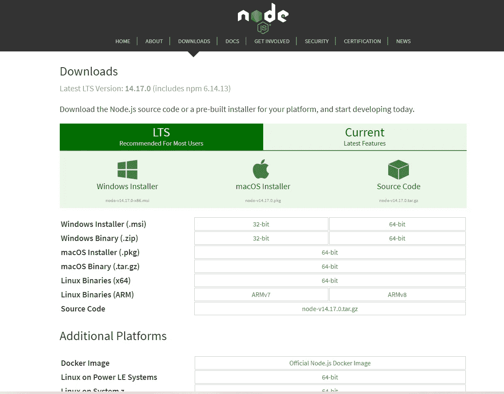

这里的安装环节是

**在首选目录下创建一个文件夹，并将其命名为 **prj-mng-backend** 。然后，在新创建的文件夹中打开 Visual Studio 代码(VS 代码)。**

**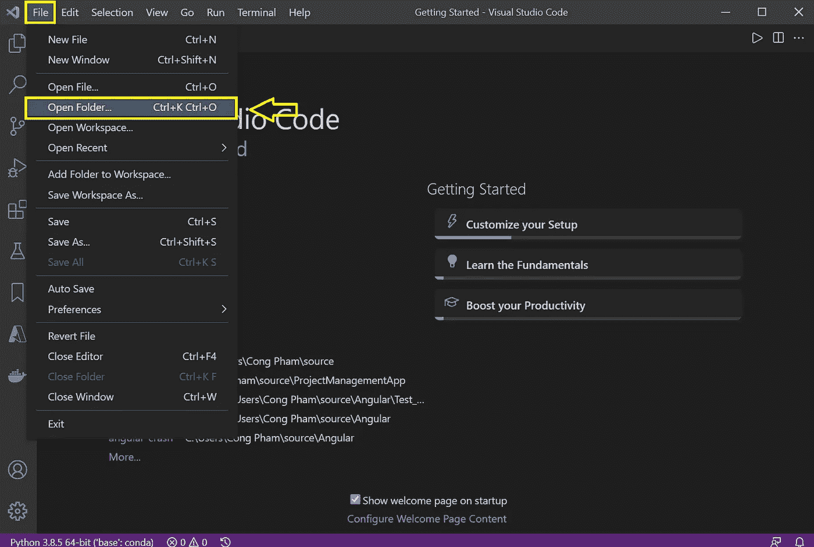**

**在 VS 代码中创建一个新的终端:**

**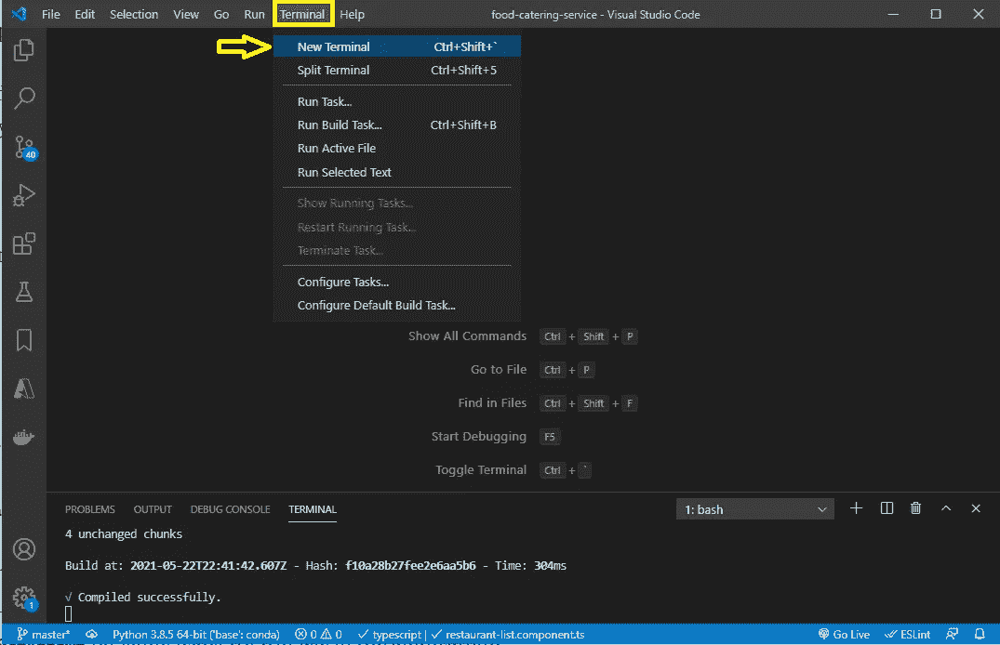**

**我们可以通过在终端内部运行以下命令来检查 NodeJS 是否已经正确安装:**

> **`**node -v**`**

**它向我们展示了我们安装的 NodeJS 的当前版本。**

**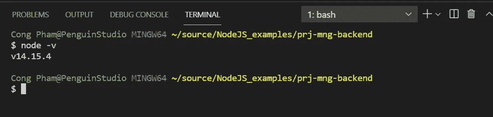**

**然后，继续在终端中运行:**

> **`**npm init**`**

**这个命令是 package.json，它存储了这个项目的所有信息，比如项目名称、作者、许可证等等**

**现在，我们通过运行以下命令来安装开发环境:**

> **`**npm install -D nodemon**`**

**命令运行完成后，我们看到在我们的项目文件夹中创建了 **node_modules** 文件夹和 **package-lock.json** 文件。 **node_modules** 文件夹包含作为模块的函数库，我们可以将其导入到我们的项目中使用。 **package-lock.json** 包含我们安装到项目中的所有记录的依赖信息。**

**创建一个文件名 index.js:**

**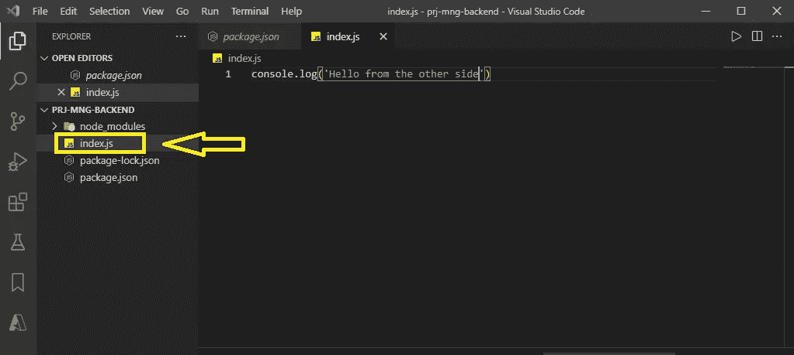**

**并传入以下代码:**

> **`**console.log(‘Hello from the other side’);**`**

**然后，在我们的终端中，运行命令**

> **`**node index.js**`**

**我们看到终端内部打印了以下字样:**

**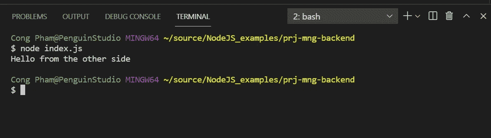**

**2.**在云中设置 MongoDB****

**首先我们需要在这里 注册一个 MongoDB [**的账号。然后，登录并设置您的 MongoDB。**](https://account.mongodb.com/account/login?signedOut=true)**

**选择您的 Javascript 作为您的首选语言。**

**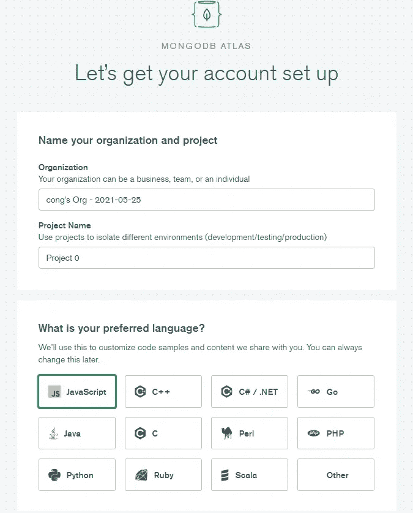**

**然后选择免费共享集群选项:**

**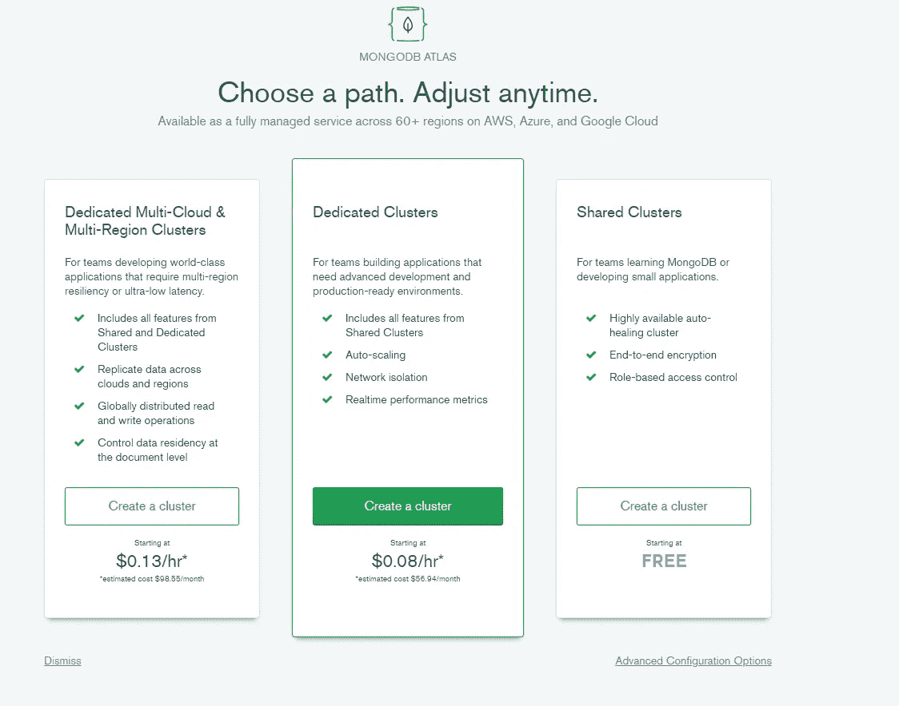**

**选择您的云提供商和地区。然后点击创建集群。创建新集群通常需要 2-3 分钟。**

**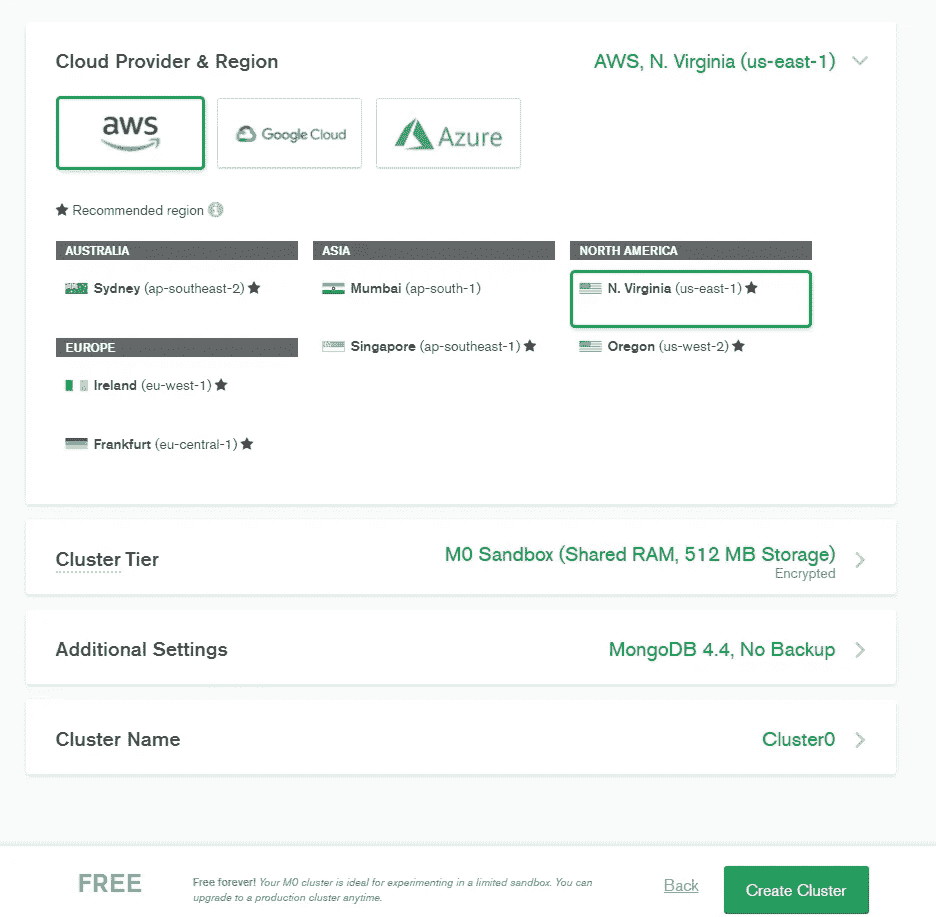**

**创建集群后，单击集群内的集合按钮:**

**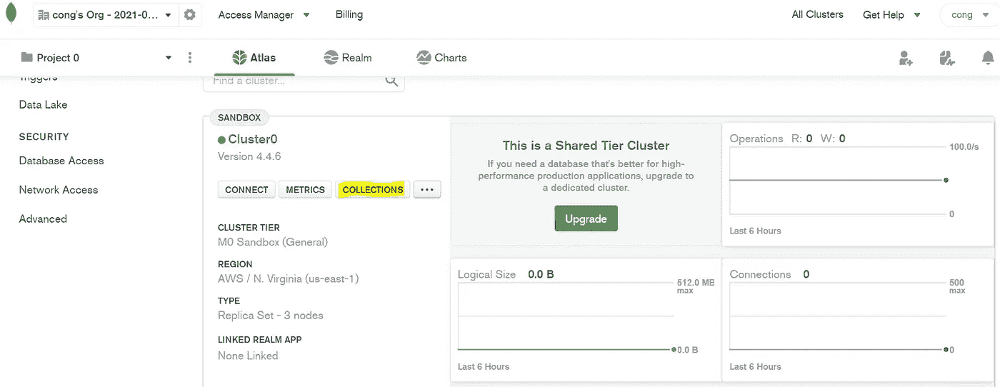**

**然后点击“添加我自己的数据”按钮，填写数据库名称和集合名称，如下图所示:**

**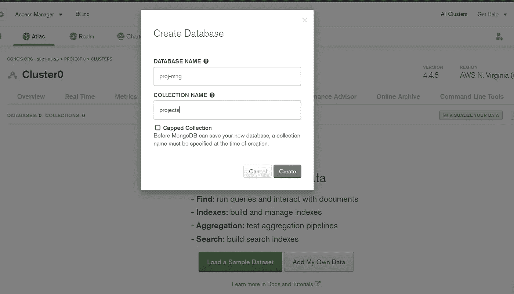**

**之后，查看页面左侧菜单，点击数据库访问添加新用户(选择您自己的用户名和密码):**

**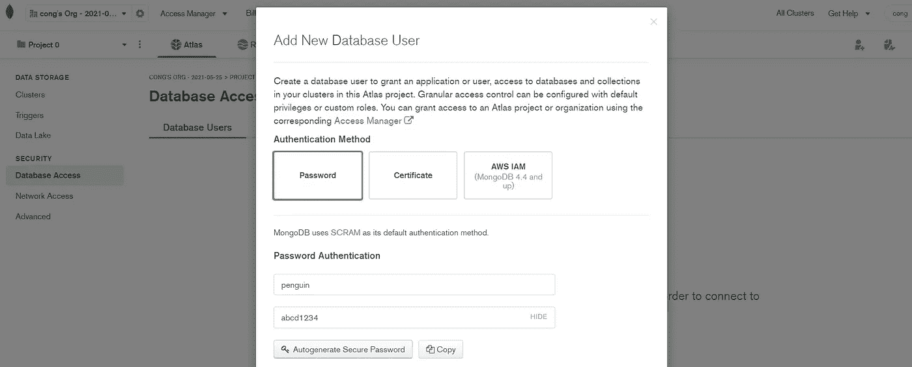**

**回到集群菜单，点击连接按钮，添加一个新的接入连接。当提示时，选择我们自己的 IP 地址，这样，它将只允许我们的位置访问数据库。**

**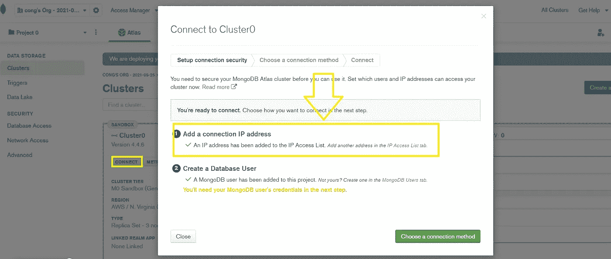**

**然后点击“Choose a connection method”，复制**连接字符串**并将其粘贴到一个文本文件中，以便在我们的 NodeJS 脚本中使用，从而连接到该数据库。**

**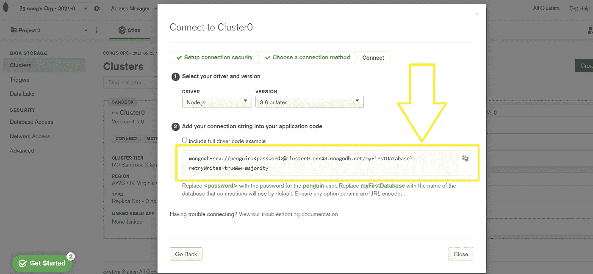**

**3) **在 NodeJS 应用中设置 MongoDB:****

**首先，我们需要将 MongoDB 安装到我们的项目中。在您的终端中运行以下命令:**

> **`**npm install mongoose**`**

**在我们的 **index.js** 文件中，导入 Mongoose 模块:**

**然后，创建一个变量`dbURI`，并给它分配我们之前保存到文本文件中的**连接字符串**。**

**在**连接字符串**中，将`<password>`更改为您创建用户时使用的那个，在我这里是`abcd1234`。另外，将`myFirstDatabase`改为`proj-mng`，这是我们在集群中创建的数据库名称。所以就变成了:**

**然后我们可以使用 mongoose 模块连接到我们的数据库:**

**`mongoose.connect()`是一个异步方法，它返回一个承诺。因此，我们使用`.then`等待它被连接，并在终端中打印出消息`Databse is connected`。如果连接失败，它将打印出`error`。**

**完成上述所有步骤后，您的 index.js 文件应该类似于以下内容:**

**然后在终端中运行 index.js:**

> **`**node index.js**`**

**如果成功连接，您将看到显示的消息:**

**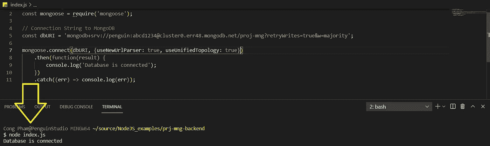**

**恭喜，我们刚刚完成第 1 部分！**

**继续第二部[T2 这里 T4。](https://cong-pham234.medium.com/creating-a-backend-for-crud-application-with-nodejs-expressjs-and-mongodb-part-2-of-2-d997d94dcbd2)**