# 用 NodeJS、ExpressJS 和 MongoDB 为 CRUD 应用程序创建后端(第 2 部分，共 2 部分)

> 原文：<https://medium.com/geekculture/creating-a-backend-for-crud-application-with-nodejs-expressjs-and-mongodb-part-2-of-2-d997d94dcbd2?source=collection_archive---------7----------------------->

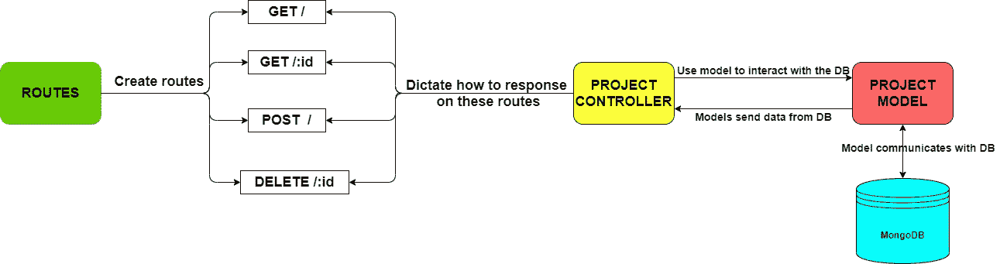

如果你还没有读过第一部分，你可以在这里找到。

在第 2 部分中，我们将介绍:

1.  创建与 MongoDB 通信的模型。
2.  为 GET 请求设置控制器和快速路由器。
3.  创建其余的路线。

**第二部分**

1.  **创建与 MongoDB 通信的模型。**

在项目文件夹中，创建一个名为“models”的文件夹。在该文件夹中创建一个文件 **project.js** :

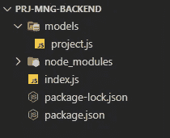

我们将 mongose 库导入到 **project.js** 文件中，并创建 mongose 模式。**数据库模式**是一个抽象的设计，表示数据库中数据的存储。

然后我们继续指定`projectSchema`(这就像一个指定数据类型和是否需要的模板)。

我们的项目模板包含字符串类型的项目名称、项目状态、项目经理和数字类型的项目成本。我们不需要有项目 id，因为 MongoDB 会自动为我们生成项目 id。

在文件的最后，我们将 projectSchema 分配给我们的模型，然后导出它。

2.**为 GET 请求设置 Express 路由器和控制器。**

现在，我们创建另外两个文件夹“控制器”和“路线”。然后，在相应的文件夹中创建 **projectController.js** 和 **projectRoutes.js** 。您的项目目录应该如下所示:

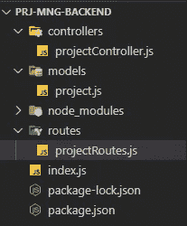

接下来，我们需要安装两个依赖项，Express 和 CORS。在您的终端中运行以下每个命令来安装它们:

> `**npm install express**`
> 
> `**npm install cors**`

**跨来源资源共享** ( [CORS](https://developer.mozilla.org/en-US/docs/Glossary/CORS) )是一种基于 [HTTP](https://developer.mozilla.org/en-US/docs/Glossary/HTTP) 报头的机制，它允许服务器指示除它自己以外的任何其他[来源](https://developer.mozilla.org/en-US/docs/Glossary/Origin) s(域、方案或端口),浏览器应该允许从这些来源加载资源。您可以在 **package.json** 文件中检查您的依赖项安装:

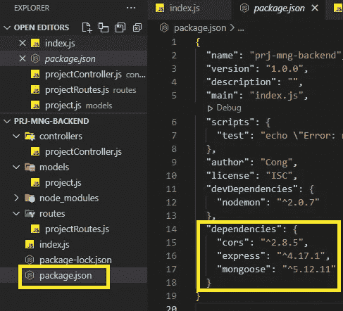

在 index.js 文件中，让我们导入 CORS 和 Express。然后，我们通过调用`express()`创建一个 Express 应用程序，然后将它分配给一个`app`变量。我们还需要定义后端服务 URL 监听的端口:

您的计算机当前未使用的任何端口都可以。我会选择 8080 端口。

接下来，我们创建一个主页路由并在我们的应用程序上使用 CORS 策略，然后将端口分配给我们的应用程序。

我们的整个 index.js 文件目前如下所示:

现在，我们回到我们的终端，再次运行`node index.js`，我们看到“服务器正在端口上运行…”和“数据库已连接”这两个消息被打印出来。

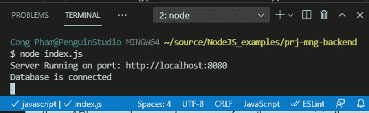

如果我们打开我们最喜欢的网络浏览器，进入“[**http://localhost:8080**](http://localhost:8080/)”，我们会看到这条消息被打印在主页上:

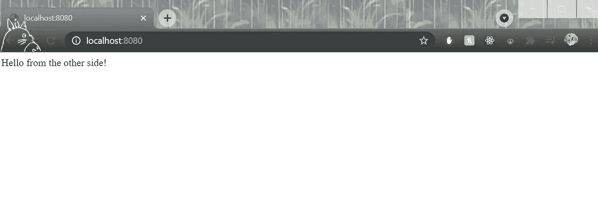

现在我们需要创建 GET 路由和该路由对应的控制器方法。这个 GET 路径显示了存储在 Mongo 数据库中的所有项目数据。

首先，我们需要将我们在 models 文件夹中创建的`Project`模式导入到 **projectController.js** 中，这样我们就可以使用它与数据库进行通信。

然后，我们创建一个方法来响应路由。

`project_get_all`方法返回存储在 mongoDB 中的所有项目列表。该方法使用`Project`模式来`find()`所有项目，然后通过`createdAt`标签以`-1`顺序`sort()`它们(降序/首先新建)。一旦`result`准备就绪，`res`发回状态码`200` (OK)和已经排序的`result`。如果在获取`result`时出现任何错误，则发送回状态代码`400`(错误请求)。

在 **projectRoutes.js** 中，为 Express Router 导入`express`，为我们刚刚创建的方法导入`projectController`以响应获取路由。

然后，我们通过添加以下代码行将项目 route 的“/”页面连接到其对应的控制器方法。之后，我们导出路由器。

在 **index.js 里面我们还需要做一件事**我们需要将项目路线添加到应用程序中。

让我们将刚刚创建的`projectRoutes`和`bodyParser`导入到 **index.js** 的开头:

然后，将其添加到 **index.js** 文件的末尾:

`/projects`是指在`http://localhost:8080`的主页后添加`/projects`即可前往该路线(http://localhost:8080/projects)。

现在，在您的终端中重新运行`node index.js`命令，并转到[http://localhost:8080/projects](http://localhost:8080/projects)，您将看到一个空数组显示，因为我们的数据库中还没有任何数据:

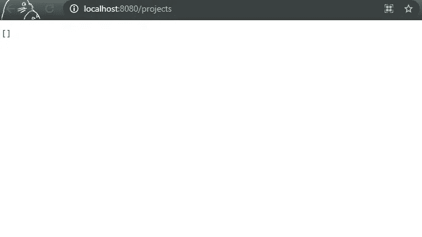

因此，我们回到 MongoDB 云，转到我们最初创建的集群，然后单击`Collection`按钮。在收集选项卡中，寻找`Insert Document`按钮，并在其中添加一些数据。添加数据时，要移动到下一个输入框，可点击键盘上的`Tab`。

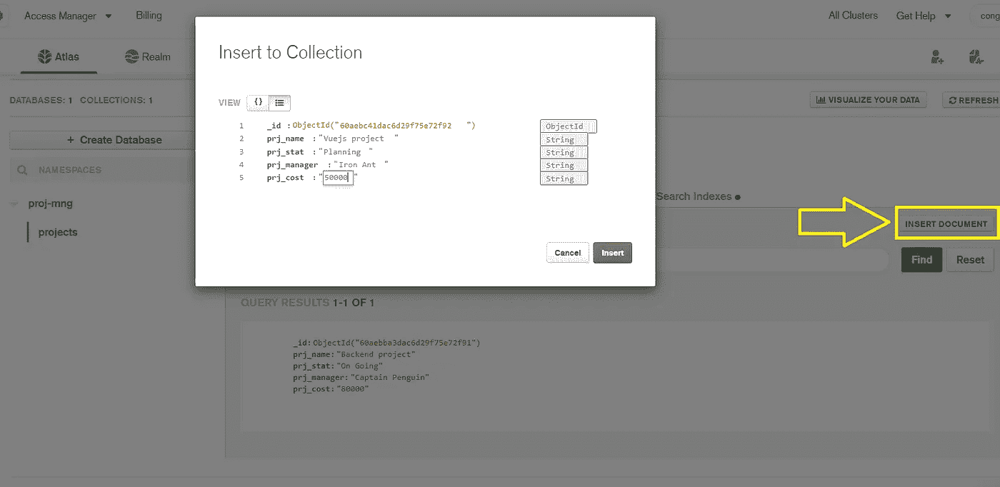

现在，回到[http://localhost:8080/projects](http://localhost:8080/projects)并刷新它。您将看到数据现在显示出来:

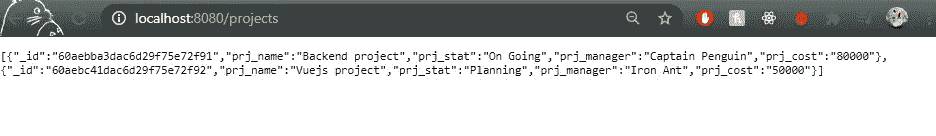

基本上，这是[http://localhost:8080/projects](http://localhost:8080/projects)是一个 URL，您可以从前端发送请求，从后端获取数据。

3.**创建其余路线:**

i) " **GET /:id "路线:**

现在，让我们创建一个路由，您可以通过它的 id 获取特定的项目，它看起来像这样**http://localhost:8080/projects/:id**，其中“:ID”是您想要获取的项目的 ID。

让我们先在 **projectController.js** 中创建一个方法`project_get_byID()`:

`req`是前端发送的输入请求，它应该有一个 id 参数(`req.params.id`)。然后我们使用给定的`id`通过 ID 使用`findById()` mongoDB 方法找到项目。不要忘记在文件末尾导出`project_get_byID()`方法。

之后，在 **projectRoutes.js** 中，我们创建一个 route `\:id`并连接控制器方法。

重新运行`node index.js`命令。

在您的 MongoDB cloud 中，复制您在 MongoDB 中创建的项目的 id，然后转到**http://localhost:8080/projects/:id**，其中`:id`是您复制的项目 id。您将会看到，只有具有匹配 id 的项目会从数据库中检索出来。

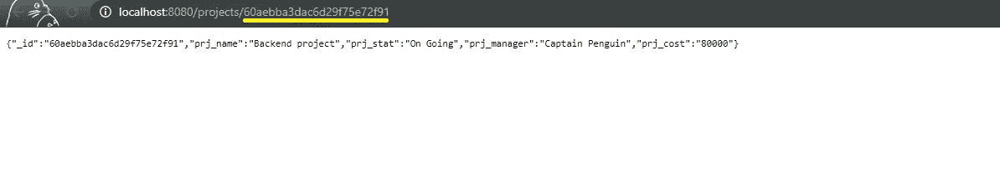

ii)“**POST/”和“DELETE /:id”路线:**

最后，我们添加了`project_create`和`project_delete`方法，这样我们就可以通过 HTTP 请求(前端请求)创建新项目或删除现有项目。

对于`project_create`，我们创建一个`new Project()`模式来与 MongoDB 通信。我们将新的项目数据`req.body`传递给它。然后我们将新创建的项目`save()`到 MongoDB。

对于`project_delete`，我们首先得到需要删除的项目的`id`。然后，我们用匹配的`id`项目`findByIdAndDelete`。

还有别忘了最后导出`project_create`和`project_delete`。

在 **projectRoutes.js** 中，我们将`project_create`方法连接到 POST 路径，而将`project_delete`连接到 DELETE 路径。

然后，我们重新运行`node index.js`。恭喜你！我们已经完成了编码部分，现在让我们测试新的 POST 和 DELETE routes。现在，我们需要一些东西来模拟前端的发送请求功能。

打开[邮差](https://www.postman.com/downloads/)桌面 app，点击`+ New`按钮添加请求。我们将该请求命名为“POST 项目”。在 POST PROJECT request 选项卡中，单击下拉菜单选择 POST 选项，并键入[http://localhost:8080/projects/](http://localhost:8080/projects/)作为 URL 链接。

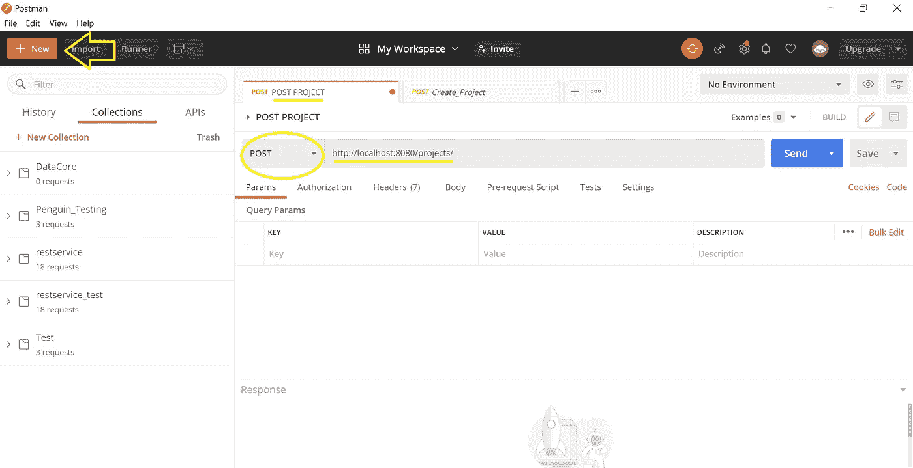

同样在 POST PROJECT 选项卡中，单击`Body`选项卡，然后单击`raw`选项，将新项目数据附加到我们的请求中。点击 JSON 选项，因为我们的数据是 JSON 格式的

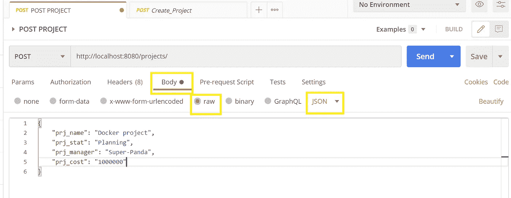

然后将以下数据添加到`Body`:

然后点击蓝色按钮`Send`。转到我们的 MongoDB 云网站，在集合中，我们会看到它已被添加到那里。

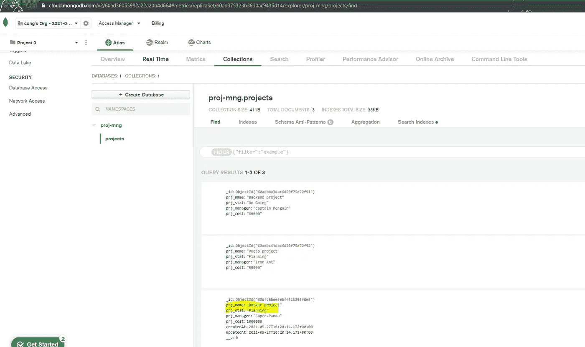

要删除一个现有的项目，我们创建一个新的请求，并将其命名为“删除项目”。我们选择 DELETE 作为请求的选项，并传入[**http://localhost:8080/projects/:id**](http://localhost:8080/projects/:id)**其中`:id`是我们要删除的项目 id。然后点击`Send`。**

**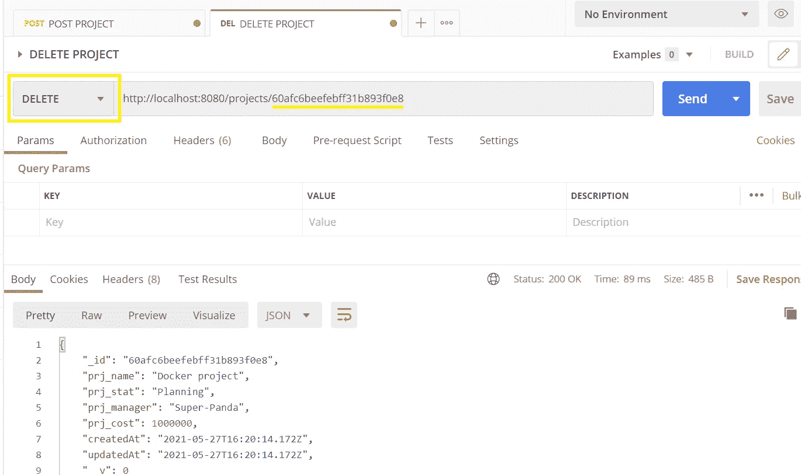**

**我们看到带有给定`id`的项目已经从我们的云数据库中删除了。**

****

**恭喜你！您已经完成了第 2 部分！你应该得到热烈的掌声和放松的散步。**