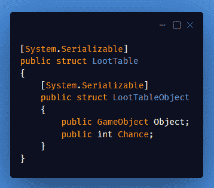
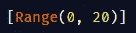
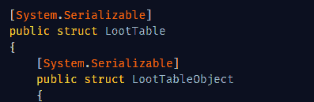
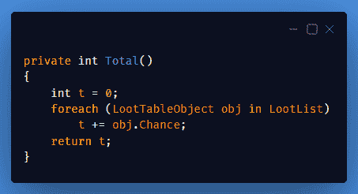
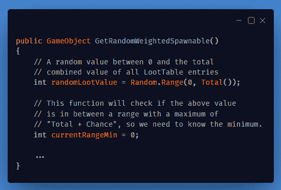
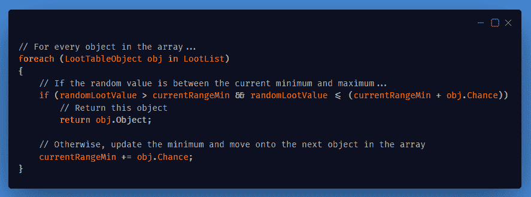
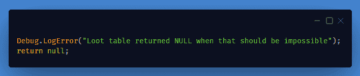
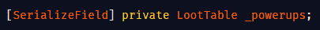
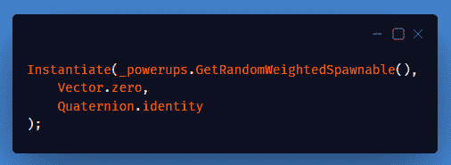
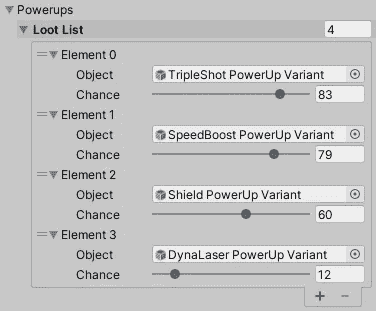

# 创建一个基本的道具表

> 原文：<https://medium.com/geekculture/creating-a-basic-loot-table-for-power-ups-25a9fe2481aa?source=collection_archive---------16----------------------->

与其依赖随机产生的均等机会，不如给产生的机会增加一些权重。

**今天的目标:**创造一个加权的战利品产卵器来代替完全随机的战利品产卵器。

## 我们开始吧！

不仅仅需要一个游戏对象来产卵，现在每次加电都需要一个数值来表示它的产卵机会。

创建一个新的*脚本。把它从“类”改成“结构”，更容易用作变量。在该结构中，创建另一个结构，如下所示:*

**

*Add “[System.Serializable]” to both Structs to make them serialized for Inspector modification*

**

*If you want, add a range attribute with a suitable maximum to “Chance”, to make the Inspector look nicer.*

*在"***【loot table】***"内添加一个"***【loot table object】***类型的数组。*

**

*The **LootList** won’t change in-game, so an Array is better than a List.*

*在"***【loot table】***内部，创建一个函数返回数组中所有产卵机会的总和。*

**

*现在创建一个函数从数组中返回一个随机的 ***游戏对象*** ，基于重生几率权重。*

**

*Two vital variables inside the function*

*为该函数添加一个 ***ForEach*** 循环。*

**

*最后，在函数的末尾加上一个错误日志，万一出了什么问题，**这应该是不可能的**。*

**

*现在，我使用一个名为 SpawnManager 的脚本来管理所有的生成工作。在那个脚本中，我做了一个变量" ***_powerups*** "，类型为"*"。**

****

**Because they are serialized, they structs appear in the Inspector to fill**

**当我想制造能量的时候，我只需要使用" ***_powerups "。getrandomweightedsbownable()***”。**

****

**Spawn a power-up based on all weights**

****

**Make sure to fill the array in the Inspector, and that at least one Chance is above zero.**