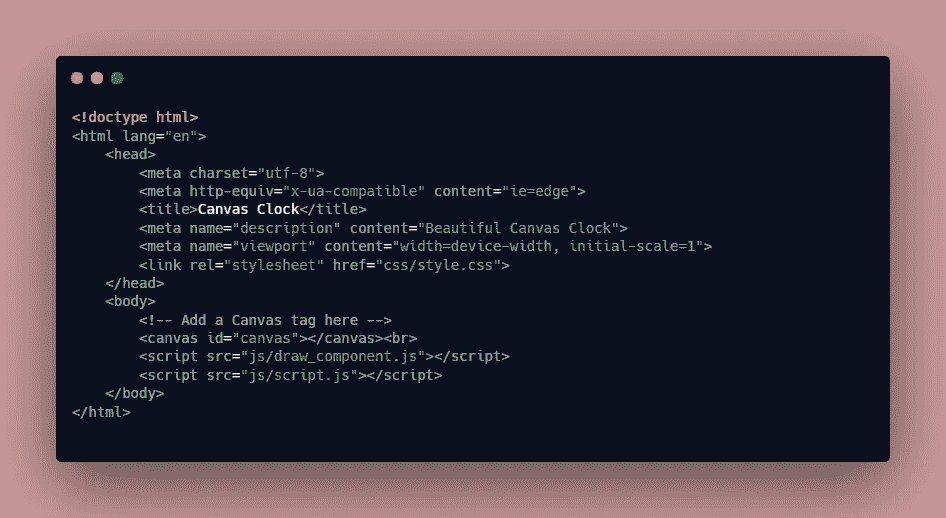
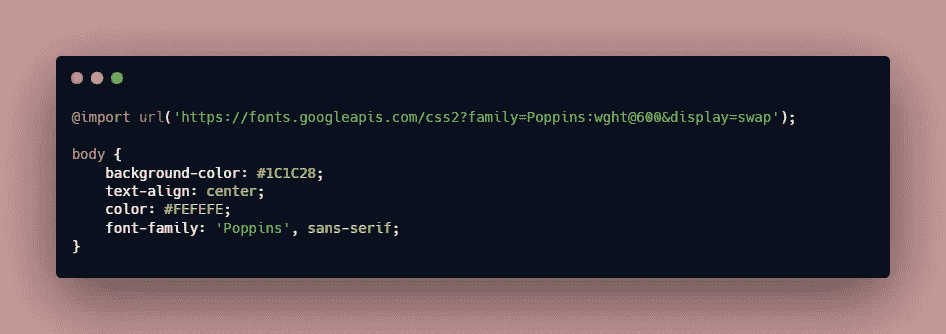
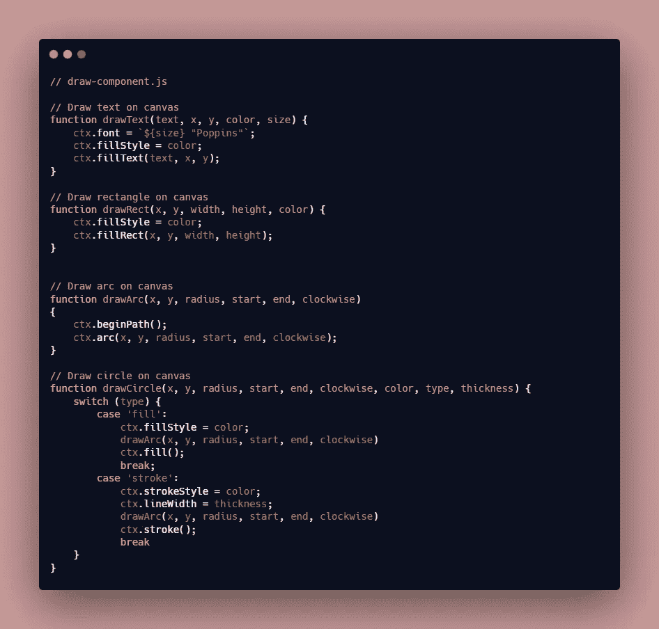
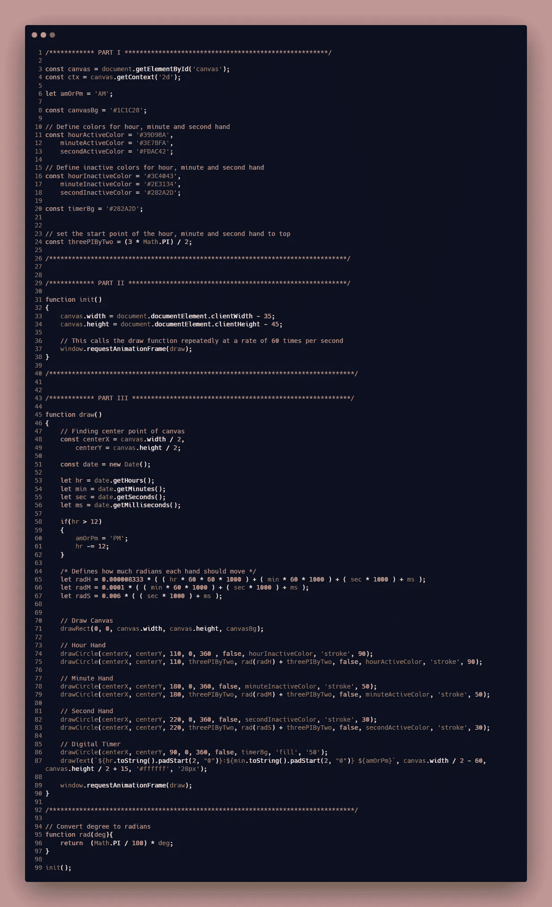
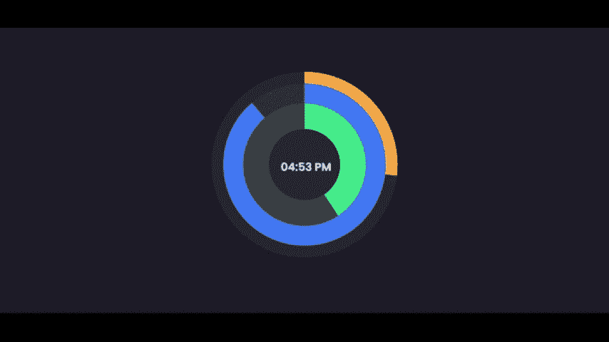

# 使用 HTML5 画布创建一个漂亮的时钟

> 原文：<https://medium.com/geekculture/creating-a-beautiful-clock-using-html5-canvas-a67acefb3255?source=collection_archive---------22----------------------->

## 重温我 4 年前创作的时钟

HTML5 为我们提供了 [Canvas API](https://developer.mozilla.org/en-US/docs/Web/API/Canvas_API) ，它可以用来使用 Javascript 在浏览器上绘制图形。我们可以通过在 HTML 中添加一个**画布**标签来开始在浏览器中绘制图形。它类似于我们用来绘画的真正的[画布](https://en.wikipedia.org/wiki/Canvas)。我们可以绘制各种形状和文本，并用 Javascript 制作动画。

在本文中，我们将使用 HTML5 Canvas 和 Javascript 创建一个漂亮的时钟。

# 添加 HTML 布局

首先，我们将从添加一个带有 **canvas** 标签的 HTML 文件开始

index.html

# 添加 CSS 样式

接下来，我们将添加一个 CSS 文件，该文件包含了 **body** 标签的一些基本样式。

style.css

# 添加 Javascript —逻辑

时钟包含文本和不同的形状，如矩形，弧形等。我们将添加代码来创建这些基本的形状。

draw_component.js

在上面的文件中，我们添加了创建矩形、圆形和文本的逻辑。

接下来，我们将添加基于当前时间呈现时钟的代码。为此，我们需要添加一些逻辑来决定时针、分针和秒针的当前位置。

script.js

我们的脚本包含 3 个部分。

**第一部分** -第 1 至 26 行
**第二部分** -第 29 至 40 行
**第三部分** -第 45 至 92 行

## 第一部分

在这里，我们查询 canvas 元素并初始化一个 2D 上下文，因为我们将在一个 2D 平面上工作。我们还定义了几个变量来保存时针、分针和秒针的颜色。

## 第二部分

这里我们有一个 **init** 方法，它将在执行脚本时被调用。在 **init** 方法中，我们定义了画布的**宽度**和**高度**。此外，我们调用了方法**window . request animation frame**，并将 **draw** 方法(第 45 行)作为参数。window.requestAnimationFrame 每秒执行方法 **60 次**，从而使其成为动画。

## 第三部分

这里我们添加了核心逻辑，它根据当前时间计算时针、分针和秒针的当前位置。由于 **requesAnimationFrame** 方法被重复调用，画布根据时间用指针的新位置重新绘制。

最后，这个钟看起来棒极了。

Preview

**预告**-【https://codepen.io/ganeshkumarm/full/MobJdo】
**源代码**-[https://github.com/ganeshkumarm1/CanvasClock](https://github.com/ganeshkumarm1/CanvasClock)

# 谢谢你🤘

想了解我更多，请访问[**ganeshkumarm . me**](https://www.ganeshkumarm.me/)

