# 创造一个老板的敌人——第四部分，卫生系统

> 原文：<https://medium.com/geekculture/creating-a-boss-enemy-part-4-health-system-61a16c16a58f?source=collection_archive---------43----------------------->

我们的 **Boss** 现在已经具备了让它成为一个强大对手的所有必要条件，但截至目前，它还是**无敌**！

在这篇文章中，我们将为我们的老板创建一个**健康系统**，以及一个当你击败它时触发的独特爆炸！

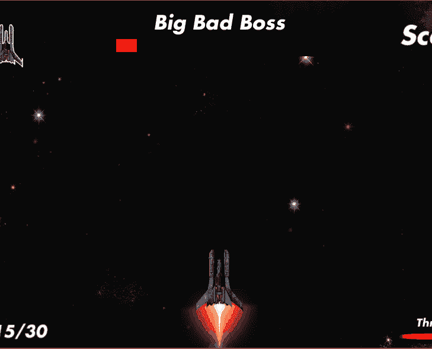

Disregard the “Wave 1”, haha.

# Boss 健康吧 UI

创建 **Boss 健康条**与我们创建**玩家推进器 UI** 元素非常相似。你可以在这里阅读:[https://frankgwarman . medium . com/small-speed-boost-with-player-boosters-EC 0 FD 3a 67 b 0a](https://frankgwarman.medium.com/small-speed-boost-with-player-thrusters-ec0fd3a67b0a)

首先，我们将在**画布**中创建所需的 **UI 元素**；一个**边框**，一个**填充**，还有**文本**告诉玩家**生命条**是谁的:

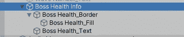

我将这些元素嵌套到一个父对象中，以便将来启用/禁用它们更加容易！

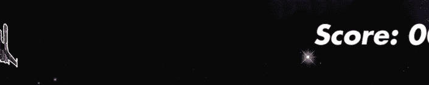

现在我们可以跳转到我们的 **UIManager 脚本**中，该脚本附加到我们的**画布 UI** 中。我们需要让**引用**两个变量；一个用于 **Boss 填充**以更新实际的**健康条**，另一个用于**启用/禁用**整个 **Boss 健康信息**:

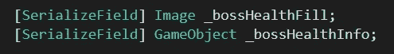

并在**的两个新函数**中利用这些变量:

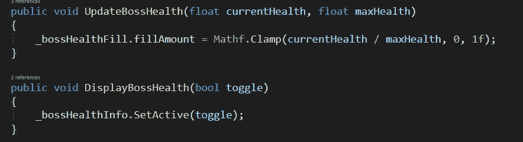

# Boss 剧本里的 Boss 健康

让我们跳回我们的**敌人 Boss 脚本**来完成我们的**健康栏逻辑**。

首先，我们将获得对我们的 **UIManager** 的引用，并在 **Start():** 处初始化

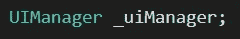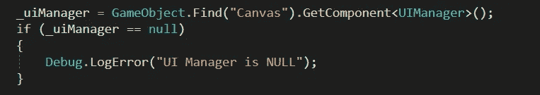

现在我们可以为 **Boss Health** 创建我们的**全局变量**:

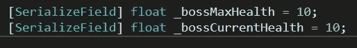

接下来，我们将创建一个函数，当 Boss 将生成时调用，该函数将**启用**Boss 健康信息 UI 对象，并将 **Boss 健康设置为完全**:

然后我们可以创建我们的**on trigger inter 2d 逻辑**。每次老板受到伤害，我们就会**减少**他们的生命值**更新**UI:

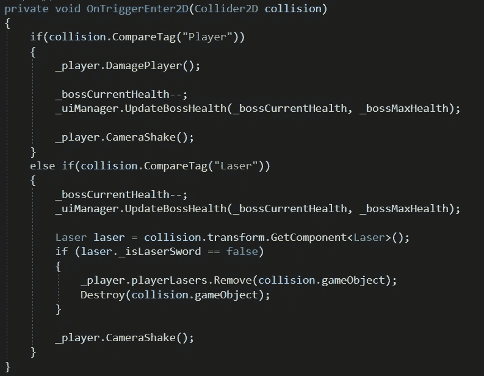

For information on the Camera Shake effect (**_player.CameraShake()** ), see this article: [https://frankgwarman.medium.com/camera-shake-when-damaged-bebd8d149df8](https://frankgwarman.medium.com/camera-shake-when-damaged-bebd8d149df8)

最后，我们将创建一个函数，**检查**是否**老板健康**处于**零点**。这将在 **Update()** 中被调用，如果被调用将导致**爆炸序列**，**禁用**Boss 健康信息 UI**元素，并启动进程开始下一波敌人。**

*   如果你喜欢的话，你也可以在杀死老板后结束游戏

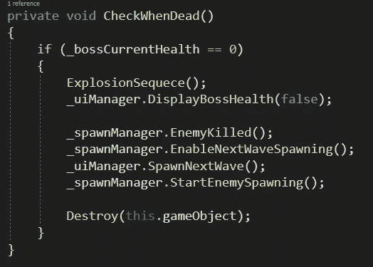

# 爆炸顺序

对于 Boss 被摧毁时的爆炸序列，我**重用了**之前我们为**小行星**创建的**爆炸 VFX** 。我还**实例化了那些爆炸的 3 个**，改变了每个爆炸的**颜色、比例和位置**来给爆炸一些深度**！**

**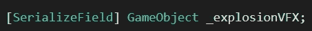**

**Make sure to get a reference to link in the Inspector**

**然后是**爆炸序列():****

**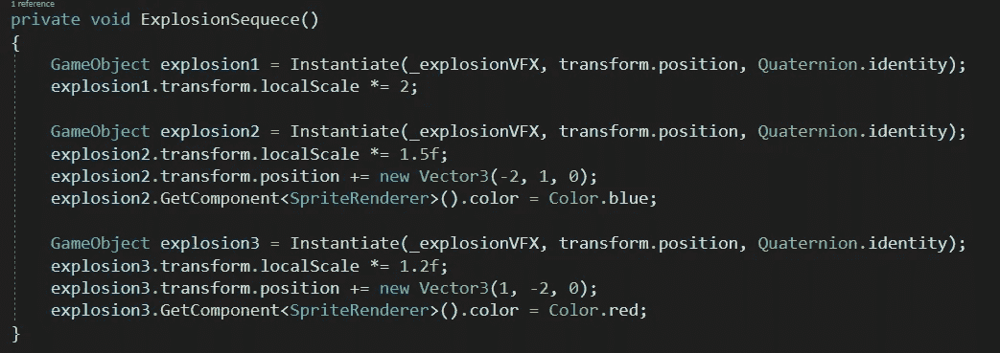**

**See top GIF for example!**

# **什么时候产生老板**

**这完全取决于你什么时候想在 Boss 里产卵。你可以每 5 波做一次，只做一次，然后继续玩(像我一样)，或者作为“赢得”游戏前的最后一波。**

**处理你的 **Boss 产卵**将在**产卵管理器脚本**中完成:**

**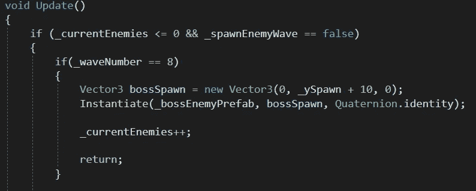**

**Don’t forget to create a reference to the Boss prefab and link in the Inspector**

**对于我来说，我武断地选择了在第 7 波之后产卵 Boss。在测试我的游戏后，这看起来像是一个玩家没有预料到老板会出现的疲惫程度。我喜欢**自然**精髓。**

**而现在，老板完蛋了！在你的游戏中加入一个“Boss 敌人”是一个很好的方法，可以让你的游戏更加难忘，并且增加难度。**

**随着我们的游戏基本完成，最后一步是建立游戏，并向世界展示它！在本系列的下一篇，也是最后一篇文章中，我们将介绍这些基础知识，以及在哪里托管您的游戏！**