# 创建一个有反应和不和谐的接触形式。

> 原文：<https://medium.com/geekculture/creating-a-contact-form-with-react-and-discord-9f1230472c66?source=collection_archive---------11----------------------->

今天，不和谐是一种工具，它让我们成为无数社区的一部分，并为我们提供了可以充分利用的工具。

***不和谐*** 的 ***WebHook*** ，允许我们从外部发展向我们的不和谐渠道发送信息。在这个例子中，我们将为我们的网站创建一个联系表单，这个表单我们将使用 ReactJS 来完成，react js 负责将联系信息发送到我们的 Discord 服务器上的一个频道。

# 1.-配置不一致的“服务器和通道”

我会避免我们已经有一个不和谐的帐户，在此基础上，我们继续创建我们的服务器和我们的渠道，我们将在那里接收从我们的联系方式发送的消息。

## 命名服务器不协调“ACME”

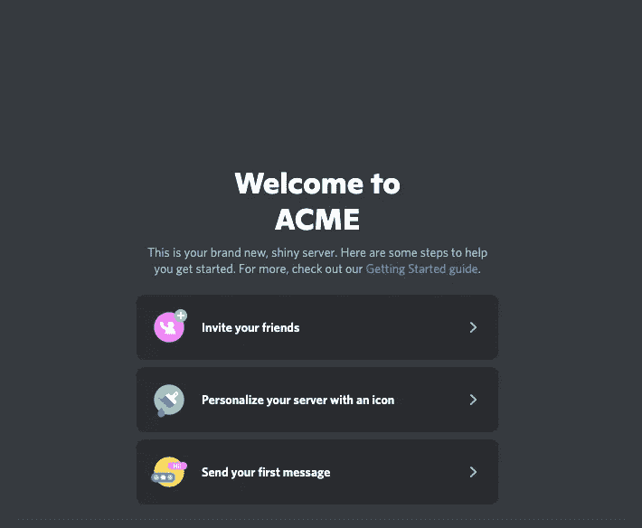

## 创建私人文本通道“联系人”

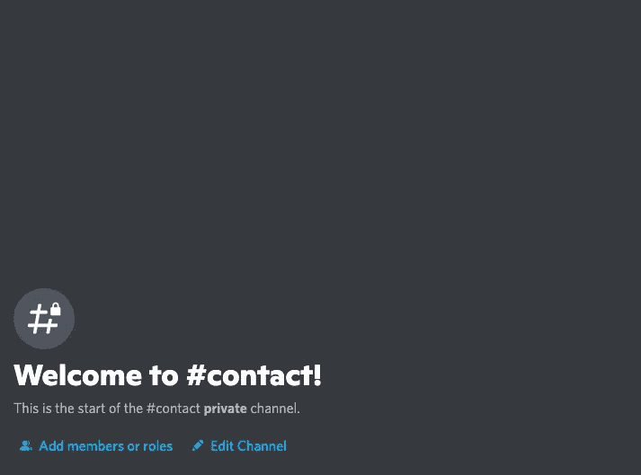

# 2.- WEBHOOK

是时候创建我们的 Webhook 了，它将负责接收和发送信息到我们未来客户的“联系”渠道。

在我们不和谐的联系渠道内，我们点击编辑选项。

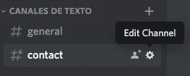

它将打开一个屏幕，显示有关我们频道的信息。

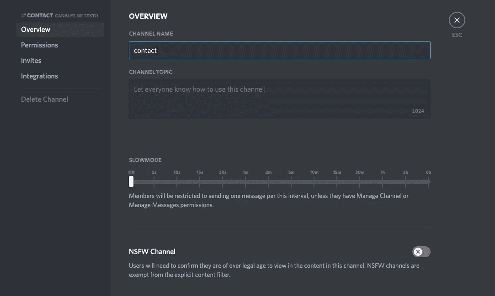

到目前为止一切顺利，是时候创建我们的 webhook 了，因为我们要选择集成。

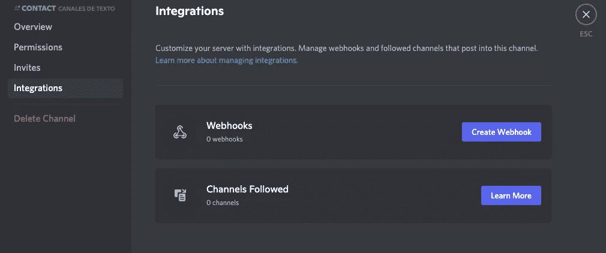

我们点击创建 webhook，我们将为它分配一个名称，我们可以在它上面放置一个头像，这是可选的，现在我们保存更改，稍后我们将通过我们的 webhook 的 URL 返回。

# 3.-创建我们的 REACT 应用

我们用我们网站的名字创建了一个新的 React 项目。

***“npx 创建-反应-app 极致”***

创建过程完成后，我们将执行以下命令。

***【CD 极致】***

准备好了，现在让我们用下面的命令开始我们的项目。

***“纱线开始或 npm 开始”***

到目前为止，我们有我们的网站项目工作。

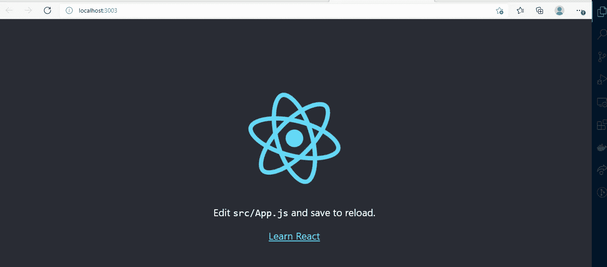

# 4.-创建我们的联系方式。

我们清理了项目中不需要的东西，我们的项目应该保留如下结构，浏览器应该显示如下图。

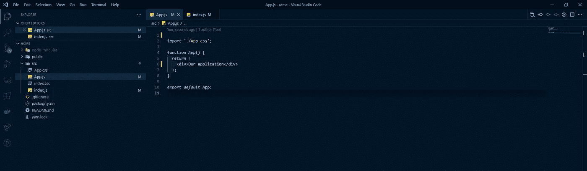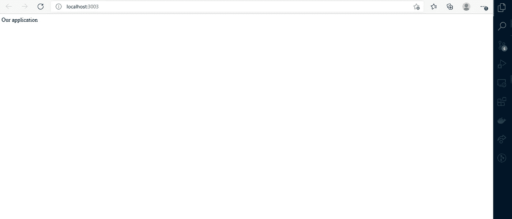

Browser

现在，在我们项目的“src”文件夹中，我们创建一个名为“pages”的新文件夹

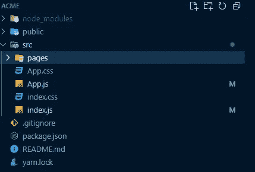

在该文件夹中，我们将创建一个名为“Contact.js”的文件，这是我们创建联系人表单的地方。现在我们将页面导入到 app.js 文件中，开始查看表单的结果。

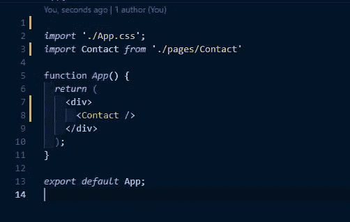

我们将以这种方式看待我们的项目。

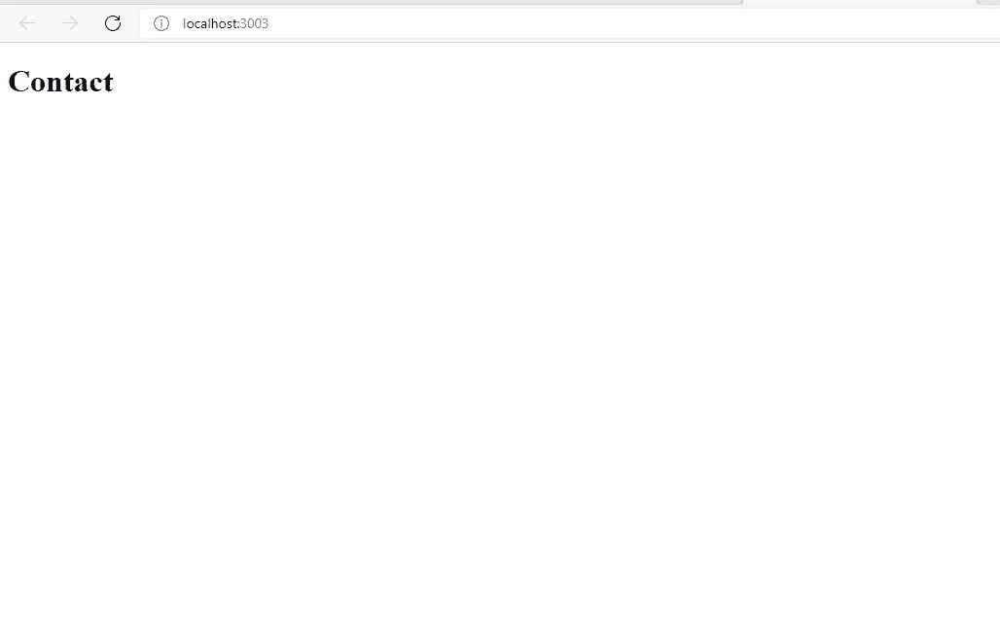

酷！；是时候为我们的表单编写代码了。

***注:该项目将使用顺风和 styled-components 和第一件事是安装它们。***

我们将安装 ***顺风和样式组件*** ，这是为了处理我们的样式，如果你还不知道如何安装顺风，我会留下如何安装的参考。[安装尾翼](【https://tailwindcss.com/docs/guides/create-react-app】T4)

现在我们的文件 contact.js 应该如下所示，我们在这里添加了 HTML 结构和描述、电话和联系人姓名字段。以同样的方式，我们将为表单的操作、验证数据和处理样式添加必要的状态。

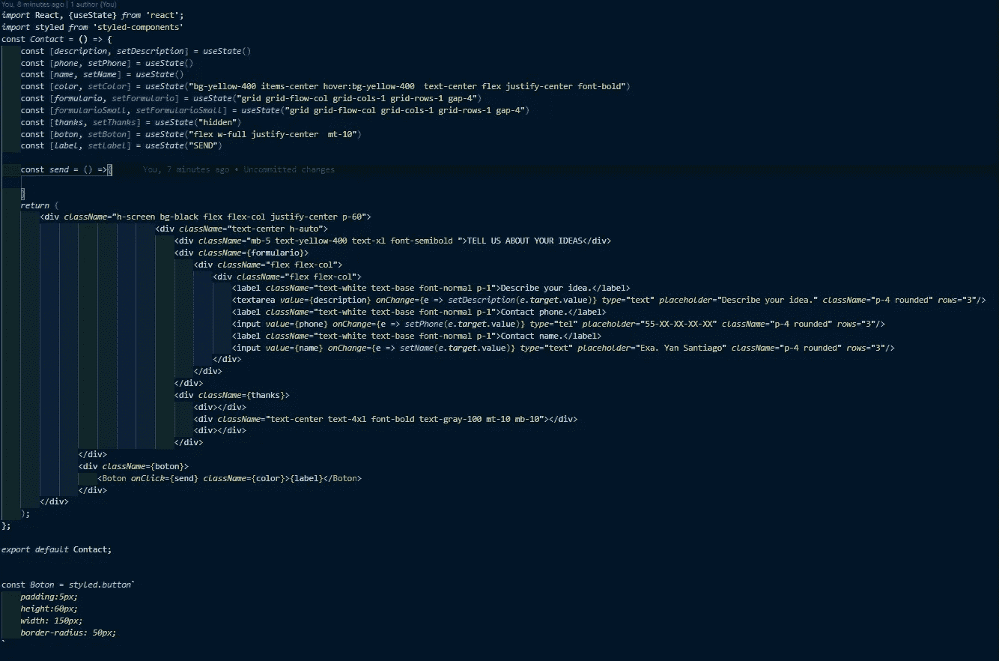

我们的表单应该如下所示。

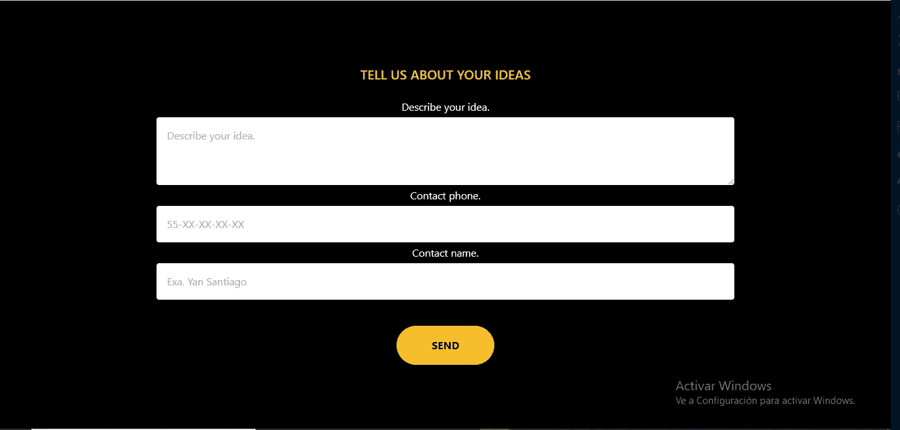

准备好了。这样，我们就可以将我们的信息从表单发送到 Discord，现在我们将把我们的端点添加到我们将开始发送我们未来客户端的捕获数据的地方，为此，在我们的 ***send*** 函数中，我们添加了以下代码。

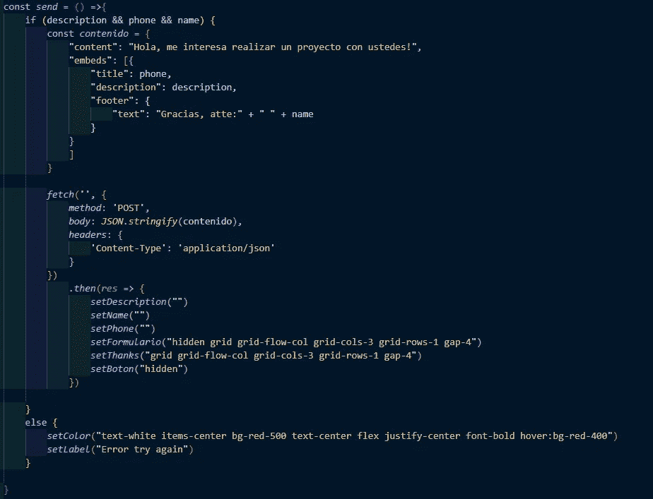

除了进行必要的验证之外，这个代码将允许我们与我们的 Discord 通道进行通信。到目前为止还不错，但是，我们需要与我们的 Webhook 通信的基本要素，它是我们的 webhook 的 URL，如果我们记得在前面一点中我们提到过我们将通过 URL 返回，因为实际上它是我们需要的 URL，让我们浏览一下。
在我们的 discord 客户端中，我们点击复制我们的 webhook 的 URL，如下图所示。

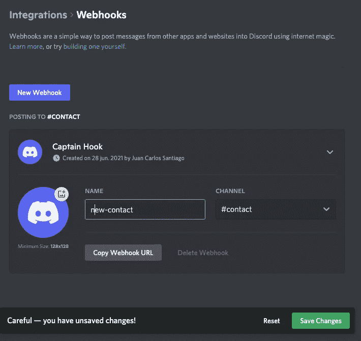

我们将看到如下所示的 URL:

[***https://discordapp . com/API/web hooks/8591454976574755082/isvuhnfpxe 0-_ i1sarqyn 3 mmb 0 S2 wlq _ txym 4 Li _ w0 zabsubqlogd 3 xsr 2 ok 6s 6 nf 2r 1***](https://discordapp.com/api/webhooks/859145497657475082/isvUHnFPxe0-_I1sArQyn3MmB0s2wLQ_TxYM4Li_w0ZAbSubQlOgD3xsr2ok6s6nF2R1)***5FG***

这条路径是我们必须粘贴到代码中的一条路径，如下所示。

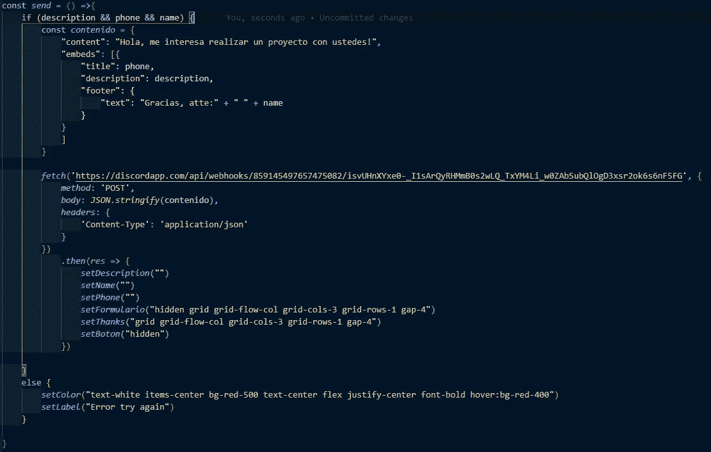

好了，现在让我们来测试我们的形式。

我们要做的第一件事是，当我们想要发送一个空的表单时，我们通过点击按钮进行测试，它会显示一个错误，并且会显示为按钮自己的标签。

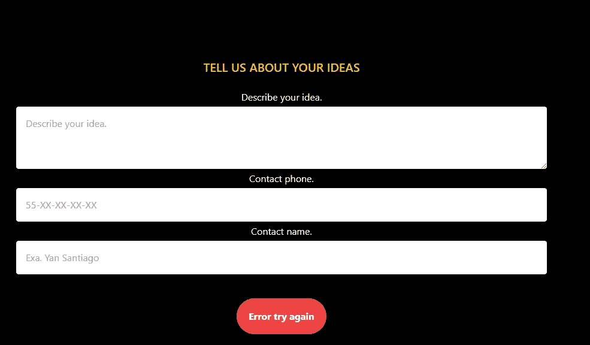

太好了！现在让我们填写表格，看看我们的不和谐是否收到我们的信息。

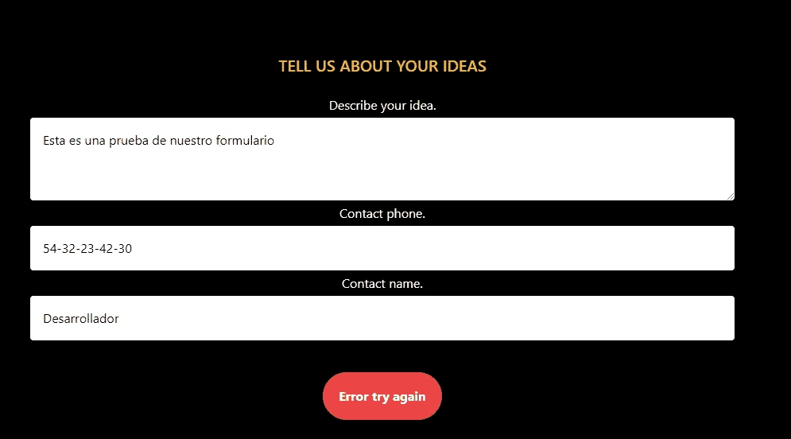

太棒了。，Discord 正在接收我们的信息，需要澄清的是，Discord 拥有管理其 API 的必要文档，在这个链接中你可以看到其 API 的文档。

 [## Discord 开发者门户-面向机器人和开发者的 API 文档

### 将你的服务与不和谐融为一体——无论是机器人、游戏还是你能想到的任何东西…

discord.com](https://discord.com/developers/docs/resources/webhook) 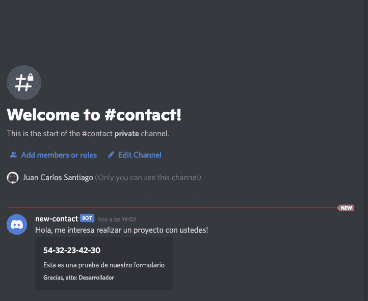

现在我们的形式将感谢您的客户，下一步是联系他，并作出业务约定。

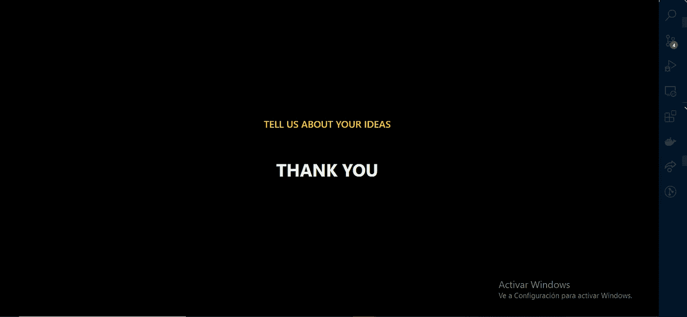

## 结论。

今天，我们有更多的工具能够把我们的网站变成一个更好的信息管理器，Discord 帮了我们很多，它只是把一点创造力，仅此而已。

感谢你的阅读，我希望它能帮助你，并把它付诸实践。