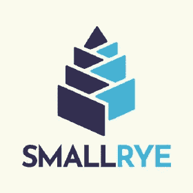
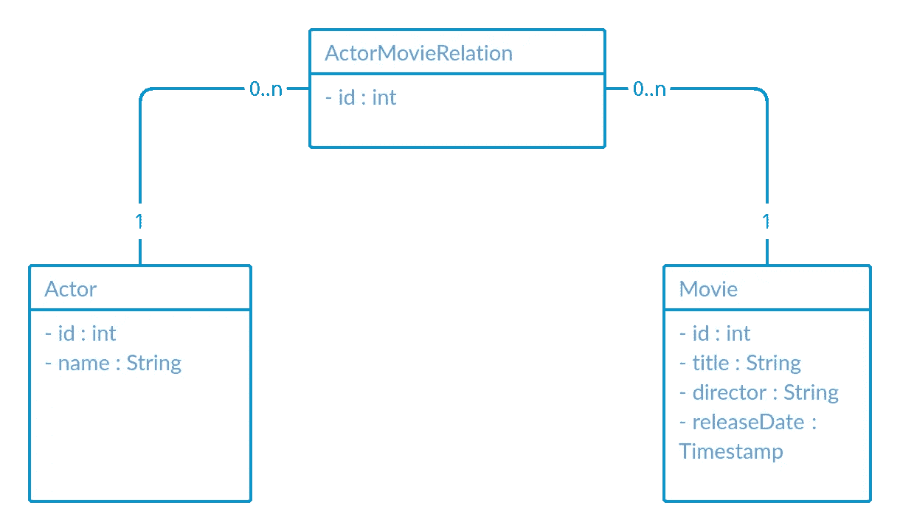
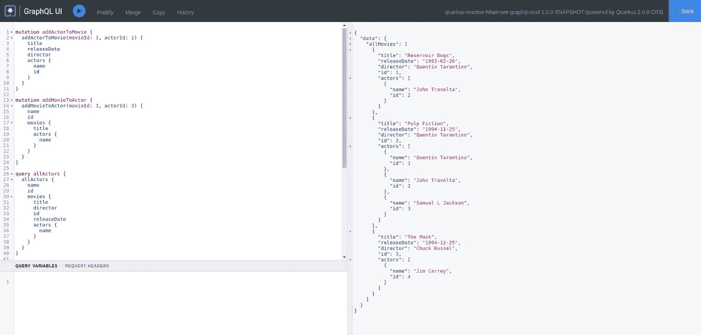

# 使用 PostgreSQL 数据库创建一个包含 Quarkus、反应式 Hibernate、Panache 和 GraphQL 的 CRUD 应用程序

> 原文：<https://medium.com/geekculture/creating-a-crud-app-with-quarkus-reactive-hibernate-panache-and-graphql-using-a-postgresql-216ecd75ee52?source=collection_archive---------11----------------------->


本指南演示了您的 Quarkus 应用程序如何使用 [**SmallRye GraphQL**](https://github.com/smallrye/smallrye-graphql/) ，[**micro profile graph QL**](https://github.com/eclipse/microprofile-graphql/)规范的实现，以及反应式的**Hibernate****Panache**扩展和 **PostgreSQL** 数据库。简而言之，它提供了一组电影和演员及其对应关系和突变操作。


quarkus.io

GraphQL 是一种用于 API 的查询语言，也是一种用现有数据完成这些查询的运行时语言。GraphQL 为 API 中的数据提供了完整且易于理解的描述，使客户能够准确地要求他们需要的东西，使 API 更容易随时间发展，并支持强大的开发工具。

**GraphQL** 最初是由**脸书**在 2012 年开发的，从 2015 年开始成为开放标准。

> GraphQL 不是 REST API 规范的替代品，而仅仅是一种替代方案。与 REST 不同，GraphQL API 能够通过以下方式使客户端受益:

***防止超取和欠取***

> REST API 是服务器驱动的固定数据响应，不能由客户端决定。虽然客户端不需要所有的字段，但是客户端必须检索所有的数据，因此`Over-fetching`。根据第一次调用(HATEOAS ),客户端可能还需要多次 REST API 调用来检索所需的所有数据`Under-fetching`。

***API 进化***

> 由于 GraphQL API 返回客户端请求的数据，因此向现有 API 添加额外的字段和功能不会对现有客户端造成重大更改。

考虑到这一点，我们在设计实体时可以有许多不同的灵活方法，并使我们的查询更加松散耦合。GraphQL 驱动的设计也有助于解决围绕数据库的 **n + 1 选择**的问题。

# 先决条件

*   PostgreSQL ≥ 10.5(在 Docker 中)
*   Java 8+
*   龙目岛≥ 1.18.18
*   Maven ≥ 3.6.2

# Quarkus 扩展

```
$ ./mvnw quarkus:add-extension -Dextensions="quarkus-hibernate-reactive-panache,quarkus-reactive-pg-client,quarkus-resteasy-reactive-jsonb,quarkus-smallrye-graphql"
```

本指南基于本指南中的发现。

[夸尔库斯—小黑麦图 QL](https://quarkus.io/guides/smallrye-graphql)



# 实体设计



多对多的实体关系需要规范化，以获得更好的结构。这是通过将描述电影和演员之间关系的新实体分解成一个*actor movie relationship*表来完成的，该表将成为我们的桥接表。

# 声明演员派头实体

# 宣布电影派头实体

# 宣告演员电影关系的华丽实体

# 反应式 GraphQL 查询

例如，可以通过使用`Uni`或`CompletionStage`作为返回类型来使查询变得被动。我们将使用**small rye-哗变**反应流的反应方式。

# GraphQL 执行元 API

# GraphQL 电影 API

# 配置

# 运转

运行 PostgreSQL 数据库。

```
$ docker run -d --rm --name my_reative_db -e POSTGRES_USER=user -e POSTGRES_PASSWORD=password -e POSTGRES_DB=my_db -p 5432:5432 postgres:10.5
```

使用实时编码预览运行 quarkus 应用程序。

```
$ ./mvnw compile quarkus:dev
```

# GraphQL 生成的模式

这将从我们的 GraphQL 注释类中生成。位于

[*http://localhost:8080/graph QL/schema . graph QL*](http://localhost:8080/graphql/schema.graphql)

# Quarkus 图形用户界面

这是默认启用的，用户界面位于

[*http://localhost:8080/q/graph QL-ui/*](http://localhost:8080/q/graphql-ui/)

将以下查询添加到 GraphQL 编辑器中，并开始交互。

```
mutation addActorToMovie {
  addActorToMovie(movieId: 1, actorId: 1) {
    title
    releaseDate
    director
    actors {
      name
      id
    }
  }
}mutation addMovieToActor {
  addMovieToActor(movieId: 3, actorId: 3) {
    name
    id
    movies {
      title
      actors {
        name
      }
    }
  }
}query allActors {
  allActors {
    name
    id
    movies {
      title
      director
      id
      releaseDate
      actors {
        name
      }
    }
  }
}query allMovies {
  allMovies {
    title
    releaseDate
    director
    id
    actors {
      name
      id
    }
  }
}mutation deleteMovie {
  deleteMovie(movieId: 2)
}mutation updateMovie {
  updateMovie(movieId: 1, movie: {title: "rEsErvOiR d0Gs"}) {
    title
  }
}
```



# 结论

正如所见，我们可以立即开始与不同的 API 资源和实体进行交互。更多操作和例子可以在 GitHub repo 中找到。

[在这里找到 GitHub 源码项目](https://github.com/dvddhln/quarkus-reactive-hibernate-graphql-crud)

祝你好运！