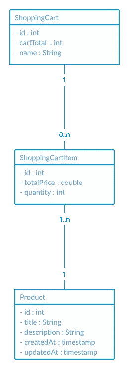

# 使用 Quarkus、Hibernate 反应式 ORM Panache 和 PostgreSQL 创建 CRUD 购物服务

> 原文：<https://medium.com/geekculture/creating-a-crud-shopping-service-with-quarkus-hibernate-orm-panache-and-postgresql-using-active-41a755693f12?source=collection_archive---------3----------------------->


当有了 **Hibernate ORM** mapper 可用时，在 quarkus 中创建一个基于 JPA 的 CRUD 应用程序是一个相当无缝的过程。Hibernate ORM 是事实上的标准 **JPA** 实现，而 **Quarkus** 提供了一个名为 **Panache** 的扩展，使得在反应式上下文中运行时不同的映射变得更加简单。本文给出了几个例子，说明如何使用活动记录模式将这些部分集成在一起。


quarkus.io

> 活动记录模式是一种访问[数据库](https://en.wikipedia.org/wiki/Database)中数据的方法。一个[数据库表](https://en.wikipedia.org/wiki/Database_table)或[视图](https://en.wikipedia.org/wiki/View_(database))被包装成一个[类](https://en.wikipedia.org/wiki/Class_(computer_science))。因此，一个[对象](https://en.wikipedia.org/wiki/Object_(computer_science))实例被绑定到表中的一行。

以下发现基于 Quarkus 社区的这篇扩展文章。

[quar kus——简化的 HIBERNATE ORM，外观华丽](https://quarkus.io/guides/hibernate-orm-panache)

# 先决条件

*   Quarkus ≥1.13.6 .最终
*   一种数据库系统
*   Java 8+
*   龙目岛≥ 1.18.18
*   Maven ≥ 3.6.2

此外，先决条件是添加以下扩展。我们将使用基于反应的扩展，它利用了 Vert.x 事件循环线程池。

```
$ ./mvnw quarkus:add-extension -Dextensions="quarkus-hibernate-reactive-panache,quarkus-reactive-pg-client,quarkus-resteasy-reactive-jsonb"
```

在开始之前，一些简短的 UML 符号描述了所涉及的实体。



UML notation for our entities

让我们开始设置我们的购物车服务，它基本上利用了包含一组处理产品的购物项目的购物车。具有适当 hibernate 注释映射的产品如下所示。

# 宣称派头产品实体

# 声明华丽的购物车实体

# 声明 Panache 购物车项目实体

# 声明产品 API

# 声明购物车 API

# 配置应用程序

# 运行应用程序

我们需要运行 PostgresSQL 数据库

```
$ docker run -d --rm --name my_reative_db -e POSTGRES_USER=user -e POSTGRES_PASSWORD=password -e POSTGRES_DB=my_db -p 5432:5432 postgres:10.5
```

使用实时编码预览运行 quarkus 应用程序

```
$ ./mvnw compile quarkus:dev
```

# 卷曲示例

获取所有购物车

```
$ curl -X GET "[http://localhost:8080/v1/carts](http://localhost:8080/v1/carts)"
```

将产品添加到购物车

```
$ curl -X PUT "http://localhost:8080/v1/carts/1/1"
```

# 购物车 REST API 的响应

```
[
  {
    "cartItems": [
      {
        "product": {
          "createdAt": "2021-06-06T08:45:48Z",
          "description": "description",
          "id": 1,
          "title": "Product1",
          "updatedAt": "2021-06-06T08:45:48Z"
        },
        "quantity": 1
      }
    ],
    "cartTotal": 1,
    "id": 1,
    "name": "MyCart"
  }
]
```

使用主动模式和 Panache 可以证明一些好处，但是，根据应用程序的性质，人们可能更喜欢存储库模式。需要其他实体参与的更复杂的关系可能表明这种方法更反模式。更多的例子和请求可以在 GitHub repo 中找到。

[在这里找到 GitHub 源码项目](https://github.com/dvddhln/quarkus-reactive-crud-hibernate-active-pattern)

祝你好运！