# 在 Unity 中创建过场动画

> 原文：<https://medium.com/geekculture/creating-a-cutscene-in-unity-aaec5042aaab?source=collection_archive---------7----------------------->

当创建过场动画时，在游戏中有两种主要的方式。第一种是将过场动画渲染为视频，并为过场动画播放该视频。第二是用游戏引擎实时渲染过场动画。后者是我在这篇文章中要展示的。

我将根据导演的笔记和故事板来创建这个过场动画。

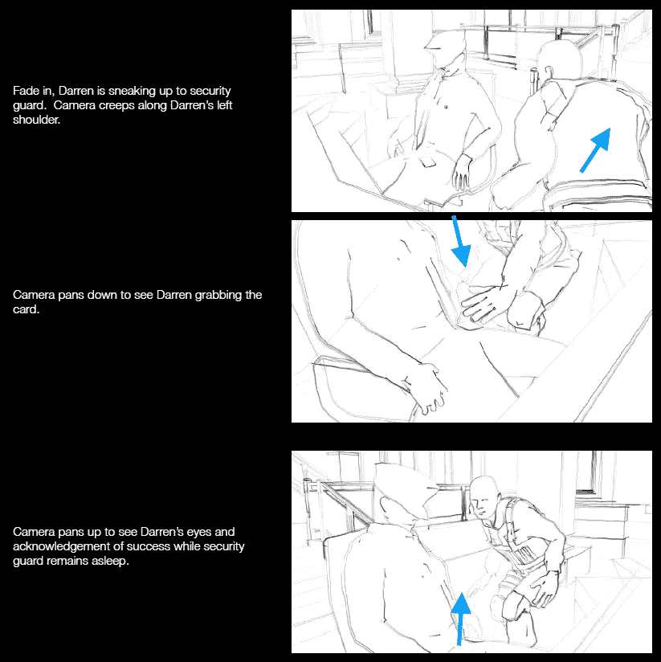

为了开始这个过场动画，我们需要将演员拖到位，这是附加了动画序列的模型。

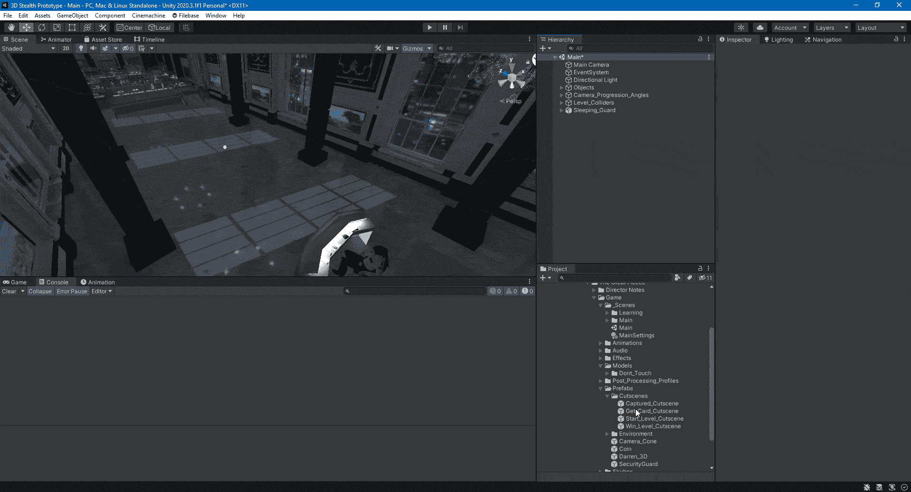

接下来，我们将从包管理器中使用 [Cinemachine](https://docs.unity3d.com/Packages/com.unity.cinemachine@2.1/manual/index.html) 来处理摄像机更改。

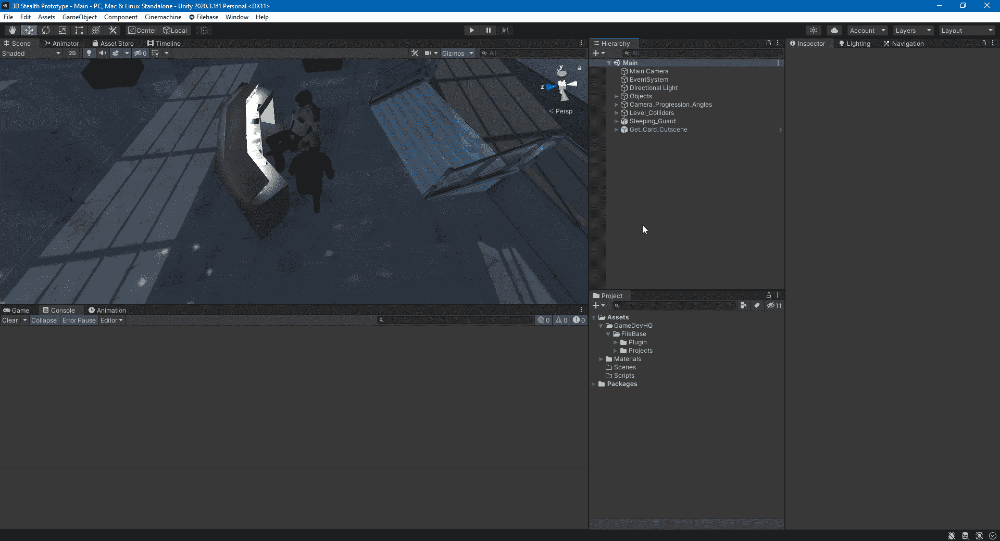

我们将使用 Cinemachine 创建一个虚拟摄像机，它将接管主摄像机，并将其设置为过场动画的虚拟摄像机的设置。将虚拟摄像机添加到场景中后，主摄像机会直接捕捉到它的位置和旋转，并将 CinemachineBrain 组件添加到其中。这将使主摄像机受到其他 Cinemachine 对象的影响。

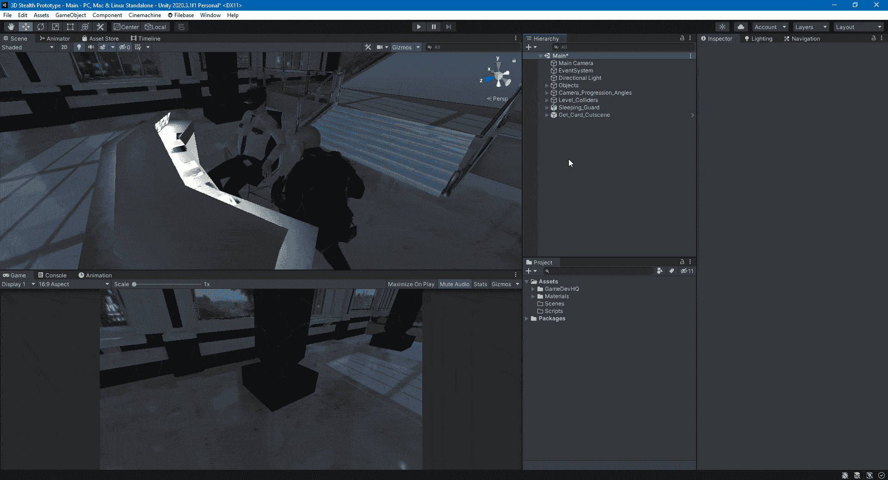

为另一个摄像机角度添加下一个虚拟摄像机时，第二个虚拟摄像机会覆盖第一个虚拟摄像机，接管主摄像机视图。您可以通过优先级设置来改变这一点。

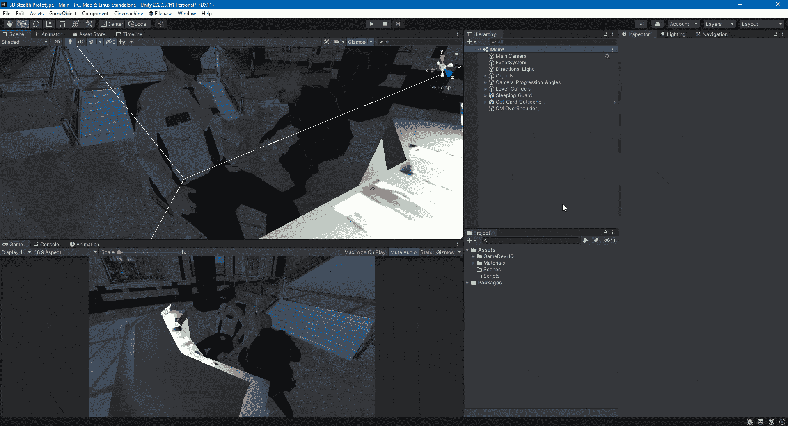

现在我们有了导演笔记中看到的拍摄地点。

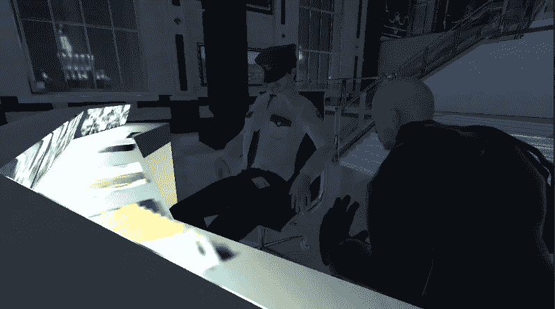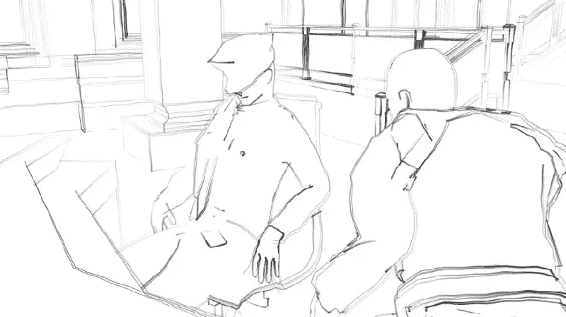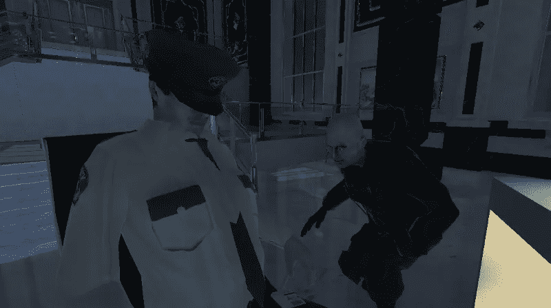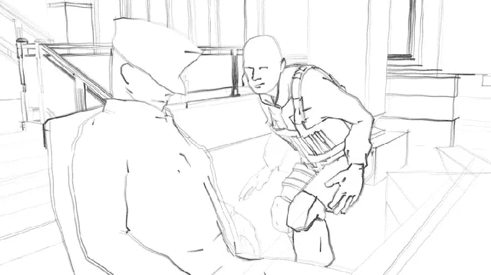

为了从一个虚拟摄像机切换到另一个，我们将使用 Cinemachine 的时间轴轨道，它允许您设置每个镜头的持续时间。

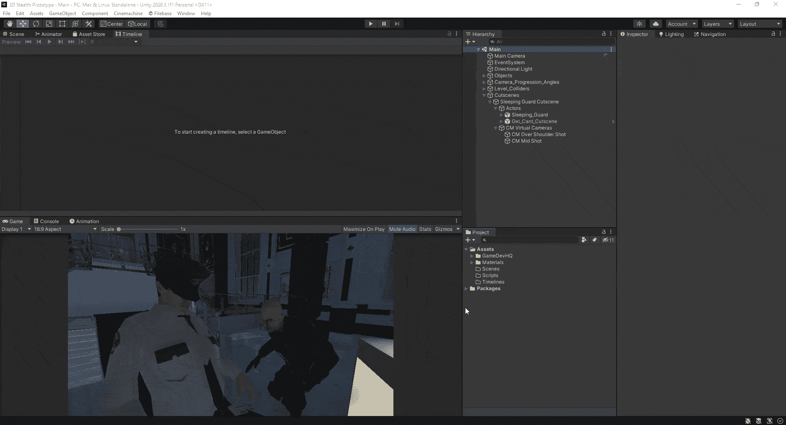

您可以更改每个镜头的长度，更改顺序，甚至在镜头之间进行混合。

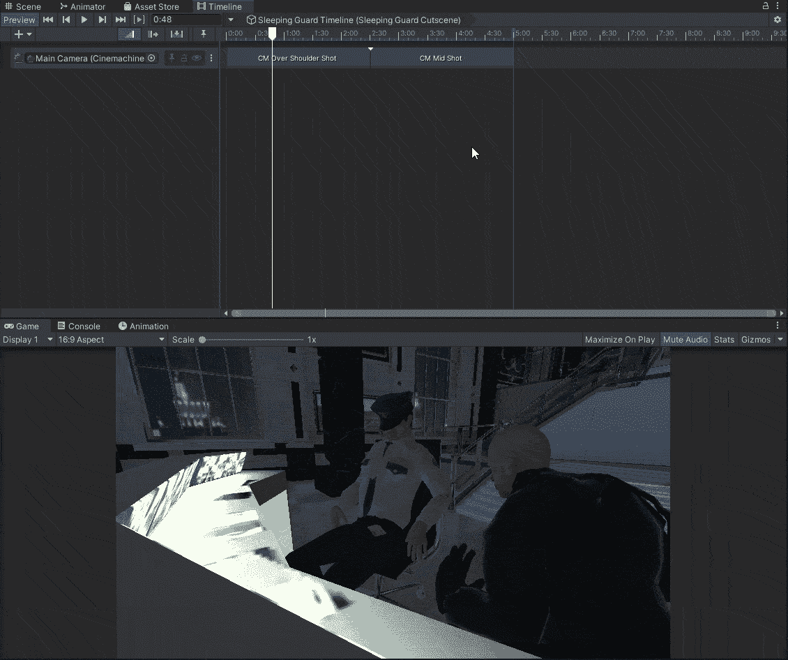

如果我们为动画序列添加一个动画轨道，我们现在可以在播放时间轴时看到动画；这将使摄像机的动画变得更加简单。

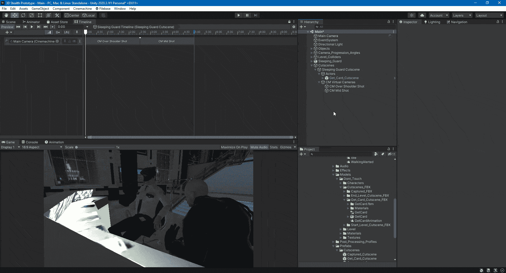

为肩部平移添加一个动画轨迹，以便我们可以制作摄像机动画。

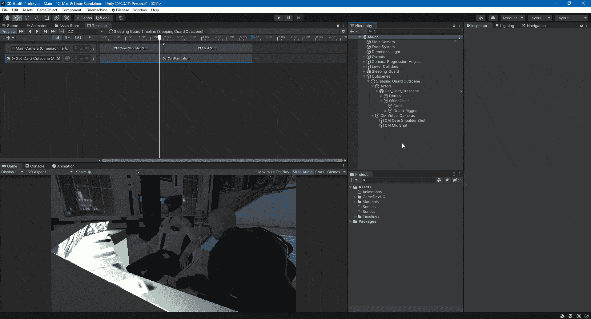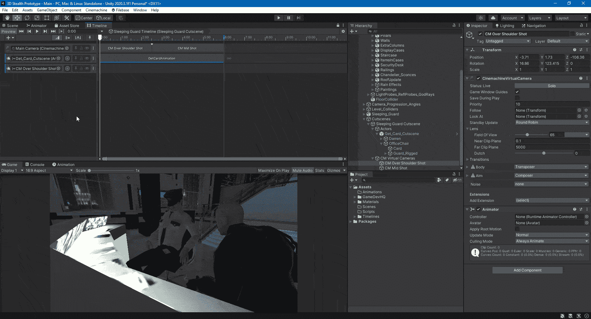

然后我们对中景相机做同样的事情。

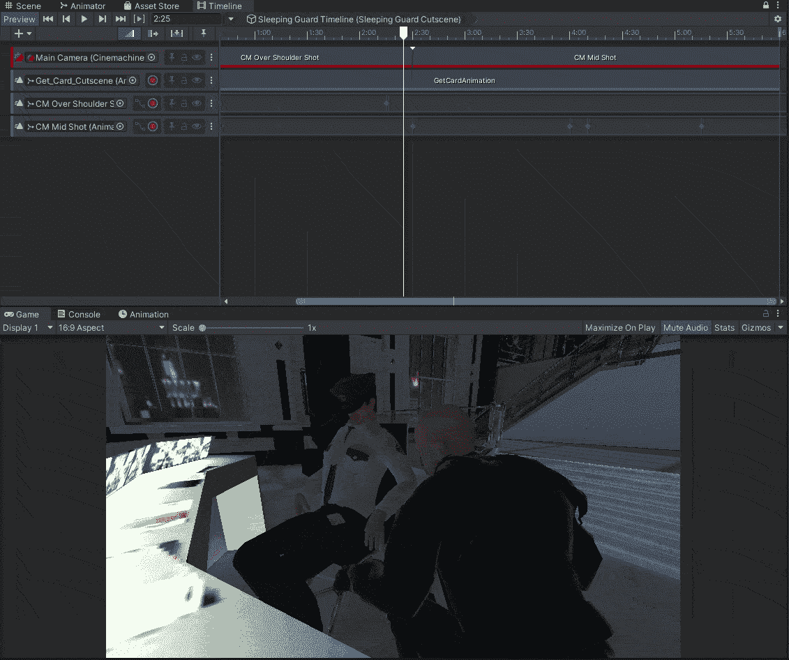

接下来，我们为钥匙卡添加一个激活轨迹，当主角抓住它时，它就会消失。

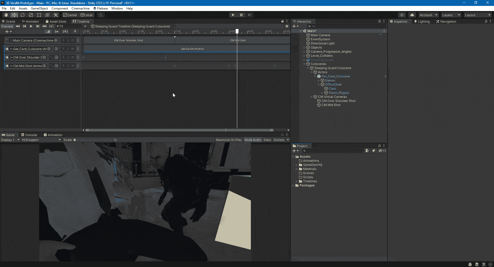

最后要添加的是用画布淡入黑色，用动画 alpha 淡入黑色图像。

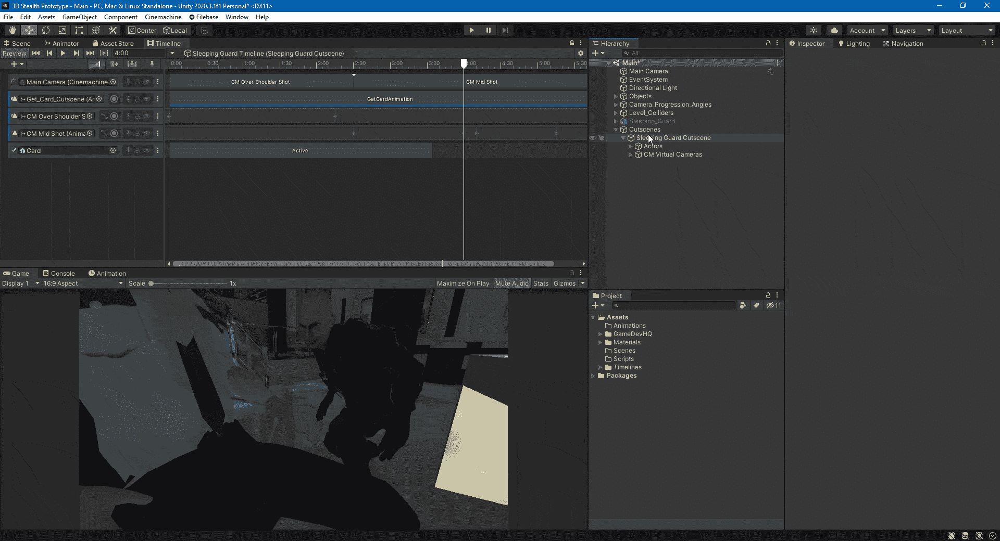

这是完成的过场动画。

