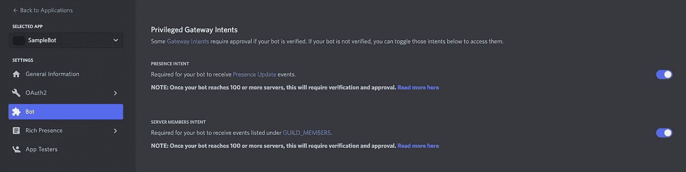

# 在 Discord.js 中创建与机器人的不和谐对话

> 原文：<https://medium.com/geekculture/creating-a-discord-dialogue-with-a-bot-in-discord-js-bcfaa4b21c06?source=collection_archive---------5----------------------->

## 如何用 Discord.js 创建响应式渠道和 DM 对话


Image from [Pixabay](https://pixabay.com/photos/feedback-report-back-business-people-3653368/)

# 概观

## 介绍

最近，我在做一个项目，使用 Discord.js 创建一个 Discord 对话。然而，尽管发送消息相当简单，但对我来说，拥有一个 bot 消息并作出响应稍微有点困难，相当于 Python 中的`await`。

## 目标

这个博客的目标是:

*   在 DMs 中创建机器人对话
*   在频道中创建机器人对话

## 工具

要执行此操作，您需要:

*   [Node.js](https://nodejs.org/en/) 和 [NPM](https://www.npmjs.com/)
*   [不和谐账户](https://discord.com/)
*   [Discord.js](https://discord.js.org/) (v13.6.0)

# 第一步:创建一个不和谐机器人

首先，通过[开发者门户](https://discord.com/developers/applications)创建一个 Discord bot。创建一个新的应用程序，创建一个 bot，然后复制并粘贴要在代码中使用的令牌。


Create an Application, create a bot, then copy the token

接下来，在`Bot`选项卡中，让机器人访问意图选项。



Give the bot access to intent

有了令牌，你现在应该准备好为你的不和谐机器人编程了。

# 第二步:用正确的设置创建客户机

首先，创建一个项目来构建 Discord bot。

```
mkdir discord_dialogue
cd discord_dialoguenpm init
npm install discord.jstouch index.js
```

首先，导入 discord.js。

```
const { Client, Intents } = require("discord.js");
```

接下来，创建客户端。

```
const client = new Client({
   intents: ['GUILD_PRESENCES', 'GUILD_MEMBERS', Intents.FLAGS.GUILDS, Intents.FLAGS.GUILD_MESSAGES, Intents.FLAGS.DIRECT_MESSAGES],
   partials: ['CHANNEL', 'MESSAGE', 'REACTION']
});
```

在就绪状态下创建客户端。

```
client.on("ready", () => {
   console.log("Bot is ready.");
});
```

接下来，创建客户端`onMessage`。这是大部分代码所在的地方。目前，如果作者是机器人，它将返回。

```
client.on("messageCreate", async (message) => { if (message.author.bot) return;})
```

最后，在文档的结尾，使用您拥有的令牌登录客户端。

```
client.login("TOKEN");
```

> 注意:所有代码都必须在这行代码之上，客户端代码才能运行。

# 第三步:创建一个触发词并发送消息

> 注意:从这里开始，所有的代码，除非另有说明，都在“messageCreate”事件中。

为了开始对话，我们将指定一个触发词。如果消息是这个触发字，对话代码将开始。在我的例子中，我将使用`start dialogue`作为触发词。

```
if (message.content === 'start dialogue') {}
```

> 注意:从这里开始，所有的代码，除非另有说明，都将出现在上面的 if 语句中。

接下来，让我们发送一条消息，比如问候用户。

```
if (message.content === 'start dialogue') { message.author.send("Hi! What's your name?");}
```

# 第四步:收集回复

接下来，从前面的消息中，我们将添加一个`.then`声明。

```
if (message.content === 'start dialogue') { message.author
      .send("Hi! What's your name?")
      .then((start) => { // Response code goes here. })}
```

为了等待响应，我们将使用`.awaitMessages`命令。这将替换注释。

```
message.channel
   .awaitMessages({ true , max: 1, time: 50000, errors: ['time'] })
   .then((name) => { message.author.send(`Pleased to meet you, ${name}!`); })
   .catch((err) => message.author.send("There's been an error or you've timed out! Try again with `start dialogue`!"));
```

我们来分析一下。`.awaitMessages`接受一个有三个参数的对象。第一个是简单返回`true`的过滤器。如果消息有某些约束，可以用返回 true 或 false 的函数替换第一个参数。接下来，`max`是它将等待的最大消息数。最后，`time`是函数等待消息的时间，`errors`是函数可能抛出的问题——在本例中是超时错误。

接下来，`.then`函数接受消息的一个参数，为简单起见，称为`name`。作为响应，当前有一个响应，通过用户的名字来调用用户。这可以修改为您需要完成的任何任务。

最后，`.catch`函数处理任何错误。如果有错误，机器人会通知用户有错误，并建议他们重新启动。

# 第五步:更长的对话和渠道对话

为了继续，在上面的`.then`函数中添加`.awaitMessages`函数。

```
message.channel
   .awaitMessages({ true , max: 1, time: 50000, errors: ['time'] })
   .then((name) => { message.author.send(`Pleased to meet you, ${name}! What is your favourite colour?`).then((start) => { message.channel
            .awaitMessages({ true , max: 1, time: 50000, errors: ['time'] })
            .then((colour) => { message.author.send(`I love ${colour} too, ${name}!`); })
            .catch((err) => message.author.send("There's been an error or you've timed out! Try again with `start dialogue`!")); }) })
   .catch((err) => message.author.send("There's been an error or you've timed out! Try again with `start dialogue`!"));
```

在对话的剩余部分继续添加`.then`语句。

接下来，要将这些对话更改为在频道而非 DM 中出现，请用`message.channel`替换所有`message.author`功能。

```
message.channel.send("Hi! What's your name?");
```

`message.author`发送 DM，而`message.channel`在对话发起的通道中发送消息。接下来，由于多个人可以同时参与对话，您将需要添加一个过滤器来替换`.awaitMessages`函数中的第一个`true`。

```
let filter = (msg) => message.author.id === msg.author.id;
```

这样，您就应该拥有了创建不和谐(DM 或渠道)对话所需的所有代码！

# 第六步:结论

恭喜你完成这篇博客！如果你也在寻找一个不和谐的对话，希望这有所帮助！欢迎提出任何问题、意见或建议！