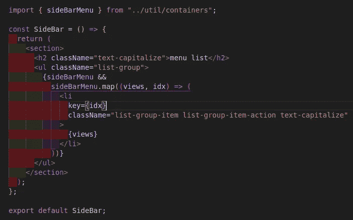
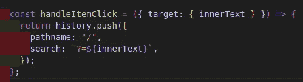
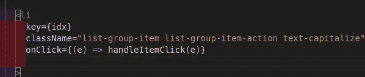
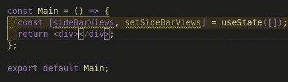
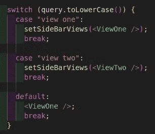
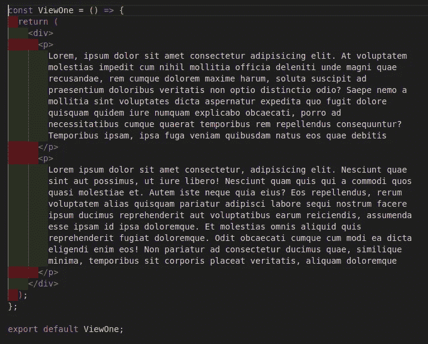
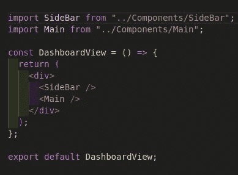
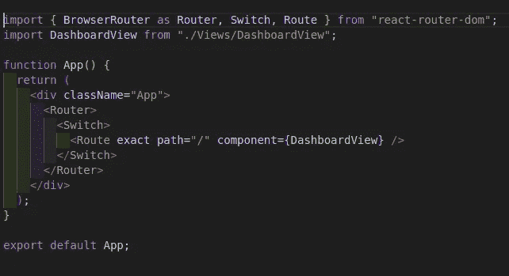

# 使用 react 钩子创建动态侧边栏菜单。

> 原文：<https://medium.com/geekculture/creating-a-dynamic-sidebar-menu-with-one-route-using-react-hooks-9d31640fb78c?source=collection_archive---------0----------------------->


Photo by [Domenico Loia](https://unsplash.com/@domenicoloia?utm_source=medium&utm_medium=referral) on [Unsplash](https://unsplash.com?utm_source=medium&utm_medium=referral)

对于一些前端开发人员来说，为侧边栏菜单中的每个项目创建一个单独的视图已经成为惯例。因此为所有侧边栏菜单项创建不同的路径。

在本文中，我将向您展示如何在为每个侧边栏菜单项创建不同的路由时获得相同的结果。

**先决条件**

*   了解 Javascript
*   反应堆的基本知识
*   下载并安装 NodeJS 和 NPM

在本教程中，我将使用 visual studio 代码(vscode)作为我的代码编辑器。

事不宜迟，我们开始吧。转到终端并运行以下命令:

```
cd Desktopnpx create-react-app rendering-sidebarcd rendering-sidebaryarn add react-router-domincase you have web-vitals module error, install the following;yarn add web-vitals ––savecode .
```

根据上面的代码片段，我在桌面文件夹中创建了一个目录，其中保存了已安装的 react 模板。在新文件夹中，安装了一些包，以便有效地运行应用程序。最后，我打开了 VSCode 中的目录。

在 SRC 文件夹中，我将通过运行以下命令创建一些新的文件夹/文件:

```
mkdir View Component utilcd View touch dashboardView.jscd ..cd Componenttouch SideBar.jsx Main.jsxcd ..cd utiltouch containers.js
```

我在 src 文件夹中创建了三个新文件夹，在 view 文件夹中创建了一个新文件，在 component 文件夹中创建了两个新文件。最后，在 util 文件夹中创建了一个 container.js 文件。

在 containers.js 文件中，添加以下内容:


sidebar menu list

接下来，我将在侧栏组件中导入并呈现 sideBarMenu，如下所示:



sidebar component

侧边栏菜单项被映射并呈现到一个有序的列表元素中。

让我们来处理当我点击下面的任何侧边栏菜单项时会发生什么:



menu list click function

在上面的代码片段中，我添加了一个函数，该函数不仅路由到根路径，还添加了一个查询以及保存我单击的每个菜单项内的文本的路径 innerText 从参数中被析构。在列表元素的开始标记内调用了 handleItemClick 函数，如下所示:



我将转到主要组件，并向其添加以下内容:



main component

我们创建了一个函数组件来处理将会显示的内容，这取决于单击了侧边栏的哪一项。一个状态被初始化，现在，这个状态保存一个空数组作为它的默认值。

请记住，每当我单击任何侧边栏菜单项时，它都会路由到根路径“/”并附加一个查询。

下面，让我们看看如何从主组件的浏览器搜索栏中获得该查询:


我访问了浏览器位置 API 的 search 属性，以获取从上面的侧边栏 click 函数传递给它的查询。进行检查以了解找到的查询参数是否包含带数值的百分号，如果是，它将被替换为空格。如果没有，它将返回实际的查询。useEffect 函数用于在位置的搜索属性改变时总是获取查询参数。

现在，我已经获得了让我知道在主组件中加载哪个组件的查询，我将创建一个 switch 语句来处理它的呈现条件。



switch statement

我已经使用 switch 语句根据查询参数呈现了不同的组件——我将很快创建组件。查询参数值是大写的，这就是为什么我必须在 switch 语句中使用 toLowerCase 方法将其转换为小写值。

完成这些之后，让我们进入我之前创建的组件文件夹，并通过在终端中运行以下命令来创建我在主组件中导入的新组件:

```
cd Component touch ViewOne.jsx ViewTwo.jsx
```

在 ViewOne 组件中，我们添加以下内容:



view one component

在 ViewTwo 组件中，我们添加以下内容:


view two-component

接下来，我将导入之前创建的 dashboardView 组件中的侧栏组件和主组件，如下所示:



dashboardView

在 app 组件内部，我将导入仪表板视图组件，并将其传递给应用程序路径，如下所示:



app component

我从 react-router-dom 导入了一些属性，使我能够路由到不同的视图，在我的例子中只有一个视图。

让我们在下面的 [***演示***](https://res.cloudinary.com/hobbyluv07/video/upload/v1631867768/Screencast_from_17-09-2021_09_31_47_at9hkw.webm) ***中，打开浏览器，看看我这段时间都在做些什么。***

随着演示，我想我可以称之为成功。我现在可以根据被点击的侧边栏菜单项切换到不同的视图。此外，当我重新加载浏览器时，当前视图将被保留，就像将视图添加到它们各自的路径中一样。

最后，这是这篇牛逼文章的结尾。点击下面的 [***为来源***](https://github.com/chibuike07/dynamic_sidebar_item-component)

告诉我，你将如何呈现你的侧边栏菜单项组件？

如果这篇文章对你有帮助，别忘了点击拍手图标，分享这篇文章，关注我的 [***中的***](https://princewillchime43.medium.com/) 和[***Linkedin***](https://www.linkedin.com/in/chime-princewill-3a2b1b192/)以查看更多我的文章。

请放弃任何评论或建议。如果你有一个基于 JavaScript/React.js 生态系统的主题，请随时联系我，我很乐意就此进行写作。谢了。