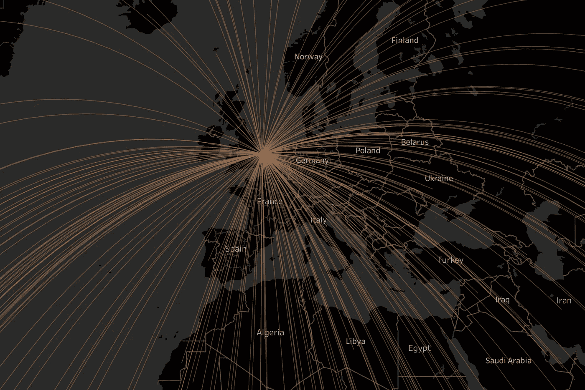

# 在 Tableau 中创建一个奇特的中心辐射图——用数据讲故事(第四部分)

> 原文：<https://medium.com/geekculture/creating-a-fancy-hub-spoke-chart-in-tableau-storytelling-with-data-part-iv-f1c139cc67e7?source=collection_archive---------11----------------------->

## 什么是轴辐图以及如何在 Tableau 中构建它们

你是否经常在 Tableau 公共画廊中滚动，看到最迷人的视觉效果，并渴望重现它们。下面是一个我见过多次的 viz 图表:

Image Source: By Author, [https://public.tableau.com/app/profile/aasavari.kaley/viz/SpokeChart_16486760962960/Dashboard2](https://public.tableau.com/app/profile/aasavari.kaley/viz/SpokeChart_16486760962960/Dashboard2)