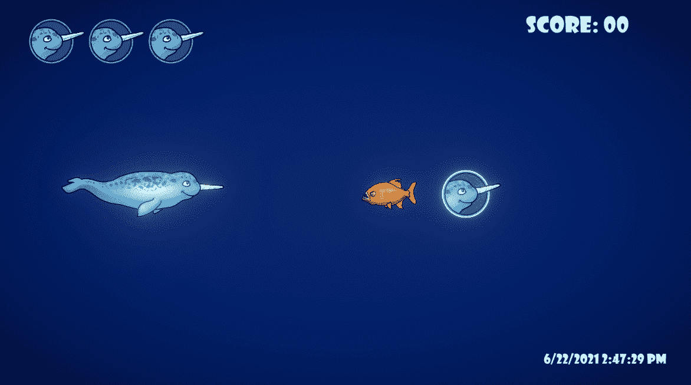

# 在 Unity2D 中创建健康启动

> 原文：<https://medium.com/geekculture/creating-a-health-powerup-in-unity2d-37aa580891ef?source=collection_archive---------48----------------------->

在这篇文章中，我想给我的玩家通过收集能量来治疗的能力。在 Corel Draw 中，我使用我的健康展示中已经存在的艺术，来制作一个快速启动的图像。

