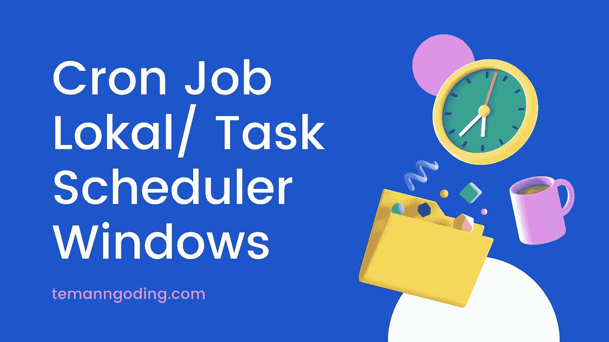
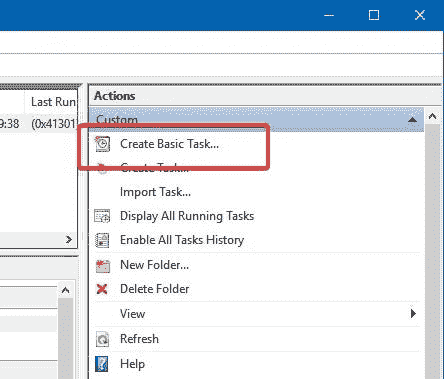
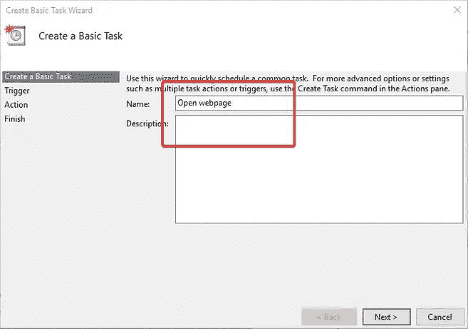
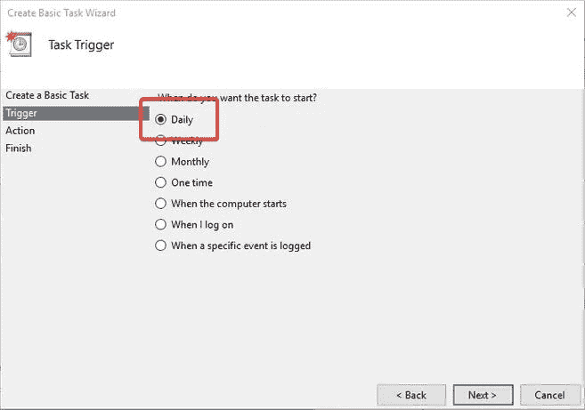
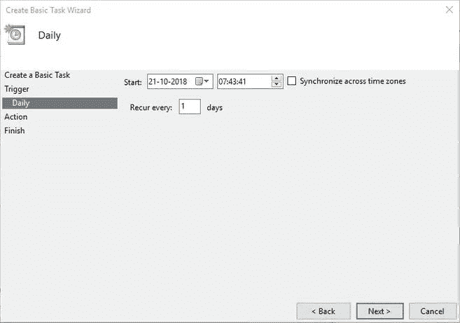
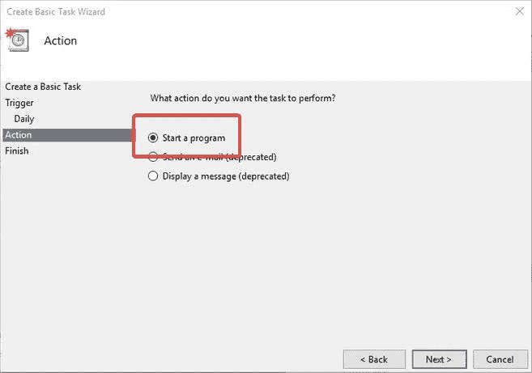
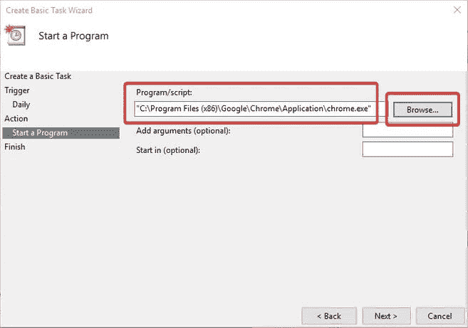
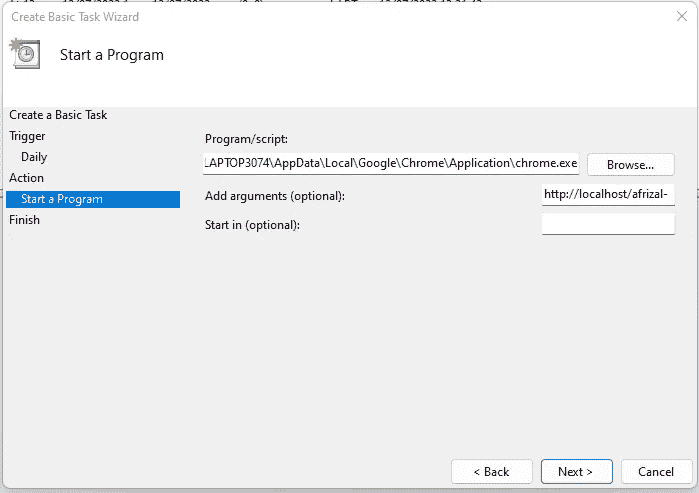
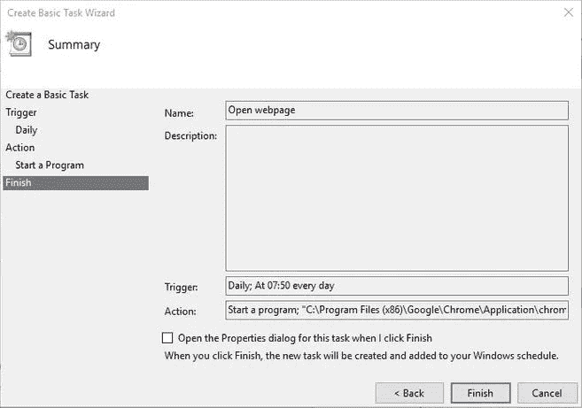
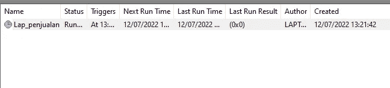

# 创建本地 Cron 作业/ Windows 任务计划程序

> 原文：<https://medium.com/geekculture/creating-a-local-cron-job-windows-task-scheduler-c13ff51fead2?source=collection_archive---------13----------------------->

你好，你们都好吗，我希望你们都永远健康和成功。在本次讨论中，我们将讨论如何在本地 PC 上创建 cron 作业。

如果我们想要在线运行应用程序，我们将使用 cron 作业来运行我们创建的任务。但是这次我们有一个 url，我们想根据我们在本地 PC 上计划的程序运行它。这对于那些在本地 PC 上运行应用程序的人来说非常重要。现在，我们想通过电子邮件发送一份带有预定日程的报告，windows 上的任务调度程序是解决方案。

考虑到使用任务计划程序是多么容易，使用任务计划程序打开网站也是非常容易的。所以，如果你需要按计划打开一个网站，试着按照下面的步骤使用任务计划程序。

# 使用任务计划程序打开 URL

*   在“开始”菜单中找到“任务计划程序”并打开它。
*   在任务调度器中，点击**创建基本任务**。

*   输入任务名称和描述，然后点击**下一步**。

*   选择希望任务开始的时间，然后单击“**下一步**”。在我的例子中，我想每天运行一个任务，所以我选择了“ **Daily** ”。如果你想一打开电脑就开始一项任务。

*   选择定期计划和行为。如果您想每天运行计划，请确保“每天重复”字段设置为“1”。

*   选择**启动程序**，点击**下一步**。

*   点击**浏览**按钮，选择您的浏览器。就我而言，我选择了 Chrome。

*   添加我们要运行“ **Add arguments** ”字段的 url 地址，然后单击“ **Next** ”。

*   首先检查我们所做的是否是我们想要的，然后点击“**完成**”。

*   接下来，忘记所有的朋友，在我们创建的任务上点击**运行**。

*   等到我们指定的时间，然后是在任务计划中创建的 url。会自动运行。

德米基安教程。塞莫加·伯曼法特。

***特利马卡西。***

[https://temanngoding . com/mem UAT-cron-job-lokal-task-scheduler-windows/](https://temanngoding.com/membuat-cron-job-lokal-task-scheduler-windows/)