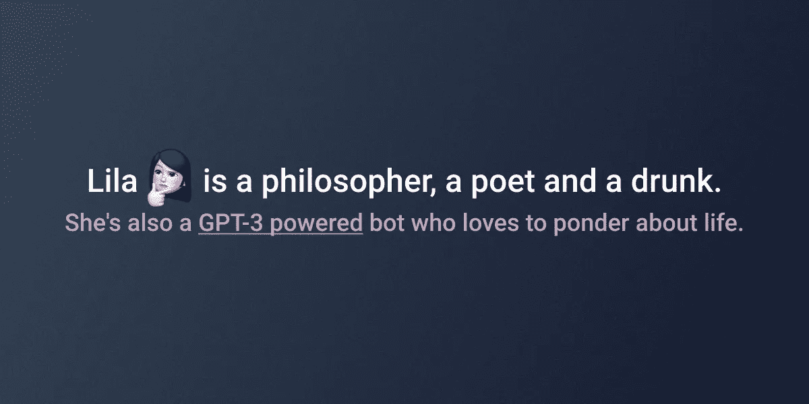

# 创造一个能产生关于生活的原创引语的哲学家机器人

> 原文：<https://medium.com/geekculture/creating-a-philosopher-bot-that-generates-original-quotes-about-life-a8cebe2de31f?source=collection_archive---------62----------------------->

TL；在这里找到莱拉。

# 使用 GPT-3

生成式预训练变压器 3 (GPT-3)是一种 OpenAI 语言模型，使用深度学习来产生类似人类的文本。它目前被微软独家授权(花费高达[10 亿](https://www.theverge.com/2020/9/22/21451283/microsoft-openai-gpt-3-exclusive-license-ai-language-research)美元)，但是你可以在这里申请试用它的测试版[。](https://beta.openai.com/)