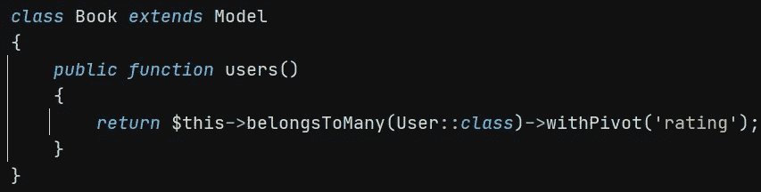
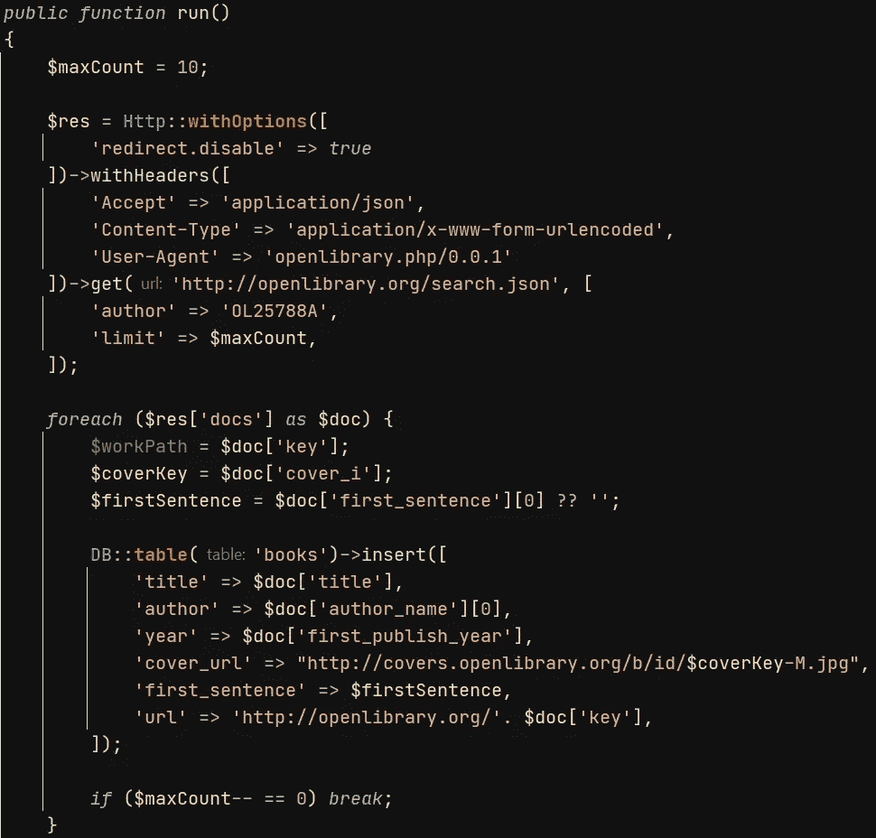
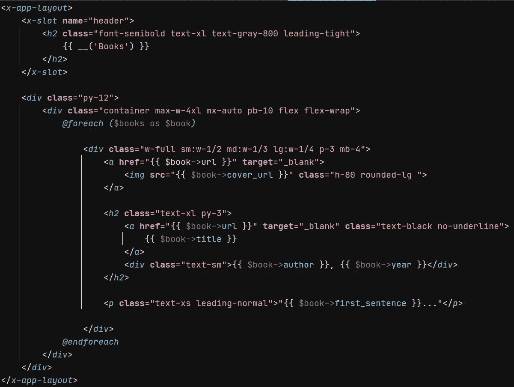
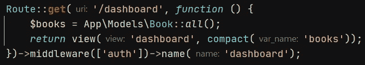
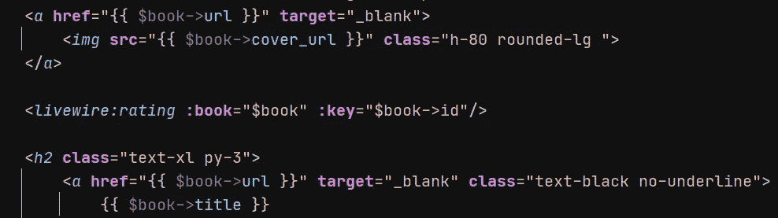
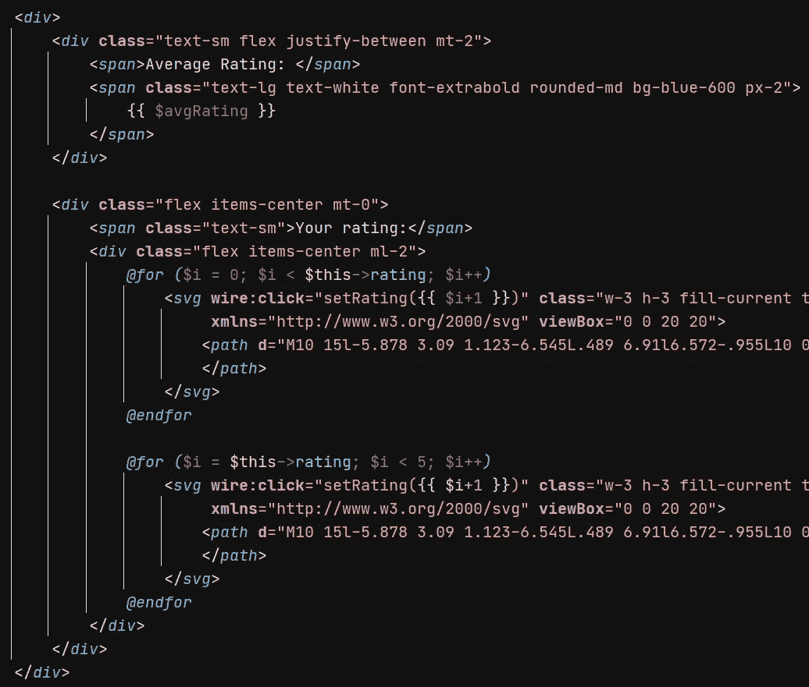
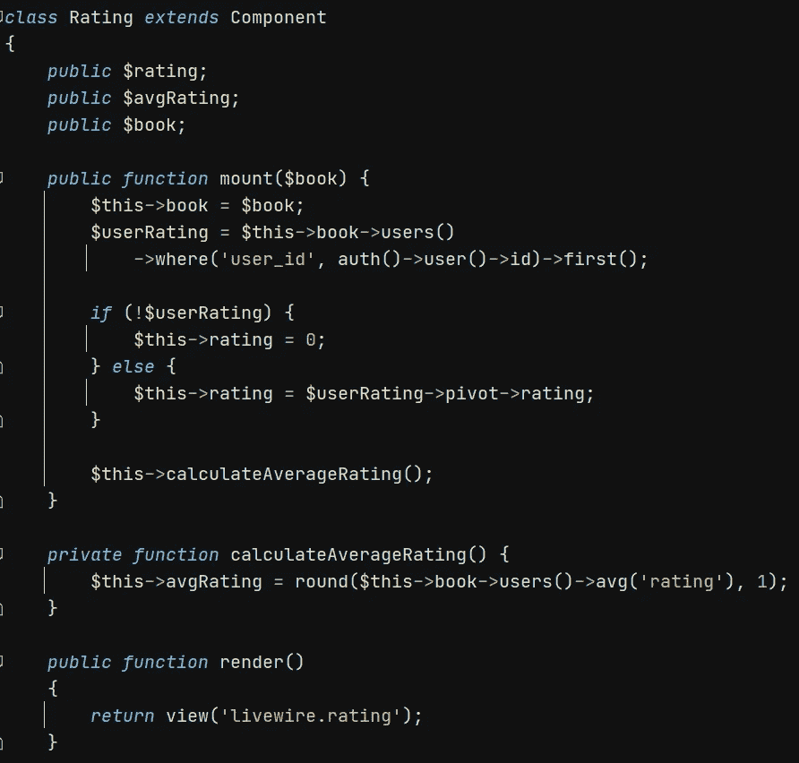
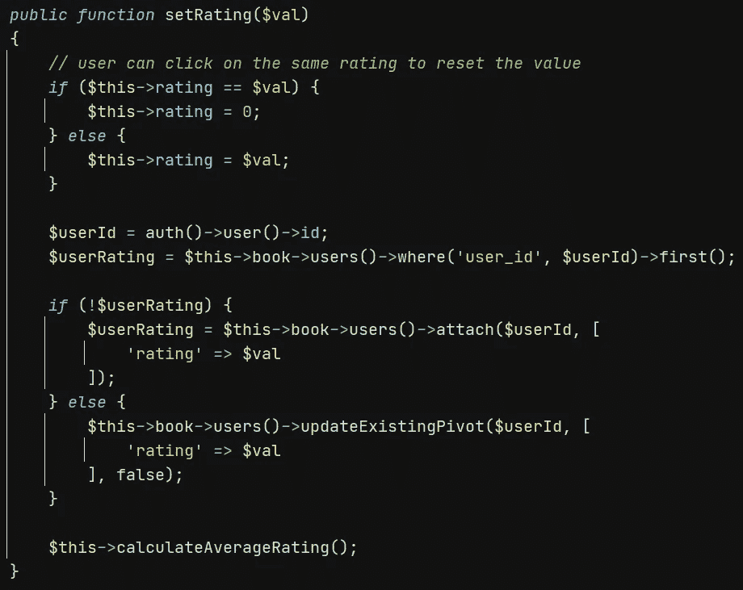

# 使用 Livewire Laravel 创建评级组件

> 原文：<https://medium.com/geekculture/creating-a-rating-component-with-livewire-laravel-c76fe333ae33?source=collection_archive---------0----------------------->

在这篇文章中，我将展示如何使用 Laravel Livewire 构建评级组件。 [Laravel Livewire](https://laravel-livewire.com/) 是 Laravel 之上的一个框架，用来构建动态应用，而不会脱离 Laravel 的“舒适性”。该框架通过在后台发出 AJAX 请求来更新网页。

出于测试目的，我在 Laravel 中构建了一个简单的图书目录，它使用了评级组件。这是完整应用程序的预览:


在红框中，我突出显示了评级部分:


您可以单击星星给出您的评级，您的评级和所有用户的平均评级都会更新并显示出来。有趣的是，该组件是反应式的，即不需要任何页面重载，也不需要使用任何 Javascript 代码。

托管评级组件的应用程序是一个常规的 [Laravel](https://laravel.com/) 应用程序，它使用 [Breeze](https://laravel.com/docs/8.x/starter-kits#laravel-breeze) 进行身份验证。我正在使用 [Tailwindcss](https://tailwindcss.com/) 进行造型。

# 源代码

你可以在我的 Github 库上找到完整的源代码。如果觉得有用请加星。

# 环境设置

我在 Windows 上工作，所以一些命令可能需要在 MacOS/Linux 上稍加修改。假设您已经[安装了 Laravel](https://laravel.com/docs/8.x/installation) ，让我们使用 Livewire 和 Breeze 创建一个新的 Laravel 应用程序:

```
laravel new livewire-rating-demo
cd livewire-rating-demo
composer require livewire/livewire
composer require laravel/breeze --dev
php artisan breeze:install
npm install && npm run dev
```

*如果您在 web 服务器根目录下运行 Laravel 应用程序，您可以跳到下一部分。否则，您仍然可以按照以下步骤让 Laravel 和 Livewire 工作:*

```
php artisan livewire:publish --config
```

编辑你的`.env`文件，使`APP_URL`和`LIVEWIRE_ASSET_URL`指向你的 Laravel 应用程序的公共文件夹。下面是我的本地配置的一个示例，您应该根据您的环境进行更改:

```
APP_URL=http://other.test.test/Laravel/livewire-rating-demo/public
LIVEWIRE_ASSET_URL=http://other.test/Laravel/livewire-rating-demo/public
```

最后，编辑`config/livewire.php`替换:

```
'asset_url' => *null*,
```

使用:

```
'asset_url'  => env('LIVEWIRE_ASSET_URL'),
```

# 数据库设置

让数据库运行起来最快的方法是使用 SQLite。现在，让我们创建一个空的 SQLite 数据库。Windows 上的命令是:

```
copy nul database\database.sqlite
```

或者`touch database/database.sqlite`如果你是 Linux/Mac 用户。

接下来，打开您的`.env`文件，删除所有以`DB_...`开头的行，然后添加:

```
DB_CONNECTION=sqlite
```

现在，您应该能够运行迁移了。以下是适用于 Windows 的命令:

```
php artisan migrate
```

# 添加数据库表

我们需要两张桌子:

*   `books`，存储所有的图书字段(书名、作者等。),
*   `book_user`，图书与用户的关联表，存储用户对图书的评分。

让我们创建我们的雄辩模型，以及迁移和播种器:

```
php artisan make:model Book --migration --seed
```

打开`database/migrations`下的账簿迁移来定义两个表的结构:


如您所见，我已经在关联表`book_user`中添加了`rating`列来存储用户评级。

我扩展了位于`app/Models/Book.php`下的图书模型，以访问为该书投票的所有用户，以及他们的评级(雄辩的枢纽列):



现在可以通过以下方式访问`rating` pivot 列:

```
$book->users()->where(…)->first()->pivot->rating
```

# 为数据库设定种子

为了填充图书目录，我创建了一个数据库播种器，它从[开放库](https://openlibrary.org/)公共 API 获取输入，并将它们保存到数据库中。下面是从伟大的约翰·斯坦贝克那里下载 10 本书的代码:



我不打算深入讨论开放库 API 的细节。如果您想使用不同的作者，您必须更改:

```
'author' => 'OL25788A'
```

你最喜欢的作家的代码。只要进入正规网站，搜索作者就可以了。

现在，您可以输入您的数据库:

```
php artisan db:seed --class BookSeeder
```

如果您使用任何支持 SQLite 的客户端打开数据库，例如 [DB Browser for SQLite](https://sqlitebrowser.org/) ，您应该会看到充满数据的 book 表。

# 展示书籍

让我们更改主页`resources/views/dashboard.blade.php`以显示数据库中的所有书籍:



页面正在迭代`$books`集合。接下来，编辑`routes/web.php`将书籍传递到页面:



让我们试试:访问你的应用程序的主页，点击页面右上角的“注册”链接进行注册。您应该看到检索到的书籍(封面、标题等。)没有评级组件，我们将在下一部分构建。

# 创建 Livewire 评级组件

首先，使您的页面能够托管 Livewire 组件编辑`resources/views/layouts/app.blade.php`并添加:

*   `<livewire:styles />`在`</head>`之前
*   `<livewire:scripts />`在`</body>`之前

现在，您可以创建评级组件:

```
php artisan livewire:make Rating
```

评级组件分为刀片模板和服务器端组件。首先，我们将新组件包含在`dashboard.blade.php`视图中:



以下是刀片组件`resources/views/livewire/rating.blade.php`的外观:



而服务器端组件:`app/Http/Livewire/Rating.php`:



`mount()`方法是在创建组件时计算的，因此这是初始化刀片模板访问的属性的合适位置。

在刀片模板中，我将每个星形图标上的“点击”事件绑定到服务器端方法`setRating()`。下面是`Rating.php`类中的方法:



我们完了！当您单击评级按钮时，您的评级会存储在服务器端，模板会根据所有用户评级计算出一个更新的平均评级。交互是动态的——无需重新加载整个页面就可以更新视图——而且不需要一行 Javascript 代码！

尝试注册多个用户，看看平均评分如何变化。

# 结论和最后想法

在我看来，Livewire 是一个非常有趣的框架。每当一个新的框架出现时，社区就会分成支持者和反对者。然而，更好的做法是关注它的优点，以及何时使用基于 React/Vue 的更传统的方法更好。

如果您已经组织了前端和后端开发人员在不同的团队中工作，您可能会希望坚持使用 React/Vue。如果你是一个全栈开发人员，并且你熟悉 Laravel，或者你愿意学习 Laravel，你应该认真考虑 Livewire，因为它真的可以缩短你的开发时间。例如，如果你正处于原型制作阶段，或者你需要在一个紧张的时间表内建立一些东西，并保持一个反应式的行为，Livewire 真的可以有所作为。

请记住，Livewire 组件是一个端到端的组件，而 React/Vue 组件需要一个 API 来与后端进行交互。虽然从纯粹主义者的角度来看，这可能被认为是一个缺点，但这意味着您可以构建或下载可以在项目中轻松重用的组件库。

当然，在将 Livewire 用于真实项目之前，我建议您深入学习并进行大量实验。由于更高的抽象层次，您对正在发生的事情的控制更少。你应该明确了解 Livewire 是如何在幕后工作的。

像往常一样，我乐于接受建议和反馈。