# 使用 Git 和 GitHub 为初学者创建存储库

> 原文：<https://medium.com/geekculture/creating-a-repository-using-git-and-github-for-beginners-cf209f15b03b?source=collection_archive---------20----------------------->

*在本文中，我们将使用* [*Git*](https://git-scm.com/) *和*[*GitHub*](https://github.com/)*从头开始创建一个存储库，正如标题所示，本文是为不知道如何创建存储库的人准备的。如果您已经使用这些工具/技术有一段时间了，您可能会发现这很平常。也就是说，建设性的批评是非常受欢迎的，如果你发现我可以做得更好，请随时 ping 我，让我们讨论，现在女士们&先生们让我们一起学习！*

## **首先什么是存储库？？**

从我的简单理解来看，存储库只是一个文件夹，从软件开发人员的角度来看，它是一个中心位置，我们在这里保存文件(*例如 HTML、CSS & JavaScript 文件*)，我们在这些文件上编写了指令，供计算机解释和执行，以产生所需的结果。

**现在我们知道了我们在处理什么，让我们得到创建我们的存储库将使用的工具。**

在这一点上，我将假设你有一台装有网络浏览器的计算机，并且你知道你在万维网上的方式。因此，你将导航到我们将从中获取 git 的网站，该网站是[https://git-scm.com/](https://git-scm.com/)，应该看起来像这样

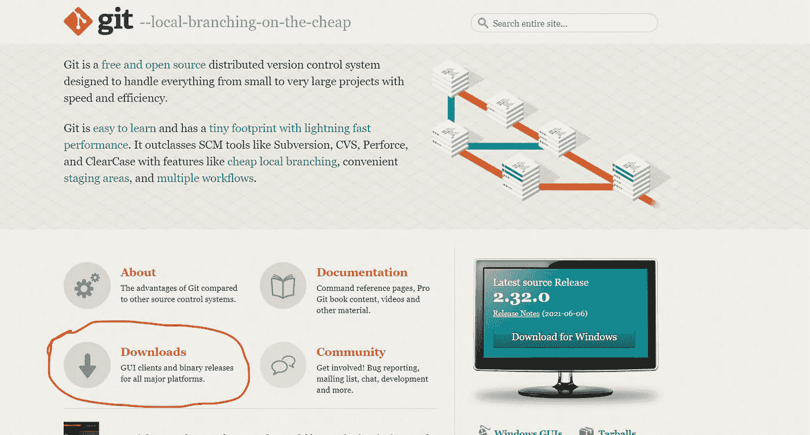

here is where we download Git

你应该能够识别我在上图中圈出的下载部分，点击下载。点击后，你会被带到一个页面，上面有 Git 运行的不同操作系统，分别是 Windows、Mac OS 和 Linux。

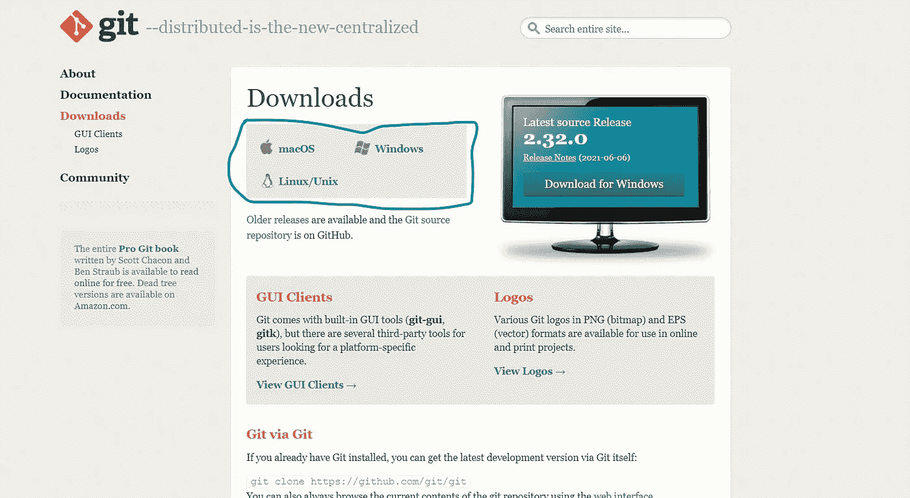

operating systems that run Git

请单击您的计算机正在运行的操作系统，这将提示一条自动下载弹出消息，您的下载器会询问您是否同意下载 git，请接受。如果没有弹出，网站将加载一个新的页面，您可以手动下载 git。

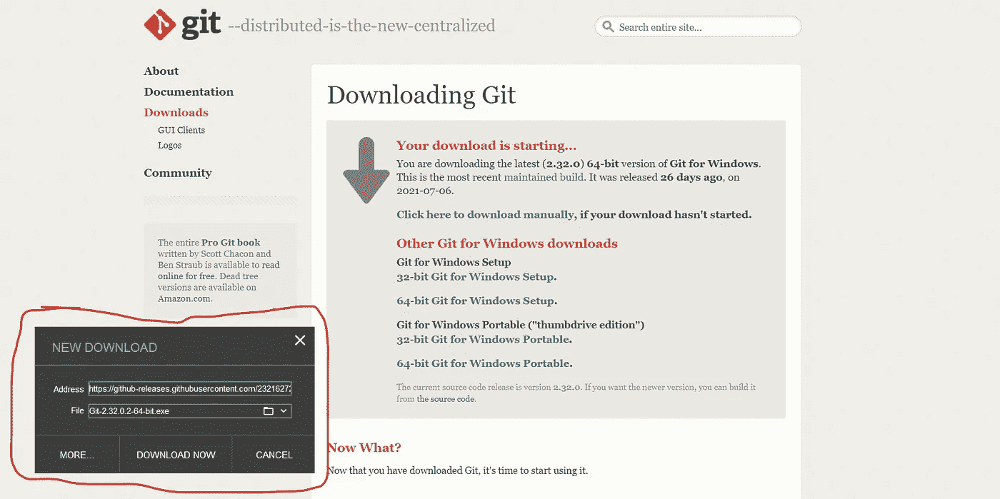

你应该注意的非常重要的一点是，你将需要确保你的安装包括用于 windows 的[*git bash*](https://www.atlassian.com/git/tutorials/git-bash)

**下一步是获得一个 GitHub 账户**，提供一些观点 GitHub 是一个云服务，允许使用 git 远程存储您的存储库，所以如果您要利用远程存储库带来的所有好处，您肯定需要一个 [GitHub](https://github.com/) 账户。所以你需要去 github.com 注册，这里最大的需求是一个电子邮件地址。

## **终于创建一个存储库(Repo)了！！**

如果你能坚持到这一步，那就恭喜你了，因为我们已经大功告成了。因此，我假设此时您的机器上已经安装了 git，并且您还有一个 GitHub 帐户。现在，当你登录到你的 GitHub 时，我需要你点击右上角的个人资料图片，然后点击“你的存储库”

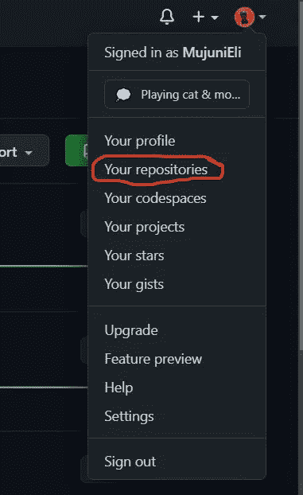

Your Repos

在此之后，您应该会被引导到显示您过去创建的存储库的页面，但对于您的情况，很可能没有列表，因为这是您的第一次回购，单击应该位于您计算机屏幕右侧的 ***新建*** 按钮。

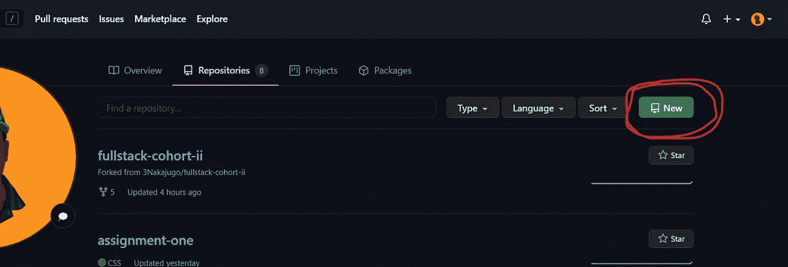

new repo button

从这个页面，您将被引导到一个新页面，在这里您可以为您的回购命名，还可以选择一些应该添加到您的回购中的首选项。您现在可以忽略这些首选项，专注于为您的存储库编写一个合适的名称。

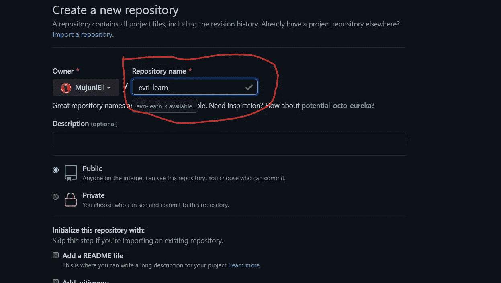

your repo name

写下您想要的名称后，点击位于首选项选择末端的 ***创建存储库*** 按钮。

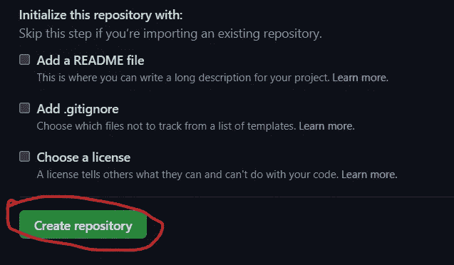

creating repository

点击 create repository 后，您将被引导至一个屏幕，该屏幕带有将引导我们进入终端的指令，但在我们的示例中，这将是 git bash，在这里我们将开始使用命令来查看 git 的肌肉。

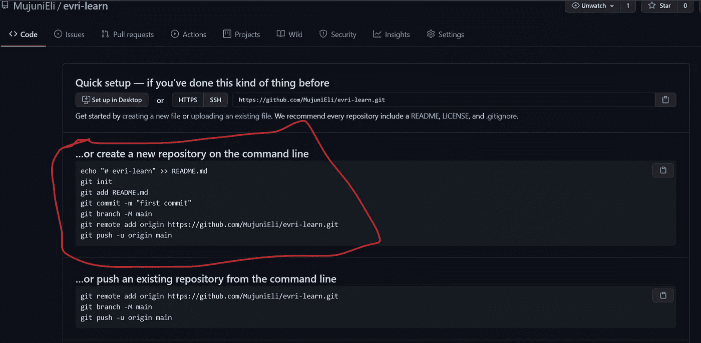

new repo command for the terminal

此时，我们将转到我们的计算机并启动 git bash 应用程序，从那里我们将导航到我们计算机上的一个本地文件夹，在那里我们将保存我们创建的存储库的本地副本。但是在我们开始创建和连接存储库之前，我们必须通过将本地 git 连接到我们创建的 GitHub 帐户来配置它。参见附加的视频，了解配置 git 的步骤，不要忘记使用创建 GitHub 帐户时使用的密码和电子邮件，因为这是这个过程所必需的。

既然我们的 git 凭证已经设置好了，现在我们可以导航到选择的文件夹/目录，或者创建一个文件夹/目录，其名称应该与之前在 GitHub 中创建的存储库相匹配。

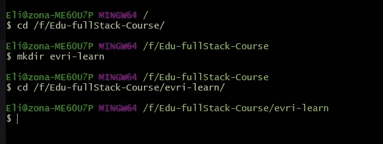

created evri-learn directory matching repo in GitHub

下一步是回到我们的 git，复制命令来创建一个新的存储库，如下图所示，复制按钮是用黄色圈起来的那个。

copy the first set of commands

我们现在转向 git bash，粘贴我们复制的命令，git 将运行它们直到推送，如下所示。

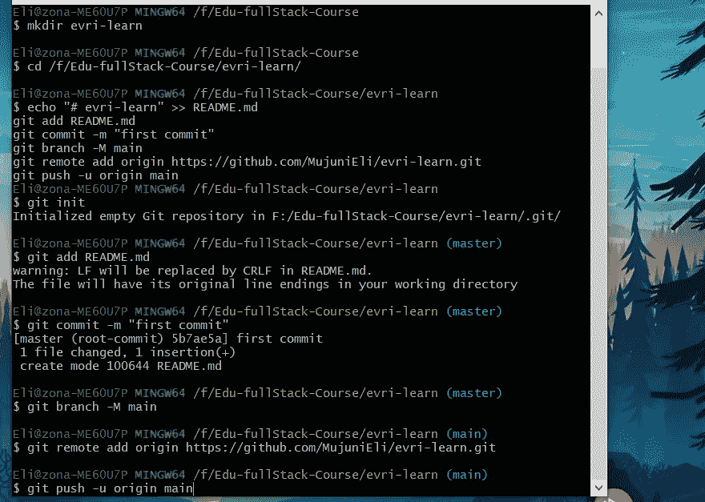

Hit enter at this point

在这一点上，你唯一需要做的就是点击键盘上的回车键来完成创建你的库，如下所示

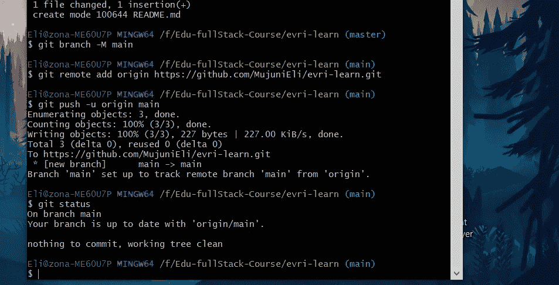

success

我的朋友，您已经创建了您的存储库，现在您可以开始添加文件，进行编辑并将这些更改推送到您的远程存储库。这仅仅是个开始，还有一些命令没有在本文中探讨，这些命令对于您正确使用 git 至关重要，幸运的是，在互联网上有很多[资料来源](https://www.atlassian.com/git/tutorials/atlassian-git-cheatsheet)，您可以从中获得关于 git bash 终端中可用的不同命令的指导。

结论我想提一下，这篇文章看起来更适合使用 Windows 操作系统的个人，但事实并非如此，因为所有操作系统的命令都是一样的，Windows 被引用了很多次，因为它才是作者真正使用的操作系统。也就是说，我希望这是一个很好的阅读，就像我在开始时说的，我欢迎所有的反馈，所以请随意留下一些，否则请保持登录，我会在下一篇文章中赶上你。✌